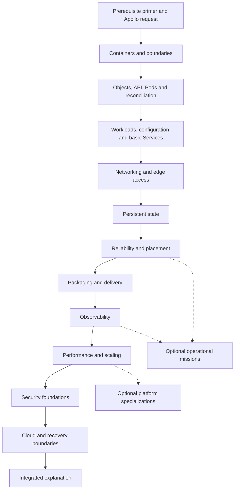
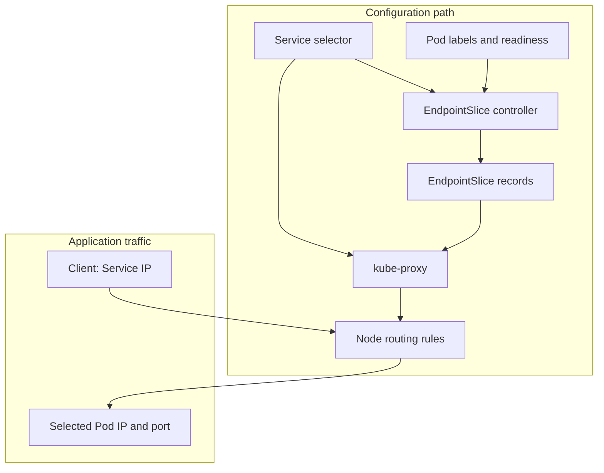

# Apollo11 documentation learning-journey implementation plan

## Purpose and review boundary

This plan rebuilds the Apollo11 documentation as a self-contained Kubernetes
learning journey. Apollo11 remains the source of truth for runnable application
snapshots, manifests, scripts, and observed verification results. This
repository becomes the textbook: it must explain concepts completely before an
optional lab asks learners to inspect, break, or recover them.

This is a planning artifact. It does not change the application repository,
claim a new runtime verification result, or promote planned Apollo stages to
runnable status.

## Review coverage

The review covered all learner-facing Markdown under `docs/`:

- the overview, Launchpad, Ignition, Stages 1 through 11, EKS appendix, and
  capstone;
- troubleshooting, command reference, and glossary;
- navigation and site configuration in `sidebars.ts`, `docusaurus.config.ts`,
  `package.json`, `README.md`, and homepage components;
- Apollo11's `AGENTS.md`, `ROADMAP.md`, status documentation, selected stage
  READMEs, manifests, templates, source handlers, scripts, and CI workflow.

Apollo11 source inspection was corroborating rather than exhaustive. No live
labs, cloud infrastructure, builds, or recorded verification counts were
reproduced. Unreferenced raster, PDF, PSD, and draw.io assets were inventoried
but not visually reviewed.

## Overall assessment

The current site is an explained lab manual for readers already comfortable
with containers and command-line investigation. It contains strong material:

- Apollo Airlines supplies a continuous, concrete application story.
- Stage 1's controller-ownership explanation is useful.
- Launchpad's browser-versus-container networking explanation is useful.
- Stage 3 names ordinary Pod-replacement persistence boundaries honestly.
- Stage 6 distinguishes metrics, logs, and traces well.
- The current documentation usually labels unverified security and cloud work
  as planned rather than runnable.

The central change is structural. A reader should not need to execute an
exercise, inspect a manifest, or infer an expected outcome to obtain a required
explanation. Labs become optional demonstrations after the core narrative.

### Priority findings

| Priority | Finding | Learner impact |
|---|---|---|
| P0 | Several diagrams or explanations assign actions to the wrong actor or overstate guarantees. | Produces mental models that later caveats do not reliably correct. |
| P0 | Some examples differ from their named source or describe a different object relationship. | Learners cannot reconcile the textbook with the lab. |
| P1 | Important explanations are embedded in investigations. | Reading alone does not teach the required mechanism. |
| P1 | Prerequisites are broader than stated. | YAML, DNS, signals, storage, TLS, and application concepts arrive without preparation. |
| P1 | Stage pages combine motivation, mechanism, installation, labs, and reference material in 400–730-line pages. | Cognitive load prevents progressive learning. |
| P1 | Later snapshots do not necessarily retain earlier controls. | The curriculum can imply cumulative security and reliability guarantees that manifests do not support. |
| P2 | Homepage and navigation emphasize hands-on completion and technology count. | The product promise conflicts with a reading-first textbook. |

### Required prerequisite baseline

| Area | Required before starting | Teach within the journey |
|---|---|---|
| Linux | Navigate files, run a command, read basic terminal output. | Processes, exit codes, env vars, permissions, signals, mounts, stdout/stderr. |
| Networking | Recognize a URL and HTTP request/response. | IPs, ports, listeners, localhost, DNS, routing, proxies, TLS. |
| Containers | None. | Images, containers, writable state, networks, volumes, registries, lifecycle. |
| Applications | A client requests work from a server. | Dependencies, database state, initialization, retries, idempotency, asynchronous work, caching. |
| Configuration | None. | YAML maps/lists/indentation, object identity, references, selectors, desired state. |

Move workstation requirements and tool installation to optional lab setup. Core reading must not require Docker, kind, or a cluster.

## Correctness corrections that implementation must make

| Area | Correction |
|---|---|
| Service routing | EndpointSlices are routing information consumed by implementations such as kube-proxy. Packets do not travel through an EndpointSlice API object. Draw distinct configuration and traffic paths. |
| Gateway API | Cross-namespace Route-to-Gateway attachment is governed by `allowedRoutes`; cross-namespace backend references use ReferenceGrant. Apollo's frontend HTTPRoute attaches across namespaces but references a same-namespace frontend Service, so it is not a ReferenceGrant example. |
| Probes | The Stage 4 conceptual 45-second startup cannot be protected by a 30-second startup-probe budget. A startup budget must cover the stated worst case. |
| Termination | `preStop` runs inside the Pod termination grace period; it does not provide an additional grace window. Endpoint withdrawal and proxy updates are asynchronous. |
| QoS and eviction | Do not present BestEffort → Burstable → Guaranteed as an absolute eviction ladder. Node-pressure decisions include use relative to requests and Pod priority. |
| StatefulSets | Do not state that databases categorically require StatefulSets or that PVC persistence behavior is unconditional. Explain workload needs and configured retention/reclaim policy. |
| HPA | Downscale stabilization considers recent recommendations; it is not simply a fixed sleep after demand falls. |
| VPA | The illustrative Stage 7 YAML must show `spec.updatePolicy.updateMode: Off`, matching the source nesting. |
| Delivery | A version-looking tag is not inherently immutable. Helm rollback does not reverse unrelated side effects or database writes. Argo sync and health are separate statuses. |
| Observability | A ServiceMonitor describes discovery/configuration; Prometheus performs scraping. Trace examples must use actual booking calls or be marked conceptual. |
| Sources | Exact excerpts must match the named source. Mark every adaptation, render, and conceptual YAML block clearly. |

## Proposed learning architecture

Use descriptive textbook modules while retaining Apollo phase names as
subtitles and lab mappings. Documentation chapter boundaries need not mirror
executable snapshots.

| Module and learner question | Chapters | Learner outcome |
|---|---|---|
| 0. Orientation — “What will I understand?” | `docs/start/prerequisites.md`; `docs/start/apollo-airlines.md` | Explain the application and required baseline. |
| 1. Containers — “What does it mean to run this application?” | `docs/learn/containers/process-image-container.md`; `images-and-configuration.md`; `networks-and-clients.md`; `state-and-dependencies.md` | Distinguish image/process/container, client locality, durable state, and readiness. |
| 2. Kubernetes control system — “How does a declaration become a process?” | `docs/learn/cluster/why-orchestration.md`; `objects-and-api.md`; `reconciliation-and-components.md`; `pod-lifecycle.md` | Explain API objects, spec/status, actors, container restart, and Pod replacement. |
| 3. Workloads/configuration — “How does the application survive replacement and change?” | `docs/learn/workloads/ownership-and-replicas.md`; `services-and-readiness.md`; `configuration-and-identity.md`; `jobs-and-initialization.md`; `rollouts-and-rollback.md`; `ephemeral-state.md` | Explain controllers, selectors, configuration, finite work, rollouts, and ephemeral state. |
| 4. Networking — “How does a request reach a changing Pod?” | `docs/learn/networking/pod-network-and-cni.md`; `service-control-and-data-paths.md`; `dns-and-namespaces.md`; `nodeport-and-loadbalancer.md`; `ingress-and-tls.md`; `gateway-api.md` | Trace DNS, packet, HTTP, and configuration paths separately. |
| 5. Persistent state — “Which identity and bytes survive which failure?” | `docs/learn/storage/volume-lifetimes.md`; `claims-and-provisioning.md`; `statefulsets-and-headless-dns.md`; `initialization-and-seeding.md`; `recovery-boundaries.md` | Explain storage claims, ordinal identity, initialization, and recovery limits. |
| 6. Reliability/placement — “What should react when work starts, fails, or leaves?” | `docs/learn/reliability/probes.md`; `termination-and-draining.md`; `requests-limits-and-pressure.md`; `scheduling.md`; `disruption-budgets.md` | Explain trigger, actor, action, evidence, and limit for each mechanism. |
| 7. Delivery — “How do we reproduce and change the resource graph?” | `docs/learn/delivery/rendering-and-helm.md`; `kustomize-comparison.md`; `ci-and-image-delivery.md`; `gitops-and-ownership.md`; `promotion-and-rollback.md` | Trace a source change to artifact, desired object, rollout, and runtime. |
| 8. Observability — “How do we explain what the application is doing?” | `docs/learn/observability/signals-and-metrics.md`; `discovery-and-collection.md`; `queries-alerts-and-objectives.md`; `logs.md`; `traces.md`; `correlating-a-booking.md` | Select, interpret, and correlate the correct signal. |
| 9. Performance/scaling — “Which change addresses the measured bottleneck?” | `docs/learn/scaling/measurement-baseline.md`; `cache-aside.md`; `hpa.md`; `vpa-and-capacity.md` | Distinguish caching, replica count, resource sizing, and capacity. |
| 10. Security foundations — “Who may change, communicate, or obtain credentials?” | `docs/learn/security/identity-and-authorization.md`; `admission-and-runtime.md`; `network-policy.md`; `secrets-and-supply-chain.md` | Explain distinct enforcement locations. Apollo lab remains planned. |
| 11. Cloud/recovery boundaries — “What changes beneath the same APIs?” | `docs/learn/cloud/local-to-cloud.md`; `infrastructure-and-ownership.md`; `topology-scaling-and-upgrades.md`; `backup-restore-and-teardown.md` | Explain provider ownership, recovery, portability, and limits. No runnable EKS lifecycle is claimed. |
| 12. Integrated explanation — “Can I explain one system across these mechanisms?” | `docs/learn/capstone/a-booking-through-kubernetes.md`; `change-failure-and-recovery.md`; `limits-and-design-decisions.md` | Give a causal explanation without introducing new concepts. |

### Dependency map



### Concept progression

| Concept | First introduced | Developed | Integrated |
|---|---|---|---|
| Reconciliation | Cluster object/component model | ReplicaSet, EndpointSlice, storage, GitOps, operator, HPA | Multiple controllers reacting to one change. |
| Identity and scope | Name, namespace, UID | Ownership, ServiceAccount, stateful ordinal, authorization | App versus Kubernetes versus provider identity. |
| Networking | Client location and localhost | Services, DNS, edge proxy, Gateway permissions | Request path, policy, cloud integration. |
| State | Process memory and volume | PVC provisioning, identity, initialization, retention | Recovery and backup limits. |
| Health | Alive versus able to serve | Probe thresholds, endpoint propagation, termination | Rollout, telemetry, scaling. |
| Configuration | Build-time/runtime values | References, templates, artifacts, reconciliation | Promotion, rollback, rotation. |
| Resources | Container resource boundaries | Scheduling requests/runtime limits | HPA/VPA and node capacity. |

## Stage-by-stage migration summary

| Existing page | Proposed destination | Disposition |
|---|---|---|
| `docs/index.md` | Overview plus `docs/start/*` and `docs/labs/setup.md` | Split; retain motivation, correct workflow routes, simplify early architecture. |
| `docs/launchpad.md` | Container chapters plus `docs/labs/launchpad.md` | Rewrite/split; extract all explanations from activities. |
| `docs/ignition.md` | Cluster chapters plus `docs/labs/ignition.md` | Rewrite/split; separate mental model from kind setup. |
| `docs/stage-1.md` | Workload chapters plus lab | Split; teach ownership, selection, readiness, Jobs, rollout, and ephemeral state independently. |
| `docs/stage-2.md` | Networking chapters plus lab | Rewrite/split; separate control, DNS, packet, and HTTP paths. |
| `docs/stage-3.md` | Storage chapters plus lab | Rewrite/expand; add delayed binding, Redis durability, and recovery boundaries. |
| `docs/stage-4.md` | Reliability chapters plus lab | Rewrite; correct timing and availability claims. |
| `docs/stage-5.md` | Delivery chapters plus lab | Expand/split; add artifact and GitOps ownership sequence. |
| `docs/stage-6.md` | Observability chapters plus lab | Expand/split; teach each signal before correlation. |
| `docs/stage-7.md` | Scaling chapters; scheduling moves to reliability; lab stays mapped to Stage 7 | Split/move; add measurement baseline and corrected VPA/HPA teaching. |
| `docs/eks.md` | Cloud concept chapter plus status reference | Merge; preserve prototype boundary without source-inspection exercise. |
| `docs/stage-8.md` | Security concept chapters plus status reference | Replace status-only material with teaching; preserve planned-lab boundary. |
| `docs/stage-9.md` | Cloud chapters plus status reference | Expand/merge; no runnable cloud procedure. |
| `docs/stage-10.md` | `docs/optional/operations.md` | Move as independently scoped missions. |
| `docs/stage-11.md` | `docs/optional/platform.md` | Move; teach CRD literacy earlier and retain authoring as optional. |
| `docs/capstone.md` | Reading capstone plus optional lab capstone | Split; preserve gap analysis. |
| `docs/troubleshooting.md` | `docs/reference/troubleshooting.md` | Retain/rewrite with corrected decision branches. |
| `docs/command-reference.md` | `docs/reference/commands.md` | Retain/rewrite with context, effects, and ownership. |
| `docs/glossary.md` | `docs/reference/glossary.md` | Retain/correct and cross-link to first/deeper explanation. |

## Writing and teaching standard

A complete explanation answers:

1. What concrete problem motivates this mechanism?
2. What object records the intent?
3. Which actor observes that object or condition?
4. What action does that actor take?
5. How does that action affect other components?
6. What evidence distinguishes acceptance, convergence, and useful behavior?
7. What does the mechanism not guarantee?

Use motivation → mental model → mechanism → worked example → connections and
limitations flexibly. Do not force every page into identical headings.

Authoring rules:

- Define first-use terms in the paragraph where they become necessary.
- Explain one relationship before showing the full resource graph.
- Start with minimal excerpts, then add fields incrementally.
- Mark snippets `exact excerpt`, `abridged excerpt`, `rendered example`, or
  `conceptual example`.
- Keep all YAML nesting valid in abridged examples.
- State source stage and environment explicitly.
- Give the result and interpretation in prose; commands must not be the only
  route to understanding.
- Mark invented output as illustrative.
- Keep installation details, exhaustive flags, vendor internals, and optional
  experiments outside the core path.
- Repeat a topic only when its new context adds a new mechanism or tradeoff.

## Mermaid diagram program

Create or substantially revise **80 Mermaid diagrams**. Each must answer a
distinct learner question. This repository already enables Mermaid through
`@docusaurus/theme-mermaid`; no additional diagram platform is required.

| Destination | Count | Required subjects |
|---|---:|---|
| Orientation | 2 | Learning dependencies; simplified passenger workflow. |
| Containers | 5 | Process/image/container; build layers; browser/backend boundaries; storage lifetimes; dependency failure/readiness. |
| Cluster model | 5 | Host/kind/node/Pod nesting; spec/status loop; API-to-running-Pod sequence; restart versus replacement; phase/condition/reason distinction. |
| Workloads | 6 | Ownership versus selection; reconciliation; readiness-to-Service; config consumption; Job lifecycle; rollout/rollback. |
| Networking | 9 | Pod network boundary; Service control path; Service packet path; DNS; kind/NodePort; Ingress planes; TLS; MetalLB; Gateway permissions. |
| Storage | 7 | Lifetimes; PVC/PV/class/provisioner; delayed binding; ordinal claims; normal/headless DNS; init/seed; recovery boundaries. |
| Reliability | 8 | Probe transitions; readiness propagation; startup budget; termination; requests/limits; scheduling; pressure/preemption/eviction; PDB calculation. |
| Delivery | 6 | Helm render; revisions; Kustomize transform; CI/artifact; Argo compare/sync/health; ownership/promotion. |
| Observability | 7 | Signal selection; counter/rate; histogram; discovery/scrape; logs; trace propagation; correlated incident. |
| Scaling | 6 | Measurement comparison; cache branches; HPA chain; utilization arithmetic; stabilization; VPA/HPA interaction. |
| Security | 5 | Authn/authz/admission; runtime controls; policy paths; secret rotation; artifact admission. |
| Cloud | 5 | Local/cloud map; ownership; zonal scheduling; pod/node scale; restore/teardown. |
| Capstone | 3 | Integrated paths; failure/recovery; demonstrated/unproven boundaries. |
| Optional catalogs | 2 | Operational and platform prerequisites. |
| Troubleshooting | 4 | Pod/container, network, storage, and autoscaling diagnosis. |
| **Total** | **80** | Distinct teaching purpose for every diagram. |

Diagram standards:

- Use `sequenceDiagram` for interactions, `stateDiagram-v2` for state, and
  flowcharts for relationships/decisions.
- Label configuration/control edges, application traffic, and telemetry flow.
- Never depict an API object as an active process.
- Split diagrams that need tiny text.
- Show asynchronous behavior explicitly.
- Add interpretation prose below every diagram.
- Give every diagram a stable ID, purpose, source references, and owner in
  `maintenance/diagram-inventory.md`.
- Validate both light/dark renderings and narrow viewport readability.
- Do not use duplicate overviews to meet the count.

### Representative teaching rewrite

Current Stage 2 presents EndpointSlice as a packet-processing hop. Replace it
with a two-path explanation:

> A Service gives callers a stable address even though selected Pods change.
> Controllers and node agents maintain routing information: the EndpointSlice
> controller records selected endpoints, and kube-proxy uses Service/endpoint
> information to update node rules. Separately, an application sends a packet
> to the Service address. The node rules select a backend and rewrite the
> destination; the packet does not visit the EndpointSlice object.



## Ordered implementation work packages

Every content package must satisfy the shared acceptance criteria: established
prerequisites, source labeling, self-contained explanations, semantic/rendered
diagram review, and no unique instruction hidden inside an optional exercise.

| Package | Objective and scope | Dependencies | Acceptance criteria |
|---|---|---|---|
| WP0 | Create `maintenance/source-map.md`, `maintenance/content-migration.md`, and `maintenance/diagram-inventory.md`. Record source snapshot, claim, destination, old anchors, and diagram IDs. | None | Every current learner page mapped; every P0 correction assigned. |
| WP1 | Rework site structure: `sidebars.ts`, `docusaurus.config.ts`, homepage, README; add orientation, setup, and implementation-status pages. | WP0 | A new reader starts without installation. Sidebar/navbar/homepage/status agree. |
| WP2 | Rebuild containers and cluster foundations; split Launchpad and Ignition into core chapters and labs. | WP1 | Reader explains image/container/process, client locality, spec/status, and restart/replacement. |
| WP3 | Rebuild workloads/configuration and Stage 1 lab. | WP2 | Ownership, selection, Jobs, rollout, and data-loss outcomes are explained without running commands. |
| WP4 | Rebuild networking and Stage 2 lab. | WP3 | Distinct DNS/control/packet/HTTP paths; correct Gateway permission model and source ports/namespaces. |
| WP5 | Rebuild storage and Stage 3 lab. | WP4 | Reader predicts container, Pod, claim, node, and cluster-loss outcomes separately. |
| WP6 | Rebuild reliability/placement and Stage 4 lab; move scheduling concepts from Stage 7. | WP5 | Correct probe budgets, termination timing, eviction claims, and scheduling order. |
| WP7 | Rebuild delivery and Stage 5 lab. | WP6 | Helm, Kustomize, CI, Argo ownership, promotion, and rollback boundaries are explicit. |
| WP8 | Rebuild observability and Stage 6 lab. | WP7 | Each signal is taught independently; source/configuration chain is correct. |
| WP9 | Rebuild scaling and Stage 7 lab. | WP8 | Measurement precedes optimization; HPA/VPA/cache mechanisms are accurate. |
| WP10 | Build security/cloud concept chapters and consolidated status reference. | WP9 | Concepts are self-contained without promoting unverified Apollo labs. |
| WP11 | Build reading capstone, optional lab capstone, and optional catalogs. | WP2–WP10 | Core path ends in synthesis without optional missions. |
| WP12 | Rebuild reference material, stage landing pages, links, anchors, and classify legacy assets/configuration. | Relevant packages | Every original page has a completed disposition; no stale linear links. |
| WP13 | Full validation and reading review. | WP0–WP12 | Build/typecheck, internal links, diagram review, source checks, and reading-only walkthrough pass. |

### Package detail requirements

#### WP0 — provenance

- Map every exact source excerpt to a file and relevant stage/environment.
- Record divergences between source comments, README claims, manifests, and
  current documentation.
- Preserve old URL/anchor mappings before page moves.
- Give each diagram an ID, teaching question, source basis, and destination.

#### WP1 — orientation and site structure

- Replace homepage claims such as “100% hands-on” and inconsistent stage counts
  with the textbook/lab distinction and current implementation boundary.
- Move hardware/tool requirements to optional setup.
- Explain Apollo’s booking path without prematurely introducing Gateway,
  caching, security, or cloud mechanisms.
- Use existing stage URLs as landing pages initially to preserve bookmarks.

#### WP2 — foundations

- Correct the named Launchpad Dockerfile excerpt or label it adapted.
- Teach a process before namespaces/cgroups/capabilities details.
- Separate kind’s local-node implementation from Kubernetes component roles.
- Put both bare-Pod and container-restart outcomes in core prose before labs.

#### WP3 — workloads

- Separate owner references from label selectors.
- Explain Services only to the depth needed for Stage 1, then revisit in Stage 2.
- Explain ConfigMap and Secret delivery limits, including startup-read env
  behavior and development-secret scope.
- Explain completed Job behavior and idempotency before lab commands.
- Explain rollout status, readiness, old ReplicaSets, and rollback limits.

#### WP4 — networking

- Give separate diagrams for Service control plane and packet data path.
- Teach namespace DNS search before cross-namespace failure examples.
- Explain NodePort plus kind port mapping as two separate hops.
- Teach Ingress object/controller/proxy split and local self-signed TLS limits.
- Teach MetalLB controller, address pool, advertisement, and Service request.
- Teach CRD, controller, data plane, GatewayClass, Gateway, HTTPRoute,
  `allowedRoutes`, and ReferenceGrant accurately.

#### WP5 — storage

- Explain volume lifetime before StorageClass and StatefulSet.
- Explain claims, volumes, provisioners, delayed binding, access modes, and
  backend constraints separately.
- State that StatefulSets are chosen for stable identity/ordered behavior, not
  because every database is universally required to use one.
- Distinguish schema bootstrap, idempotent seed work, and migrations.
- Include local-path/node-loss, reclaim, retention, backup, and replication
  boundaries.

#### WP6 — reliability and placement

- Give exact Apollo settings separately from conceptual examples.
- Treat probe outcomes as kubelet actions with explicit sampling/thresholds.
- Explain termination as a bounded, asynchronous coordination process.
- Teach requests before limits, then QoS, pressure, priority, scheduling,
  topology, and PDBs.
- Distinguish direct deletion, Deployment rollout, voluntary eviction, node
  failure, and OOM.

#### WP7 — delivery

- Explain Helm render output versus Helm release record.
- Use one same-object Helm/Kustomize comparison rather than broad claims.
- Trace GitHub Actions validation/build/publication with source-specific status.
- Explain Argo Application source, render, diff, sync, health, reconciliation,
  and ownership boundaries.
- Surface controls that later snapshots do not preserve rather than implying
  permanent inheritance.

#### WP8 — observability

- Teach counter resets/rates, histograms/quantiles, labels/cardinality,
  ServiceMonitor selection, Prometheus targets, alert rules, logs, traces, and
  correlation in that order.
- Mark any conceptual SLI/SLO/error-budget calculation as conceptual until an
  Apollo implementation exists.
- Use actual booking request relationships, or clearly label a conceptual trace.

#### WP9 — scaling

- Add an explicit repeatable measurement design before cache teaching.
- Explain cache freshness, authoritative data, MISS/HIT/error branches, and
  why `X-Cache` alone does not establish a performance result.
- Explain metrics-server input, request denominator, HPA hand-off to a target
  Deployment, missing metrics, available capacity, and recommendation windows.
- Use complete VPA source nesting and describe recommendation-only mode.

#### WP10 — security/cloud

- Teach conceptual security using clearly labeled examples; do not create
  synthetic Apollo lab manifests.
- Preserve Stage 8’s clean-rebuild boundary.
- Teach provider ownership, zonal storage, Pod/node scaling, upgrades, backup,
  restore verification, teardown, cost residue, and EKS-to-GKE comparison.
- Preserve Stage 9/EKS research and implementation boundaries.

#### WP11 and WP12 — synthesis/reference

- Make the reading capstone a fully worked causal account.
- Keep the lab capstone optional and state its supported snapshot.
- Give every optional mission a motivating question, prerequisites, expected
  mechanism, evidence, limits, and cleanup boundary.
- Correct troubleshooting statements such as “Pending means unscheduled,”
  “exit 137 alone proves OOM,” and cloud volume recovery claims.
- Add command context, working directory, stage, mutation effect, and owner.
- Confirm whether MkDocs configuration and unused starter components/assets are
  deployed or referenced before retiring them.

## Validation plan

The confirmed documentation commands are:

```bash
npm ci
npm run typecheck
npm run build
npm run serve
```

`package.json` does not define a dedicated link-check command. During
implementation, make broken internal links, Markdown links, and Markdown images
fatal in Docusaurus configuration, then use `npm run build` as the internal-link
gate. If an external link checker is added, document its actual command only
after it exists.

Useful Apollo source checks for future excerpt validation include:

```bash
helm lint stages/stage5/helm/apollo11

helm template apollo11 stages/stage5/helm/apollo11 \
  -f stages/stage5/helm/apollo11/values-dev.yaml

kubectl kustomize stages/stage5/overlays/dev

bash stages/stage5/argocd/scripts/validate.sh
```

These validate selected source artifacts; they do not prove prose accuracy or
replace a reading review. Every Mermaid diagram must be reviewed for semantic
accuracy and successful rendering in light/dark themes and narrow viewports.

## Completion criteria

The rebuilt documentation is complete when:

- A beginner can read orientation through synthesis without running a cluster,
  opening Apollo11 source, or solving an exercise to obtain a missing concept.
- Each stage relies only on established prerequisites.
- Every major mechanism identifies intent, actor, action, evidence, and limit.
- All existing learner-facing pages are migrated without losing explanation
  embedded in current activities.
- The 80-diagram backlog is complete, distinct, source-grounded, and rendered
  successfully.
- Exact excerpts match sources and conceptual/adapted examples are labeled.
- Snapshot differences are explicit: token automount, `preStop`, replicas,
  PDBs, VPA availability, probe behavior, and Gateway listeners.
- Security and cloud theory remain self-contained while runnable Apollo status
  remains truthful.
- Navigation, glossary, recaps, troubleshooting, and diagrams agree with the
  detailed chapters.
- Typecheck/build/internal link-image validation passes.
- The final capstone distinguishes demonstrated behavior from planned or
  unproven availability/security/cloud claims.

## Recommended defaults

| Decision | Default |
|---|---|
| Apollo stage names | Preserve as subtitles and lab mappings; use descriptive chapter names in textbook navigation. |
| Investigations | Keep selected activities as optional labs only after extracting their explanatory content. |
| Security/cloud teaching | Teach concepts now as explicitly conceptual material; do not invent runnable Apollo implementations. |
| Traefik | Retain as a focused Ingress/TLS transition; give Envoy Gateway deeper continuing-platform treatment. |
| Kustomize | Keep one substantial comparison while following the roadmap’s Helm-canonical direction. |
| Version claims | Record real source snapshot/version evidence; do not treat broad minimums or `latest` entries as compatibility proof. |
| Performance claims | Use illustrative calculations until reproducible measured data exists. |
| Apollo source discrepancies | Record separately; document the current implementation accurately without expanding this rewrite into application changes. |
| MkDocs/legacy assets | Check deployment/reference usage before retiring them. |
