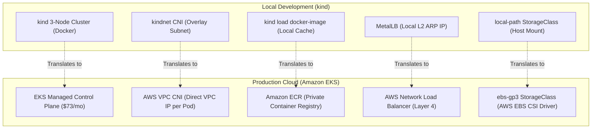

# Cloud Appendix: Running Apollo11 on Amazon EKS

Everything you built and tested in **Stages 1–7** ran locally inside a `kind` cluster on your laptop.

In this **Cloud Appendix**, you learn how those exact same Kubernetes manifests translate to a real public cloud provider: **Amazon Web Services (AWS)** using **Amazon Elastic Kubernetes Service (EKS)**.

You will see that the application code, the 10 workloads, the StatefulSets, and the Gateway API HTTPRoutes remain **100% identical**. What changes is the underlying infrastructure platform: replacing local emulation with managed cloud services.



---

## ⚖️ The Translation: kind vs. AWS EKS

| Component | Local Stack (`kind`) | AWS Cloud (`stages/eks`) | What Changes in Kubernetes? |
|---|---|---|---|
| **Control Plane** | Docker container (`kubeadm`) | Managed AWS EKS Control Plane | High availability across 3 AZs; automated etcd backups. |
| **Worker Nodes** | Docker containers (`apollo11-worker`) | EC2 Auto Scaling Node Group (2 × `t3.small` Spot) | Real virtual machines running Amazon Linux with IAM instance profiles. |
| **Container Images** | `docker build` + `kind load` | Amazon Elastic Container Registry (ECR) | Standard `docker tag` and `docker push` with IAM authentication. |
| **Networking / CNI** | `kindnet` (overlay network) | **AWS VPC CNI** | Every Pod gets a **real IP address directly inside your AWS VPC subnet**! |
| **Edge Routing** | MetalLB L2 IP (`172.18.0.50`) | **AWS Network Load Balancer (NLB)** | Provisioned automatically by the **AWS Load Balancer Controller (LBC)**. |
| **Persistent Storage** | `local-path` StorageClass | **`ebs-gp3` StorageClass (EBS CSI Driver)** | Block storage backed by AWS Elastic Block Store (EBS). |

:::important Look How Little Manifest Code Changes!
Between Stage 3 and Stage EKS, **zero application code changes**.
The GatewayClass, Gateway, 6 HTTPRoutes, ReferenceGrant, 4 StatefulSets, and 6 Deployments run completely unmodified!
The only changes are:
1. Five annotations on the `EnvoyProxy` configuration telling the AWS Load Balancer Controller to provision an NLB.
2. Installing the `aws-ebs-csi-driver` add-on and declaring an `ebs-gp3` StorageClass.
:::

---

## 💰 Cloud Economics & Cost Breakdown

Running a cloud cluster costs real money. AWS charges for the EKS control plane by the hour regardless of cluster size.

*Pricing benchmarked in `us-east-1` (May 2026):*

| Cloud Resource | Specification | Always-On Cost / Month | 2-Hour Dev Session |
|---|---|---|---|
| **EKS Control Plane** | Managed master nodes | $73.00 | $0.20 |
| **Worker Nodes** | 2 × `t3.small` Spot instances | $18.25 | $0.05 |
| **NAT Gateway** | 1 × NAT Gateway (Single AZ) | $32.85 | $0.09 |
| **Elastic IP (EIP)** | 1 × EIP for NAT Gateway | $3.65 | $0.01 |
| **Network Load Balancer** | 1 × Internet-facing NLB | $16.43 | $0.05 |
| **Public IPv4 Addresses** | 2 × IPv4 for NLB interfaces | $7.20 | $0.02 |
| **Node Root Volumes** | 2 × 20 GB gp3 root disks | $3.20 | $0.01 |
| **StatefulSet Volumes** | 4 × 1 GB gp3 EBS volumes | $0.32 | &lt;$0.01 |
| **Total Cost** | — | **~$156.00 / month** | **~$0.44 per 2 hours** |

:::tip The Golden Rule of Cloud Labs: Teardown Hygiene!
Never leave an EKS cluster running overnight unless your company is paying the bill.
The Apollo11 EKS module is engineered for **fast, reproducible lifecycle**:
- **Spin up**: `bash scripts/up.sh` (~10 minutes).
- **Tear down**: `bash scripts/down.sh` (~6 minutes, destroying all billable resources).
:::

---

## ⚠️ Critical Cloud Gotchas: EBS and Availability Zones

When moving from local storage to cloud storage, one critical operational difference will bite every unprepared engineer: **EBS Volumes Are Zonal!**

### The Zonal Volume Constraint
An AWS Elastic Block Store (EBS) volume exists in **one specific Availability Zone** (e.g. `us-east-1a`).
- It **cannot** be mounted by an EC2 instance or worker node in `us-east-1b`.
- If Kubernetes schedules `identity-db-0` on a worker node in `us-east-1b`, but its EBS disk was provisioned in `us-east-1a`, the Pod will be stuck in `ContainerCreating` forever with the error:
  `FailedAttachVolume: Volume is in us-east-1a, node is in us-east-1b`!

### The Solution: `volumeBindingMode: WaitForFirstConsumer`
In `stages/eks/terraform/storage/storageclass.tf`, the StorageClass is configured with:

```yaml
apiVersion: storage.k8s.io/v1
kind: StorageClass
metadata:
  name: ebs-gp3
provisioner: ebs.csi.aws.com
volumeBindingMode: WaitForFirstConsumer
allowVolumeExpansion: true
parameters:
  type: gp3
  encrypted: "true"
```

### Why `WaitForFirstConsumer` is vital:
- Under the default `Immediate` binding mode, the StorageClass provisions the EBS volume as soon as the PVC is created, before the Pod is scheduled. It randomly guesses an AZ (e.g. `us-east-1a`). If the scheduler later places the Pod on a node in `us-east-1b`, the Pod deadlocks!
- Under **`WaitForFirstConsumer`**, the StorageClass **delays volume creation** until the scheduler picks a node for the Pod. It then creates the EBS volume in the **exact same Availability Zone** where the worker node lives!

---

## 🚀 The End-to-End EKS Lifecycle

### Prerequisites
Before running the cloud lab, ensure you have:
1. An active AWS account with administrative IAM privileges.
2. `awscli` configured with valid credentials (`aws configure`).
3. `terraform`, `kubectl`, and `helm` installed (available automatically inside `devbox shell`).

### Step-by-Step Walkthrough

```bash
cd stages/eks

# 1. Verify AWS caller identity
aws sts get-caller-identity

# 2. Spin up AWS infrastructure (~10 minutes)
# Runs Terraform to provision VPC, Subnets, NAT, EKS, NodeGroups, ECR, IAM, and Add-ons
bash scripts/up.sh

# 3. Build container images and push to Amazon ECR
# Builds 6 images, authenticates via aws ecr get-login-password, and pushes tags
bash scripts/apply-workloads.sh

# 4. Run the comprehensive verification suite
# Verifies NLB provisioning, Gateway routing, EBS volume binding, and app readiness
bash scripts/verify.sh

# 5. TEST USER TRAFFIC ON THE INTERNET!
# Retrieve public DNS of the AWS Network Load Balancer
NLB_HOSTNAME=$(kubectl get gateway apollo-gateway -n apollo-airlines-apps -o jsonpath='{.status.addresses[0].value}')
echo "Public Gateway: ${NLB_HOSTNAME}"

curl -H "Host: booking.apollo.local" "http://${NLB_HOSTNAME}/readyz"
```

### Clean Teardown (Stop Billing)

```bash
# 6. Destroy all cloud resources (~6 minutes)
bash scripts/down.sh
```

`scripts/down.sh` deletes workloads first (releasing EBS volumes and load balancers), then runs `terraform destroy` to eliminate all VPCs, NAT gateways, and EC2 instances, leaving **zero billable residue**.

---

## 🏁 What You Learned

- How local Kubernetes concepts (`kindnet`, MetalLB, `local-path`) map directly to cloud equivalents (AWS VPC CNI, NLB, EBS CSI).
- The cost economics of managed cloud Kubernetes ($156/month vs $0.44 for a 2-hour lab).
- Why `volumeBindingMode: WaitForFirstConsumer` is required for zonal cloud block storage like EBS.
- How the AWS Load Balancer Controller provisions Network Load Balancers automatically based on Kubernetes Gateway API configurations.
- The discipline of automated cloud teardown hygiene.

👉 **Continue to [Stage 8: Command Module Hardening (Security Roadmap)](./stage-8)**
