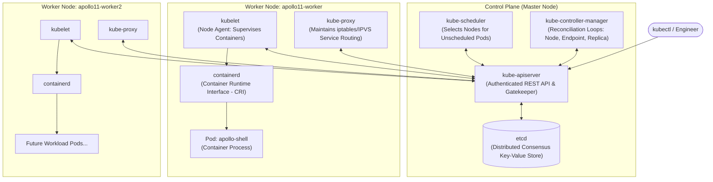

# Ignition: Your First Kubernetes Cluster

In **Ignition**, you create a small real cluster on your workstation using
**kind** (Kubernetes in Docker). The goal is not to memorise component names.
It is to answer a practical question: after you ask Kubernetes for a Pod, which
parts of the cluster turn that stored request into a running process?

Most importantly, you will perform two controlled experiments that reveal the core contract of Kubernetes:
1. What the **kubelet** recovers automatically when a process crashes inside an existing Pod.
2. Why a **bare Pod** does not recover when deleted, illustrating why production systems require controllers (Deployments) introduced in Stage 1.

---

## 🎯 Learning Goals

By the end of this stage, you will be able to:
1. Explain the role of each Kubernetes control plane component (`kube-apiserver`, `etcd`, `kube-scheduler`, `kube-controller-manager`) and node component (`kubelet`, `kube-proxy`, container runtime).
2. Understand how `kind` runs full Kubernetes nodes inside Docker containers on your machine.
3. Contrast imperative CLI commands (`kubectl run`) with declarative state management (`kubectl apply`).
4. Read and dissect a Pod manifest using the 4-pass YAML habit.
5. Systematically apply the 5-Rung Evidence Ladder to diagnose workloads before touching code.
6. Observe how container restarts preserve Pod UID while Pod deletion destroys identity.

---

## 🏛️ One request travels through several hands

When you later apply an Apollo Airlines Deployment, `kubectl` does not ssh to a
worker and start a container. It sends a desired-state object to the API server.
The scheduler, controllers, and kubelet each see different parts of that object
and have different authority. That separation makes the system inspectable: an
unscheduled Pod and a crashing container are different failures with different
evidence.



### 1. The Control Plane Components

- **`kube-apiserver`**: The front door of the cluster. Every `kubectl` command, every controller update, and every node heartbeat sends an HTTPS JSON request to the API server. It validates requests, enforces authentication/authorization, runs admission plugins, and is the **only** component that writes directly to `etcd`.
- **`etcd`**: A consistent, highly-available key-value store based on the Raft consensus algorithm. It stores the authoritative state of every object in the cluster (Pods, Services, Secrets, ConfigMaps).
- **`kube-scheduler`**: Watches for newly created Pods that have no node assigned (`spec.nodeName` is empty). It filters eligible nodes based on resource requests, taints, and affinity rules, scores the candidates, and binds the Pod to the winning node.
- **`kube-controller-manager`**: Runs continuous reconciliation control loops. For example, the ReplicaSet controller compares desired replica count against actual running Pods, and requests the API server to create or delete Pods to match desired state.

### 2. The Worker Node Components

- **`kubelet`**: The primary node agent. It watches the API server for Pods assigned to its node. It instructs the container runtime (`containerd`) to pull images, create container namespaces, mount volumes, and execute probes. If a container dies, the kubelet restarts it according to its `restartPolicy`.
- **`kube-proxy`**: A network proxy running on each node. It programs host kernel packet filtering rules (`iptables` or `IPVS`) so that virtual Service IPs (ClusterIPs) forward traffic to the real IP addresses of healthy Pods.
- **Container Runtime (`containerd`)**: The low-level runtime that manages Linux cgroups, namespaces, and image storage via the Container Runtime Interface (CRI).

For the `apollo-shell` Pod in this chapter, follow this sequence:

```text
kubectl apply → API server stores Pod spec → scheduler binds Pod to a node
→ kubelet sees the assignment → containerd starts BusyBox and mounts its rootfs
→ kubelet reports status and runs the requested restart policy
```

The API server records the desired object and status updates. It does not run
the HTTP server. The scheduler chooses a node but does not pull the image. The
kubelet runs the Pod on its assigned node but does not decide that a deleted bare
Pod deserves a replacement. The two break experiments below make those
boundaries concrete.

---

## 🐳 The lab is small; the roles are real

In production or on cloud providers (like AWS EKS or GCP GKE), each Kubernetes node is an EC2 instance or virtual machine.

In Apollo11, we use **kind** (Kubernetes in Docker). Instead of spinning up 3 heavy virtual machines that would consume 16 GB of RAM, `kind` launches **Docker containers that pretend to be Linux nodes**:

```
Your Host Laptop (Docker Engine)
  ├── Docker Container: apollo11-control-plane (Runs apiserver, etcd, scheduler, kubelet)
  ├── Docker Container: apollo11-worker        (Runs kubelet, containerd, pods)
  └── Docker Container: apollo11-worker2       (Runs kubelet, containerd, pods)
```

Inside each kind node container, Kubernetes components still perform their
normal roles. This is why a local lab can teach the control-plane flow without
claiming to model cloud availability. Losing the Docker host would still remove
every kind node at once.

Let's examine the Apollo11 kind configuration:

*Source: `stages/ignition/kind-config.yaml`*

```yaml
kind: Cluster
apiVersion: kind.x-k8s.io/v1alpha4
name: apollo11
networking:
  apiServerAddress: "127.0.0.1"
  apiServerPort: 6443
  podSubnet: "10.244.0.0/16"
  serviceSubnet: "10.96.0.0/16"
  disableDefaultCNI: false
  kubeProxyMode: "iptables"
nodes:
  - role: control-plane
    kubeadmConfigPatches:
      - |
        kind: InitConfiguration
        nodeRegistration:
          kubeletExtraArgs:
            node-labels: "node-role=control-plane"
    extraPortMappings:
      - containerPort: 30080
        hostPort: 30080
        protocol: TCP
      - containerPort: 30081
        hostPort: 30081
        protocol: TCP
      - containerPort: 30082
        hostPort: 30082
        protocol: TCP
      - containerPort: 30083
        hostPort: 30083
        protocol: TCP
      - containerPort: 30084
        hostPort: 30084
        protocol: TCP
      - containerPort: 30443
        hostPort: 30443
        protocol: TCP
  - role: worker
    labels:
      node-role: worker
      workload: app
  - role: worker
    labels:
      node-role: worker
      workload: app
```

### Important Fields Explained:
- **`extraPortMappings`**:
  Maps ports `30080`–`30084` and `30443` from your laptop into the control-plane container. In Stage 2, when we expose Apollo Airlines via `NodePort` or Traefik Ingress, your laptop will reach them through these forwarded ports!
- **`nodes`**:
  Defines a 3-node cluster: 1 control plane + 2 workers. The workers are pre-labeled with `workload: app`, which we will target with scheduling constraints in Stage 4 and Stage 7.

---

## 📦 A Pod is the unit Kubernetes places on a node

A container is one process boundary. A **Pod** is the scheduling and networking
unit Kubernetes creates for one or more tightly coupled containers. It is the
object the scheduler assigns to a node and the kubelet maintains there.

A Pod represents a single instance of a running process in your cluster. While a container is a single execution boundary, a Pod can contain **one or more tightly coupled containers** that:
- Share the same **network namespace** (they share the same Pod IP address and can communicate with each other over `localhost`).
- Share the same **storage volumes** (mounted into each container).
- Are scheduled together on the **same physical node**.

In Apollo11, every microservice runs in its own single-container Pod. That does
not make “Pod” a synonym for “container”: the distinction matters as soon as a
container restarts but the Pod UID and IP remain the same.

### Dissecting `pod.yaml` with the 4-Pass YAML Habit

*Source: `stages/ignition/pod.yaml`*

```yaml
apiVersion: v1
kind: Pod
metadata:
  name: apollo-shell
  labels:
    app: shell
    stage: ignition
spec:
  restartPolicy: Always
  containers:
    - name: shell
      image: busybox:1.36.1
      imagePullPolicy: IfNotPresent
      command:
        - sh
        - -c
        - |
          mkdir -p /www
          printf 'Apollo11 Ignition ready\n' > /www/index.html
          echo 'ignition HTTP server started'
          httpd -f -p 8080 -h /www &
          server_pid=$!
          wait "${server_pid}"
      ports:
        - name: http
          containerPort: 8080
          protocol: TCP
```

Let's read this manifest through our 4 passes:

1. **Pass 1 — Identity**:
   - `apiVersion: v1`: Core API group (where Pods, Services, Namespaces live).
   - `kind: Pod`: Declares this resource is a Pod.
   - `metadata.name: apollo-shell`: The unique name for this object within its namespace.
2. **Pass 2 — Ownership & Labels**:
   - `labels: { app: shell, stage: ignition }`: Arbitrary key-value metadata. Used by Services and controllers to query and group related resources.
3. **Pass 3 — Runtime Specification**:
   - `spec.restartPolicy: Always`: Tells the node's **kubelet** to restart the container if its main process exits or crashes.
   - `spec.containers[0].image: busybox:1.36.1`: The container image to run.
   - `command: [...]`: Overrides the image's default entrypoint to start a simple HTTP daemon (`httpd`) serving static HTML on port 8080.
   - `containerPort: 8080`: Documents that the application listens on port 8080. *(Note: This does not publish the port to your laptop! It is informational metadata for Kubernetes.)*
4. **Pass 4 — Relationships**:
   - No volumes or Secrets are referenced here; this is a standalone Pod.

---

## 🪜 Build an explanation from evidence

When something is not working, start with the least invasive question and move
toward user-visible behavior. The rungs are not a ritual and you need not always
run all five. They are a way to avoid using a log line to answer a scheduling
question, or assuming a `Running` status proves an HTTP endpoint works.

| Rung | Diagnostic Scope | What to Check |
|---|---|---|
| **Rung 1: Snapshot** | `kubectl get pod <name> -o wide` | Is the Pod `Running`, `Pending`, or `CrashLoopBackOff`? Which node is it on? What is its IP? |
| **Rung 2: Events** | `kubectl get events --field-selector involvedObject.name=<name>` | Did scheduling succeed? Was the image pulled? Did a volume mount fail? |
| **Rung 3: Detail & Spec** | `kubectl describe pod <name>` | Container status, exit codes, reason strings (`OOMKilled`), probe status, and recent events. |
| **Rung 4: Container Logs** | `kubectl logs <name>` | Application stdout/stderr output. Did an unhandled exception or database connection error occur? |
| **Rung 5: Live Endpoint** | `kubectl port-forward` + `curl` | Can a real client establish a TCP handshake and receive the expected HTTP payload? |

---

## 🧪 Investigations: separate process recovery from object recovery

Before each command, predict which component will react. Afterward, use the UID,
restart count, owner references, and endpoint response together; one signal is
rarely the whole explanation.

### Exercise 1: Provisioning the Local Cluster

**Question:** can you identify the control plane and two workers before any
Apollo application workload exists? Their roles explain the later scheduling
and routing observations.

- **Objective**: Create the multi-node `kind` cluster and verify control plane components.
- **Starting Point**: Docker running on your host machine.
- **Instructions**:

```bash
cd Apollo11

# 1. Create the 3-node cluster
kind create cluster --config stages/ignition/kind-config.yaml

# 2. Verify current context points to the new cluster
kubectl config current-context

# 3. Check node readiness
kubectl get nodes -o wide
```

- **Expected Result**:
  `kubectl config current-context` outputs `kind-apollo11`.
  `kubectl get nodes` shows three nodes:
  - `apollo11-control-plane` (Ready, role: control-plane)
  - `apollo11-worker` (Ready, role: worker)
  - `apollo11-worker2` (Ready, role: worker)
- **Verification Command**:

```bash
# Check system pods running in kube-system
kubectl get pods -n kube-system
```

You should see `coredns`, `etcd`, `kube-apiserver`, `kube-controller-manager`, `kube-proxy`, and `kube-scheduler` all in `Running` state.

- **Troubleshooting hints**: If nodes remain `NotReady`, inspect `kubectl get
  pods -n kube-system` and `docker ps --filter name=apollo11` before recreating
  anything.
- **Concept reinforced**: kind runs Kubernetes nodes as containers, but the
  control-plane and worker responsibilities are still Kubernetes roles.

---

### Exercise 2: Imperative vs. Declarative Management

**Prediction:** the dry-run command produces YAML only on your workstation. The
checked-in manifest becomes cluster state only after `kubectl apply` sends it to
the API server.

- **Objective**: Understand client-side dry-run generation vs. declarative apply.
- **Starting Point**: Running cluster.
- **Instructions**:

```bash
# 1. Generate a Pod manifest imperatively without creating it on the cluster
kubectl run apollo-shell \
  --image=busybox:1.36.1 \
  --restart=Always \
  --port=8080 \
  --dry-run=client -o yaml > /tmp/imperative-pod.yaml

# 2. Inspect the generated file
cat /tmp/imperative-pod.yaml

# 3. Apply the checked-in declarative manifest
kubectl apply -f stages/ignition/pod.yaml

# 4. Wait for the Pod to become Ready
kubectl wait --for=condition=Ready pod/apollo-shell --timeout=90s
```

- **Expected Result**:
  The Pod `apollo-shell` transitions from `ContainerCreating` to `Running`.
- **Verification command**: `kubectl get pod apollo-shell -o yaml` should show
  `stage: ignition` from the checked-in manifest, while the dry-run file remains
  only a local file.
- **Troubleshooting hints**: Use `kubectl describe pod apollo-shell` when the
  wait times out; events distinguish image-pull, scheduling, and startup issues.
- **What Concept This Reinforces**:
  `--dry-run=client -o yaml` is a great way to generate boilerplate YAML without remembering syntax, but production systems store **declarative Git-tracked manifests** applied via `kubectl apply`.

---

### Exercise 3: Climbing the Evidence Ladder

**Prediction:** all five rungs describe the same Pod from different angles.
If the endpoint succeeds but a log line is absent, that is a logging question,
not proof that the HTTP server failed.

- **Objective**: Gather complete proof that `apollo-shell` is running and serving traffic.
- **Starting Point**: `apollo-shell` Pod running.
- **Instructions**:

```bash
# Rung 1: Check Pod snapshot
kubectl get pod apollo-shell -o wide

# Rung 2: Check chronological cluster events
kubectl get events --field-selector involvedObject.name=apollo-shell --sort-by=.metadata.creationTimestamp

# Rung 3: Inspect Pod detail and conditions
kubectl describe pod apollo-shell | grep -A 5 Conditions:

# Rung 4: Check stdout logs
kubectl logs apollo-shell

# Rung 5: Port-forward and curl the endpoint
kubectl port-forward pod/apollo-shell 18080:8080 &
PF_PID=$!
sleep 2

curl -s http://127.0.0.1:18080/

# Terminate background port-forward
kill $PF_PID
```

- **Expected Result**:
  - Events show `Scheduled` -> `Pulling image` -> `Pulled image` -> `Created container` -> `Started container`.
  - Conditions show `Initialized=True`, `Ready=True`, `ContainersReady=True`, `PodScheduled=True`.
  - Logs show: `ignition HTTP server started`.
  - `curl` prints: `Apollo11 Ignition ready`.
- **Verification command**: The endpoint response is the top rung; preserve the
  lower-rung output so you can explain how the Pod reached that state.
- **Troubleshooting hints**: If port-forward exits, inspect the Pod first and
  rerun it in the foreground to see binding errors.
- **Concept reinforced**: No single `kubectl get` line proves application
  behavior; confidence comes from several independent evidence layers.

---

### Exercise 4: Break 1 — Container Crash vs. Pod Identity

**Prediction:** the kubelet restarts the exited `httpd` process inside the same
Pod. The restart count changes, while the Pod UID remains evidence that the API
object itself was not replaced.

- **Objective**: Prove that the kubelet restarts crashed containers while preserving Pod identity (UID).
- **Starting Point**: Healthy `apollo-shell` Pod.
- **Instructions**:

```bash
# 1. Record the Pod's immutable UID and initial restart count
kubectl get pod apollo-shell -o custom-columns='NAME:.metadata.name,UID:.metadata.uid,RESTARTS:.status.containerStatuses[0].restartCount'

# 2. Kill the httpd process inside the container
kubectl exec apollo-shell -- sh -c 'kill $(pidof httpd)' || true

# 3. Watch the Pod status
kubectl get pod apollo-shell -w
```
*(Press `Ctrl-C` once the Pod returns to `Running 1/1`)*

```bash
# 4. Re-inspect UID and restart count
kubectl get pod apollo-shell -o custom-columns='NAME:.metadata.name,UID:.metadata.uid,RESTARTS:.status.containerStatuses[0].restartCount'
```

- **Expected Result**:
  - The Pod UID remains **identical**.
  - `RESTARTS` increments from `0` to `1`.
- **What Concept This Reinforces**:
  The **kubelet** on the worker node is a local process supervisor. Because
  `spec.restartPolicy: Always` was specified, it restarts the exited container
  within the same Pod sandbox after the restart sequence, preserving the Pod's
  IP and metadata.
- **Verification command**: Compare the before/after UID and restart count, then
  repeat the endpoint check from Exercise 3.
- **Troubleshooting hints**: If `pidof httpd` finds nothing, check container
  logs and the exact command in `stages/ignition/pod.yaml` before injecting the
  failure again.

---

### Exercise 5: Break 2 — The Bare Pod Vulnerability

**Prediction:** deletion removes the API object that the kubelet was watching.
There is no ReplicaSet in this chapter yet to notice a missing count and create
a new Pod.

- **Objective**: Prove why bare Pods are not production-ready and why controllers are necessary.
- **Starting Point**: `apollo-shell` running.
- **Instructions**:

```bash
# 1. Delete the Pod
kubectl delete pod apollo-shell

# 2. Immediately check if the Pod comes back
kubectl get pods
```

- **Expected Result**:
  `No resources found in default namespace.`
  The Pod is **permanently gone**. No amount of waiting will bring it back!
- **Why Did This Happen?**
  A bare Pod has no owner reference (`metadata.ownerReferences`). The API server and kubelet do not keep desired replica counts for bare Pods. Once you delete it, there is no controller running in the control plane to recreate it.
- **Recovery**:

```bash
# 3. Manually recreate the Pod
kubectl apply -f stages/ignition/pod.yaml
kubectl wait --for=condition=Ready pod/apollo-shell --timeout=90s

# 4. Inspect its UID
kubectl get pod apollo-shell -o custom-columns='NAME:.metadata.name,UID:.metadata.uid'
```

Notice that the Pod now has a **completely different UID**! It is a brand-new object.

- **Verification command**: `kubectl get pod apollo-shell -o
  jsonpath='{.metadata.ownerReferences}'` is empty, and the recovered Pod's UID
  differs from the deleted one.
- **Troubleshooting hints**: If a Pod unexpectedly reappears before manual
  apply, check its owner references—you may be observing a similarly named Pod
  managed by a controller rather than the bare Ignition Pod.
- **Concept reinforced**: The kubelet restarts containers inside an existing
  Pod; a workload controller is required to replace a deleted Pod object.

---

## 🏁 What You Learned

- How `kube-apiserver`, `etcd`, `kube-scheduler`, `kube-controller-manager`, and `kubelet` cooperate to run workloads.
- How `kind` creates multi-node clusters using Docker containers and forwards NodePorts via `extraPortMappings`.
- The difference between imperative generation (`--dry-run=client -o yaml`) and declarative desired-state management (`kubectl apply`).
- How to systematically debug workloads using the 5-Rung Evidence Ladder.
- The fundamental difference between a **container restart** (managed locally by `kubelet`, preserving Pod UID) and a **Pod deletion** (destroying Pod identity).

---

## ✈️ Before Continuing: Checkpoint

Before moving to Stage 1, ensure you can answer:
1. Which component decides *which node* a Pod runs on?
2. Which component is responsible for restarting a failed container on a node?
3. If you delete a bare Pod, why doesn't Kubernetes automatically recreate it?
4. When should you run `kubectl describe` instead of `kubectl logs`?

Now that you have mastered cluster fundamentals and the evidence ladder, you are ready to deploy the entire Apollo Airlines fleet using self-healing controllers!

👉 **Continue to [Stage 1: Liftoff (Workloads & Deployments)](./stage-1)**
