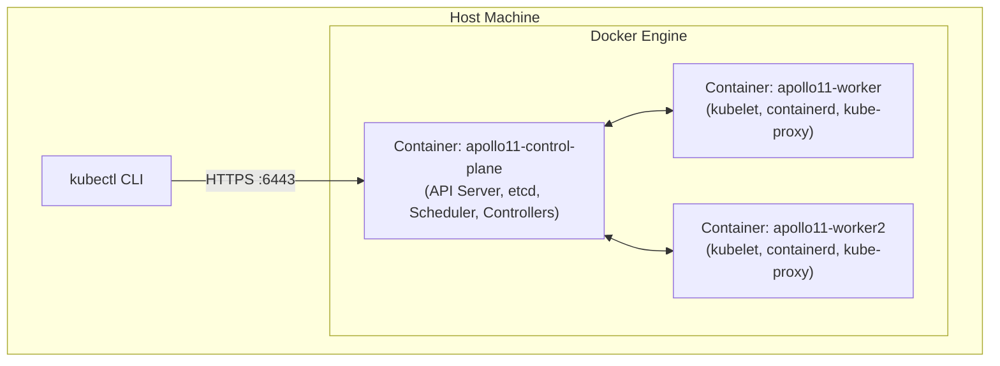

# Ignition: First Kubernetes Cluster

**Goal:** Create a local multi-node Kubernetes cluster using **kind**, launch an HTTP Pod, and prove what Kubernetes does—and does not—recover automatically.

Ignition deliberately uses a single, minimal workload (`busybox:1.36.1` running an HTTP server). The focus is mastering the cluster architecture, imperative vs declarative workflows, and the **evidence-first troubleshooting ladder** before Apollo Airlines introduces Deployments, Services, ConfigMaps, Secrets, and databases in Stage 1.

---

## What You Will Learn

1. How **kind** (Kubernetes in Docker) maps Kubernetes nodes directly to Docker containers.
2. The core responsibilities of `kube-apiserver`, `etcd`, `kube-scheduler`, `kube-controller-manager`, `kubelet`, `CoreDNS`, and `kube-proxy`.
3. Imperative (`kubectl run`) versus declarative (`kubectl apply -f`) workflows.
4. The 5-rung **Evidence Ladder** for systematically diagnosing workload failures.
5. How the `kubelet` automatically restarts crashed containers inside an existing Pod (retaining Pod identity).
6. Why a deleted **bare Pod** stays gone forever, and why Stage 1 introduces **Deployments and ReplicaSets** to ensure self-healing.

---

## Prerequisites

Ensure Docker, kind, kubectl, and curl are installed and operational:

```bash
docker info >/dev/null
kind version
kubectl version --client
curl --version
```

Run all commands from the root of the `Apollo11` repository.

---

## 1. Cluster Architecture: kind Internals

In production, Kubernetes runs across physical servers or cloud VMs. With `kind`, each Kubernetes node is an isolated Docker container running `systemd`, `containerd`, and the `kubelet`.



### Control Plane & Worker Components

- **kube-apiserver:** The central API gateway. Validates and configures data for Pods, Services, and Deployments.
- **etcd:** Consistent, highly available key-value store holding the complete state of the cluster.
- **kube-scheduler:** Watches for newly created Pods without assigned nodes and selects the optimal worker node.
- **kube-controller-manager:** Runs core reconciliation loops (Node Controller, EndpointSlice Controller, Job Controller).
- **kubelet:** The node agent. Communicates with the container runtime (`containerd`) to launch, monitor, and restart containers.
- **kube-proxy:** Implements Kubernetes Service networking via iptables/IPVS on each node.
- **CoreDNS:** Provides cluster-internal DNS resolution for Services and Pods.

---

## 2. Create the Cluster

Apollo11 provides a 3-node cluster configuration (`1 control-plane` + `2 workers`) with pre-configured host port mappings (`30080–30084` for NodePorts, `30443` for Ingress) required by later stages.

Run the cluster creation command:

```bash
kind create cluster --config stages/ignition/kind-config.yaml
```

:::tip Single-Node Alternative
If running on a machine with limited memory (under 8GB RAM), use the single-node config instead:
```bash
kind create cluster --config stages/ignition/kind-config-single.yaml
```
The context will be `kind-apollo11-dev`. Do not create both clusters simultaneously, as their host port mappings overlap.
:::

### Verify Cluster Nodes

Ensure your current kubectl context points to the new cluster:

```bash
kubectl config current-context
# Expected: kind-apollo11

kubectl get nodes -o wide
```

All 3 nodes should report `Ready`:
```text
NAME                    STATUS   ROLES           AGE   VERSION   INTERNAL-IP   OS-IMAGE
apollo11-control-plane   Ready    control-plane   2m    v1.35.0   172.18.0.4    Ubuntu 24.04.2 LTS
apollo11-worker          Ready    <none>          90s   v1.35.0   172.18.0.3    Ubuntu 24.04.2 LTS
apollo11-worker2         Ready    <none>          90s   v1.35.0   172.18.0.2    Ubuntu 24.04.2 LTS
```

Compare the Kubernetes view with the Docker container view on your host:

```bash
docker ps --filter label=io.x-k8s.kind.cluster=apollo11
```

Notice that Docker sees three running containers. Each container represents a full Kubernetes node!

### Discover Core Cluster Resources

```bash
# Check control plane endpoints
kubectl cluster-info

# View initial namespaces
kubectl get namespaces

# Inspect system pods running in kube-system
kubectl get pods -n kube-system -o wide

# View all API resources supported by the cluster
kubectl api-resources
```

---

## 3. Launching Your First Pod

A **Pod** is the smallest execution unit in Kubernetes. It encapsulates one or more containers sharing a network namespace (same IP address) and storage volumes.

### Imperative Workflow: `kubectl run`

First, test what manifest `kubectl` would generate using `--dry-run=client -o yaml`:

```bash
kubectl run apollo-shell \
  --image=busybox:1.36.1 \
  --restart=Always \
  --labels=app=shell,stage=ignition \
  --port=8080 \
  --dry-run=client -o yaml \
  -- sh -c 'mkdir -p /www; printf "Apollo11 Ignition ready\n" > /www/index.html; echo "ignition HTTP server started"; httpd -f -p 8080 -h /www & server_pid=$!; wait "$server_pid"'
```

Now execute the command for real to deploy the Pod:

```bash
kubectl run apollo-shell \
  --image=busybox:1.36.1 \
  --restart=Always \
  --labels=app=shell,stage=ignition \
  --port=8080 \
  -- sh -c 'mkdir -p /www; printf "Apollo11 Ignition ready\n" > /www/index.html; echo "ignition HTTP server started"; httpd -f -p 8080 -h /www & server_pid=$!; wait "$server_pid"'

# Wait until the Pod is Ready
kubectl wait --for=condition=Ready pod/apollo-shell --timeout=90s
```

### Declarative Workflow: Manifest YAML

In production, imperative commands are avoided because they are not version-controlled or reproducible. We use declarative YAML manifests.

Delete the imperative Pod:
```bash
kubectl delete pod apollo-shell
```

Inspect the committed declarative manifest at `stages/ignition/pod.yaml`:

```yaml
apiVersion: v1
kind: Pod
metadata:
  name: apollo-shell
  labels:
    app: shell
    stage: ignition
spec:
  restartPolicy: Always
  containers:
    - name: shell
      image: busybox:1.36.1
      command:
        - sh
        - -c
        - |
          mkdir -p /www
          printf "Apollo11 Ignition ready\n" > /www/index.html
          echo "ignition HTTP server started"
          httpd -f -p 8080 -h /www &
          server_pid=$!
          wait "$server_pid"
      ports:
        - containerPort: 8080
          name: http
      resources:
        requests:
          cpu: 50m
          memory: 32Mi
        limits:
          cpu: 100m
          memory: 64Mi
```

Apply the declarative manifest:

```bash
kubectl apply -f stages/ignition/pod.yaml
kubectl wait --for=condition=Ready pod/apollo-shell --timeout=90s
```

---

## 4. Inspect: The Evidence Ladder

Whenever a Kubernetes workload fails or behaves unexpectedly, use this **Evidence Ladder**. Always follow this exact order from cheap status queries down to network behavior:

| Step | Evidence Layer | Command | Question It Answers |
|---|---|---|---|
| **1** | **Status** | `kubectl get pod apollo-shell -o wide` | Is it Pending, ContainerCreating, Running, or CrashLoopBackOff? Which node is it on? |
| **2** | **Events** | `kubectl get events --field-selector involvedObject.name=apollo-shell --sort-by=.metadata.creationTimestamp` | What scheduler, image pull, and container lifecycle events occurred over time? |
| **3** | **Detail** | `kubectl describe pod apollo-shell` | What are the exact conditions, volume mounts, exit codes, and recent termination reasons? |
| **4** | **Logs** | `kubectl logs apollo-shell` | What did the application process write to stdout/stderr? |
| **5** | **Behavior** | `kubectl port-forward` + `curl` | Can an actual HTTP client reach the listener and get the expected response? |

### Run Every Rung on the Healthy Pod

```bash
# 1. Status
kubectl get pod apollo-shell -o wide

# 2. Events
kubectl get events \
  --field-selector involvedObject.name=apollo-shell \
  --sort-by=.metadata.creationTimestamp

# 3. Describe
kubectl describe pod apollo-shell

# 4. Logs
kubectl logs apollo-shell
```

Now test **Rung 5 (Behavior)**. Forward a local port from your host machine to the Pod:

```bash
# In a background or secondary terminal:
kubectl port-forward pod/apollo-shell 18080:8080 &
PF_PID=$!
sleep 2

# Verify application behavior with curl
curl --fail http://127.0.0.1:18080/
# Expected Output: Apollo11 Ignition ready

# Kill the background port-forward process
kill $PF_PID
```

---

## 5. Break 1: Crash the Container (Kubelet Restart)

Let's test what happens when a container's main process dies inside a Pod.

Capture the Pod's name, unique UID, and current restart count:

```bash
kubectl get pod apollo-shell \
  -o custom-columns='NAME:.metadata.name,UID:.metadata.uid,RESTARTS:.status.containerStatuses[0].restartCount'
```

Now terminate the `httpd` process inside the container:

```bash
kubectl exec apollo-shell -- sh -c 'kill "$(pidof httpd)"' || true
```

The exec command may exit with an error because the container is terminating. Now observe recovery:

```bash
sleep 3
kubectl get pod apollo-shell \
  -o custom-columns='NAME:.metadata.name,UID:.metadata.uid,RESTARTS:.status.containerStatuses[0].restartCount'
```

**Key Observations:**
- The **Pod UID remains identical**. The Pod object in etcd was never destroyed.
- The **RESTARTS count incremented from 0 to 1**.
- The `kubelet` detected that the container process exited and, adhering to `restartPolicy: Always`, created a fresh container instance inside the same Pod namespace.

Inspect the logs of the crashed container:

```bash
kubectl logs apollo-shell --previous
```

Prove that application behavior recovered:

```bash
kubectl exec apollo-shell -- wget -qO- http://127.0.0.1:8080/
# Output: Apollo11 Ignition ready
```

---

## 6. Break 2: Delete the Bare Pod (The Controller Gap)

Now test what happens when the Kubernetes object itself is removed:

```bash
# 1. Note the Pod UID
kubectl get pod apollo-shell -o jsonpath='{.metadata.uid}{"\n"}'

# 2. Delete the bare Pod
kubectl delete pod apollo-shell --wait=true

# 3. Check for the Pod
kubectl get pod apollo-shell
```

Output:
```text
Error from server (NotFound): pods "apollo-shell" not found
```

The Pod is gone and is **never recreated**. 

**Why?** A bare Pod has no controller managing it. The kube-apiserver simply deleted the record from etcd. There is no ReplicaSet or Deployment monitoring its existence. This is why bare Pods are almost never deployed in production.

---

## 7. Recover: Restore Desired State

To recover a deleted bare Pod, a human or script must explicitly reapply the manifest:

```bash
kubectl apply -f stages/ignition/pod.yaml
kubectl wait --for=condition=Ready pod/apollo-shell --timeout=90s

# Inspect the new Pod
kubectl get pod apollo-shell \
  -o custom-columns='NAME:.metadata.name,UID:.metadata.uid,RESTARTS:.status.containerStatuses[0].restartCount'
```

Notice that the **Pod UID is completely different**. A new Pod was scheduled, assigned an IP, and initialized.

Verify HTTP behavior:

```bash
kubectl exec apollo-shell -- wget -qO- http://127.0.0.1:8080/
# Output: Apollo11 Ignition ready
```

---

## 8. Maintainer Verification

Run the automated verification script to validate your Ignition lab:

```bash
bash stages/ignition/scripts/verify.sh
```

The script runs **14 automated checks**, verifying:
1. Active context matches `kind-apollo11` or `kind-apollo11-dev`.
2. All 3 nodes are in `Ready` state.
3. Node port ranges (30080–30084, 30443) are properly mapped.
4. The declarative manifest matches schema standards.
5. Automated container crash and restart recovery.
6. Automated Pod deletion and declarative recovery.

---

## Clean Up & Residue Audit

To leave the cluster clean for Stage 1:

```bash
# Delete the apollo-shell Pod
kubectl delete -f stages/ignition/pod.yaml --ignore-not-found
```

If you wish to delete the entire kind cluster and verify zero leftover resources:

```bash
kind delete cluster --name apollo11
kind get clusters
kubectl config get-contexts -o name
```

Ensure `apollo11` is absent from both outputs.

---

## Explain & Review Questions

Before advancing to Stage 1, ensure you can answer:

1. **Why can a Pod report `Running` while the application is completely broken?**
   `Running` only means the container process has started and hasn't exited. If the application is hung in an infinite loop, deadlocked, or returning 500 errors, Kubernetes considers it `Running` unless configured with health probes.

2. **Why did killing `httpd` increase the restart count without changing the Pod UID?**
   The Pod is an API resource representing a shared network/storage sandbox. The `kubelet` manages container lifecycles within that sandbox. Killing the process kills the container, but the Pod object remains alive in etcd.

3. **Why did deleting the Pod require `kubectl apply` to recover it?**
   Bare Pods lack a parent controller. No reconciliation loop exists to maintain desired replica counts until Stage 1 introduces ReplicaSets and Deployments.

4. **What is the difference between `kubectl`, `kube-apiserver`, and `kubelet`?**
   - `kubectl` is the client CLI making HTTP REST calls.
   - `kube-apiserver` is the cluster API gateway and state gatekeeper.
   - `kubelet` is the worker node daemon executing commands from the API server via containerd.

---

## What's Next

In [Stage 1: Liftoff](./stage-1.md), we deploy all 10 components of Apollo Airlines using Deployments, ReplicaSets, Services, ConfigMaps, Secrets, ServiceAccounts, and Jobs.