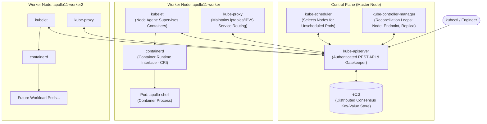

# Ignition: Your First Kubernetes Cluster

:::info[Page type · build and investigate]
Run this after the Ignition chapters against Apollo11 commit
`69113dcc80f77e32301d8ee7b9e73a67c923de96` (see [setup](./labs/setup#revision-and-verification-boundary)). Start in a clean lab clone and verify your context before applying anything.
:::

:::note[Take the controls · Ignition lab]
Start your first cluster and watch its components bring a Pod to life.
For the explanation before the experiment, start with the
[Ignition chapters](./learn/cluster/why-orchestration). You can return to this lab whenever you’re ready.

Already read them? [Jump to the investigations](#-investigations-separate-process-recovery-from-object-recovery).
:::

In **Ignition**, you create a small, real cluster on your workstation using
**kind** (Kubernetes in Docker). The aim is not to memorise component names. It
is to answer a practical question: after you ask Kubernetes for a Pod, which parts
of the cluster turn that request into a running process?

You will also run two experiments that show what Kubernetes does and does not do for you:
1. What the **kubelet** recovers automatically when a process crashes inside an existing Pod.
2. Why a **bare Pod** is not recreated when you delete it. This is why real systems use controllers such as Deployments, which you meet in Stage 1.

<details>
<summary><strong>Optional conceptual refresher</strong></summary>

The Ignition chapters are the primary explanation. Expand this section when you
want the older all-in-one account beside the lab.

---

## 🎯 Learning Goals

By the end of this stage, you will be able to:
1. Explain what each control plane component (`kube-apiserver`, `etcd`, `kube-scheduler`, `kube-controller-manager`) and each node component (`kubelet`, `kube-proxy`, container runtime) does.
2. Describe how `kind` runs Kubernetes nodes as Docker containers on your machine.
3. Compare imperative commands (`kubectl run`) with declarative management (`kubectl apply`).
4. Read a Pod manifest using the 4-pass YAML habit.
5. Use the 5-rung evidence ladder to diagnose a workload before you change any code.
6. Show that a container restart keeps the Pod's UID, while deleting the Pod destroys its identity.

---

## 🏛️ One request passes through several components

When you later apply an Apollo Airlines Deployment, `kubectl` does not log in to a
worker and start a container. It sends a desired-state object to the API server.
The scheduler, the controllers, and the kubelet each act on a different part of
that object. Because the work is split this way, you can investigate each part on
its own. A Pod that was never scheduled and a container that keeps crashing are
different failures, and each leaves different evidence.


```mermaid
flowchart TD
  subgraph ControlPlane ["Control Plane (Master Node)"]
    API["kube-apiserver\n(Authenticated REST API & Gatekeeper)"]
    ETCD[("etcd\n(Distributed Consensus Key-Value Store)")]
    SCHED["kube-scheduler\n(Selects Nodes for Unscheduled Pods)"]
    CM["kube-controller-manager\n(Reconciliation Loops: Node, Endpoint, Replica)"]

    API <--> ETCD
    SCHED <--> API
    CM <--> API
  end

  subgraph WorkerNode1 ["Worker Node: apollo11-worker"]
    Kubelet1["kubelet\n(Node Agent: Supervises Containers)"]
    Proxy1["kube-proxy\n(Maintains iptables/IPVS Service Routing)"]
    Runtime1["containerd\n(Container Runtime Interface - CRI)"]
    PodA["Pod: apollo-shell\n(Container Process)"]

    Kubelet1 <--> API
    Proxy1 <--> API
    Kubelet1 --> Runtime1
    Runtime1 --> PodA
  end

  subgraph WorkerNode2 ["Worker Node: apollo11-worker2"]
    Kubelet2["kubelet"]
    Proxy2["kube-proxy"]
    Runtime2["containerd"]
    PodB["Future Workload Pods..."]

    Kubelet2 <--> API
    Proxy2 <--> API
    Kubelet2 --> Runtime2
    Runtime2 --> PodB
  end

  User(["kubectl / Engineer"]) --> API
```

### 1. The Control Plane Components

- **`kube-apiserver`:** the front door of the cluster. Every `kubectl` command, every controller update, and every node heartbeat reaches it as an HTTPS request with a JSON body. It checks requests, enforces authentication and authorization, runs admission plugins, and is the **only** component that writes to `etcd`.
- **`etcd`:** a consistent key-value store that uses the Raft consensus algorithm and can run on several machines for high availability. It holds the authoritative state of every object in the cluster (Pods, Services, Secrets, ConfigMaps).
- **`kube-scheduler`:** watches for new Pods that have no node assigned (`spec.nodeName` is empty). It filters out nodes that cannot take the Pod, based on resource requests, taints, and affinity rules, scores the remaining nodes, and binds the Pod to the best one.
- **`kube-controller-manager`:** runs the reconciliation loops. For example, the ReplicaSet controller compares the desired replica count with the Pods that are actually running, and asks the API server to create or delete Pods until they match.

### 2. The worker node components

- **`kubelet`:** the main agent on each node. It watches the API server for Pods assigned to its node. It tells the container runtime (`containerd`) to pull images, create containers, mount volumes, and run probes. If a container dies, the kubelet restarts it according to the Pod's `restartPolicy`.
- **`kube-proxy`:** a network proxy on each node. It sets up packet-filtering rules in the node's kernel (`iptables` or `IPVS`) so that traffic sent to a Service's virtual IP (ClusterIP) is forwarded to the real IP of a healthy Pod.
- **Container runtime (`containerd`):** the low-level runtime that manages Linux cgroups, namespaces, and image storage, through the Container Runtime Interface (CRI).

For the `apollo-shell` Pod in this chapter, the sequence is:

```text
kubectl apply → API server stores Pod spec → scheduler binds Pod to a node
→ kubelet sees the assignment → containerd starts BusyBox and mounts its rootfs
→ kubelet reports status and runs the requested restart policy
```

Each component has a limited role. The API server stores the desired object and
status updates, but it does not run the HTTP server in the Pod. The scheduler picks
a node but does not pull the image. The kubelet runs the Pod on its node but does
not decide that a deleted bare Pod needs a replacement. The two break experiments
below make these limits concrete.

---

## 🐳 The lab is small, but the roles are real

In production, or on a cloud provider such as AWS EKS or GCP GKE, each Kubernetes
node is an EC2 instance or a virtual machine.

Apollo11 uses **kind** (Kubernetes in Docker). Starting three full virtual machines
would need about 16 GB of RAM. Instead, `kind` starts **Docker containers that act
as Linux nodes**:

```
Your Host Laptop (Docker Engine)
  ├── Docker Container: apollo11-control-plane (Runs apiserver, etcd, scheduler, kubelet)
  ├── Docker Container: apollo11-worker        (Runs kubelet, containerd, pods)
  └── Docker Container: apollo11-worker2       (Runs kubelet, containerd, pods)
```

Inside each kind node container, the Kubernetes components do their normal jobs.
This is why a local lab can teach how the control plane works, even though it
does not model the availability of a cloud cluster: if the Docker host goes away,
every kind node goes with it.

Here is the Apollo11 kind configuration:

*Source: `stages/ignition/kind-config.yaml`*

```yaml
kind: Cluster
apiVersion: kind.x-k8s.io/v1alpha4
name: apollo11
networking:
  apiServerAddress: "127.0.0.1"
  apiServerPort: 6443
  podSubnet: "10.244.0.0/16"
  serviceSubnet: "10.96.0.0/16"
  disableDefaultCNI: false
  kubeProxyMode: "iptables"
nodes:
  - role: control-plane
    kubeadmConfigPatches:
      - |
        kind: InitConfiguration
        nodeRegistration:
          kubeletExtraArgs:
            node-labels: "node-role=control-plane"
    extraPortMappings:
      - containerPort: 30080
        hostPort: 30080
        protocol: TCP
      - containerPort: 30081
        hostPort: 30081
        protocol: TCP
      - containerPort: 30082
        hostPort: 30082
        protocol: TCP
      - containerPort: 30083
        hostPort: 30083
        protocol: TCP
      - containerPort: 30084
        hostPort: 30084
        protocol: TCP
      - containerPort: 30443
        hostPort: 30443
        protocol: TCP
  - role: worker
    labels:
      node-role: worker
      workload: app
  - role: worker
    labels:
      node-role: worker
      workload: app
```

### Key fields
- **`extraPortMappings`:**
  forwards ports `30080`–`30084` and `30443` from your laptop to the control-plane container. In Stage 2, when Apollo Airlines is exposed through a `NodePort` or a Traefik Ingress, your laptop reaches it through these forwarded ports.
- **`nodes`:**
  defines a 3-node cluster: 1 control plane and 2 workers. The workers are labeled `workload: app`, which Stage 4 and Stage 7 use in their scheduling rules.

---

## 📦 A Pod is the unit that Kubernetes places on a node

A container is a single isolated process. A **Pod** is the unit that Kubernetes
schedules and gives a network identity to. It holds one or more tightly coupled
containers. The scheduler assigns a Pod to a node, and the kubelet keeps it
running there.

A Pod is one running instance of your workload. It can hold **one or more
tightly coupled containers** that:
- Share one **network namespace**: they have the same Pod IP address and can talk to each other over `localhost`.
- Share the same **storage volumes**, which are mounted into each container.
- Always run together on the **same node**.

In Apollo11, each microservice runs in its own Pod with a single container. That
does not make "Pod" mean the same as "container". The difference shows up as soon
as a container restarts while the Pod's UID and IP stay the same.

### Reading `pod.yaml` with the 4-pass YAML habit

*Source: `stages/ignition/pod.yaml`*

```yaml
apiVersion: v1
kind: Pod
metadata:
  name: apollo-shell
  labels:
    app: shell
    stage: ignition
spec:
  restartPolicy: Always
  containers:
    - name: shell
      image: busybox:1.36.1
      imagePullPolicy: IfNotPresent
      command:
        - sh
        - -c
        - |
          mkdir -p /www
          printf 'Apollo11 Ignition ready\n' > /www/index.html
          echo 'ignition HTTP server started'
          httpd -f -p 8080 -h /www &
          server_pid=$!
          wait "${server_pid}"
      ports:
        - name: http
          containerPort: 8080
          protocol: TCP
```

Read the manifest in four passes:

1. **Pass 1: identity**
   - `apiVersion: v1`: the core API group, which holds Pods, Services, and Namespaces.
   - `kind: Pod`: the type of object.
   - `metadata.name: apollo-shell`: the name, which must be unique within its namespace.
2. **Pass 2: ownership and labels**
   - `labels: { app: shell, stage: ignition }`: free-form key-value pairs. Services and controllers use them to find and group related objects.
3. **Pass 3: runtime specification**
   - `spec.restartPolicy: Always`: tells the **kubelet** to restart the container whenever its main process exits or crashes.
   - `spec.containers[0].image: busybox:1.36.1`: the container image to run.
   - `command: [...]`: replaces the image's default command so that it starts a small HTTP server (`httpd`) that serves a static page on port 8080.
   - `containerPort: 8080`: states that the application listens on port 8080. *(This does not publish the port to your laptop. It is only information for Kubernetes.)*
4. **Pass 4: relationships**
   - The manifest refers to no volumes or Secrets. This is a standalone Pod.

---

## 🪜 Build an explanation from evidence

When something is not working, start with the least intrusive check and work up
to what a user would see. The rungs are not a ritual, and you do not always need
all five. They help you avoid answering a scheduling question with a log line, or
assuming that a `Running` status means the HTTP endpoint works.

| Rung | What it covers | What to check |
|---|---|---|
| **Rung 1: snapshot** | `kubectl get pod <name> -o wide` | Is the Pod `Running`, `Pending`, or `CrashLoopBackOff`? Which node is it on? What is its IP? |
| **Rung 2: events** | `kubectl get events --field-selector involvedObject.name=<name>` | Was the Pod scheduled? Was the image pulled? Did a volume fail to mount? |
| **Rung 3: details** | `kubectl describe pod <name>` | Container status, exit codes, reasons such as `OOMKilled`, probe status, and recent events. |
| **Rung 4: logs** | `kubectl logs <name>` | The application's stdout and stderr. Is there an unhandled exception or a database connection error? |
| **Rung 5: live endpoint** | `kubectl port-forward` + `curl` | Can a real client connect and get the expected HTTP response? |

---

</details>

## 🧪 Investigations: separate process recovery from object recovery

Before each command, predict which component will react. Afterwards, look at the
UID, the restart count, the owner references, and the endpoint response together.
One signal is rarely the whole explanation.

### Exercise 1: Create the local cluster

**Question:** can you identify the control plane and the two workers before any
Apollo application is running? Their roles explain what you will see later when
Pods are scheduled and traffic is routed.

- **Objective**: Create the multi-node `kind` cluster and check the control plane components.
- **Starting Point**: Docker is running on your machine, and your terminal is inside the cloned `Apollo11` repository.
- **What happens under the hood**: `kind` reads `stages/ignition/kind-config.yaml` and starts three Docker containers: one control plane (`apollo11-control-plane`) and two workers (`apollo11-worker`, `apollo11-worker2`). It also forwards ports `30080`–`30084` and `30443` to the control-plane container, so you can reach web services from your laptop later.
- **Instructions**:

```bash
cd Apollo11

# 1. Create the 3-node cluster
kind create cluster --config stages/ignition/kind-config.yaml

# 2. Check that the current context points to the new cluster
kubectl config current-context

# 3. Check that the nodes are ready
kubectl get nodes -o wide
```

- **Expected result**:
  `kubectl config current-context` prints `kind-apollo11`.
  `kubectl get nodes` shows three nodes:
  - `apollo11-control-plane` (Ready, role: control-plane)
  - `apollo11-worker` (Ready, role: worker)
  - `apollo11-worker2` (Ready, role: worker)
- **Verification command**:

```bash
# List the system Pods in kube-system
kubectl get pods -n kube-system
```

`coredns`, `etcd`, `kube-apiserver`, `kube-controller-manager`, `kube-proxy`, and `kube-scheduler` should all be `Running`.

- **Troubleshooting hints**: If the nodes stay `NotReady`, run `kubectl get pods
  -n kube-system` and `docker ps --filter name=apollo11` before you recreate
  anything.
- **Concept reinforced**: kind runs the Kubernetes nodes as containers, but the
  control plane and worker roles are still the usual Kubernetes roles.

---

### Exercise 2: Imperative generation and declarative authoring

**Prediction:** the dry-run command only writes YAML on your workstation. The
manifest becomes cluster state only after `kubectl apply` sends it to the API
server.

- **Objective**: Generate a starter template into `learner-work/`, see what it is missing, and apply the declarative manifest.
- **Starting Point**: A running cluster.
- **Instructions**:

```bash
mkdir -p learner-work/ignition

# 1. Generate starter Pod YAML into your workspace
kubectl run apollo-shell \
  --image=busybox:1.36.1 \
  --restart=Always \
  --port=8080 \
  --dry-run=client -o yaml > learner-work/ignition/pod.yaml

# 2. Inspect the generated file
cat learner-work/ignition/pod.yaml
```

The generator supplied `apiVersion`, `kind: Pod`, `image`, `restartPolicy`, and `containerPort`. It did not supply the web server process or any content. The reference file `stages/ignition/pod.yaml` in the repository adds the labels (`app: shell`, `stage: ignition`) and a BusyBox `httpd` command that keeps the server running:

```bash
# 3. Apply the Pod manifest from the repository (or your own file in learner-work/ignition/pod.yaml)
kubectl apply -f stages/ignition/pod.yaml

# 4. Wait for the Pod to become Ready
kubectl wait --for=condition=Ready pod/apollo-shell --timeout=90s
```

- **Expected result**:
  The Pod `apollo-shell` goes from `ContainerCreating` to `Running`.
- **Verification command**: `kubectl get pod apollo-shell -o yaml` should show
  `stage: ignition` from the manifest you applied. The dry-run file on your disk is
  still only a template.
- **Troubleshooting hints**: If the wait times out, run `kubectl describe pod
  apollo-shell`. The events show whether the problem is the image pull,
  scheduling, or startup.
- **Concept reinforced**:
  `--dry-run=client -o yaml` quickly produces boilerplate YAML so you do not have
  to guess the syntax. Real systems keep **declarative manifests in Git** and apply
  them with `kubectl apply`.

---

### Exercise 3: Climb the evidence ladder

**Prediction:** all five rungs describe the same Pod from different angles. If the
endpoint responds but you see no log line, that is a question about logging. It
does not mean the HTTP server failed.

- **Objective**: Collect complete evidence that `apollo-shell` is running and serving requests.
- **Starting Point**: The `apollo-shell` Pod is running.
- **Instructions**:

```bash
# Rung 1: snapshot of the Pod
kubectl get pod apollo-shell -o wide

# Rung 2: cluster events in time order
kubectl get events --field-selector involvedObject.name=apollo-shell --sort-by=.metadata.creationTimestamp

# Rung 3: Pod details and conditions
kubectl describe pod apollo-shell | grep -A 5 Conditions:

# Rung 4: the container's stdout
kubectl logs apollo-shell

# Rung 5: forward a port and call the endpoint
kubectl port-forward pod/apollo-shell 18080:8080 &
PF_PID=$!
sleep 2

curl -s http://127.0.0.1:18080/

# Stop the background port-forward
kill $PF_PID
```

- **Expected result**:
  - The events show `Scheduled`, `Pulling image`, `Pulled image`, `Created container`, and `Started container`, in that order.
  - The conditions show `Initialized=True`, `Ready=True`, `ContainersReady=True`, and `PodScheduled=True`.
  - The logs show `ignition HTTP server started`.
  - `curl` prints `Apollo11 Ignition ready`.
- **Verification command**: The endpoint response is the top rung. Keep the output
  from the lower rungs too, so you can explain how the Pod got to this state.
- **Troubleshooting hints**: If `port-forward` exits, check the Pod first, then run
  `port-forward` in the foreground to see any error about binding the port.
- **Concept reinforced**: No single `kubectl get` line proves that the application
  works. You gain confidence by combining several independent kinds of evidence.

---

### Exercise 4: Break 1, a container crash versus Pod identity

**Prediction:** the kubelet restarts the exited `httpd` process inside the same
Pod. The restart count and the container runtime ID change. The Pod's UID stays
the same, which shows that the API object was not replaced.

- **Objective**: Show that the kubelet restarts a crashed container and keeps the Pod's identity (its UID).
- **Starting Point**: A healthy `apollo-shell` Pod.
- **Instructions**:

Record these five signals before you cause the failure:

| Signal | Command | Before the failure | After the restart |
|---|---|---|---|
| **Pod UID** | `kubectl get pod apollo-shell -o jsonpath='{.metadata.uid}'` | Write it down | **Unchanged** |
| **Container ID** | `kubectl get pod apollo-shell -o jsonpath='{.status.containerStatuses[0].containerID}'` | Write it down | **A new ID** |
| **Restart count** | `kubectl get pod apollo-shell -o jsonpath='{.status.containerStatuses[0].restartCount}'` | `0` | `1` |
| **Previous state** | `kubectl get pod apollo-shell -o jsonpath='{.status.containerStatuses[0].lastState}'` | Empty | Details of the terminated container |
| **HTTP response** | `curl -s http://127.0.0.1:18080/` (through a port-forward) | `Apollo11 Ignition ready` | `Apollo11 Ignition ready` |

Now cause the failure:

```bash
# 1. Record the baseline signals
kubectl get pod apollo-shell -o custom-columns='NAME:.metadata.name,UID:.metadata.uid,CONTAINER_ID:.status.containerStatuses[0].containerID,RESTARTS:.status.containerStatuses[0].restartCount'

# 2. Kill the httpd process inside the container
kubectl exec apollo-shell -- sh -c 'kill $(pidof httpd)' || true

# 3. Watch the Pod's status change
kubectl get pod apollo-shell -w
```
*(Press `Ctrl-C` once the Pod is back to `Running 1/1`.)*

```bash
# 4. Check the signals again after recovery
kubectl get pod apollo-shell -o custom-columns='NAME:.metadata.name,UID:.metadata.uid,CONTAINER_ID:.status.containerStatuses[0].containerID,RESTARTS:.status.containerStatuses[0].restartCount'

# 5. Look at the details of the previous container's termination
kubectl get pod apollo-shell -o jsonpath='{.status.containerStatuses[0].lastState.terminated}' | jq .
```

- **Expected result**:
  - The **Pod UID is identical**.
  - The **container runtime ID changes**: the kubelet started a new container.
  - `RESTARTS` goes from `0` to `1`.
  - The HTTP endpoint serves `Apollo11 Ignition ready` again.
- **Concept reinforced**:
  The **kubelet** on the worker node supervises the processes on its node. Because
  the Pod sets `spec.restartPolicy: Always`, the kubelet restarts the exited
  container inside the same Pod, so the Pod's IP and metadata do not change.
- **Verification command**: Compare the UID and the restart count from before and
  after, then repeat the endpoint check from Exercise 3.
- **Troubleshooting hints**: If `pidof httpd` finds nothing, check the container
  logs and the command in `stages/ignition/pod.yaml` before you try to cause the
  failure again.

---

### Exercise 5: Break 2, the bare Pod problem

**Prediction:** deleting the Pod removes the API object that the kubelet was
watching. Nothing in this chapter compares the Pod count with a desired count, so
nothing creates a replacement.

- **Objective**: See why a bare Pod is not replaced when it is deleted. This is the reason for the Deployments in Stage 1.
- **Starting Point**: The `apollo-shell` Pod is running.
- **Instructions**:

```bash
# 1. Check the ownerReferences of the bare Pod
kubectl get pod apollo-shell -o jsonpath='{.metadata.ownerReferences}'
# Output: (empty, so no controller owns this Pod)

# 2. Record the Pod's UID
kubectl get pod apollo-shell -o jsonpath='{.metadata.uid}' && echo ""

# 3. Delete the bare Pod
kubectl delete pod apollo-shell

# 4. Wait 5 seconds and list the Pods in the namespace
kubectl get pods
# Output: No resources found in default namespace.
```

The Pod does not come back. Its desired state was deleted from etcd, and the
kubelet stopped the container because it was told to.

```bash
# 5. Recover by applying the manifest again
kubectl apply -f stages/ignition/pod.yaml
kubectl wait --for=condition=Ready pod/apollo-shell --timeout=90s

# 6. Record the new Pod's UID
kubectl get pod apollo-shell -o jsonpath='{.metadata.uid}' && echo ""
```

- **Expected result**:
  The new Pod has a **different UID** from the one you recorded in step 2.
- **Concept reinforced**:
  The kubelet recovers **crashed processes inside a Pod**. It does not recover
  **deleted Pod objects**. To survive deletion, you need a higher-level controller
  (a `ReplicaSet` or `Deployment`) that keeps comparing the desired replica count
  with what is actually running. That is the subject of Stage 1: Liftoff.
- **Verification command**: `kubectl get pod apollo-shell -o jsonpath='{.metadata.ownerReferences}'` prints nothing, and the new Pod's UID differs from the deleted one's.
- **Troubleshooting hints**: If a Pod reappears before you apply the manifest, check its owner references. You may be looking at a similarly named Pod that a controller manages, not the bare Ignition Pod.

---

## 🏁 What You Learned

- How `kube-apiserver`, `etcd`, `kube-scheduler`, `kube-controller-manager`, and `kubelet` work together to run workloads.
- How `kind` builds a multi-node cluster from Docker containers and forwards NodePorts with `extraPortMappings`.
- The difference between generating YAML imperatively (`--dry-run=client -o yaml`) and managing desired state declaratively (`kubectl apply`).
- How to debug a workload step by step with the 5-rung evidence ladder.
- The difference between a **container restart** (handled by the kubelet, and the Pod keeps its UID) and a **Pod deletion** (the Pod's identity is gone).

---

## ✈️ Before Continuing: Checkpoint

Before you move to Stage 1, make sure you can answer these questions:
1. Which component decides *which node* a Pod runs on?
2. Which component restarts a failed container on a node?
3. If you delete a bare Pod, why does Kubernetes not recreate it?
4. When should you run `kubectl describe` instead of `kubectl logs`?

You now understand the basics of the cluster and the evidence ladder. In Stage 1
you will deploy the whole Apollo Airlines fleet with controllers that replace
failed Pods.

👉 **Continue to [Stage 1: Liftoff (Workloads & Deployments)](./stage-1)**
