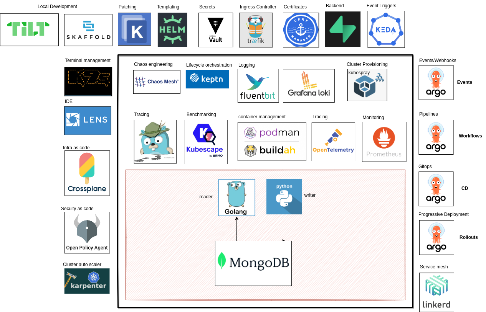

# What will we cover

Here's the architecture of what you will build at the end of this journey

| Category | Tools |
|---|---|
| Backend API |  Golang,Python |
| Sql Database| Postgres,Mysql |
| Nosql Database | MongoDB | 
| Local Development | Tilt |
| Dashboard | Headlamp,k9s |
| Container Management | Docker, Podman |
| CI | Github Actions |
| GitOps | ArgoCD |
| Progressive Deployment | Argo Events, Argo Rollouts |
| Secret Store | Vault |
| Ingress Controller | Apisix |
| Packaging | Helm |
| Patching | Kustomize |
| Logging | Fluentd (agent), Loki (backend) |
| Service Mesh | Istio |
| Monitoring | Prometheus, Grafana |
| Compliance Monitoring | kubebench |
| Policy Engine | OPA/Kyverno |
| Policy Checker | Kubescape |
| Backup and Restore | Velero |
| Load Testing | hey,Kube-monkey |
| Cluster Provisioning | Kubespray (optional) |
| Serverless | OpenFaas |
| Container Builds | Buildah |

Extra:

- Dapr
- Dagger

# Stages:

- Stage 0: Basics and Local Setup
    - using docker compose to run all the components locally and ensure they run

- Stage 1: Run on local k8s cluster
    - create a kind cluster with multiple worker nodes
    - create all the manifests and confirm its working
    - using tilt for local development
    
- Stage 2: Move on from Local k8s cluster
    - github actions to push image to gcr/private repo
    - use image pull secrets to pull image

- Stage 3: Monitoring + Observability + Tracing 
    - Headlamp and k9s for k8s dashboard
    - monitor the cluster and app metrics with prometheus
    - create cronjobs which will send data to push gateway
    - get all the logs centrally using loki
    - visualizing everything in grafana
    - getting traces using opentelemtry agent in tempo/jaeger

- Stage 4: Helm packaging and Kustomize Patching

- Stage 5: Service Mesh + ingress controller + gateway

- Stage 6: troubleshooting
    - ephemeral containers/kubectl debug command

- Stage 7: Deployment/Gitops [cover nodeselector, labels, muliple env deployment also]

- Stage 8: AutoScaling and Load testing
    - Qos class

- Stage 9: Chaos Engineering + Backup and Restore

- Stage 10: Security and Compliance
    - https://kubernetes.io/docs/tasks/administer-cluster/encrypt-data/
    - Enable or configure RBAC rules

- Stage 11: progressive deployment + devsecops

# Prerequisite

This course assumes that you come with bare basic knowledge about k8s concepts. 