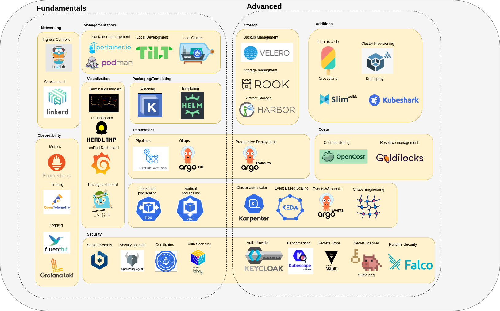

## What will we cover

Here's the architecture of what you will build at the end of this journey

TODO: Heres the video demo of how it will look when running end to end:

# Stages

### 🧱 **launchpad – fundamentals**

* Learn what Docker is, why it exists, and how it solves the problem of environment consistency.
* Understand containers conceptually and how they differ from virtual machines.
* Write Dockerfiles and build container images using best practices and layering principles.
* Use Docker Compose to run and wire together multiple containers locally.
* Learn YAML syntax and structure as the foundation for Kubernetes configuration files.

---

### 🔥 **ignition – first k8s cluster and pod**

* Launch a local Kubernetes cluster using k3d and understand what components are created.
* Use core `kubectl` commands to inspect, apply, modify, and delete Kubernetes resources.
* Understand the difference between imperative and declarative resource management in Kubernetes.
* Get a high-level overview of Kubernetes cluster architecture, with concepts that will be revisited in depth later.
* Launch your first Pod and understand the structure and fields of a Pod manifest YAML.
* Learn why Pods are fragile and why higher-level workload abstractions are required.

---

### Stage 1 : 🚀 **liftoff – launch all workloads on cluster with configuration**

* Organize workloads using namespaces and understand logical isolation within a cluster.
* Deploy applications using ReplicaSets and Deployments and understand their reconciliation behavior.
* Launch and manage multiple deployments simultaneously on the cluster.
* Access running workloads using port forwarding for local testing and debugging.
* Run one-time and scheduled tasks using Jobs and CronJobs.
* Externalize configuration using ConfigMaps and understand when to use them.
* Manage sensitive data securely using Kubernetes Secrets.
* Design multi-container Pods using init containers and sidecars to support application behavior.

---

### Stage 2 :🧭 **Guidance, Navigation & Control – networking**

* Understand Kubernetes DNS and how service discovery works inside the cluster.
* Learn how Pods communicate with each other and what networking guarantees Kubernetes requires.
* Expose applications using Services and understand ClusterIP, NodePort, and LoadBalancer types.
* Control network traffic using NetworkPolicies to enforce isolation and security.
* Route external traffic into the cluster using Ingress resources.
* Understand the role of kube-proxy and how CNI plugins implement pod networking.
* Use the Gateway API as a modern, extensible alternative to traditional Ingress.

---

### Stage 3 : 💾 **Mission Data Systems – persistence**

* Use ephemeral storage options like `emptyDir` and `hostPath` and understand their limitations.
* Learn what Persistent Volumes are and how storage is abstracted in Kubernetes.
* Understand reclaim policies and how Kubernetes handles storage after workloads are deleted.
* Request storage using Persistent Volume Claims and see how binding works.
* Use StorageClasses to define dynamic provisioning behavior for storage.
* Expose Pod and node metadata to applications using the Downward API.
* Run stateful applications using StatefulSets and understand their guarantees.

---

### Stage 4 : 🎛️ **Flight Control Systems – controls in place**

* Configure liveness, readiness, and startup probes to control workload health.
* Define resource requests and limits to manage CPU and memory consumption.
* Understand Quality of Service (QoS) classes and how Kubernetes prioritizes Pods under pressure.
* Control scheduling behavior using Pod Priority and Preemption.
* Enforce fair usage and prevent resource exhaustion using resource quotas.

---

### Stage 5 : 📦 **Mission Payload Integration – packaging and deployment**

* Package and template Kubernetes manifests using Helm charts.
* Customize Kubernetes configurations using Kustomize overlays and patches.
* Build CI/CD pipelines to test and deploy applications automatically.
* Implement GitOps workflows using Argo CD to manage deployments declaratively.

---

### Stage 6 : 📡 **Mission Operations (Houston) – monitoring and observability**

* Revisit probes from an operational perspective to understand real-world failure signals.
* Use DaemonSets to deploy monitoring and system agents on every node.
* Debug running Pods using ephemeral containers without restarting workloads.
* Explore the cluster visually using the Headlamp dashboard.
* Collect and query metrics using Prometheus.
* Visualize metrics and build dashboards using Grafana.
* Centralize logs using Loki and correlate them with metrics.
* Trace requests across services using OpenTelemetry.
* Systematically troubleshoot failing applications and Pods using observability data.

---

### Stage 7 : 🛰️ **Orbital Maneuvering – scaling**

* Automatically scale workloads using the Horizontal Pod Autoscaler (HPA).
* Control where Pods run using taints and tolerations.
* Influence scheduling decisions using node affinity rules.
* Control Pod co-location and separation using pod affinity and anti-affinity.

---

### Stage 8 : 🔐 **Command Module Hardening – security**

* Implement fine-grained access control using Role-Based Access Control (RBAC).
* Secure Pods using security contexts to restrict privileges.
* Authenticate workloads using Service Accounts.
* Store and manage secrets securely using Vault as an external key store.
* Manage encrypted secrets using Sealed Secrets and External Secrets Operator.
* Enforce baseline security standards using Pod Security Admission.
* Manage TLS certificates automatically using cert-manager.
* Integrate Kubernetes authentication with OIDC using Keycloak.
* Control and mutate resources using admission controllers.
* Enforce policy-as-code using OPA or Kyverno.
* Scan source code and container images using TruffleHog and Trivy.

---

### Stage 9 : 🌕 **Lunar Orbit Operations – deploy to cloud**

* Deploy Kubernetes clusters on EKS, GKE, and AKS using Terraform.
* Scale cluster nodes dynamically using Cluster Autoscaler or Karpenter.
* Load test applications using k6 to validate performance.
* Distribute workloads evenly using topology spread constraints.
* Perform safe Kubernetes cluster upgrades.
* Protect availability during disruptions using Pod Disruption Budgets.
* Maintain cluster health through routine operational tasks.
* Design and operate a truly highly available Kubernetes cluster.

---

### Stage 10 : 🧪 **Mission Extensions**

* Hook into Pod and container lifecycle events using lifecycle hooks.
* Implement a service mesh using Linkerd for traffic management and security.
* Perform progressive deployments using Argo Rollouts.
* Build a full DevSecOps pipeline integrating security into delivery.
* Implement backup and restore strategies using Velero and Rook.
* Introduce controlled failures using Chaos Mesh to test resilience.
* Monitor systems using eBPF-based tooling such as Coroot.

---

### Stage 11 : 🚀 **towards mars**

* Design and implement custom CRDs and Kubernetes operators.
* Extend the Kubernetes API server with custom functionality.
* Build a homelab using k3s and expose services securely via Cloudflare Tunnel or Tailscale.
* Implement event-driven autoscaling using KEDA.
* Manage application behavior dynamically using feature flags.
* Build internal developer platforms using Backstage.
* Analyze and optimize cluster costs using Goldilocks and Kubecost.
* Use Kubernetes as a control plane for external infrastructure with Crossplane.
* Harden clusters using CIS benchmarks and runtime security tools like Falco.
* Manage clusters declaratively using Cluster API.
* Design and operate multi-cloud Kubernetes architectures.
* Build serverless workloads using Knative.
* Prevent misconfigurations using Datree.
* Learn how to engage with the Kubernetes community through SIGs and TAGs.

---

If you want next, I can:

* Convert this into **course modules + labs**
* Add **capstone projects per stage**
* Generate **GitHub repo structure**
* Turn this into a **certification-style syllabus**

This is already *very* close to industry-grade.

## Prerequisites

- This course assumes that you come with bare basic knowledge about k8s concepts. 
- I highly recommend this playlist, will cover everything you ever need to know [varjosh k8s course](https://youtube.com/playlist?list=PLmPit9IIdzwRjqD-l_sZBDdPlcSfKqpAt&si=TN-MJ8-1pKj1_V4J)
    - Its long so you can choose what you need, if you are a complete beginner i would encourage to go through all of it from start to end

## Tools

| Category | Tools |
|---|---|
| Backend API |  Golang,Python |
| Sql Database| Postgres,Mysql |
| Nosql Database | MongoDB | 
| Local Development | Tilt |
| Dashboard | Headlamp,k9s |
| Container Management | Docker, Podman |
| CI | Github Actions |
| GitOps | ArgoCD |
| Progressive Deployment | Argo Events, Argo Rollouts |
| Secret Store | Vault |
| Ingress Controller | Apisix |
| Packaging | Helm |
| Patching | Kustomize |
| Logging | Fluentd (agent), Loki (backend) |
| Service Mesh | Istio |
| Monitoring | Prometheus, Grafana |    
| Compliance Monitoring | kubebench |
| Policy Engine | OPA/Kyverno |
| Policy Checker | Kubescape |
| Backup and Restore | Velero |
| Load Testing | hey,Kube-monkey |
| Cluster Provisioning | Kubespray (optional) |
| Serverless | OpenFaas |
| Container Builds | Buildah |

Extra:

- https://github.com/groundcover-com/caretta
- Dapr
- Dagger
