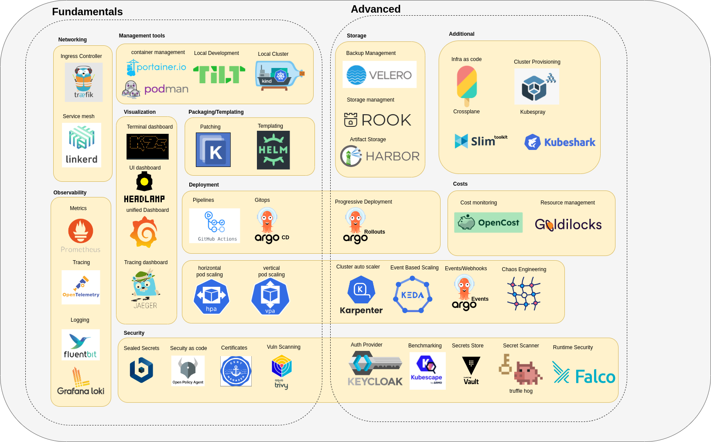

# Apollo11: Cloud-Native Learning Platform

Welcome to **Apollo11** — a 13-phase, hands-on Kubernetes and cloud-native engineering curriculum. 

Instead of toy tutorials or disconnected snippets, Apollo11 uses a complete, production-shaped flight management system — **Apollo Airlines** — as the learning application. You start with local containers on Docker Compose and progress step-by-step through core Kubernetes workloads, edge networking, persistent storage, operational reliability, packaging, GitOps, observability, autoscaling, enterprise security, and a real AWS/EKS cloud deployment.

---

## The Learner-First Lab Contract

Every required stage and substage adheres to a strict five-step learning contract:

```mermaid
flowchart LR
    B["1. Build"] --> I["2. Inspect"]
    I --> BR["3. Break"]
    BR --> R["4. Recover"]
    R --> E["5. Explain"]
```

1. **Build:** Introduce the minimum new Kubernetes or cloud-native mechanism on top of a known working baseline.
2. **Inspect:** Identify the exact resource, status, event, log, metric, or trace that proves the mechanism is active.
3. **Break:** Execute an exact, safe, and reversible failure experiment.
4. **Recover:** Restore the system and prove recovery through observable application behavior, not mere resource existence.
5. **Explain:** Answer core causal questions demonstrating deep understanding of cause, effect, and failure boundaries.

---

## Apollo Airlines Architecture

Apollo Airlines consists of **10 core components** (6 application microservices and 4 infrastructure services):

| Service | Technology | Port | Database / Dependency | Purpose |
|---|---|---|---|---|
| **frontend** | React, Tailwind, NGINX | 3000 | Backend APIs | Single-page application user interface |
| **identity** | Python 3.12, FastAPI | 8080 | `identity-db` (PostgreSQL 15) | User authentication, passenger profiles, JWT issuance |
| **flight** | Go 1.22, Gin | 8081 | `flight-db` (PostgreSQL 15) | Flight inventory, airport schedules, seat allocation |
| **booking** | Go 1.22, Gin | 8082 | `booking-db` (PostgreSQL 15) | Reservations flagship service; orchestrates calls to identity, flight, notification |
| **search** | Go 1.22, Gin | 8083 | `flight` (and `redis` cache in Stage 7) | High-throughput flight search and route filtering |
| **notification** | Go 1.22, Gin | 8084 | `redis` (Redis 7) | Event fan-out and booking notification queue |
| **identity-db** | PostgreSQL 15 | 5432 | Persistent Volume | Identity & user credential store |
| **flight-db** | PostgreSQL 15 | 5432 | Persistent Volume | Flight routes, schedule inventory, seat state |
| **booking-db** | PostgreSQL 15 | 5432 | Persistent Volume | Passenger booking records |
| **redis** | Redis 7 | 6379 | Persistent Volume | Async notification queue & caching layer |

---

## The 13-Phase Learning Journey

The curriculum is structured into a linear required progression (Launchpad through Stage 9) followed by optional specialization mission catalogs (Stages 10 and 11):

### 🧱 [Launchpad — Container & Application Baseline](./launchpad.md)
* Container fundamentals: Dockerfiles, multi-stage builds, layers, and Compose networking.
* Local development with all 10 components wired together.
* Non-root container runtime users, read-only root filesystems, and tmpfs mounts.
* Structured JSON logging, health and dependency-aware readiness probes (`/healthz`, `/readyz`), Prometheus text metrics (`/metrics`), and W3C request correlation.
* Reversible database failure experiment and volume persistence verification.

### 🔥 [Ignition — Cluster Architecture & First Pod](./ignition.md)
* Multi-node local Kubernetes cluster provisioning with **kind** (1 control plane, 2 workers) with host port mappings.
* Control plane internals: API server, etcd, scheduler, controller manager, kubelet, CoreDNS, and kube-proxy.
* Imperative (`kubectl run`) versus declarative (`kubectl apply -f pod.yaml`) workflows.
* The recurring **Evidence Ladder**: Status → Events → Describe → Logs → Behavior.
* Two safe failure experiments: process crash (kubelet container restart with same Pod UID) and bare Pod deletion (controller absence).

### 🚀 [Stage 1: Liftoff — Workloads & Configuration](./stage-1.md)
* Moving all 10 workloads onto Kubernetes Deployments and ClusterIP/NodePort Services in the `apollo-airlines` namespace.
* Externalized configuration with **ConfigMaps** and sensitive credentials with **Secrets**.
* Dedicated workload identities: 13 **ServiceAccounts** with token automount disabled.
* One-shot database schema initialization with bounded retry **Jobs** and `ON_ERROR_STOP`.
* Ownership chains: Deployment → ReplicaSet → Pods.
* Safe failure labs: Pod deletion with automatic ReplicaSet replacement, and diagnosing a failed rolling update (`ImagePullBackOff`) followed by `kubectl rollout undo`.

### 🧭 [Stage 2: Guidance — Networking & Edge Access](./stage-2.md)
* Progressive **5-substage edge access ladder**:
  1. `01-internal-dns`: ClusterIP Services, CoreDNS FQDN resolution (`<svc>.<ns>.svc.cluster.local`), EndpointSlices, and selector binding failure experiment.
  2. `02-nodeport`: Direct L4 node port exposure (`localhost:30080–30084`) and targetPort breakdown.
  3. `03-traefik-ingress-tls`: Traefik v3 IngressController, host-based routing, and wildcard TLS termination (`CN=*.apollo.local`).
  4. `04-metallb`: MetalLB L2 ARP IP allocation (`172.18.0.50–100`) and standard LoadBalancer ports (80/443).
  5. `05-envoy-gateway`: Migration to modern **Envoy Gateway API v1.5.0** (GatewayClass, Gateway, HTTPRoute, cross-namespace ReferenceGrant) — **the canonical access baseline for all future stages**.

### 💾 [Stage 3: Mission Data — Persistent Storage & StatefulSets](./stage-3.md)
* Replacing ephemeral `emptyDir` with **PersistentVolumeClaims (1Gi PVCs)** provisioned via `local-path` StorageClass.
* Converting all 4 stateful workloads (`identity-db`, `flight-db`, `booking-db`, `redis`) into **StatefulSets** with ordinal naming (`*-0`).
* Stable network identity via **Headless Services** (`clusterIP: None`).
* Automated schema bootstrap using the official PostgreSQL entrypoint hook (`/docker-entrypoint-initdb.d/`) and idempotent seed Jobs (`ON CONFLICT DO NOTHING`).
* Pod deletion persistence experiment: proving relational data survives Pod termination.

### 🎛️ [Stage 4: Flight Control — Workload Reliability & Governance](./stage-4.md)
* Three-tier probe strategy: `startupProbe` (30s bootstrap window), `livenessProbe` (vitality restart), and `readinessProbe` (traffic gating).
* Graceful SIGTERM drains (30s timeout) and `preStop` lifecycle hooks (`sleep 5`) to prevent dropped in-flight requests during endpoint deregistration.
* Resource governance: **Guaranteed Quality of Service (QoS)** (`requests == limits`) across all containers.
* Priority scheduling: cluster-scoped `PriorityClass` (`apollo-airlines-app-critical` vs `apollo-airlines-app-low`).
* Node placement: `topologySpreadConstraints` with `maxSkew: 1` across kind worker nodes.
* High availability under voluntary disruption: **PodDisruptionBudgets (PDB)** and Eviction API rejection experiments.

### 📦 [Stage 5: Payload Integration — Packaging & Delivery](./stage-5.md)
* Production **Helm chart** (`stages/stage5/helm/apollo11/`) bundling all 10 workloads, PDBs, Envoy Gateway, MetalLB, and seed Jobs with environment-specific values files (`values-dev.yaml`, `values-staging.yaml`, `values-prod.yaml`).
* Required **Kustomize comparison lab** with base manifests and dev/staging/prod overlays.
* Continuous Integration: **GitHub Actions matrix workflow** linting manifests, building multi-arch container images, and pushing to GitHub Container Registry (GHCR).
* GitOps delivery: **Argo CD v3.5.1 module** featuring an `AppProject` security boundary, three environment applications, drift detection, and automated self-healing.

### 📡 [Stage 6: Mission Operations — Observability](./stage-6.md)
* Application telemetry: real `/metrics` counters and latency histograms, OpenTelemetry SDK in Go and Python, W3C `traceparent` propagation, and structured JSON logs with correlated `trace_id` and `span_id`.
* The `apollo-observability` platform: Prometheus Operator v0.93.0, Prometheus v3.13.1, Grafana 10.4.2 (5 provisioned dashboards accessible via Envoy at `grafana.apollo.local`), Tempo 2.3.1 (traces), Loki 2.9.8 (logs), and Alloy v1.18.0 (log collection).
* Distributed tracing verification across Booking, Identity, Flight, and Notification services.

### 🛰️ [Stage 7: Orbital Maneuvering — Autoscaling & Performance](./stage-7.md)
* Application acceleration: **Redis cache-aside pattern** in flight search (`X-Cache: HIT/MISS`, 5-min TTL, Prometheus cache hit ratio metrics, and graceful degradation).
* Horizontal scaling: **HorizontalPodAutoscaler (HPA)** on CPU with metrics-server, configuring rapid scale-up policies and 5-minute scale-down stabilization.
* Vertical scaling: **VerticalPodAutoscaler (VPA)** in recommendation-only (`Off`) mode to prevent CPU oscillation battles with HPA.
* Practical scheduling lab: reversible node taints, tolerations, and node affinity exercises.
* Repeatable load testing with k6 driving automated replica scaling from 1 to 3 to 1 across cluster nodes.

### 🔐 [Stage 8: Command Module — Security Enforcement](./stage-8.md)
* Complete clean rebuild on the hardened Helm baseline.
* Identity & Workload hardening: fine-grained **RBAC** (Roles, RoleBindings), **Pod Security Admission (restricted)**, dropped Linux capabilities (`ALL`), read-only root filesystems, and non-root runtimes.
* Enforced cluster networking: replacing kindnet with **Calico CNI** to enforce default-deny and least-privilege **NetworkPolicies** with observable traffic drops.
* External Secret Lifecycle: **HashiCorp Vault** paired with **External Secrets Operator (ESO)** for secret synchronization and automated rotation.
* Policy admission & supply chain security: **Kyverno** policy enforcement, **Trivy** vulnerability scanning in CI, and **Cosign** cryptographic image signing with admission rejection of unsigned artifacts.

### 🌕 [Stage 9: Lunar Orbit — AWS Cloud Lifecycle & Capstone](./stage-9.md)
* Production-shaped deployment on **Amazon EKS** using modular Terraform (VPC, EKS cluster, managed node groups, ECR, EBS CSI, AWS Load Balancer Controller).
* Billable resource inventory and dev-session cost forecasting (~$0.44 per 2-hour lab session).
* Production cloud ingress: AWS Network Load Balancer (NLB) integrated with Envoy Gateway, automated TLS via cert-manager.
* Cloud persistent storage with EBS gp3 volumes via AWS EBS CSI driver.
* Cluster lifecycle operations: node drains, controlled rolling Kubernetes upgrades, and required disaster recovery backup and restore with **Velero**.
* Ownership-scoped teardown and residue auditing.

### 🧪 [Stage 10: Production Operations Missions](./stage-10.md)
* Optional, modular operational missions:
  * **Linkerd Service Mesh:** transparent mTLS, traffic splitting, and service profiles.
  * **Argo Rollouts:** Canary and blue-green progressive delivery with automated analysis.
  * **Live Debugging:** ephemeral containers (`kubectl debug`) and **Kubeshark** live L7 traffic inspection.
  * **Chaos Engineering:** resilience testing with **Chaos Mesh** (pod failure, network latency, packet loss).
  * **Advanced Disaster Recovery:** cross-cluster and cross-region recovery with Velero.

### 🚀 [Stage 11: Towards Mars — Platform Engineering Specializations](./stage-11.md)
* Optional specialization tracks:
  * **Custom Controllers & Operators:** authoring an Apollo `FlightStatus` CRD and controller with Kubebuilder.
  * **Event-Driven Autoscaling:** scaling workloads based on message queue depth using **KEDA**.
  * **Homelab & Edge:** deploying Apollo Airlines on a **k3s** multi-node cluster with Cloudflare Tunnels.
  * **Internal Developer Platforms:** service catalog and developer portals with **Backstage**.
  * **Cost Optimization:** Kubernetes cost allocation and right-sizing with **Kubecost** and **Goldilocks**.
  * **Cluster API (CAPI):** declarative cluster lifecycle management across environments.

---

## Toolchain & Technology Stack

| Category | Primary Technologies Used |
|---|---|
| **Container Runtime & Local Dev** | Docker, Docker Compose, kind |
| **Core Workloads** | Pods, Deployments, ReplicaSets, StatefulSets, Jobs, ConfigMaps, Secrets, ServiceAccounts |
| **Reliability & Placement** | Probes (startup, liveness, readiness), Guaranteed QoS, PriorityClasses, TopologySpreadConstraints, PodDisruptionBudgets |
| **Networking & Ingress** | CoreDNS, ClusterIP, NodePort, Traefik v3 (transitional), MetalLB L2, Envoy Gateway API v1.5.0 (canonical baseline) |
| **Storage** | PersistentVolumes, PersistentVolumeClaims, StorageClasses (`local-path`, AWS `ebs-gp3`) |
| **Packaging & Delivery** | Helm 3, Kustomize, GitHub Actions, GitHub Container Registry (GHCR), Argo CD v3.5.1 |
| **Observability** | Prometheus Operator v0.93.0, Prometheus v3.13.1, Grafana 10.4.2, OpenTelemetry Collector, Tempo 2.3.1, Loki 2.9.8, Alloy v1.18.0 |
| **Scaling & Caching** | HorizontalPodAutoscaler, VerticalPodAutoscaler, metrics-server, Redis 7 (cache-aside), k6 load testing |
| **Security & Policy** | RBAC, Pod Security Admission, Calico NetworkPolicies, HashiCorp Vault, External Secrets Operator, Kyverno, Trivy, Cosign |
| **Cloud Infrastructure** | AWS EKS, VPC CNI, AWS Load Balancer Controller (NLB), EBS CSI Driver, Terraform, Velero |
| **Specializations & Extensions**| Linkerd, Argo Rollouts, Kubeshark, Chaos Mesh, KEDA, k3s, Backstage, Kubecost, Cluster API |

---

## Prerequisites

To get the most out of Apollo11, you only need:
- A Linux, macOS, or WSL2 environment with basic command-line familiarity.
- Docker installed and running.
- Tools managed easily via your system package manager or **Devbox** (`curl`, `kubectl`, `kind`, `helm`, `jq`).
- No prior Kubernetes or Go/Python development experience is required. Every concept is built from first principles.