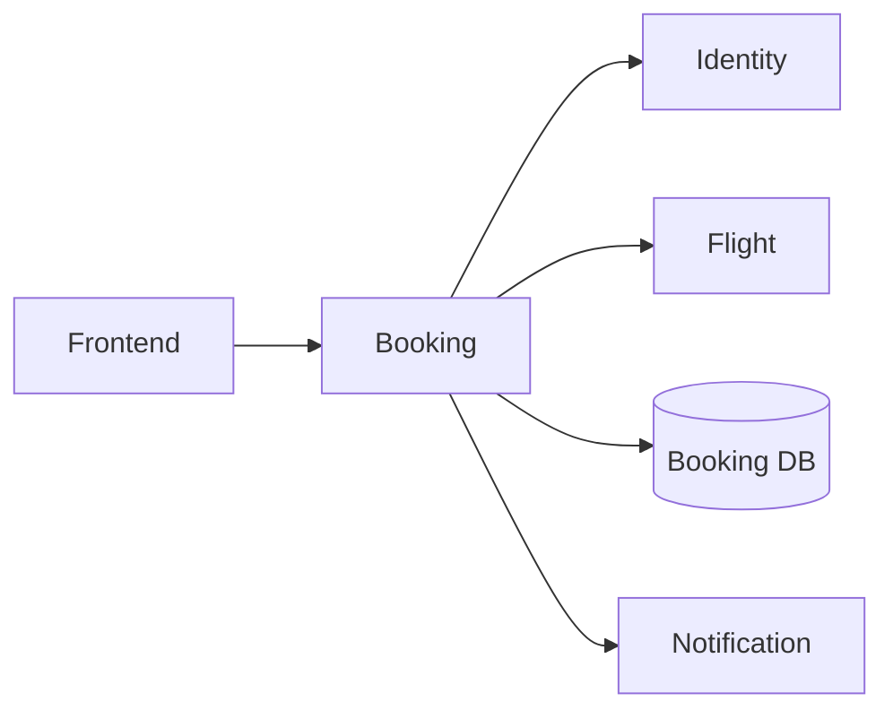

# Apollo11

Apollo11 is a practical path from “what is a container?” to a production-shaped Kubernetes platform. You build and operate **Apollo Airlines**, a flight reservation system made of six application services and four infrastructure components.

This site is the textbook. The companion [Apollo11 repository](https://github.com/darshan-raul/Apollo11) is the lab: it contains the source code, Dockerfiles, YAML, scripts, tests, and canonical stage READMEs. Clone it before starting:

```bash
git clone https://github.com/darshan-raul/Apollo11.git
cd Apollo11
```

## How to use this site

Follow the stages in order. Every stage uses the same learning loop: **Build** the next capability, **Inspect** evidence that proves it works, **Break** one thing safely, **Recover** it, then **Explain** the concept in your own words. Scripts accelerate setup and verify implementation; they do not replace the experiments.

## The application

| Component | Technology | Responsibility |
| --- | --- | --- |
| `identity` | Python/FastAPI | JWT authentication and passenger profiles |
| `flight` | Go/Gin | Flight inventory and seats |
| `booking` | Go/Gin | Reservations; the flagship workflow |
| `search` | Go/Gin | Flight search; Redis cache arrives in Stage 7 |
| `notification` | Go/Gin | Event fan-out |
| `frontend` | React/Tailwind + NGINX | Browser application |
| three `*-db` services | PostgreSQL 15 | Service-owned data |
| `redis` | Redis 7 | Queue first, cache later |


```mermaid
flowchart LR
  UI[Frontend] --> B[Booking]
  B --> I[Identity]
  B --> F[Flight]
  B --> DB[(Booking DB)]
  B --> N[Notification]
```

## Learning route

| Phase | Focus |
| --- | --- |
| Launchpad | Docker, Compose, service discovery, YAML, health and persistence |
| Ignition | kind, Kubernetes architecture, Pods, `kubectl`, evidence-first debugging |
| Stage 1 — Liftoff | Deployments, Services, ConfigMaps, Secrets, Jobs, identities and rollouts |
| Stage 2 — Guidance | DNS, NodePort, Ingress, TLS, MetalLB and Gateway API |
| Stage 3 — Mission Data | StatefulSets, PVCs, StorageClasses, headless Services and seeds |
| Stage 4 — Flight Control | Probes, resources, QoS, scheduling, graceful shutdown and PDBs |
| Stage 5 — Payload Integration | Helm, Kustomize, CI/GHCR and Argo CD |
| Stage 6 — Mission Ops | Metrics, dashboards, alerts/SLOs, logs, traces and correlation |
| Stage 7 — Orbital Maneuvering | Redis cache, HPA, VPA recommendations and scheduling |
| EKS appendix | Terraform, EKS, NLB and EBS CSI; prototype only |

Stages 8–11 are planned or optional mission catalogs. They are not prerequisites for the runnable core path.

## The YAML habit

Read every manifest in four passes: **identity** (`apiVersion`, `kind`, `metadata`), **ownership** (labels, selectors, owner references), **runtime** (containers, ports, probes, resources), and **relationships** (Services, ConfigMaps, Secrets, PVCs, namespaces). Kubernetes can accept syntactically valid YAML whose selectors or references are semantically wrong.

:::warning Source of truth
Paths and commands point into the Apollo11 repo. If this site and a source README disagree, the source repo's current implementation is authoritative; the docs should then be corrected.
:::

Install Docker, `kubectl`, `kind`, `curl`, and `jq` before starting. Helm is needed from Stage 5; `argocd`, Terraform, and AWS CLI are only needed for their optional paths.

Start with [Launchpad](./launchpad).
