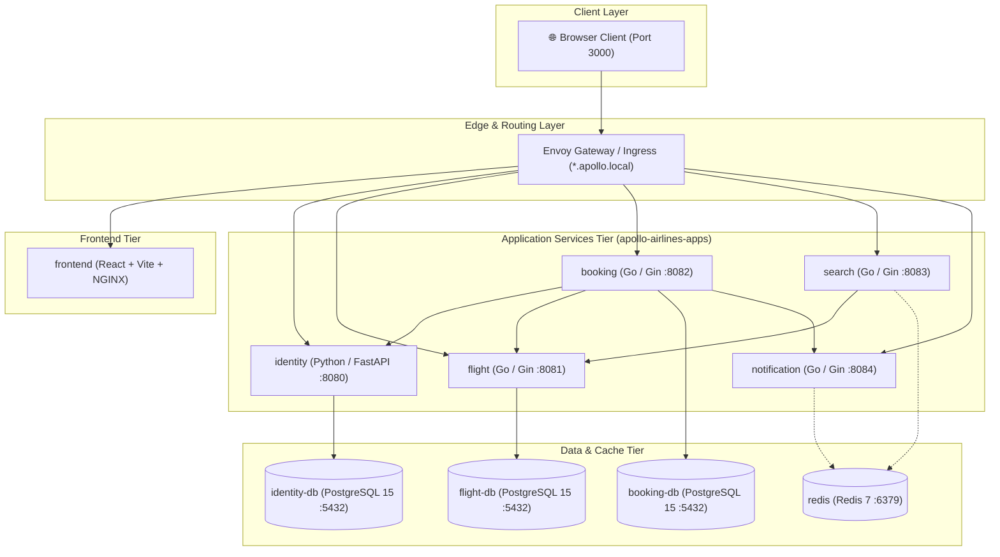
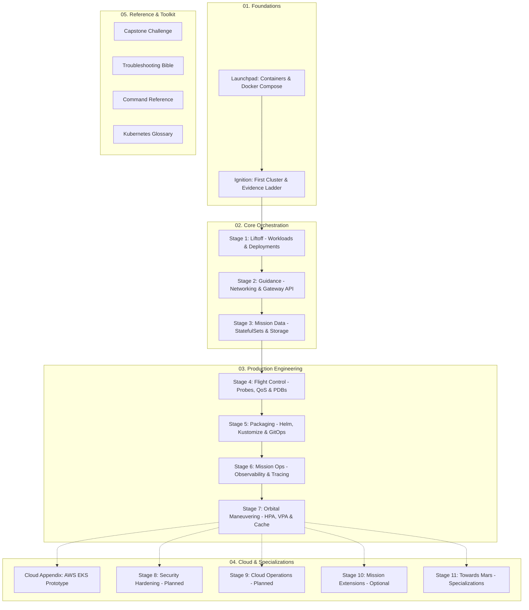

# Apollo11: The Learner's Flight Plan

Welcome to **Apollo11**. You are going to operate one application—Apollo
Airlines—and use the questions it raises to learn Kubernetes. We begin where a
developer normally begins: with containers that work on one machine. Each later
stage exists because that earlier arrangement has a specific limitation.

This is deliberately not a tour of Kubernetes nouns. When you meet a
Deployment, Service, PVC, or HPA, you will first meet the Apollo Airlines
problem that makes it necessary. Then you will inspect the object, watch the
cluster act on it, and learn what evidence to gather when the result is not what
you expected.

---

## 🧭 Who This Guide Is For

This curriculum is built for:

- **Developers and Software Engineers** who want to understand how their applications run, communicate, scale, and fail inside a Kubernetes cluster.
- **DevOps, Platform, and SRE Aspirants** seeking a grounded, production-shaped mental model of container orchestration, networking, storage, lifecycle management, and observability.
- **Curious Operators** who know Docker Compose or basic container commands but feel overwhelmed by Kubernetes abstractions and YAML complexity.

### What Knowledge Is Assumed

You do **not** need prior Kubernetes experience. Everything about Kubernetes will be introduced from first principles at the exact point where it solves a real problem.

You only need:
- Familiarity with a Linux terminal (navigating directories, running shell scripts, editing text files).
- Basic understanding of HTTP, ports, and JSON.
- An appetite for breaking things on purpose to see how systems fail and recover.

---

## 🛫 The Application: Apollo Airlines

**Apollo Airlines** is a distributed flight reservation platform. Its ten
application and data workloads are small enough to inspect, yet connected enough
that changing one component has visible consequences elsewhere.

*Sources: `stages/launchpad/docker-compose.yml` and the service directories
under `stages/launchpad/code/`.*


```mermaid
flowchart TD
  subgraph Client ["Client Layer"]
    Browser["🌐 Browser Client (Port 3000)"]
  end

  subgraph Edge ["Edge & Routing Layer"]
    GW["Envoy Gateway / Ingress (*.apollo.local)"]
  end

  subgraph FrontendTier ["Frontend Tier"]
    UI["frontend (React + Vite + NGINX)"]
  end

  subgraph AppsTier ["Application Services Tier (apollo-airlines-apps)"]
    Identity["identity (Python / FastAPI :8080)"]
    Flight["flight (Go / Gin :8081)"]
    Booking["booking (Go / Gin :8082)"]
    Search["search (Go / Gin :8083)"]
    Notification["notification (Go / Gin :8084)"]
  end

  subgraph DataTier ["Data & Cache Tier"]
    IdentityDB[("identity-db (PostgreSQL 15 :5432)")]
    FlightDB[("flight-db (PostgreSQL 15 :5432)")]
    BookingDB[("booking-db (PostgreSQL 15 :5432)")]
    RedisData[("redis (Redis 7 :6379)")]
  end

  Browser --> GW
  GW --> UI
  GW --> Identity
  GW --> Flight
  GW --> Booking
  GW --> Search
  GW --> Notification

  Booking --> Identity
  Booking --> Flight
  Booking --> BookingDB
  Booking --> Notification

  Identity --> IdentityDB
  Flight --> FlightDB
  Search --> Flight
  Search -.-> RedisData
  Notification -.-> RedisData
```

### Component Inventory

| Component | Technology | Role in Apollo Airlines | Internal Port | Edge Route |
|---|---|---|---|---|
| `identity` | Python 3.12 / FastAPI | User authentication, password hashing, and JWT token issuance | `8080` | `http://identity.apollo.local` |
| `flight` | Go 1.22 / Gin | Flight catalog, scheduling, seat inventories, and reservations | `8081` | `http://flight.apollo.local` |
| `booking` | Go 1.22 / Gin | **Flagship workflow**: coordinates passenger reservations across services | `8082` | `http://booking.apollo.local` |
| `search` | Go 1.22 / Gin | Fast flight query engine; queries flight-service with Redis cache-aside | `8083` | `http://search.apollo.local` |
| `notification` | Go 1.22 / Gin | Event fan-out; receives booking confirmation events | `8084` | `http://notification.apollo.local` |
| `frontend` | React 18 / Tailwind / NGINX | Single-Page Application (SPA) serving the customer flight booking UI | `80` (container) | `http://frontend.apollo.local` |
| `identity-db` | PostgreSQL 15-alpine | Dedicated database for user credentials and passenger profiles | `5432` | Internal only |
| `flight-db` | PostgreSQL 15-alpine | Dedicated database for flights, routes, airports, and seat availability | `5432` | Internal only |
| `booking-db` | PostgreSQL 15-alpine | Dedicated database storing created reservations and passenger details | `5432` | Internal only |
| `redis` | Redis 7-alpine | In-memory datastore: message queue initially; cache-aside in Stage 7 | `6379` | Internal only |

> [!NOTE]
> Launchpad also includes **Dozzle** (`:8085`), a lightweight container log viewer. It is diagnostic tooling for the local Docker Compose environment, not an application microservice.

### Start with one passenger action

The booking workflow is our running thread. A passenger does not see its
internal hops; they see either a confirmation or an error. You will learn to
follow the hidden route below, first through Docker Compose and later through
Kubernetes networking, health checks, storage, and traces.

```
[Browser Frontend]
        │  POST /api/bookings (with JWT Authorization header)
        ▼
[Booking Service] ──(1) Verify Token & Passenger Profile──► [Identity Service] ──► [Identity DB]
        │
        ├──(2) GET /api/flights/:id (Verify Seat Availability)──► [Flight Service] ──► [Flight DB]
        │
        ├──(3) POST /api/flights/:id/reserve (Decrement Seat Count)──► [Flight Service]
        │
        ├──(4) INSERT INTO bookings (Save Reservation Record)──► [Booking DB]
        │
        └──(5) POST /api/notifications (Publish Event)──► [Notification Service] ──► [Redis]
```

At this point, do not try to memorise every arrow. Notice one important fact:
`booking` depends on `identity`, `flight`, `booking-db`, and `notification` to
complete one request. That dependency chain is why a process being *alive* is
not enough to say that it is ready for traffic. Launchpad lets you see that
distinction before Kubernetes adds its own readiness and routing machinery.

---

## 🎯 Why Kubernetes? The Problem Space

In [Launchpad](./launchpad), Compose gives every component a name, a network,
and—where configured—a local restart policy. That is useful, and it is not a
failure of Compose. The question changes when the application needs to live
across several machines and remain understandable while pieces are replaced.

Kubernetes adds a shared API for declaring the state you want. Controllers read
that declaration and continually create, replace, or update objects to move the
cluster toward it. That model gives us several new questions to investigate:

1. If `booking` disappears, where is the desired replica count recorded, and
   which controller notices the gap?
2. If a replacement Pod has a different address, how can `search` still find
   `flight` without learning that address?
3. If `flight` starts before its database is usable, how can routing wait for
   real application readiness rather than merely an open process?
4. If a database Pod is replaced, which data follows the Pod and which data is
   lost with it?
5. If demand changes, which measurements may safely influence replica count?

The stages answer these questions in order. They also make the boundary clear:
a three-node kind cluster is a learning lab, not proof of production
availability.

---

## 🗺️ Curriculum Structure & Navigation

The curriculum describes **13 named phases**, but only Launchpad through Stage
7 are currently implemented and verified as the runnable local path. The cloud
appendix and Stages 8–11 document explicit research or roadmap boundaries; they
are not extra hands-on stages to run after Stage 7.


```mermaid
flowchart TD
  subgraph Foundation ["01. Foundations"]
    L[Launchpad: Containers & Docker Compose] --> IGN[Ignition: First Cluster & Evidence Ladder]
  end

  subgraph CoreWorkloads ["02. Core Orchestration"]
    IGN --> S1[Stage 1: Liftoff - Workloads & Deployments]
    S1 --> S2[Stage 2: Guidance - Networking & Gateway API]
    S2 --> S3[Stage 3: Mission Data - StatefulSets & Storage]
  end

  subgraph Operations ["03. Production Engineering"]
    S3 --> S4[Stage 4: Flight Control - Probes, QoS & PDBs]
    S4 --> S5[Stage 5: Packaging - Helm, Kustomize & GitOps]
    S5 --> S6[Stage 6: Mission Ops - Observability & Tracing]
    S6 --> S7[Stage 7: Orbital Maneuvering - HPA, VPA & Cache]
  end

  subgraph Advanced ["04. Cloud & Specializations"]
    S7 -.-> EKS[Cloud Appendix: AWS EKS Prototype]
    S7 -.-> S8[Stage 8: Security Hardening - Planned]
    S7 -.-> S9[Stage 9: Cloud Operations - Planned]
    S7 -.-> S10[Stage 10: Mission Extensions - Optional]
    S7 -.-> S11[Stage 11: Towards Mars - Specializations]
  end

  subgraph Reference ["05. Reference & Toolkit"]
    CAP[Capstone Challenge]
    TRB[Troubleshooting Bible]
    CMD[Command Reference]
    GLO[Kubernetes Glossary]
  end
```

### Stage Overview

| Stage | Name | Key Kubernetes Concepts Taught | Repository Location |
|---|---|---|---|
| [**Launchpad**](./launchpad) | Container Foundations | Images, containers, layers, cgroups, Linux namespaces, Compose DNS, health vs readiness | `stages/launchpad/` |
| [**Ignition**](./ignition) | First Kubernetes Cluster | kind, Control Plane (`kube-apiserver`, `etcd`, `scheduler`), kubelet, Pods, 5-Rung Evidence Ladder | `stages/ignition/` |
| [**Stage 1**](./stage-1) | Liftoff: Workloads | `Deployment`, `ReplicaSet`, `Service` (ClusterIP/NodePort), `ConfigMap`, `Secret`, `Job`, `ServiceAccount` | `stages/stage1/` |
| [**Stage 2**](./stage-2) | Guidance: Networking | CoreDNS, Endpoints, `EndpointSlice`, `NodePort`, Traefik `Ingress`, MetalLB L2, Envoy `Gateway API` | `stages/stage2/` |
| [**Stage 3**](./stage-3) | Mission Data: Storage | `StatefulSet`, `PersistentVolumeClaim`, `StorageClass`, Headless Service (`clusterIP: None`), initdb hooks | `stages/stage3/` |
| [**Stage 4**](./stage-4) | Flight Control: Reliability | `startupProbe`, `livenessProbe`, `readinessProbe`, Guaranteed QoS, `preStop` hooks, `PriorityClass`, `PDB` | `stages/stage4/` |
| [**Stage 5**](./stage-5) | Payload Integration | Helm charts (`values.yaml`, templates), Kustomize overlays (dev/prod), GitHub Actions CI, Argo CD GitOps | `stages/stage5/` |
| [**Stage 6**](./stage-6) | Mission Operations | Prometheus Operator, `ServiceMonitor`, PromQL, OpenTelemetry distributed tracing, Tempo, Loki, Grafana | `stages/stage6/` |
| [**Stage 7**](./stage-7) | Orbital Maneuvering | Redis cache-aside (`X-Cache`), Horizontal Pod Autoscaler (HPA v2), Vertical Pod Autoscaler (VPA), Taints/Affinity | `stages/stage7/` |
| [**Cloud EKS**](./eks) | EKS Research Boundary | *Reference only*: inspect the untrusted prototype and cloud translation without provisioning it | `stages/eks/` |
| [**Stage 8**](./stage-8) | Security Hardening | *Planned; no current implementation*: least-privilege RBAC, Pod Security Admission, Calico NetworkPolicies, Vault / ESO | `ROADMAP.md` |
| [**Stage 9**](./stage-9) | Lunar Orbit: Cloud | *Roadmap*: Multi-AZ EKS lifecycle, automated cert-manager TLS, Velero backup/restore, zero-downtime upgrades | `stages/stage9/` |
| [**Stage 10**](./stage-10) | Mission Extensions | *Optional*: Linkerd Service Mesh, Argo Rollouts progressive canary, Ephemeral debug containers, Chaos Mesh | `stages/stage10/` |
| [**Stage 11**](./stage-11) | Towards Mars | *Optional*: Custom Resource Definitions (CRD) & Controllers, KEDA event autoscaling, k3s homelab, Backstage | `stages/stage11/` |
| [**Capstone**](./capstone) | Core Capstone | Verified Stage 7 deployment, tracing, persistence, scaling, rollout observation, gap audit, and cleanup | `docs/capstone.md` |
| [**Troubleshooting**](./troubleshooting) | Diagnostic Bible | Systematic diagnostic trees for `CrashLoopBackOff`, `ImagePullBackOff`, `Pending PVC`, and network issues | `docs/troubleshooting.md` |
| [**Command Cheat Sheet**](./command-reference) | Command Reference | Curated `kubectl`, `kind`, `helm`, and `docker` commands organized by task | `docs/command-reference.md` |
| [**Glossary**](./glossary) | Kubernetes Glossary | Plain-language, technically precise definitions of all Kubernetes terminology used in Apollo11 | `docs/glossary.md` |

---

## 🔬 How to work through this guide

Treat the commands as instruments, not incantations. Before a command changes
anything, the text will tell you the question it is meant to answer. Pause and
predict the result. Afterwards, compare what you saw with the explanation—then
consider what a different result would mean.

Some investigations deliberately break a safe, local part of the system. Those
experiments are always followed by recovery steps. The point is not to prove
that a command has an expected output; it is to see which Kubernetes component
noticed a mismatch, what it changed, and what it could not protect.

---

## 🪜 The 5-Rung Evidence Ladder

When something goes wrong in a Kubernetes cluster, beginners often resort to random restarts or deleting pods. In Apollo11, you will practice the **5-Rung Evidence Ladder**:

```
      ▲  Rung 5: Endpoint & User Contract (curl, browser, HTTP status codes)
      │
      ├── Rung 4: Container Standard Out / Logs (kubectl logs <pod> -c <container>)
      │
      ├── Rung 3: Resource Spec & Conditions (kubectl describe <resource> <name>)
      │
      ├── Rung 2: Cluster Events (kubectl get events --sort-by=.metadata.creationTimestamp)
      │
      └── Rung 1: High-Level Resource Snapshot (kubectl get pods,svc,deploy -o wide)
```

- **Rung 1 (Snapshot)**: Check status (`Running`, `Pending`, `CrashLoopBackOff`, `Ready 1/2`).
- **Rung 2 (Events)**: Look at the control plane's event log (`FailedScheduling`, `Unhealthy`, `BackOff`).
- **Rung 3 (Describe)**: Read container exit codes, mount paths, probe parameters, and condition timestamps.
- **Rung 4 (Logs)**: Inspect application-level messages (database connection timeout, unhandled panic).
- **Rung 5 (Behavior)**: Test the live network endpoint via `curl` or port-forward.

---

## 📖 Read a manifest as a set of relationships

Kubernetes YAML is not a script that runs from top to bottom. It is a request
to the API server: “make this named object true.” Read it by asking what it
claims, who acts on that claim, and what other objects must agree with it:

1. **Identity**:
   - What API group and version is this? (`apiVersion: apps/v1`)
   - What kind of object is it? (`kind: Deployment`)
   - What is its name and namespace? (`metadata.name: booking`, `metadata.namespace: apollo-airlines-apps`)
2. **Ownership and contracts**:
   - What labels are attached? (`metadata.labels: app=booking`)
   - What selector does the controller use? (`spec.selector.matchLabels: app=booking`)
   - Does the selector match the Pod template label?
3. **Runtime specification**:
   - What container images and ports are declared?
   - What environment variables are injected?
   - What probes (`startupProbe`, `livenessProbe`, `readinessProbe`) and resource limits are configured?
4. **Relationships and dependencies**:
   - Which ServiceAccount does it use?
   - Which ConfigMaps or Secrets are referenced?
   - What PersistentVolumeClaims or Volumes are mounted?

For example, a Deployment selector and its Pod-template labels are not two
unrelated fields: together they tell the Deployment which Pods it owns. A
Service selector is another contract over labels, this time deciding which ready
Pods may receive traffic. We will trace those contracts in Stage 1 and Stage 2.

---

## 🛠️ Prerequisites & Local Setup

All hands-on exercises run on a local workstation using lightweight, containerized tooling.

### Hardware Requirements
- **OS**: Linux, macOS, or Windows 11 with WSL2.
- **CPU**: 4 cores minimum (8 cores recommended for Stages 6–7).
- **RAM**: 8 GB free RAM (16 GB total recommended).
- **Disk**: 20 GB free disk space.

### Required Tools Checklist

| Tool | Minimum Version | Purpose | Installation Verification |
|---|---|---|---|
| **Docker** | `24.0+` | Container runtime engine | `docker --version && docker ps` |
| **kind** | `v0.22+` | Runs Kubernetes clusters inside Docker containers | `kind version` |
| **kubectl** | `v1.28+` | Kubernetes command-line interface | `kubectl version --client` |
| **Helm** | `v3.14+` | Package manager (needed from Stage 5) | `helm version` |
| **curl** & **jq** | Any modern | HTTP endpoint testing and JSON parsing | `curl --version && jq --version` |

### Recommended: One-Command Setup with Devbox

The Apollo11 repository includes a declarative environment definition using [Devbox](https://www.jetify.com/devbox):

```bash
# 1. Install devbox
curl -fsSL https://get.jetify.com/devbox | bash

# 2. Clone the Apollo11 repository
git clone https://github.com/darshan-raul/Apollo11.git
cd Apollo11

# 3. Launch isolated environment containing all matching tools
devbox shell
```

Once inside `devbox shell`, `docker`, `kind`, `kubectl`, `helm`, and all CLI utilities are loaded into your path with verified version compatibility.

---

## 📌 Ground Rules & Source of Truth

:::important[Source of Truth]
The sibling **Apollo11 application repository** is the sole source of truth for
all application code, service names, container ports, environment variables,
and Kubernetes manifests. In the authoring workspace used to verify this guide,
it is checked out at `/home/darshan/projects/Apollo11`; learners may clone it
elsewhere.

Every YAML snippet and command in this guide identifies its relative source path in the Apollo11 repository:
`Source: stages/stage1/k8s/apps/booking/booking-dep.yaml`
:::

:::warning[Security Notice]
Repository excerpts in this guide redact Secret values. The application
repository contains development-only lab defaults; do not reuse them in another
cluster. External secret management is planned for Stage 8 but is not yet a
verified Apollo11 lab.
:::

---

## 🚀 Ready for Launch?

Now that your flight plan is set, proceed to the first stage:

👉 **[Launchpad: Containers & Docker Compose](./launchpad)** — Build, wire, and break the 10 components of Apollo Airlines on Docker before adding the Kubernetes control plane.
