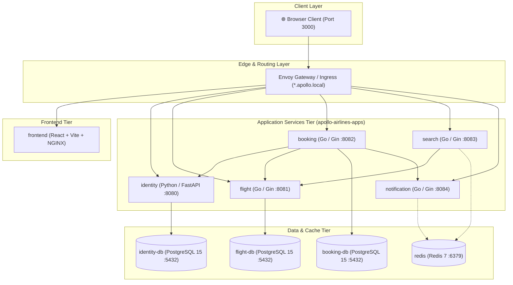
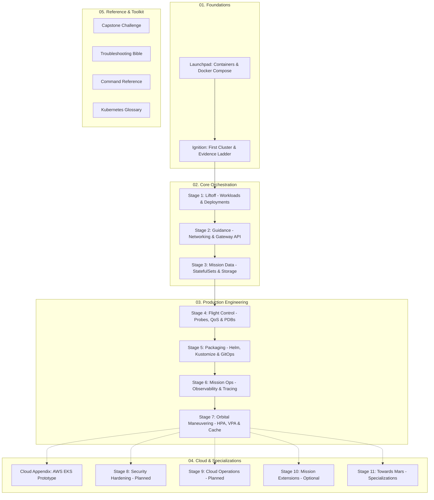

# Apollo11: The Learner's Flight Plan

Welcome to **Apollo11**, a hands-on, progressive curriculum designed to take you from *"what is a container?"* to operating a resilient, observable, multi-service platform on Kubernetes.

Rather than teaching Kubernetes through isolated, toy examples ("hello-world" nginx pods or single-file guestbooks), this entire guide is grounded in a real-world, cloud-native microservice application: **Apollo Airlines**.

---

## 🧭 Who This Guide Is For

This curriculum is built for:

- **Developers and Software Engineers** who want to understand how their applications run, communicate, scale, and fail inside a Kubernetes cluster.
- **DevOps, Platform, and SRE Aspirants** seeking a grounded, production-shaped mental model of container orchestration, networking, storage, lifecycle management, and observability.
- **Curious Operators** who know Docker Compose or basic container commands but feel overwhelmed by Kubernetes abstractions and YAML complexity.

### What Knowledge Is Assumed

You do **not** need prior Kubernetes experience. Everything about Kubernetes will be introduced from first principles at the exact point where it solves a real problem.

You only need:
- Familiarity with a Linux terminal (navigating directories, running shell scripts, editing text files).
- Basic understanding of HTTP, ports, and JSON.
- An appetite for breaking things on purpose to see how systems fail and recover.

---

## 🛫 The Application: Apollo Airlines

**Apollo Airlines** is a complete, distributed flight reservation platform. It consists of **6 application microservices** and **4 backing infrastructure components**:


```mermaid
flowchart TD
  subgraph Client ["Client Layer"]
    Browser["🌐 Browser Client (Port 3000)"]
  end

  subgraph Edge ["Edge & Routing Layer"]
    GW["Envoy Gateway / Ingress (*.apollo.local)"]
  end

  subgraph FrontendTier ["Frontend Tier"]
    UI["frontend (React + Vite + NGINX)"]
  end

  subgraph AppsTier ["Application Services Tier (apollo-airlines-apps)"]
    Identity["identity (Python / FastAPI :8080)"]
    Flight["flight (Go / Gin :8081)"]
    Booking["booking (Go / Gin :8082)"]
    Search["search (Go / Gin :8083)"]
    Notification["notification (Go / Gin :8084)"]
  end

  subgraph DataTier ["Data & Cache Tier"]
    IdentityDB[("identity-db (PostgreSQL 15 :5432)")]
    FlightDB[("flight-db (PostgreSQL 15 :5432)")]
    BookingDB[("booking-db (PostgreSQL 15 :5432)")]
    RedisData[("redis (Redis 7 :6379)")]
  end

  Browser --> GW
  GW --> UI
  GW --> Identity
  GW --> Flight
  GW --> Booking
  GW --> Search
  GW --> Notification

  Booking --> Identity
  Booking --> Flight
  Booking --> BookingDB
  Booking --> Notification

  Identity --> IdentityDB
  Flight --> FlightDB
  Search --> Flight
  Search -.-> RedisData
  Notification -.-> RedisData
```

### Component Inventory

| Component | Technology | Role in Apollo Airlines | Internal Port | Edge Route |
|---|---|---|---|---|
| `identity` | Python 3.12 / FastAPI | User authentication, password hashing, and JWT token issuance | `8080` | `http://identity.apollo.local` |
| `flight` | Go 1.22 / Gin | Flight catalog, scheduling, seat inventories, and reservations | `8081` | `http://flight.apollo.local` |
| `booking` | Go 1.22 / Gin | **Flagship workflow**: coordinates passenger reservations across services | `8082` | `http://booking.apollo.local` |
| `search` | Go 1.22 / Gin | Fast flight query engine; queries flight-service with Redis cache-aside | `8083` | `http://search.apollo.local` |
| `notification` | Go 1.22 / Gin | Event fan-out; receives booking confirmation events | `8084` | `http://notification.apollo.local` |
| `frontend` | React 18 / Tailwind / NGINX | Single-Page Application (SPA) serving the customer flight booking UI | `80` (container) | `http://frontend.apollo.local` |
| `identity-db` | PostgreSQL 15-alpine | Dedicated database for user credentials and passenger profiles | `5432` | Internal only |
| `flight-db` | PostgreSQL 15-alpine | Dedicated database for flights, routes, airports, and seat availability | `5432` | Internal only |
| `booking-db` | PostgreSQL 15-alpine | Dedicated database storing created reservations and passenger details | `5432` | Internal only |
| `redis` | Redis 7-alpine | In-memory datastore: message queue initially; cache-aside in Stage 7 | `6379` | Internal only |

> [!NOTE]
> Launchpad also includes **Dozzle** (`:8085`), a lightweight container log viewer. It is diagnostic tooling for the local Docker Compose environment, not an application microservice.

### The Flagship Booking Workflow

To understand distributed microservices and tracing, follow the **Flagship Workflow**: creating a flight booking. A single click in the browser triggers a sequence spanning four backend services and multiple datastores:

```
[Browser Frontend]
        │  POST /api/bookings (with JWT Authorization header)
        ▼
[Booking Service] ──(1) Verify Token & Passenger Profile──► [Identity Service] ──► [Identity DB]
        │
        ├──(2) GET /api/flights/:id (Verify Seat Availability)──► [Flight Service] ──► [Flight DB]
        │
        ├──(3) POST /api/flights/:id/reserve (Decrement Seat Count)──► [Flight Service]
        │
        ├──(4) INSERT INTO bookings (Save Reservation Record)──► [Booking DB]
        │
        └──(5) POST /api/notifications (Publish Event)──► [Notification Service] ──► [Redis]
```

When something breaks along this path (such as `flight-db` failing or network latency spiking), you will observe how readiness checks propagate, how probes react, how distributed traces isolate the bottleneck, and how Kubernetes maintains system stability.

---

## 🎯 Why Kubernetes? The Problem Space

In [Launchpad](./launchpad), you run all 10 containers on your laptop using Docker Compose. Docker Compose is fantastic for local development, but consider what happens when running in production:

1. **Self-Healing & Supervised Restarts**: If a service crashes or deadlocks, who restarts it? What if the whole machine dies? Docker Compose on a single VM dies with the VM. Kubernetes supervises processes across a fleet of physical or virtual worker nodes.
2. **Reconciliation vs. Scripting**: In Docker Compose, you run an imperative command (`docker compose up`). If a container terminates 3 hours later, Compose doesn't automatically reconcile your cluster back to desired state. Kubernetes constantly compares **observed state** with **desired state** in an infinite reconciliation control loop.
3. **Traffic Gating via Readiness**: If `flight` is starting up and loading schemas, Docker will blindly route traffic to its published port as soon as the container process starts, returning `502 Bad Gateway` to users. Kubernetes **Readiness Probes** prevent traffic from hitting a Pod until the application explicitly confirms it is ready to serve.
4. **Zero-Downtime Rolling Updates**: How do you deploy version 2 without dropping customer requests? Kubernetes Deployments orchestrate rolling updates with configurable surge and unavailability limits (`maxSurge`, `maxUnavailable`).
5. **Stateful vs. Stateless Workloads**: Stateless web servers can be created and destroyed freely. Databases need stable network names, ordered deployment, and sticky persistent disks that reattach after crashes. Kubernetes provides `StatefulSets` and `PersistentVolumeClaims` to solve this exact problem.

---

## 🗺️ Curriculum Structure & Navigation

The curriculum is structured into **13 progressive stages**, plus comprehensive appendices and reference guides:


```mermaid
flowchart TD
  subgraph Foundation ["01. Foundations"]
    L[Launchpad: Containers & Docker Compose] --> IGN[Ignition: First Cluster & Evidence Ladder]
  end

  subgraph CoreWorkloads ["02. Core Orchestration"]
    IGN --> S1[Stage 1: Liftoff - Workloads & Deployments]
    S1 --> S2[Stage 2: Guidance - Networking & Gateway API]
    S2 --> S3[Stage 3: Mission Data - StatefulSets & Storage]
  end

  subgraph Operations ["03. Production Engineering"]
    S3 --> S4[Stage 4: Flight Control - Probes, QoS & PDBs]
    S4 --> S5[Stage 5: Packaging - Helm, Kustomize & GitOps]
    S5 --> S6[Stage 6: Mission Ops - Observability & Tracing]
    S6 --> S7[Stage 7: Orbital Maneuvering - HPA, VPA & Cache]
  end

  subgraph Advanced ["04. Cloud & Specializations"]
    S7 -.-> EKS[Cloud Appendix: AWS EKS Prototype]
    S7 -.-> S8[Stage 8: Security Hardening - Planned]
    S7 -.-> S9[Stage 9: Cloud Operations - Planned]
    S7 -.-> S10[Stage 10: Mission Extensions - Optional]
    S7 -.-> S11[Stage 11: Towards Mars - Specializations]
  end

  subgraph Reference ["05. Reference & Toolkit"]
    CAP[Capstone Challenge]
    TRB[Troubleshooting Bible]
    CMD[Command Reference]
    GLO[Kubernetes Glossary]
  end
```

### Stage Overview

| Stage | Name | Key Kubernetes Concepts Taught | Repository Location |
|---|---|---|---|
| [**Launchpad**](./launchpad) | Container Foundations | Images, containers, layers, cgroups, Linux namespaces, Compose DNS, health vs readiness | `stages/launchpad/` |
| [**Ignition**](./ignition) | First Kubernetes Cluster | kind, Control Plane (`kube-apiserver`, `etcd`, `scheduler`), kubelet, Pods, 5-Rung Evidence Ladder | `stages/ignition/` |
| [**Stage 1**](./stage-1) | Liftoff: Workloads | `Deployment`, `ReplicaSet`, `Service` (ClusterIP/NodePort), `ConfigMap`, `Secret`, `Job`, `ServiceAccount` | `stages/stage1/` |
| [**Stage 2**](./stage-2) | Guidance: Networking | CoreDNS, Endpoints, `EndpointSlice`, `NodePort`, Traefik `Ingress`, MetalLB L2, Envoy `Gateway API` | `stages/stage2/` |
| [**Stage 3**](./stage-3) | Mission Data: Storage | `StatefulSet`, `PersistentVolumeClaim`, `StorageClass`, Headless Service (`clusterIP: None`), initdb hooks | `stages/stage3/` |
| [**Stage 4**](./stage-4) | Flight Control: Reliability | `startupProbe`, `livenessProbe`, `readinessProbe`, Guaranteed QoS, `preStop` hooks, `PriorityClass`, `PDB` | `stages/stage4/` |
| [**Stage 5**](./stage-5) | Payload Integration | Helm charts (`values.yaml`, templates), Kustomize overlays (dev/prod), GitHub Actions CI, Argo CD GitOps | `stages/stage5/` |
| [**Stage 6**](./stage-6) | Mission Operations | Prometheus Operator, `ServiceMonitor`, PromQL, OpenTelemetry distributed tracing, Tempo, Loki, Grafana | `stages/stage6/` |
| [**Stage 7**](./stage-7) | Orbital Maneuvering | Redis cache-aside (`X-Cache`), Horizontal Pod Autoscaler (HPA v2), Vertical Pod Autoscaler (VPA), Taints/Affinity | `stages/stage7/` |
| [**Cloud EKS**](./eks) | AWS EKS Prototype | Terraform IaC, AWS VPC, NLB, EBS CSI driver, IAM Pod Identity, cloud cost hygiene | `stages/eks/` |
| [**Stage 8**](./stage-8) | Security Hardening | *Roadmap*: Least-privilege RBAC, Pod Security Admission (PSA), Calico NetworkPolicies, Vault / ESO | `stages/stage8/` |
| [**Stage 9**](./stage-9) | Lunar Orbit: Cloud | *Roadmap*: Multi-AZ EKS lifecycle, automated cert-manager TLS, Velero backup/restore, zero-downtime upgrades | `stages/stage9/` |
| [**Stage 10**](./stage-10) | Mission Extensions | *Optional*: Linkerd Service Mesh, Argo Rollouts progressive canary, Ephemeral debug containers, Chaos Mesh | `stages/stage10/` |
| [**Stage 11**](./stage-11) | Towards Mars | *Optional*: Custom Resource Definitions (CRD) & Controllers, KEDA event autoscaling, k3s homelab, Backstage | `stages/stage11/` |
| [**Capstone**](./capstone) | Capstone Challenge | End-to-end mission synthesizing deployment, scaling, failure recovery, and observability | `docs/capstone.md` |
| [**Troubleshooting**](./troubleshooting) | Diagnostic Bible | Systematic diagnostic trees for `CrashLoopBackOff`, `ImagePullBackOff`, `Pending PVC`, and network issues | `docs/troubleshooting.md` |
| [**Command Cheat Sheet**](./command-reference) | Command Reference | Curated `kubectl`, `kind`, `helm`, and `docker` commands organized by task | `docs/command-reference.md` |
| [**Glossary**](./glossary) | Kubernetes Glossary | Plain-language, technically precise definitions of all Kubernetes terminology used in Apollo11 | `docs/glossary.md` |

---

## 🔬 The 5-Step Learner Loop

Every stage in this guide follows the **Learner Contract**:

```
 ┌───────────┐      ┌─────────────┐      ┌───────────┐      ┌─────────────┐      ┌─────────────┐
 │  1. BUILD │ ───► │ 2. INSPECT  │ ───► │  3. BREAK │ ───► │ 4. RECOVER  │ ───► │ 5. EXPLAIN  │
 └───────────┘      └─────────────┘      └───────────┘      └─────────────┘      └─────────────┘
  Apply the next     Gather proof         Break one key      Diagnose and fix     Articulate the
  capability         it works             dependency         using evidence       exact mechanism
```

1. **BUILD**: Apply the stage's manifests or run the automated deployment script (`apply.sh`).
2. **INSPECT**: Collect hard evidence that the resource was created and is behaving as intended. Do not assume success just because the CLI returned exit code 0.
3. **BREAK**: Intentionally inject a real-world failure (kill a database, break a label selector, exhaust CPU limits, trigger an invalid image tag).
4. **RECOVER**: Use the diagnostic evidence ladder to pinpoint the failure and restore system operation.
5. **EXPLAIN**: Articulate in plain English *why* Kubernetes reacted the way it did.

---

## 🪜 The 5-Rung Evidence Ladder

When something goes wrong in a Kubernetes cluster, beginners often resort to random restarts or deleting pods. In Apollo11, you will practice the **5-Rung Evidence Ladder**:

```
      ▲  Rung 5: Endpoint & User Contract (curl, browser, HTTP status codes)
      │
      ├── Rung 4: Container Standard Out / Logs (kubectl logs <pod> -c <container>)
      │
      ├── Rung 3: Resource Spec & Conditions (kubectl describe <resource> <name>)
      │
      ├── Rung 2: Cluster Events (kubectl get events --sort-by=.metadata.creationTimestamp)
      │
      └── Rung 1: High-Level Resource Snapshot (kubectl get pods,svc,deploy -o wide)
```

- **Rung 1 (Snapshot)**: Check status (`Running`, `Pending`, `CrashLoopBackOff`, `Ready 1/2`).
- **Rung 2 (Events)**: Look at the control plane's event log (`FailedScheduling`, `Unhealthy`, `BackOff`).
- **Rung 3 (Describe)**: Read container exit codes, mount paths, probe parameters, and condition timestamps.
- **Rung 4 (Logs)**: Inspect application-level messages (database connection timeout, unhandled panic).
- **Rung 5 (Behavior)**: Test the live network endpoint via `curl` or port-forward.

---

## 📖 The 4-Pass YAML Reading Habit

Kubernetes manifests can be intimidatingly long. Never read a YAML manifest from top to bottom like a novel. Always inspect it in **Four Deliberate Passes**:

1. **Pass 1 — Identity**:
   - What API group and version is this? (`apiVersion: apps/v1`)
   - What kind of object is it? (`kind: Deployment`)
   - What is its name and namespace? (`metadata.name: booking`, `metadata.namespace: apollo-airlines-apps`)
2. **Pass 2 — Ownership & Contracts**:
   - What labels are attached? (`metadata.labels: app=booking`)
   - What selector does the controller use? (`spec.selector.matchLabels: app=booking`)
   - Does the selector match the Pod template label?
3. **Pass 3 — Runtime Specification**:
   - What container images and ports are declared?
   - What environment variables are injected?
   - What probes (`startupProbe`, `livenessProbe`, `readinessProbe`) and resource limits are configured?
4. **Pass 4 — Relationships & Dependencies**:
   - Which ServiceAccount does it use?
   - Which ConfigMaps or Secrets are referenced?
   - What PersistentVolumeClaims or Volumes are mounted?

---

## 🛠️ Prerequisites & Local Setup

All hands-on exercises run on a local workstation using lightweight, containerized tooling.

### Hardware Requirements
- **OS**: Linux, macOS, or Windows 11 with WSL2.
- **CPU**: 4 cores minimum (8 cores recommended for Stages 6–7).
- **RAM**: 8 GB free RAM (16 GB total recommended).
- **Disk**: 20 GB free disk space.

### Required Tools Checklist

| Tool | Minimum Version | Purpose | Installation Verification |
|---|---|---|---|
| **Docker** | `24.0+` | Container runtime engine | `docker --version && docker ps` |
| **kind** | `v0.22+` | Runs Kubernetes clusters inside Docker containers | `kind version` |
| **kubectl** | `v1.28+` | Kubernetes command-line interface | `kubectl version --client` |
| **Helm** | `v3.14+` | Package manager (needed from Stage 5) | `helm version` |
| **curl** & **jq** | Any modern | HTTP endpoint testing and JSON parsing | `curl --version && jq --version` |

### Recommended: One-Command Setup with Devbox

The Apollo11 repository includes a declarative environment definition using [Devbox](https://www.jetify.com/devbox):

```bash
# 1. Install devbox
curl -fsSL https://get.jetify.com/devbox | bash

# 2. Clone the Apollo11 repository
git clone https://github.com/darshan-raul/Apollo11.git
cd Apollo11

# 3. Launch isolated environment containing all matching tools
devbox shell
```

Once inside `devbox shell`, `docker`, `kind`, `kubectl`, `helm`, and all CLI utilities are loaded into your path with verified version compatibility.

---

## 📌 Ground Rules & Source of Truth

:::important Source of Truth
The **Apollo11 application repository** (`/home/darshan/projects/Apollo11`) is the sole source of truth for all application code, service names, container ports, environment variables, and Kubernetes manifests.

Every YAML snippet and command in this guide identifies its relative source path in the Apollo11 repository:
`Source: stages/stage1/k8s/apps/booking/booking-dep.yaml`
:::

:::warning Security Notice
All passwords and secrets shown in manifests (such as `POSTGRES_PASSWORD: "postgres"` or `JWT_SECRET: "apollo-airlines-dev-secret-change-in-production"`) are development placeholders for local experimentation. Never use these values in production clusters. In Stage 8, we explore external secrets management with Vault and the External Secrets Operator.
:::

---

## 🚀 Ready for Launch?

Now that your flight plan is set, proceed to the first stage:

👉 **[Launchpad: Containers & Docker Compose](./launchpad)** — Build, wire, and break the 10 components of Apollo Airlines on Docker before adding the Kubernetes control plane.
