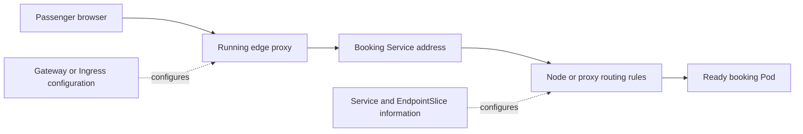
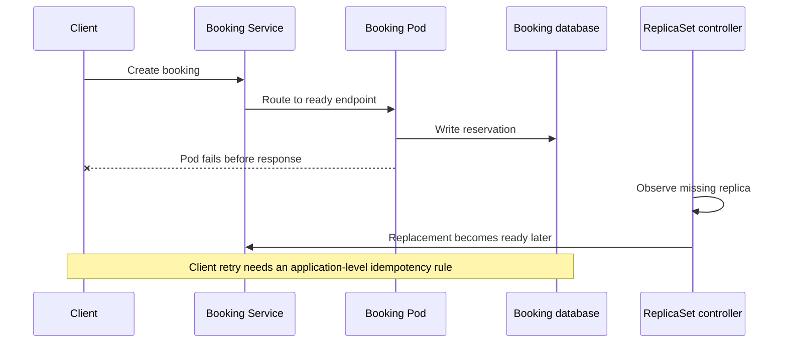

# Capstone: Follow a Passenger’s Booking

A passenger presses **Book**. For them, this is one action. For Apollo Airlines,
it crosses many of the boundaries introduced since Launchpad. This walkthrough
connects them without requiring a cluster.

The goal is not to name every object from memory. It is to explain who acts,
what information each actor uses, what changes during failure, and which
evidence supports the passenger outcome.

## 1. The request reaches the cluster

The browser first resolves an Apollo hostname to an externally reachable
address. A load balancer or local equivalent carries the connection to the
running edge proxy. Gateway or Ingress objects are stored configuration; the
proxy is the process that matches the hostname and path.

At this point, distinguish three facts:

- the route object was accepted by its controller;
- a proxy is listening at an address the browser can reach;
- this particular request matched a rule and was forwarded.

One does not prove the next. DNS, TLS, listener status, and an HTTP response are
evidence for different transitions.

## 2. Stable service identity becomes a Pod destination

The route sends the request toward a Service such as `booking`. The Service
selector and ready Pod conditions contribute to EndpointSlice records. A node
network implementation consumes the Service and endpoint information and
programs routing behavior.

The packet does not pass through a Service or EndpointSlice API object as if it
were a proxy. It reaches the stable Service address, and node or proxy rules
select a ready booking Pod.

*Diagram CA-01 — configuration paths prepare the running traffic path; they are
not packet-processing hops.*

## 3. The booking process performs application work

Reaching the booking Pod only establishes the first application hop. The booking
process may validate the passenger with identity, ask flight about a seat, write
a reservation, and request notification work.

Each call begins from booking's network environment. Its `localhost` is not the
browser's computer and not the flight Pod. Booking uses stable service names and
ports for its dependencies.

This is also why `Ready=True` is bounded evidence. A readiness check can say
booking is eligible for new traffic, but a later dependency call may still time
out or reject this request.

## 4. The reservation crosses a storage boundary

Process memory and a container writable layer disappear across different
lifecycle events. A reservation that must survive Pod replacement belongs in a
database with an explicitly understood storage and recovery boundary.

For a database running in Kubernetes, a claim may reconnect a replacement Pod
to the same volume. A StatefulSet may preserve an ordinal name and associate it
with a per-ordinal claim. Neither mechanism creates a backup or proves that the
database contents are usable.

The strongest evidence is layered:

1. The replacement Pod has the expected new UID.
2. It mounts the intended existing claim and volume.
3. The database opens the data successfully.
4. Apollo can retrieve the reservation through its application path.

## 5. Controllers keep working after the request

If the booking process exits, the kubelet may restart its container inside the
same Pod. If the Pod disappears, its ReplicaSet may create a replacement with a
new UID and usually a new IP. The Service can later offer that ready replacement
to new callers.

Those recoveries restore a process, not the in-flight request. The application
still needs appropriate retry and idempotency behavior to avoid losing work or
performing an external side effect twice.

*Diagram CA-02 — infrastructure recovery can restore capacity while leaving the
outcome of one interrupted booking uncertain.*

## 6. Delivery changes the running graph

A source change becomes useful only after several handoffs: CI identifies and
tests a revision, a registry stores an image, desired configuration refers to
the artifact, and controllers roll out new Pods. Helm or Kustomize can produce
the object graph; a GitOps controller can compare and synchronize it.

Readiness can delay traffic to a new Pod, while rollout limits control how old
and new replicas overlap. Rollback restores desired workload configuration. It
does not retract a notification, refund a payment, or reverse a database write
already made by the new version.

## 7. Telemetry helps explain the outcome

Use the signal that matches the question:

- Metrics show whether booking latency or errors changed across many requests.
- A trace follows one request and shows which dependency consumed its time.
- Logs add discrete application context, ideally correlated by trace or request
  identifiers.

A ServiceMonitor describes how Prometheus can discover a target; Prometheus
performs the scrape. A trace explains Apollo only when its context is propagated
through the real calls being investigated.

## 8. Scaling changes capacity, not correctness

Caching can reduce repeated work. HPA can change desired replicas from observed
metrics. VPA can recommend different resource requests. A node autoscaler may
add capacity when Pods cannot schedule.

These controls address different bottlenecks. More booking Pods do not repair a
slow shared database, and a warm cache does not make stale flight data correct.
Compare each change with a recorded workload and baseline.

## Mission debrief

You should now be able to explain:

1. Which parts of the booking path are configuration and which are running
   processes or traffic.
2. Why API acceptance, controller convergence, and passenger success are
   different kinds of evidence.
3. Which identity and state survive a container restart or Pod replacement.
4. What delivery, rollback, observability, and scaling mechanisms cannot
   guarantee.
5. Which security and cloud controls remain conceptual rather than demonstrated
   in Apollo's supported local snapshot.

## Self-assessment rubric

Use one real or imagined booking request. A complete explanation earns one point
for each row; aim for eight before opening the optional challenge.

| Criterion | Complete evidence |
| --- | --- |
| Client location | Names the browser or service that starts each call and interprets `localhost` from that location. |
| Configuration versus traffic | Separates API objects and controller work from the processes and packets on the request path. |
| Acceptance | Identifies evidence that the API accepted the desired object. |
| Convergence | Identifies the responsible controller and evidence that observed state approached intent. |
| Useful behaviour | Verifies a passenger-facing result rather than stopping at `Running` or `Ready`. |
| Identity and state | Explains what changes across container restart and Pod replacement and where the reservation lives. |
| Failure boundary | Names one failure the demonstrated mechanism does not survive or repair. |
| Change and rollback | Explains what rollback restores and which side effects it cannot reverse. |
| Telemetry | Chooses a signal that answers a specific question and correlates a real request identifier. |
| Status honesty | Labels planned security and cloud controls as conceptual rather than observed. |

### Example of a strong causal explanation

> The browser resolves the booking hostname and reaches a running edge proxy.
> An accepted HTTPRoute is configuration evidence, not proof of traffic; a live
> HTTP response verifies the listener and match. The proxy forwards toward the
> booking Service, and node rules select a ready Pod from endpoint information.
> Booking calls flight from booking's network environment and stores the
> reservation in its database. If the Pod disappears, a controller creates a
> replacement with a new UID, but that does not prove the interrupted request
> completed. I would verify the reservation through the application and use the
> same request or trace identifier in logs and traces. A rollback can restore
> workload configuration, not reverse a notification or committed database write.

The [Capstone Challenge](../../capstone) turns this explanation into six local
missions. Record the exact snapshot and evidence you use; a conceptual mechanism
should not be presented as verified merely because its YAML is plausible.
