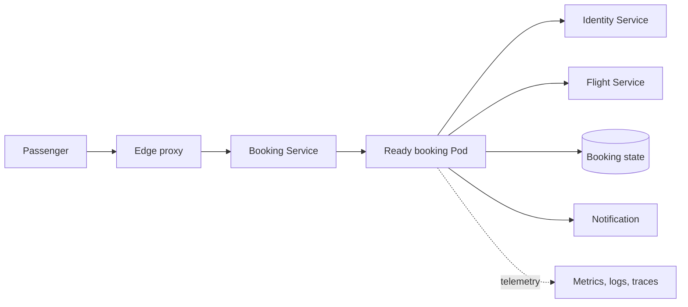

# Capstone: Follow a Passenger’s Booking

A passenger presses Book. For them, this is one action; for Apollo Airlines, it brings together almost everything you have met since Launchpad. Let’s follow that booking, then consider what happens when we change the application or lose a Pod. You can follow this walkthrough without a cluster.

## One request

A browser resolves and reaches an edge address. The edge proxy applies its configured route and sends the request to the frontend or booking Service. Node routing rules select a ready backend Pod using Service and endpoint information; the packet does not traverse an EndpointSlice object. The booking process then calls identity and flight, writes booking state, and asks notification to publish follow-up work.

Each hop has a different identity and evidence: a browser URL, a Gateway or Ingress route, a Service selector, endpoint records, Pod readiness, application logs, traces, and metrics. A successful Kubernetes API response only proves object acceptance. Ready endpoints and rollout status are convergence evidence. A completed booking with its expected data and notification outcome is useful-behavior evidence.

*Diagram CA-01 — this is an integrated conceptual path. It does not imply that every named component is active in every lab snapshot.*

## A change, a failure, and a recovery

Changing a Deployment template causes its controller to create a new ReplicaSet and Pods. The scheduler selects nodes; kubelets start containers; readiness can make usable Pods eligible for routing. Helm or Kustomize can produce the desired object graph, and a GitOps controller can compare and synchronize it, but neither makes external side effects transactional.

If a booking Pod’s process exits, the kubelet may restart its container. If the Pod is lost, its controller may replace it with a new Pod identity. The replacement does not recreate memory or an ephemeral writable layer. A claim may preserve storage across Pod replacement, subject to its backend, retention, node or zone availability, and recovery plan. A backup becomes recovery evidence only after a restore is tested.

## Mission debrief: what have we learned?

- A readiness probe controls endpoint eligibility; it does not prove every dependency or booking invariant.
- A PDB limits voluntary disruptions; it does not stop node failure, direct deletion, or OOM.
- HPA changes desired replicas from available metrics; it cannot supply node capacity or fix an unmeasured bottleneck.
- Security and cloud chapters describe mechanisms, not verified runnable Apollo security or EKS lifecycle claims.

## Ready to take the controls?

If you choose to run the capstone, use the supported Stage 7 snapshot and record the exact commit, rendered manifests, cluster environment, workload, and evidence. Treat a mismatch between the conceptual account and a snapshot as a source-map issue to investigate, not as an excuse to silently generalize from one result.

The [Capstone Challenge](../../capstone) brings the story into your local cluster through six missions: deployment, tracing, persistence, scaling, rollout observation, and a final audit.
