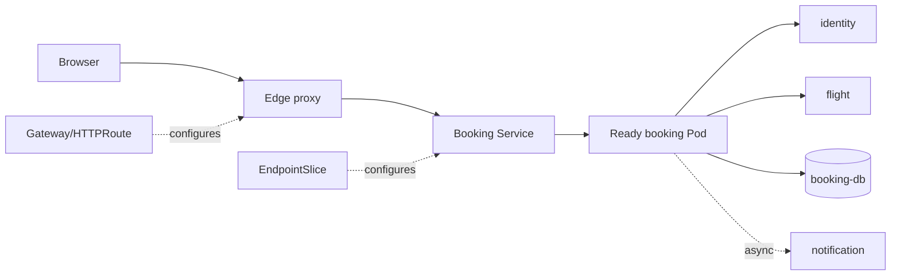

# Capstone: follow a passenger's booking

**You will be able to:** explain, for one `POST /api/bookings`, who acts at each hop, what evidence proves it, and what the mechanism does not guarantee.

## The path, hop by hop

| # | Hop | Mechanism | Evidence | Does **not** prove |
|---|---|---|---|---|
| 1 | Browser → edge | DNS/Host → LB address → running Gateway proxy; Gateway/HTTPRoute are config | Gateway `Programmed`, route `Accepted`, **a live response** | Config accepted ≠ proxy listening ≠ this request matched |
| 2 | Edge → Pod | Proxy → Service ClusterIP → node rules → **ready** Pod from EndpointSlice | `get endpointslice` ready, request succeeds | A packet never traverses an API object |
| 3 | App work | booking → identity → flight → DB insert → notification (async), each call from booking's network view | Logs/trace with one request ID | `Ready=True` ≠ this call succeeds |
| 4 | Storage | Reservation in Postgres on a PVC; StatefulSet ordinal + claim | New Pod UID, same claim, DB opens, app returns the booking | No backup/replication |
| 5 | Recovery | Kubelet restarts containers; ReplicaSet replaces Pods | `restartCount` vs UID change | The interrupted request's outcome |
| 6 | Delivery | CI → image → manifest → rollout (Helm/Kustomize/Argo) | `imageID`, rollout status, Argo Synced+Healthy | Rollback does not undo writes/emails |
| 7 | Telemetry | Metric = scope, trace = location, log = detail | `trace_id` joins trace↔log | Context is lost if a hop drops `traceparent` |
| 8 | Scaling | Cache, HPA, VPA recommend, node capacity | Baseline before/after | More Pods don't fix a slow DB; cache can be stale |

```mermaid
flowchart LR
  B[Browser] --> E[Edge proxy] --> S[Booking Service] --> P[Ready booking Pod]
  P --> I[identity] 
  P --> F[flight]
  P --> D[(booking-db)]
  P -.async.-> N[notification]
  R[Gateway/HTTPRoute] -.configures.-> E
  EP[EndpointSlice] -.configures.-> S
```

## Interrupted request

```mermaid
sequenceDiagram
  participant C as Client
  participant P as Booking Pod
  participant D as DB
  participant R as ReplicaSet
  C->>P: create booking
  P->>D: write
  P--xC: Pod dies before response
  R->>R: sees missing replica, creates a new Pod
  Note over C,D: Did the write commit? Client retry needs an idempotency rule
```

- Infrastructure recovery restores **capacity**, not the outcome of one in-flight request.
- Retries need application-level idempotency to avoid double bookings or double emails.

## Evidence layers (strongest last)

1. API accepted the object.
2. Controller reports convergence (counts, conditions).
3. Endpoints ready and proxy route accepted.
4. A **real request** returns the passenger-visible result.

## Self-assessment

Explain one booking; score one point per row; aim for 8+ before the capstone lab.

| Criterion | Complete when you… |
|---|---|
| Client location | Name the client of every call and what `localhost` means for it |
| Config vs traffic | Separate API objects/controllers from processes/packets |
| Acceptance | Cite evidence the API accepted the object |
| Convergence | Name the controller and evidence observed ≈ desired |
| Useful behaviour | Verify a passenger-facing result, not just `Running` |
| Identity and state | State what restart vs replacement keeps; where the reservation lives |
| Failure boundary | Name one failure the mechanism doesn't survive |
| Change and rollback | Say what rollback restores and what it can't reverse |
| Telemetry | Pick a signal for a question and correlate a real request ID |
| Status honesty | Label Stage 8/9 controls as planned |

Model answer

The browser resolves the booking hostname and reaches a running edge proxy. An accepted HTTPRoute is configuration evidence, not proof of traffic; a live HTTP response verifies listener and match. The proxy forwards to the booking Service and node rules select a ready Pod from endpoint information. Booking calls identity and flight from its own network environment and stores the reservation in its database. If the Pod disappears, a controller creates a replacement with a new UID, but that does not prove the interrupted request completed: I would verify the reservation through the application and use the same request or trace ID in logs and traces. Rollback restores workload configuration, not a sent notification or a committed database write.

Next: the hands-on [Core Capstone](../../capstone).
