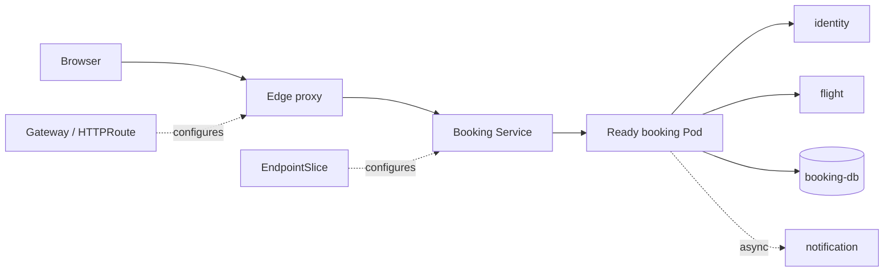
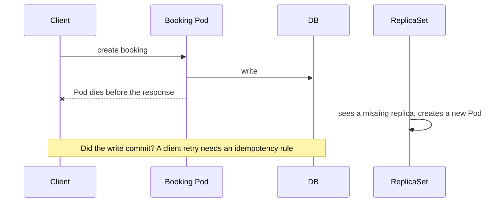

# Capstone: follow a passenger's booking

**You will be able to:** explain, for one `POST /api/bookings`, who acts at each hop, what evidence proves it, and what that mechanism does not guarantee.

## Why a walkthrough

Each chapter taught one mechanism in isolation. A passenger's booking is where they all meet. The skill is not naming every object from memory: it is telling a coherent causal story, and knowing for each claim **what evidence supports it and what it leaves unproven**.

Throughout, keep one distinction in mind. *Configuration* (Gateway, HTTPRoute, Service, EndpointSlice) is stored data that programs the running parts; the *traffic* (a packet) flows through the running parts: proxy, kernel rules, Pods. Mixing the two is the most common source of confusion.

## The path, hop by hop

| # | Hop | Mechanism | Evidence | Does **not** prove |
|---|---|---|---|---|
| 1 | Browser → edge | DNS and the `Host` header reach a load-balancer address and a running Gateway proxy. Gateway and HTTPRoute are configuration | Gateway `Programmed`, route `Accepted`, **a live response** | Accepted config ≠ proxy listening ≠ this request matched |
| 2 | Edge → Pod | Proxy → Service ClusterIP → node rules → a **ready** Pod chosen from the EndpointSlice | Ready endpoints; the request succeeds | A packet never passes through an API object |
| 3 | Application work | booking calls identity, flight, writes to booking-db, then notification asynchronously, each call starting from booking's own network view | Logs or a trace with one request ID | `Ready=True` does not mean this call succeeds |
| 4 | Storage | The reservation lives in Postgres on a PVC; a StatefulSet ordinal remounts its own claim | New Pod UID, same claim, DB opens, the app returns the booking | Backup or replication |
| 5 | Recovery | Kubelet restarts containers; a ReplicaSet replaces Pods | `restartCount` versus a UID change | The outcome of the interrupted request |
| 6 | Delivery | CI → image → manifest → rollout (Helm, Kustomize, Argo) | `imageID`, rollout status, Argo Synced + Healthy | That rollback undoes writes or emails |
| 7 | Telemetry | Metric = scope, trace = location, log = detail | `trace_id` joins trace to log | Context survives if any hop drops `traceparent` |
| 8 | Scaling | Cache, HPA, VPA advice, node capacity | A baseline before and after | More Pods do not fix a slow DB; a cache can be stale |

```mermaid
flowchart LR
  B[Browser] --> E[Edge proxy] --> S[Booking Service] --> P[Ready booking Pod]
  P --> I[identity]
  P --> F[flight]
  P --> D[(booking-db)]
  P -.async.-> N[notification]
  R[Gateway / HTTPRoute] -.configures.-> E
  EP[EndpointSlice] -.configures.-> S
```

## The interrupted request

The hardest case to reason about is a Pod that dies mid-request:

```mermaid
sequenceDiagram
  participant C as Client
  participant P as Booking Pod
  participant D as DB
  participant R as ReplicaSet
  C->>P: create booking
  P->>D: write
  P--xC: Pod dies before the response
  R->>R: sees a missing replica, creates a new Pod
  Note over C,D: Did the write commit? A client retry needs an idempotency rule
```

Infrastructure recovery restores **capacity**, not the outcome of one in-flight request. Retrying safely needs application-level *idempotency* (a repeat must not create a second booking or send a second email).

## Evidence layers, weakest to strongest

1. The API accepted the object.
2. A controller reports convergence (counts, conditions).
3. Endpoints are ready and the proxy route is accepted.
4. A **real request** returns the passenger-visible result.

## Self-assessment

Explain one booking and score one point per row; aim for 8 or more before the capstone lab.

| Criterion | You can… |
|---|---|
| Client location | Name the client of every call and what `localhost` means for it |
| Config versus traffic | Separate API objects and controllers from processes and packets |
| Acceptance | Cite evidence the API accepted the object |
| Convergence | Name the controller and the evidence observed ≈ desired |
| Useful behaviour | Verify a passenger-facing result, not just `Running` |
| Identity and state | State what restart versus replacement keeps, and where the reservation lives |
| Failure boundary | Name one failure the mechanism does not survive |
| Change and rollback | Say what rollback restores and what it cannot reverse |
| Telemetry | Pick a signal for a question and correlate a real request ID |
| Status honesty | Label Stage 8 and 9 controls as planned |

Model answer

The browser resolves the booking hostname and reaches a running edge proxy. An accepted HTTPRoute is configuration evidence, not proof of traffic; a live HTTP response verifies the listener and match. The proxy forwards to the booking Service and node rules select a ready Pod from endpoint information. Booking calls identity and flight from its own network environment and stores the reservation in its database. If the Pod disappears, a controller creates a replacement with a new UID, but that does not prove the interrupted request completed: I would verify the reservation through the application and use the same request or trace ID in logs and traces. A rollback restores workload configuration, not a sent notification or a committed database write.

Next: the hands-on [Core Capstone](../../capstone).
