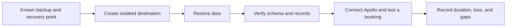
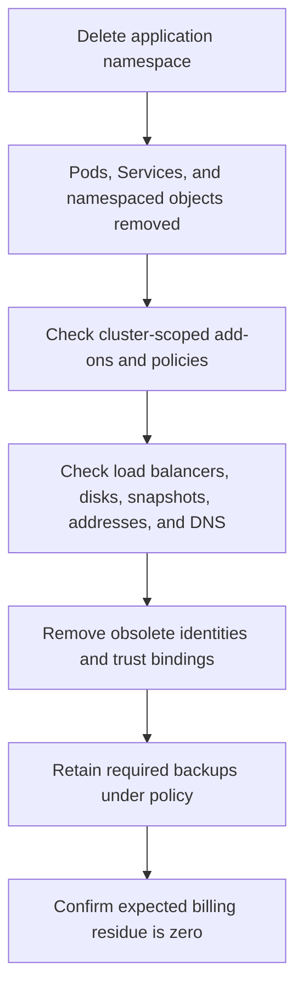

# Backup, restore, and teardown

*Lunar Orbit · Prove that Apollo can return and leave cleanly*

A running replica, a storage snapshot, and a database backup preserve different
things. None is a recovery plan by itself. Apollo has recovered only when the
team can restore the required data into a usable destination and a passenger
can complete the expected booking path.

## Start with the loss you need to survive

Recovery design begins with an event: a Pod was replaced, a disk was deleted, a
table was corrupted, a zone failed, or an entire cluster was lost. Each event
crosses a different boundary.

- **Recovery point objective (RPO):** how much recent data may be lost?
- **Recovery time objective (RTO):** how long may restoration take?

A nightly backup may satisfy a one-day RPO but cannot satisfy a five-minute one.
A replica may reduce interruption after hardware failure but can immediately
copy an accidental deletion to every member.

| Mechanism | Useful for | Important limit |
| --- | --- | --- |
| Application replica | Process or node availability | Copies bad writes too |
| Volume snapshot | Fast copy of a storage point | May not be application-consistent |
| Database backup | Logical or physical data recovery | Needs a destination and restore tooling |
| Cross-region copy | Wider failure boundary | Adds lag, cost, and coordination |

## A restore is an ordered workflow

Restoring booking data may require infrastructure, credentials, database
software, schema compatibility, and application configuration before the data
can be verified. Write that order down rather than relying on the memory of the
person who created the backup.

*Diagram CLD-04 — recovery evidence moves from a stored copy to verified data
and finally to useful application behavior.*

An isolated destination avoids overwriting the system being recovered. Record
which backup was used, how long each step took, what data was missing, and
whether the application version could read it.

## Teardown crosses the API boundary too

Deleting a namespace may not remove a retained disk, snapshot, public address,
DNS record, identity binding, log store, or provider load balancer. Inventory:

1. Kubernetes resources and cluster add-ons.
2. Nodes, disks, snapshots, and load balancers.
3. DNS records, certificates, and public addresses.
4. Provider identities, keys, and trust relationships.
5. Backups retained under policy.
6. Billing views used to detect residue.

*Diagram CLD-05 — teardown moves outward from namespaced objects to cluster and
provider resources, while intentionally retained backups follow policy.*

## Evidence and limits

Call a backup usable only after a representative restore and application-level
verification. Call teardown complete only after checking cluster and provider
inventories and confirming expected costs have stopped. No provider-specific
command sequence is claimed as tested here.
