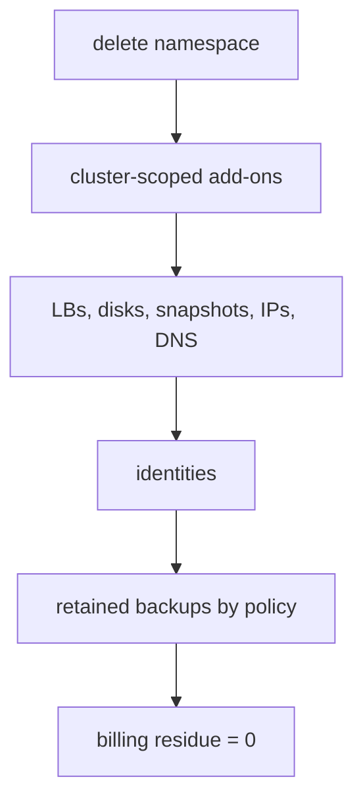

# Backup, restore, and teardown

*Lunar Orbit · Planned*

**You will be able to:** match a protection mechanism to a loss event, write an ordered restore, and inventory what teardown must remove.

Two quiet failures end careers. First, a backup that has run happily for a year turns out to be unrestorable on the day it is needed. Second, a test cluster is "deleted" but a load balancer, disk and snapshot keep billing for months. Both come from treating a mechanism's existence as the outcome.

## Recovery is proven, not owned

A fire drill versus a fire extinguisher on the wall: owning the equipment is not the same as knowing it works under pressure. **Recovery is only proven by doing it.** And leaving a rented flat means checking every room and the meters, not just locking the front door.

### Start with the loss you must survive

Different events cross different boundaries:

| Event | Boundary crossed |
|---|---|
| Pod replaced | Pod |
| Disk deleted | Volume |
| Table corrupted | Logical data |
| Zone failed | Failure domain |
| Cluster lost | Cluster |

Two numbers frame the goal: **RPO** (recovery point objective) is how much recent data you can afford to lose; **RTO** (recovery time objective) is how long restoration may take. A nightly backup cannot meet a five-minute RPO.

| Mechanism | Good for | Limit |
|---|---|---|
| Replica | Node or process availability | Copies bad writes instantly |
| Volume snapshot | A fast point-in-time copy | May be crash-consistent, not application-consistent |
| Database backup | Logical or physical data recovery | Needs a destination and tooling |
| Cross-region copy | A wider failure domain | Lag, cost and coordination |

## Restore is an ordered workflow

Restoring booking needs infrastructure, credentials, database software, a compatible schema and application configuration, in the right order. Write that order down; do not rely on the memory of whoever made the backup.

```mermaid
flowchart LR
  B[known backup + point] --> D[isolated destination] --> R[restore] --> V[verify schema + rows] --> A[connect Apollo, test a booking] --> Rec[record duration, loss, gaps]
```

Restore into an **isolated** destination so you do not overwrite what you are recovering. Record which backup you used, how long each step took, what data was missing, and whether the app version could read it. **A backup is usable only after a representative restore and an application-level check pass.**

## Teardown crosses the API boundary

Deleting a namespace may not remove a retained disk, snapshot, public address, DNS record, identity binding, log store or provider load balancer. Inventory outward:

1. Kubernetes resources and add-ons.
2. Nodes, disks, snapshots, load balancers.
3. DNS records, certificates, public IPs.
4. Provider identities, keys, trust bindings.
5. Backups retained by policy.
6. Billing views, to detect residue.

```mermaid
flowchart TB
  NS[delete namespace] --> Cl[cluster-scoped add-ons] --> Pv[LBs, disks, snapshots, IPs, DNS] --> Id[identities] --> Ret[retained backups by policy] --> Bill[billing residue = 0]
```

No provider-specific commands are claimed as tested here.

## Common misconceptions

- **"The backup job succeeded, so we're covered."** Only a rehearsed restore says so.
- **"Replication is a backup."** Bad writes replicate.
- **"Deleting the cluster stops the bill."** Check the provider inventory.

## Check yourself

A backup job reports success nightly. Are you recoverable?

Unknown until a restore has been performed and a booking verified against the restored data.

## Where this leads

That completes the conceptual path. The capstone pulls the whole journey together around one booking.
