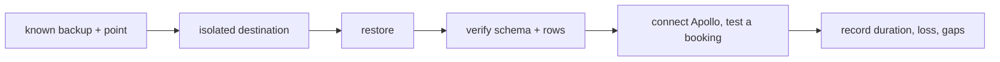
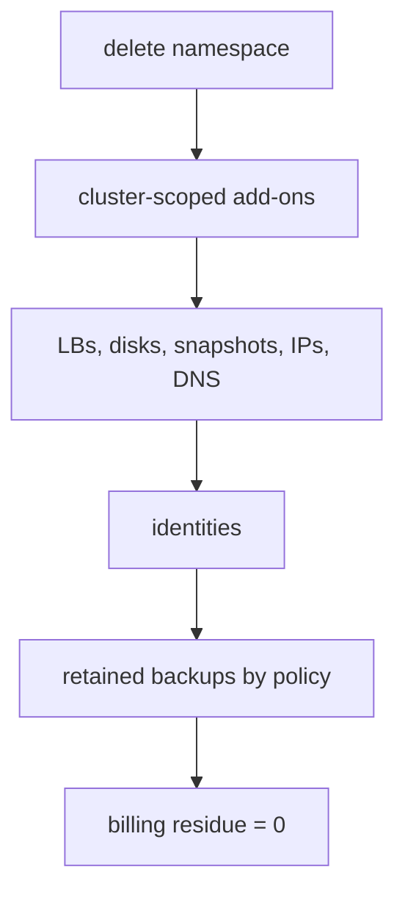

# Backup, restore, and teardown

*Lunar Orbit · Planned*

**You will be able to:** match a mechanism to a loss event, write a restore order, and inventory teardown.

## Start with the loss

| Event | Crossed boundary |
|---|---|
| Pod replaced | Pod |
| Disk deleted | Volume |
| Table corrupted | Logical data |
| Zone failed | Failure domain |
| Cluster lost | Cluster |

- **RPO:** how much recent data may be lost. **RTO:** how long restoration may take. A nightly backup cannot meet a 5-minute RPO.

| Mechanism | Good for | Limit |
|---|---|---|
| Replica | Node/process availability | Copies bad writes instantly |
| Volume snapshot | Fast point copy | May be crash- not app-consistent |
| DB backup | Logical/physical recovery | Needs destination + tooling |
| Cross-region copy | Wider failure | Lag, cost, coordination |

## Restore is an ordered workflow

```mermaid
flowchart LR
  B[known backup + point] --> D[isolated destination] --> R[restore] --> V[verify schema + rows] --> A[connect Apollo, test a booking] --> Rec[record duration, loss, gaps]
```

- Restore into an **isolated** destination so you don't overwrite what you're recovering.
- Record: backup used, per-step duration, missing data, app version compatibility.
- **Backup usable = representative restore + application check passed.**

## Teardown crosses the API boundary

1. Kubernetes resources and add-ons.
2. Nodes, disks, snapshots, load balancers.
3. DNS records, certificates, public IPs.
4. Provider identities, keys, trust bindings.
5. Backups retained by policy.
6. Billing views to detect residue.

```mermaid
flowchart TB
  NS[delete namespace] --> Cl[cluster-scoped add-ons] --> Pv[LBs, disks, snapshots, IPs, DNS] --> Id[identities] --> Ret[retained backups by policy] --> Bill[billing residue = 0]
```

- A namespace delete can leave retained disks, snapshots, addresses and provider load balancers behind.
- No provider-specific commands are claimed as tested here.

## Check yourself

A backup job reports success nightly. Are you recoverable?

Unknown until a restore has been performed and a booking verified against the restored data.

