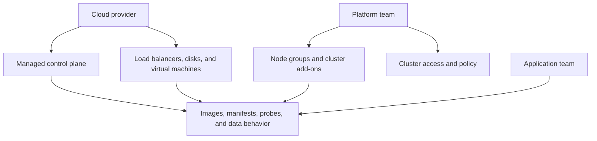

# Infrastructure and ownership

*Lunar Orbit · Know who can act at each boundary*

“Managed” does not mean “someone else guarantees Apollo works.” It means a
provider accepts responsibility for a defined part of the system. The team still
needs to know where that responsibility ends.

Suppose the booking Pods are ready but passengers cannot reach the airline. The
cause could be public DNS, a load balancer, a Gateway configuration, a Service
with no endpoints, or the application itself. Ownership tells the incident team
who can inspect and change each layer.

## Separate five kinds of responsibility

For each component, answer five questions:

1. Who chooses its configuration?
2. Who operates and monitors it day to day?
3. Who repairs or replaces it after failure?
4. Who controls access to it?
5. Who sees and controls its cost?

A managed control plane may be patched by the provider while the platform team
still chooses cluster access, node capacity, add-ons, and upgrade timing. The
application team still owns booking behavior, probes, requests, rollout safety,
and data correctness.

*Diagram CLD-02 — provider, platform, and application responsibilities meet in
one request path.*

## Build an ownership record, not just a diagram

An architecture box labelled “managed database” is too vague during an
incident. Its record should identify the service and region, the team allowed to
change it, the provider health signal, Apollo's application signal, the backup
owner, and the escalation route.

| Component | Configured by | Operated by | Useful evidence |
| --- | --- | --- | --- |
| Managed control plane | Platform and provider | Provider | API availability plus provider status |
| Worker nodes | Platform | Shared | Ready nodes, capacity, instance health |
| Booking Deployment | Application | Application | rollout status and successful booking |
| Managed database | Application and data teams | Provider and data team | query success and restore test |

Shared responsibility must be written as two concrete responsibilities.
“Shared” by itself tells nobody who acts next.

## Ownership changes the debugging path

Start with passenger impact, then find the first broken boundary. If Kubernetes
reports a load-balancer address but the provider resource is still provisioning,
the platform or provider path owns the next action. If traffic reaches a ready
booking Pod and the database call fails, the application and data paths own it.

## Evidence and limits

Record owners before an incident, including after-hours responsibility and the
evidence each owner accepts. Provider status alone does not prove Apollo meets
its availability objective, and a healthy application dashboard does not prove
the provider can restore its data.
