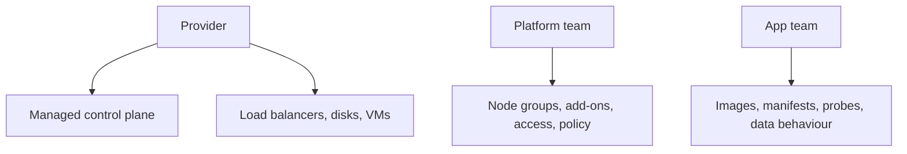

# Infrastructure and ownership

*Lunar Orbit · Planned*

**You will be able to:** fill in an ownership record for a component and use it to decide who acts next during an incident.

Booking Pods are Ready, but passengers cannot reach the site. The cause could be public DNS, a load balancer, Gateway configuration, a Service with no endpoints, or the application itself. In an incident, the worst delay is not technical: it is not knowing *who is allowed and expected to look at which layer*.

## What "managed" really means

A building has a landlord (structure and utilities), a facilities team (lifts and cleaning), and tenants (what happens inside their offices). When the lights go out, you need to know whose problem it is before you can fix it.

"Managed" cloud services work this way: it means the provider accepts responsibility for a **defined part**. It does not mean "someone else guarantees Apollo works."

For every component ask five questions:

1. Who chooses its **configuration**?
2. Who **operates** and monitors it day to day?
3. Who **repairs** or replaces it when it fails?
4. Who controls **access** to it?
5. Who sees and controls its **cost**?

```mermaid
flowchart TB
  Prov[Provider] --> CP[Managed control plane]
  Prov --> Infra[Load balancers, disks, VMs]
  Plat[Platform team] --> Nodes[Node groups, add-ons, access, policy]
  App[App team] --> W[Images, manifests, probes, data behaviour]
```

## An ownership record

An architecture box labelled "managed database" is too vague at 3 a.m. Give it a record:

| Component | Configured by | Operated by | Evidence |
|---|---|---|---|
| Managed control plane | Platform and provider | Provider | API availability plus provider status |
| Worker nodes | Platform | Shared | Ready nodes, capacity, instance health |
| Booking Deployment | App team | App team | Rollout status and a successful booking |
| Managed database | App and data teams | Provider and data team | Query success and a restore test |

Write "shared" as **two concrete responsibilities**; "shared" on its own tells nobody who acts next. Also record the service and region, who may change it, the provider's health signal, Apollo's own signal, the backup owner and the escalation route.

### Ownership shapes debugging

Start from passenger impact, then find the first broken boundary, and let ownership tell you who acts:

| Observation | Next owner |
|---|---|
| Load balancer address still pending at the provider | Platform or provider |
| Traffic reaches a ready booking Pod but the database call fails | App and data |
| Gateway route not resolving | Platform |

## Limits

Provider status alone does not show Apollo meeting its availability objective, and a green app dashboard does not show the provider can restore your data.

## Common misconceptions

- **"Managed means the provider fixes my incidents."** Only their layer.
- **"Shared responsibility is a plan."** It is a gap until it names who does what.

## Check yourself

Booking Pods are Ready but passengers can't reach the site. Where do you look first?

Outward from the Pod: Service endpoints, Gateway or route status, load balancer, DNS. Ownership decides who can change each layer.

## Where this leads

Ownership also covers failure domains and change. Next: how zones, scaling and upgrades interact.
