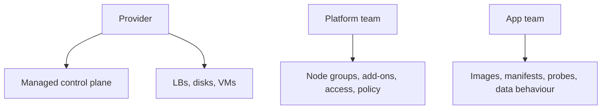

# Infrastructure and ownership

*Lunar Orbit · Planned*

**You will be able to:** fill an ownership record for a component and use it to find who acts next in an incident.

## Five questions per component

1. Who chooses its **configuration**?
2. Who **operates** and monitors it?
3. Who **repairs** or replaces it?
4. Who controls **access**?
5. Who sees and controls **cost**?

```mermaid
flowchart TB
  Prov[Provider] --> CP[Managed control plane]
  Prov --> Infra[LBs, disks, VMs]
  Plat[Platform team] --> Nodes[Node groups, add-ons, access, policy]
  App[App team] --> W[Images, manifests, probes, data behaviour]
```

- "Managed" = the provider owns a **defined** part, not "Apollo works".

## Ownership record

| Component | Configured by | Operated by | Evidence |
|---|---|---|---|
| Managed control plane | Platform + provider | Provider | API availability + provider status |
| Worker nodes | Platform | Shared | Ready nodes, capacity, instance health |
| Booking Deployment | App team | App team | Rollout status + successful booking |
| Managed database | App + data teams | Provider + data team | Query success + restore test |

- Write "shared" as two concrete responsibilities; "shared" alone tells nobody who acts.
- Add: service/region, change owner, provider health signal, app signal, backup owner, escalation route.

## Debug by ownership

| Observation | Next owner |
|---|---|
| LB address pending at provider | Platform/provider |
| Traffic reaches ready booking Pod, DB call fails | App + data |
| Gateway route unresolved | Platform |

## Limits

- Provider status ≠ meeting Apollo's availability objective. A green app dashboard ≠ the provider can restore your data.

## Check yourself

Booking Pods are Ready but passengers can't reach the site. Where do you look first?

Outward from the Pod: Service endpoints, Gateway/route status, load balancer, DNS. Ownership decides who can change each layer.

