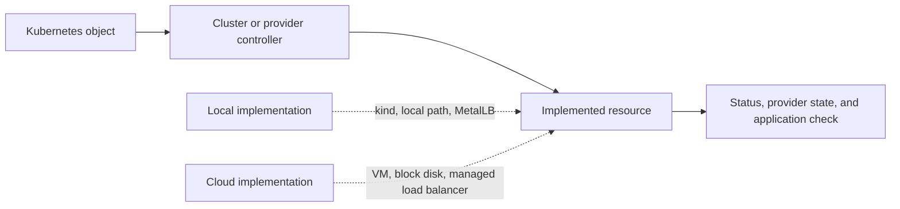

# From local clusters to cloud

*Lunar Orbit · Change the environment around the cluster*

Apollo currently runs in kind: its Kubernetes nodes are Docker containers on
one workstation. That environment is valuable because the moving parts are
visible and inexpensive. It also hides failure domains and provider services
that matter when passengers depend on the airline.

Moving to a cloud cluster does not replace the Kubernetes concepts you have
learned. Deployments still request Pods, Services still describe stable network
endpoints, and claims still request storage. What changes is the system that
implements those requests and the people responsible for it.

## Keep the API; revisit the assumptions

Consider Apollo's `LoadBalancer` Service. In a local lab, MetalLB assigns an
address from a range you configured. In a managed cloud, a controller may ask
the provider to create a load balancer, attach network rules, and allocate a
billable public address. The Service object looks familiar, but its controller,
failure modes, security boundary, and cost are different.

| Kubernetes request | Local implementation | Possible cloud implementation |
| --- | --- | --- |
| Create a node | Start a kind container | Provision or join a virtual machine |
| Request a volume | Allocate node-local storage | Create a zonal block volume |
| Request a load balancer | Assign a local MetalLB address | Provision a provider load balancer |
| Authenticate an operator | Use a local kubeconfig | Combine provider and Kubernetes identities |

The right question is not “did the YAML apply?” It is “which system fulfilled
each request, and which assumptions changed?”

*Diagram CLD-01 — the Kubernetes request can remain stable while different
controllers and infrastructure implement it.*

## Follow one booking across the new boundary

A passenger request may now cross public DNS, a provider load balancer, a
Gateway proxy, a Service, and a booking Pod. Booking may write to a managed
database or to a volume attached in one availability zone. Each hop has a
different owner and a different place to collect evidence.

A successful Deployment rollout proves little about the public DNS record or
provider load balancer. A healthy load balancer proves little about the booking
database. Preserve the evidence ladder, but include infrastructure outside
Kubernetes.

## Portability has levels

Apollo's application image may move without changing. A Kubernetes manifest may
apply after changing only a StorageClass or annotation. The operating model may
still change because identity, networking, backups, upgrades, and cost controls
depend on the provider.

- **Artifact portability:** the same image can run.
- **API portability:** equivalent Kubernetes objects are accepted.
- **Behavioral portability:** the application meets the same observable needs.
- **Operational portability:** the team can secure, recover, upgrade, and pay
  for it under the new ownership model.

## Evidence and limits

For each integration, record the Kubernetes object, the controller that acts on
it, the provider resource it creates, and the passenger-facing check that
matters. Apollo does not yet claim a verified cloud deployment or runnable EKS
lifecycle.
