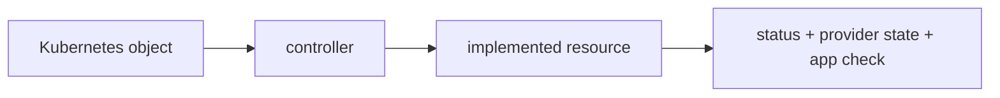

# From local clusters to cloud

*Lunar Orbit · Planned*

**You will be able to:** for any Kubernetes object, name who fulfils it locally vs in the cloud, and grade portability.

## Key points

- kind: nodes are Docker containers on one workstation. Cheap and visible, but hides failure domains and provider services.
- The Kubernetes **API stays the same**; the controller behind it, its failure modes, security boundary and cost change.

| Request | Local (kind) | Cloud |
|---|---|---|
| Node | kind container | VM joined to the cluster |
| Volume | node-local directory (`local-path`) | Zonal block volume (CSI) |
| `type: LoadBalancer` | MetalLB address from a pool | Provider load balancer + billable public IP |
| Operator login | local kubeconfig | Provider IAM + Kubernetes identity |

```mermaid
flowchart LR
  Obj[Kubernetes object] --> Ctl[controller] --> Res[implemented resource] --> Ev[status + provider state + app check]
```

- Ask "which system fulfilled this, and which assumptions changed?", not "did the YAML apply?"

## One booking, more hops

`DNS → provider LB → Gateway proxy → Service → booking Pod → managed DB or zonal volume`. Each hop has a different owner and evidence source. A rollout success says nothing about public DNS or the load balancer.

## Portability levels

| Level | Meaning |
|---|---|
| Artifact | Same image runs |
| API | Equivalent objects are accepted |
| Behavioural | Same observable behaviour |
| Operational | Team can secure, recover, upgrade and pay for it |

## Record per integration

- Kubernetes object → controller → provider resource → passenger-facing check.
- Apollo has **no verified** cloud deployment yet (see [EKS boundary](../../eks)).

## Check yourself

The same Service YAML applies on kind and EKS. Is the app portable?

API-portable at best. Controller, failure domains, identity, backup and cost differ; operational portability must be shown separately.

