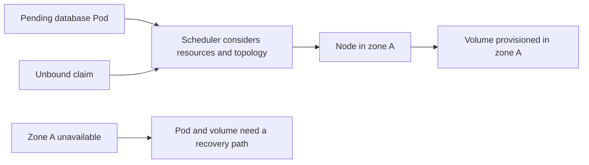

# Topology, scaling, and upgrades

*Lunar Orbit · Keep placement and capacity connected*

In kind, Apollo's workers share one physical workstation. A cloud region usually
contains separate availability zones. That gives the scheduler more failure
domains, but it also introduces placement constraints: a zonal disk cannot
automatically follow a Pod to every other zone.

## A Pod and its volume must meet somewhere

Imagine `identity-db-0` uses a block volume created in zone A. After a node
failure, the scheduler cannot place the replacement on a node in zone B if that
volume can attach only in zone A. The Pod may remain Pending even though the
cluster has spare CPU elsewhere.

Delayed volume binding helps the scheduler and storage provisioner choose
compatible topology when the claim is first used. It does not turn a zonal disk
into a multi-zone recovery system.

*Diagram CLD-03 — scheduling can align initial placement; it does not remove the
volume's failure domain.*

## Pod scaling and node scaling solve different shortages

HPA can request more search Pods when measured demand rises. Those Pods still
need nodes with sufficient requested CPU and memory. If none is available, the
new Pods remain Pending.

A node autoscaler can react to eligible unschedulable Pods by adding nodes under
its configured rules. It does not repair a missing metric, make an impossible
placement constraint possible, or know whether replicas help passengers.

Trace the chain explicitly:

1. A metric causes HPA to change the desired replica count.
2. A workload controller creates Pods.
3. The scheduler places them or reports why it cannot.
4. A node autoscaler may add suitable capacity.
5. The scheduler retries placement.
6. Readiness and a passenger request show whether capacity became useful.

## Upgrades are compatibility checks, not one button

A managed control-plane upgrade is only one part of a cluster upgrade. Nodes,
network and storage plugins, Gateway controllers, observability components, and
workloads may all have compatibility or disruption constraints.

Establish supported version skew, confirm add-on compatibility, preserve enough
workload capacity, and observe Apollo requests during the change. A successful
provider API operation does not prove that booking remained useful.

## Evidence and limits

For topology failures, inspect scheduling events, node zones, claim binding, and
volume location together. For scaling, distinguish desired, created, scheduled,
and ready Pods. This chapter does not claim that Apollo has verified a particular
provider topology or upgrade procedure.
