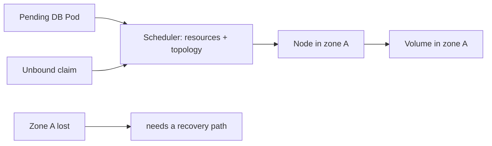

# Topology, scaling, and upgrades

*Lunar Orbit · Planned*

**You will be able to:** explain why a Pod can stay `Pending` while other zones have spare CPU, and trace a scaling request from metric to working capacity.

## The problem

In kind, every worker is on one machine. A cloud region has several **availability zones**, separate data centres that fail independently. That sounds strictly better, but it adds constraints: data and compute must be in the same place, and capacity added in one layer may be useless without the next.

## The idea in plain words

A restaurant with several branches: if the kitchen's freezer (your data) is in branch A, the chef (your Pod) must work in branch A, even if branch B is empty. Hiring more chefs does not help if there is no kitchen space to put them.

### A Pod and its volume must meet

A zonal block disk exists in one zone and can attach only to nodes there. If `identity-db-0`'s disk is in zone A and zone A fails, the replacement cannot start in zone B because the disk cannot follow. The Pod stays `Pending` although zone B has free CPU. (This is the cloud twin of kind's local-path pinning.)

`WaitForFirstConsumer` helps the scheduler and the provisioner choose a compatible zone the **first** time. It does not make a zonal disk multi-zone.

```mermaid
flowchart LR
  P[Pending DB Pod] --> S[Scheduler: resources + topology]
  C[Unbound claim] --> S --> A[Node in zone A] --> D[Volume in zone A]
  Z[Zone A lost] --> L[needs a recovery path]
```

## How it works: Pod scaling versus node scaling

Two different shortages need two different tools:

| Layer | Adds | Cannot fix |
|---|---|---|
| **HPA** | Pods, based on metrics | No node room; a non-CPU bottleneck |
| **Cluster / node autoscaler** | Nodes, for Pods that are **unschedulable** | A missing metric; impossible affinity, quota or zone constraints; whether more replicas actually help |

Trace a scale-out end to end: a metric rises → the HPA raises the desired replicas → Pods are created → the scheduler places them or reports why it cannot → if they are `Pending`, a node autoscaler may add a node → the scheduler retries → readiness → a passenger request succeeds.

## Upgrades are compatibility checks

A managed control-plane upgrade is only one part. Nodes, network and storage plugins, the Gateway controller, observability components and workloads all have version and disruption constraints. Before upgrading:

- Establish supported version skew and add-on compatibility.
- Keep enough capacity so draining a node leaves room.
- Use PDBs so drains do not remove too much at once.
- Watch real passenger requests during the change.

A successful provider API call does not show that booking stayed useful.

## Evidence

- Topology: scheduling events, node zone labels, claim binding and volume location, read together.
- Scaling: separate *desired*, *created*, *scheduled* and *ready* Pods.
- No provider topology or upgrade procedure is verified for Apollo.

## Common misconceptions

- **"More zones means automatically more resilient."** Zonal volumes pin data.
- **"The HPA adds capacity."** It adds Pod objects; capacity comes from nodes.
- **"An upgrade is one click."** It is a chain of compatibility checks.

## Check yourself

HPA wants 8 replicas, only 5 run. Where do you look?

`Pending` Pods' events (`Insufficient cpu`, affinity, volume), node capacity, and whether a node autoscaler exists and is eligible to act.

## Where this leads

Failures will happen. The last chapter covers preparing for them with backups, and leaving no mess when you tear down.
