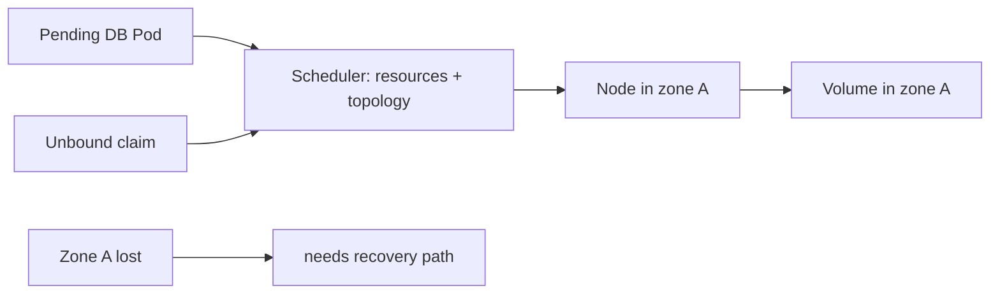

# Topology, scaling, and upgrades

*Lunar Orbit · Planned*

**You will be able to:** explain why a Pod can stay `Pending` with spare CPU elsewhere, and trace a scaling request end to end.

## Pod and volume must meet

- kind workers share one workstation; a cloud region has several **zones**.
- A zonal disk in zone A cannot attach to a node in zone B ⇒ a replacement DB Pod can stay `Pending` although zone B has free CPU. (Same effect as kind's local-path pinning.)
- `WaitForFirstConsumer` aligns the **first** placement. It does not make a zonal disk multi-zone.

```mermaid
flowchart LR
  P[Pending DB Pod] --> S[Scheduler: resources + topology]
  C[Unbound claim] --> S --> A[Node in zone A] --> D[Volume in zone A]
  Z[Zone A lost] --> L[needs recovery path]
```

## Pod scaling vs node scaling

| Layer | Adds | Can't fix |
|---|---|---|
| HPA | Pods (from metrics) | No node room; non-CPU bottleneck |
| Cluster/node autoscaler | Nodes for **unschedulable** Pods | Missing metric; impossible affinity/quota/zone; whether replicas help |

Trace it: metric → HPA desired → Pods created → scheduled or `Pending` (reason) → node autoscaler adds node → rescheduled → Ready → passenger request works.

## Upgrades

- Control-plane upgrade is one part. Also check nodes, CNI/CSI plugins, Gateway controller, observability, workloads.
- Establish supported **version skew**, confirm add-on compatibility, keep enough capacity, use PDBs, and watch real requests during the change.
- A successful provider API call ≠ booking stayed useful.

## Evidence

- Topology: scheduling events + node zone labels + claim binding + volume location, together.
- Scaling: separate *desired*, *created*, *scheduled*, *ready* Pods.
- No provider topology or upgrade procedure is verified for Apollo.

## Check yourself

HPA wants 8 replicas, only 5 run. Where do you look?

`Pending` Pods' events (`Insufficient cpu`, affinity, volume), node capacity, and whether a node autoscaler exists and is eligible to act.

