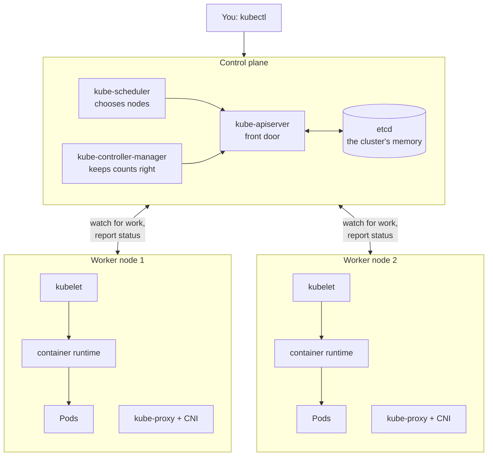
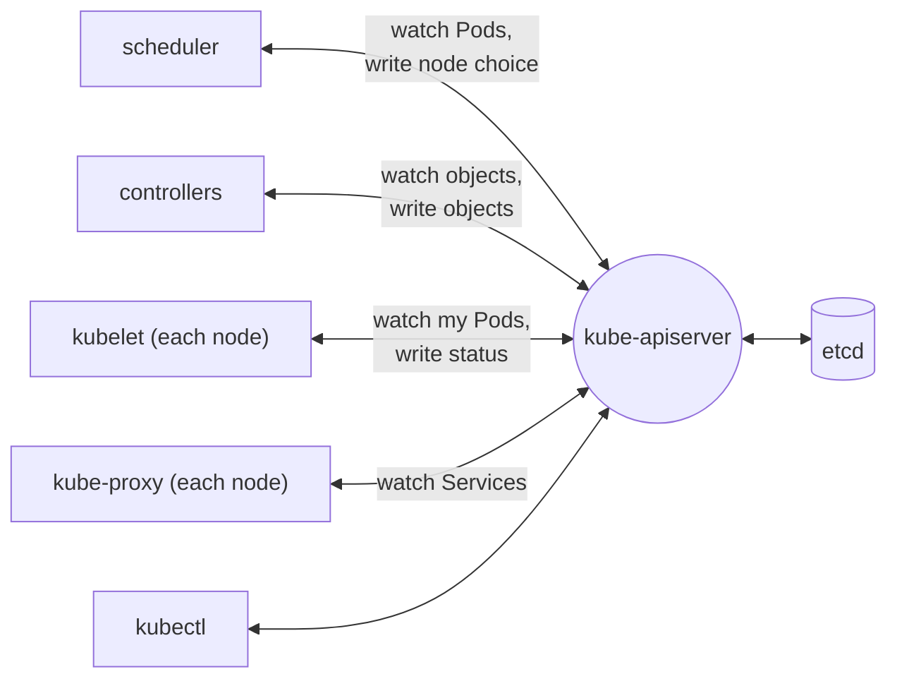
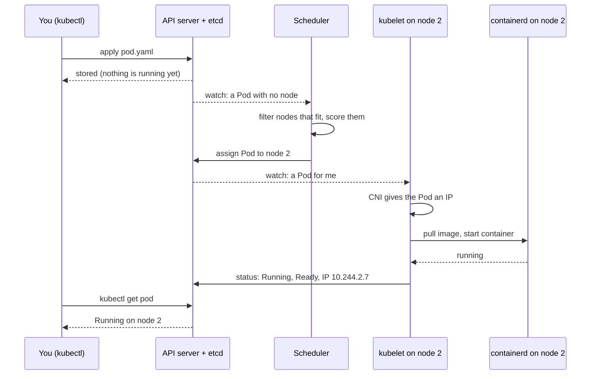
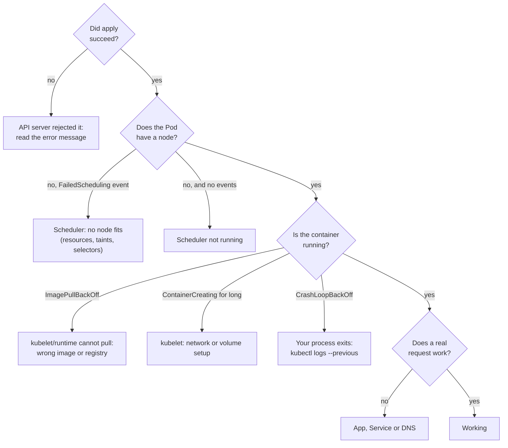
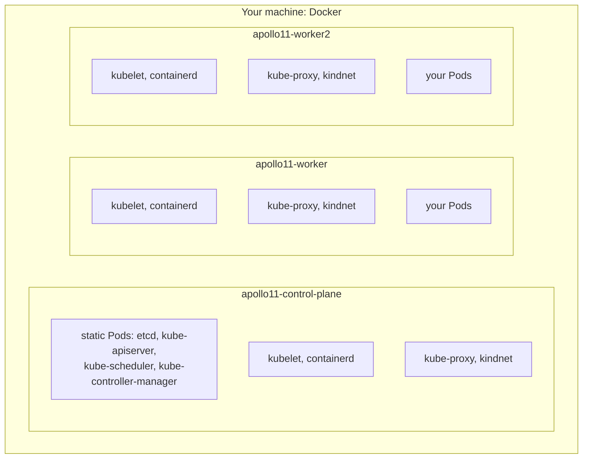

# Architecture and the basic flow

*Ignition*

**You will be able to:** draw a Kubernetes cluster from memory, say what each component is responsible for and where it runs, follow a workload from `kubectl apply` to a running container, and name the component to question when that journey stops.

Compose was one program doing everything on one machine. Kubernetes splits the work among several programs, each with one narrow job, spread over two kinds of machine. When something is not running, "Kubernetes is broken" is not a diagnosis. Knowing which component owns which step tells you where to look.

## The big picture

A cluster is a set of machines called **nodes**. They play one of two roles:

- The **control plane** stores what you asked for and makes decisions: what should exist, and where it should run.
- **Worker nodes** run your containers, and report back what is actually happening.



A useful way to hold it: the control plane is the **airline's operations centre**, where the schedule is kept and decisions are made. The nodes are the **aircraft and crews**, who do the flying and radio in their status. The operations centre never flies a plane; the crews never rewrite the schedule.

## The control plane

| Component | Its one job | Think of it as |
|---|---|---|
| **`kube-apiserver`** | The only way in. Every read and write, from you or from another component, is a request to it. It checks the request and stores the result. | The front desk and the noticeboard |
| **`etcd`** | A small, consistent database that holds every object in the cluster. Only the API server talks to it. | The filing cabinet |
| **`kube-scheduler`** | For each new Pod with no node yet, picks the best node and records the choice. | The dispatcher assigning aircraft |
| **`kube-controller-manager`** | Runs many small loops ("controllers") that keep reality matching what was asked: right number of copies, finished jobs cleaned up, dead nodes noticed. | The supervisors who keep checking the board |

The scheduler and the controllers **decide**; they never start a container themselves. They record decisions by writing to the API server.

## The nodes

Every node, including the control-plane node, runs:

| Component | Its one job |
|---|---|
| **`kubelet`** | The agent on each node. It watches for Pods assigned to *its* node and makes them real: sets up networking and volumes, asks the runtime to start containers, runs health checks, restarts crashed containers, and reports status back. |
| **Container runtime** (`containerd`) | Pulls images and starts containers, using the same Linux namespaces and cgroups you met in [Process, image, container](../containers/process-image-container). |
| **CNI plugin** | Gives each Pod an IP address and connects it so any Pod can reach any other Pod, on any node. |
| **`kube-proxy`** | Programs each node so traffic to a stable Service address reaches one of the right Pods (used from Stage 1). |

The kubelet and the runtime are ordinary system services on the node, not Pods. Everything else on this page can run as Pods.

## One rule: everyone talks through the API server

The components never call each other. Each one **watches** the API server for the kinds of object it cares about, does its job, and writes the result back. Other components notice that write and take their turn.



This design has three consequences you will rely on:

- **The flow is asynchronous.** There is no chain of function calls; there is a series of writes and reactions. A second or two between steps is normal.
- **Each step leaves evidence.** Components record what they decided as fields and **events** on the object, so you can see how far the work got.
- **Nodes pull, nobody pushes.** The control plane never connects to a node to say "start this". The kubelet notices a Pod assigned to it and acts.

## The basic flow: from `kubectl apply` to a running container

Follow one Pod (a single running copy of a container; the [next chapter](./pods) looks at it closely).



1. **You submit** the Pod. The API server checks the request, stores it in etcd, and replies. At this point the Pod exists only as a record, with no node.
2. **The scheduler notices** a Pod with no node. It rules out nodes that cannot run it, scores the rest, and writes its choice into the Pod (`spec.nodeName`). Event: `Scheduled`.
3. **The kubelet on that node notices** a Pod assigned to it. It asks the CNI plugin for an IP and asks the runtime to pull the image and start the containers. Events: `Pulling`, `Pulled`, `Created`, `Started`.
4. **The kubelet reports** the Pod's status (phase, IP, readiness) back to the API server, and keeps watching it: if a container exits, it restarts it.

`kubectl apply` returned after step 1. Everything after that happened because components noticed a change and did their part.

For a Pod you create directly, that is the whole cast. When you create a *Deployment* instead, two controllers join in before the scheduler, creating the Pods for you. That longer chain arrives with [ReplicaSets](./replicasets) and [Deployments](./deployments).

## When a component stops

Because each component has one job, each failure has a recognisable shape. A useful surprise: **running containers keep running** when the control plane is down, because the kubelet and runtime keep them alive locally. What stops is *change*.

| If this stops | What still works | What breaks | What you see |
|---|---|---|---|
| `kube-apiserver` | Running containers | Every `kubectl` command; all changes | `connection refused` on port 6443 |
| `etcd` | Running containers | The API server cannot read or store | API errors; if etcd is *lost*, the cluster forgets every object |
| `kube-scheduler` | Running Pods | New Pods are never placed | Pods `Pending` with **no events at all** |
| `kube-controller-manager` | Running Pods | Nothing self-heals or scales | A deleted Pod is not replaced |
| `kubelet` on one node | That node's containers, unsupervised | Restarts, health checks, status on that node | Node goes `NotReady`; after ~5 min its Pods are recreated elsewhere |
| CNI plugin | Existing Pods | New Pods get no network | Pods stuck in `ContainerCreating` |

## Debug by following the flow

A stuck Pod tells you how far along the flow it got. Start at the first step that did not happen:



| You see | The flow stopped at | First command |
|---|---|---|
| `apply` rejected | API server | Read the error message |
| `Pending`, `FailedScheduling` event | Scheduler: no node fits | `kubectl describe pod <name>` |
| `Pending`, no events | Scheduler not running | `kubectl -n kube-system get pods` |
| `ImagePullBackOff` | kubelet → runtime cannot pull | `kubectl describe pod <name>` |
| `ContainerCreating` for minutes | kubelet: network or volume | `kubectl describe pod <name>` |
| `CrashLoopBackOff` | Your process keeps exiting | `kubectl logs <name> --previous` |

## How Kubernetes runs itself

Two questions come up the first time you list the system Pods.

**If the API server is needed to schedule Pods, how is the API server itself started?** With **static Pods**. The kubelet on the control-plane node reads Pod files from a folder on its own disk (`/etc/kubernetes/manifests`) and runs them directly, with no scheduler involved. It then shows a read-only copy in the API, named after the node, such as `kube-apiserver-apollo11-control-plane`.

**Why do some Pods appear once per node?** They come from a **DaemonSet**, a controller that keeps exactly one Pod on every node. `kube-proxy` and the CNI plugin need to be on every node, so they are DaemonSets. Add a node and they appear on it automatically.

You will also see **CoreDNS**, an ordinary Deployment that answers DNS names for Services (from Stage 1).

## Apollo's kind cluster

[kind](https://kind.sigs.k8s.io/) ("Kubernetes in Docker") builds a cluster in which **each node is a Docker container** on your machine. Apollo's Ignition config creates three:



- The control-plane node is **tainted** so ordinary Pods are not placed on it; your Pods land on the two workers.
- `kubectl` reaches the API server at `127.0.0.1:6443`, forwarded into the control-plane container.
- Docker runs the *nodes*; `containerd` inside each node runs the *Pods*.
- If Docker stops, every node stops. kind teaches the roles, not high availability. On a managed cloud service such as EKS, the provider runs the control plane for you and you never see etcd or the API server as Pods, but they do the same jobs.

## Try it

Run these after Step 1 of the [Ignition walkthrough](../../ignition).

```bash
# The control plane as static Pods; kube-proxy and kindnet once per node
kubectl -n kube-system get pods -o wide

# Where static Pods come from, and that the kubelet is a system service
docker exec apollo11-control-plane ls /etc/kubernetes/manifests
docker exec apollo11-worker systemctl is-active kubelet containerd

# Below Kubernetes, there are only containers managed by containerd
docker exec apollo11-worker crictl ps

# After you create a Pod: each component reports only its own step
kubectl get events --sort-by=.lastTimestamp | tail -8
```

- Control-plane Pods end in the node name (static Pods). The kubelet and containerd are missing from `get pods` because they are not Pods.
- The events show `Scheduled` from `default-scheduler`, then `Pulling` / `Started` from `kubelet`: two components, each reporting its own part.

## Common misconceptions

- **"The API server starts containers."** It only stores objects. The scheduler picks the node and the kubelet starts containers.
- **"Kubernetes pushes commands to nodes."** The kubelet *pulls*: it watches for Pods assigned to its node.
- **"If the control plane dies, my app goes down."** Running containers keep running. What you lose is change: no scheduling, scaling or self-healing until it returns.
- **"Pods run in Docker."** In kind, Docker runs the *nodes*. Pods run in `containerd` inside each node.

## Check yourself

<details>
<summary>A Pod is <code>Pending</code> with a <code>FailedScheduling</code> event. Which component wrote it, and which one has not seen the Pod yet?</summary>

The scheduler wrote it: no node passed its filters. No kubelet has seen the Pod, because it is not assigned to any node.
</details>

<details>
<summary><code>kubectl apply</code> returned successfully. What has actually happened?</summary>

The API server checked and stored the object. Nothing has been scheduled or started yet; that happens afterwards, as other components notice the stored object.
</details>

<details>
<summary>The control plane is down. Can users still reach the app?</summary>

Yes, if the app's Pods were already running and traffic does not depend on new changes. The kubelets keep containers running. Nothing new can be scheduled, scaled or healed until the control plane returns.
</details>

<details>
<summary>Which component can talk to etcd directly?</summary>

Only the API server. Every other component, including <code>kubectl</code>, goes through it.
</details>

## Where this leads

You followed a "Pod" through the cluster without looking inside it. [Pods: more than a container](./pods) explains what a Pod is, why Kubernetes does not run bare containers, and what happens when one of its containers crashes.
