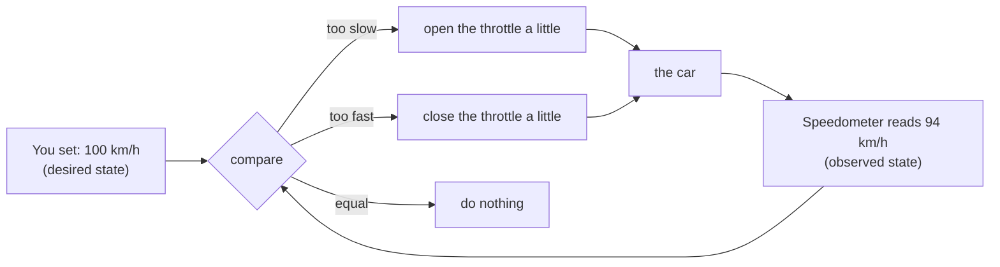
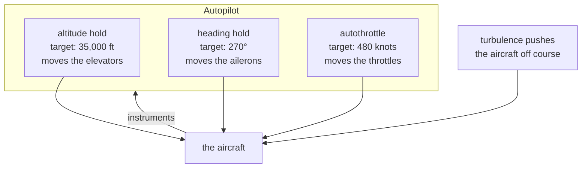
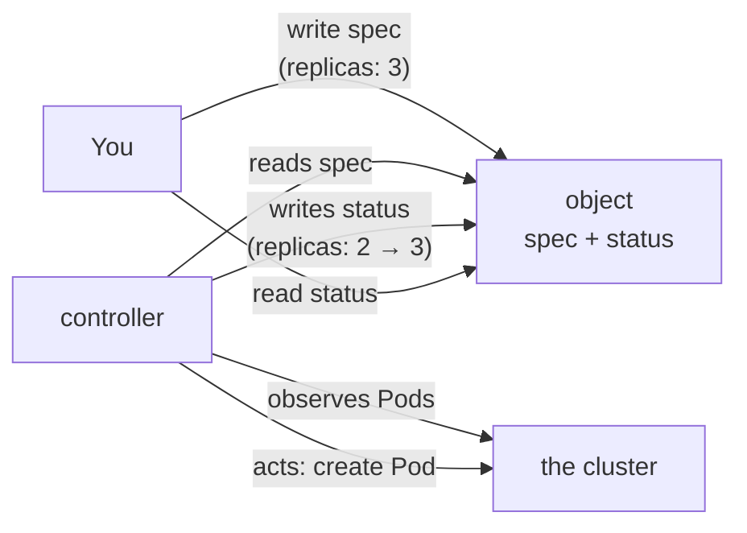
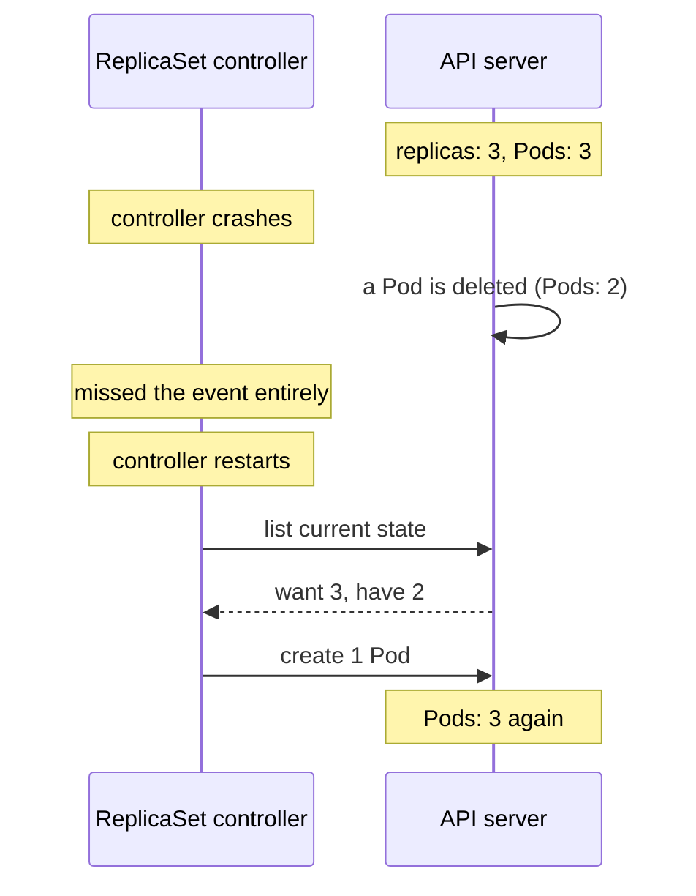
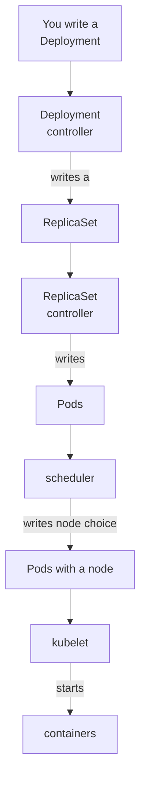

# The controller loop

*Ignition*

**You will be able to:** explain a reconciliation loop in your own words, read an object's `spec` and `status` as desired and observed state, explain why controllers survive missed events, and apply five questions to any Kubernetes object you meet.

A bare Pod that is deleted stays deleted. Nothing in the cluster holds the goal "there should be one of these". This chapter is about the mechanism that holds goals and keeps them true. It is the single most important idea in Kubernetes: almost every feature you meet later is one more instance of it.

## Cruise control: one loop

Think of cruise control in a car. You do not tell the engine "add 10% throttle now". You set a **target speed** and take your foot off.



Cruise control has a few properties that matter:

- **It holds a goal, not a command.** On a hill the car slows; the system notices and adds throttle. You never asked for "more throttle on hills".
- **It never finishes.** Reaching 100 km/h is not the end; it keeps measuring and correcting for as long as it is switched on.
- **It takes small steps.** It nudges the throttle, then measures again, rather than calculating one perfect action.
- **It only needs the current reading.** It does not care *why* the car slowed (hill, wind, trailer). It sees the gap and closes it.

## Autopilot: many loops at once

An aircraft autopilot is the same idea, multiplied. It is really a set of independent loops, each holding one value:



No single loop flies the plane. Each one watches a narrow slice, and together they hold the whole flight plan. Turbulence knocks the aircraft off; each loop independently pulls its own value back.

**Kubernetes is an autopilot for your application.** Each loop is called a **controller**. One holds the number of copies, one holds the list of healthy Pods behind a name, one makes sure finished jobs are cleaned up, one notices dead nodes, and so on. Each runs the same cycle, called **reconciliation**:

1. **Observe:** read the desired state and the actual state.
2. **Compare:** is there a gap?
3. **Act:** make one small change that moves reality towards the goal. Then go back to step 1.

### Where the analogy breaks

An autopilot moves the control surfaces directly. A Kubernetes controller **never touches the world directly**. It acts by writing to the API server: "create a Pod object", "update this status". Other components notice that write and do their part, as you saw in [Architecture and the basic flow](./architecture). A controller "creating a Pod" means writing a Pod record; the scheduler and kubelet do the rest.

## Desired and observed: `spec` and `status`

Every goal-holding object in Kubernetes keeps both halves of the loop in one place:

```yaml
apiVersion: apps/v1
kind: ReplicaSet
metadata:
  name: web
spec:              # desired state: written by you (or by another controller)
  replicas: 3
  # ...
status:            # observed state: written by the controller
  replicas: 2
  readyReplicas: 2
```



- **`spec`** is what you want. You write it.
- **`status`** is what the controller has observed. It writes it; you read it.
- When `spec` and `status` disagree, the loop is still working, or something is stopping it. That gap is the first thing to look at when debugging.

## Level, not edge: why controllers recover

There are two ways to build a loop:

- **Edge-triggered:** react to *events*. "A Pod was deleted, so create one." If you miss the event, the work is lost.
- **Level-triggered:** react to the *current state*. "There are 2 Pods and there should be 3, so create one." Whenever you look, you see the gap.

Kubernetes controllers are level-triggered, like cruise control reading the speedometer.



Because each pass compares current levels, a controller that was down, restarted, or missed a notification simply sees the gap the next time it looks, and closes it. This is why Kubernetes heals itself after its *own* components fail.

### Watching, not polling

Controllers do not ask the API server "anything new?" every second. Each opens a **watch**: one long-lived request that streams every change to the kinds of object it cares about. The controller keeps a local copy of those objects, updated by the stream, and wakes up to reconcile when something changes. It also re-checks everything periodically, as a safety net.

## Controllers build on each other

A controller's *output* is often another controller's *input*. That lets simple loops combine into rich behaviour:



Each box only knows its own slice: the Deployment controller does not know how Pods are scheduled, and the kubelet does not know Deployments exist. You will build this chain up one link at a time: [ReplicaSets](./replicasets) next, then [Deployments](./deployments).

The built-in controllers live together in one program, `kube-controller-manager`. The ones you meet in this course:

| Controller | Holds this goal | By doing |
|---|---|---|
| ReplicaSet | N copies of a Pod exist | Creating or deleting Pods |
| Deployment | The right version is rolled out | Creating and scaling ReplicaSets |
| StatefulSet | Ordered Pods with stable names and disks | Creating Pods and claims one by one (Stage 3) |
| DaemonSet | One Pod on every node | Creating a Pod per node |
| Job / CronJob | Work runs to completion, or on a schedule | Creating Pods until enough succeed |
| EndpointSlice | A Service lists its ready Pods | Updating address lists (Stage 1) |
| Node lifecycle | Dead nodes are noticed | Marking nodes `NotReady`, evicting their Pods |
| Garbage collector | Nothing outlives its owner | Deleting objects whose owner is gone |

Production clusters run two or three copies of `kube-controller-manager` for availability. Only one acts at a time; the copies compete for a **Lease** object, and the holder is the leader. Otherwise two copies might each create the missing Pod.

## What reconciliation does not do

A loop restores what its goal describes, and nothing else.

| A controller will | A controller will not |
|---|---|
| Recreate a missing Pod from its template | Recreate data held only in the lost Pod's memory |
| Keep a count of Pods | Check that your app gives correct answers |
| Replace a Pod on a dead node | Prevent the next node from dying |
| Keep fighting the same gap | Tell you *why* it cannot close it (you read events and status for that) |

## Five questions for every object

Use these on every new Kubernetes object you meet. They turn a list of YAML fields into a loop you can reason about:

1. What application problem does it solve?
2. Which field records the desired state?
3. Which controller observes it?
4. What action can that controller take?
5. What evidence shows the result is useful, and what does the mechanism *not* guarantee?

For a missing Pod of a 3-replica set: the problem is "keep 3 copies serving"; the desired state is `spec.replicas`; the ReplicaSet controller observes the gap; it creates a Pod; and the evidence is a real request succeeding, not just a new Pod name.

## Try it

Stop the controllers and watch nothing heal, then start them and watch the loop catch up. Run on the Ignition kind cluster.

:::caution
This temporarily disables the controller manager. Only do it on a local practice cluster.
:::

```bash
kubectl create deployment loop-demo --image=nginx:1.27-alpine --replicas=2
kubectl rollout status deploy/loop-demo

# Stop the controller manager (it is a static Pod: move its file away)
docker exec apollo11-control-plane mv /etc/kubernetes/manifests/kube-controller-manager.yaml /tmp/
sleep 20

kubectl delete pod -l app=loop-demo --wait=false
sleep 5
kubectl get pods -l app=loop-demo        # nothing replaces them
kubectl get rs -l app=loop-demo          # DESIRED 2, CURRENT stale

# Start it again: the loop sees "want 2, have 0" and acts
docker exec apollo11-control-plane mv /tmp/kube-controller-manager.yaml /etc/kubernetes/manifests/
sleep 30
kubectl get pods -l app=loop-demo        # 2 new Pods
kubectl delete deployment loop-demo
```

- No event was replayed. The controller came back, listed the current state, saw the gap and closed it: level-triggered reconciliation.

## Common misconceptions

- **"Reconciliation happens once, at deploy time."** It runs continuously, for as long as the object exists.
- **"Controllers react to events, so a missed event is lost work."** They compare current state on every pass.
- **"A controller starts containers."** It writes objects. The scheduler and kubelet turn them into running containers.
- **"`status` is something I should set."** It belongs to the controller. You set `spec`.

## Check yourself

<details>
<summary>In cruise control terms, what are Kubernetes' "target speed", "speedometer" and "throttle"?</summary>

The target is the object's `spec` (for example `replicas: 3`). The speedometer is the controller observing the cluster (counting matching Pods). The throttle is the action it takes through the API (creating or deleting Pods).
</details>

<details>
<summary>The controller manager is down for a minute and a Pod is deleted meanwhile. What happens when it comes back?</summary>

It lists the current state, sees fewer Pods than wanted, and creates a replacement. Nothing needs to be replayed, because controllers are level-triggered.
</details>

<details>
<summary><code>spec.replicas</code> is 3 but <code>status.readyReplicas</code> is 2 for ten minutes. What does that tell you?</summary>

The loop cannot close the gap. Something is blocking it: the third Pod cannot be scheduled, cannot pull its image, keeps crashing, or never becomes ready. Read the Pods' status and events.
</details>

## Where this leads

The simplest useful controller keeps a number of identical Pods alive. [ReplicaSets](./replicasets) shows exactly how it counts, what it creates, and how it decides which Pods are "its own".
