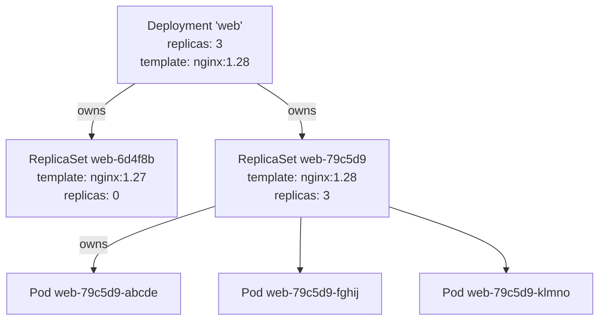
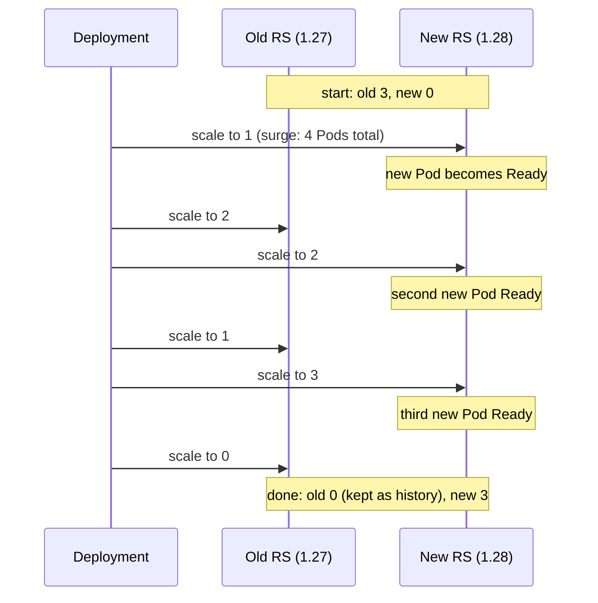
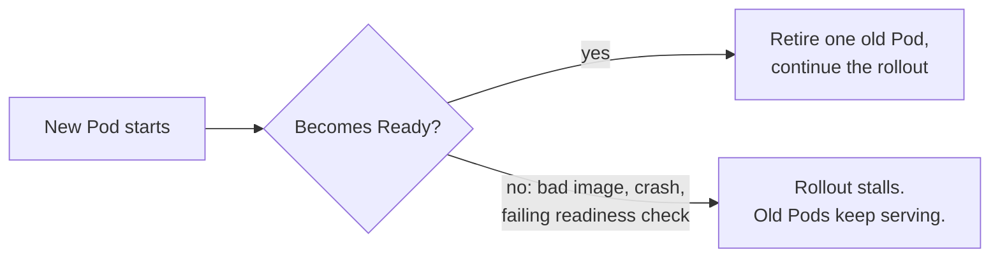
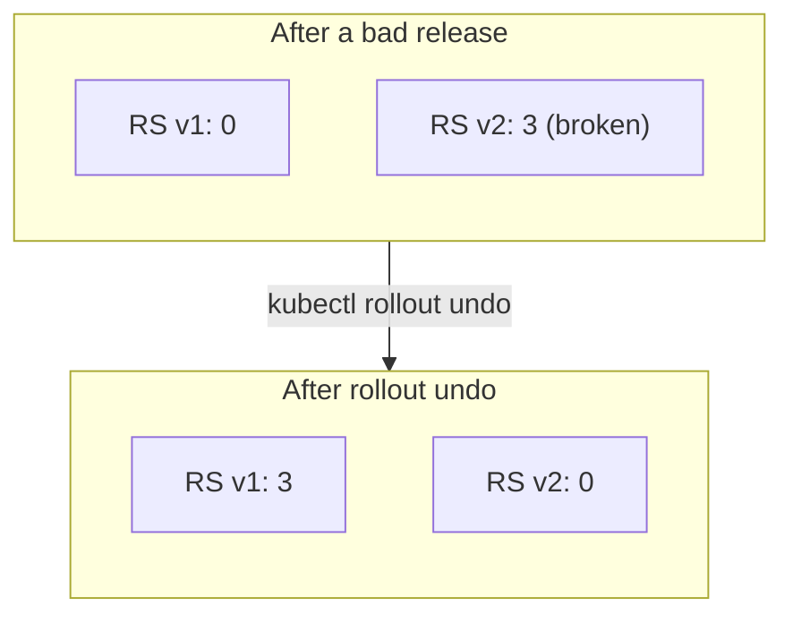

# Deployments: changing versions safely

*Ignition*

**You will be able to:** explain why a Deployment sits on top of ReplicaSets, walk through a rolling update step by step, predict how `maxSurge` and `maxUnavailable` pace it, and say what `kubectl rollout undo` actually changes.

A ReplicaSet keeps a count, but it cannot move Pods from one version to another. A **Deployment** adds that: you change the Pod template, and it replaces Pods gradually, checking each new one is ready before retiring an old one. It is the object you will write for almost every long-running service.

## A Deployment manages ReplicaSets

A Deployment looks almost exactly like a ReplicaSet: replicas, selector, template. The difference is what it does with them. Instead of creating Pods, it creates **one ReplicaSet per version of the template** and decides how many replicas each should have.



- Each ReplicaSet's name ends in a **`pod-template-hash`**, computed from its template. The same hash is added as a label to its Pods, so two versions' Pods never get mixed up in each other's counts.
- Old ReplicaSets are kept at 0 replicas. They are the Deployment's **revision history**, and what makes rollback quick.
- Pod names follow the chain: `<deployment>-<hash>-<random>`.

The full chain, with who does what:

| Object | Created by | Its controller makes sure that… |
|---|---|---|
| Deployment | You | The right ReplicaSet exists and the rollout progresses |
| ReplicaSet | Deployment controller | It has the right number of Pods |
| Pod | ReplicaSet controller | (The kubelet makes sure its containers run) |

Delete the Deployment and the garbage collector removes its ReplicaSets, and with them their Pods.

## A rolling update, step by step

Change anything in the Pod template (image, environment, probes, labels) and the Deployment creates a new ReplicaSet, then shifts replicas across. With `replicas: 3`, `maxSurge: 1` and `maxUnavailable: 0`:



| Step | Old ReplicaSet | New ReplicaSet | Ready Pods serving |
|---|---|---|---|
| Start | 3 | 0 | 3 old |
| Surge one new | 3 | 1 | 3 old (+1 starting) |
| New one Ready, retire one old | 2 | 1 → 2 | 2 old + 1 new |
| Repeat | 1 | 2 → 3 | 1 old + 2 new |
| Finish | 0 | 3 | 3 new |

At no point do fewer than 3 ready Pods serve traffic. Two fields set that pace:

| Field | Default | Meaning |
|---|---|---|
| `maxSurge` | 25%, rounded up | How many Pods may exist **above** `replicas` during the update |
| `maxUnavailable` | 25%, rounded down | How many of `replicas` may be **unavailable** during the update |

Higher values make rollouts faster; `maxUnavailable: 0` keeps full capacity throughout, at the cost of needing room for extra Pods.

## Readiness is the gate

The Deployment only retires an old Pod when a new one is **Ready**. That makes a broken release fail safe:



A stalled rollout is not an outage: users are still served by the old version while you investigate. After `progressDeadlineSeconds` (10 minutes by default) the Deployment marks itself as not progressing, so tools and people can notice. Stage 1's [Rollouts and rollback](../workloads/rollouts-and-rollback) explores stalls and what readiness should check.

## History and rollback

Because each version has its own ReplicaSet, going back is just another rollout, towards an old ReplicaSet:



- `kubectl rollout history deploy/web` lists revisions; `revisionHistoryLimit` (default 10) is how many old ReplicaSets are kept.
- `kubectl rollout undo deploy/web` copies the previous ReplicaSet's template back into the Deployment, and the normal rolling update runs in reverse.

Rollback restores the **Pod template**, nothing more. Anything the bad version wrote to a database or sent to the outside world stays done. Stage 1 covers what that means in practice.

## Two strategies

| `strategy.type` | What it does | Use when |
|---|---|---|
| `RollingUpdate` (default) | Gradual handover, as above. Old and new versions run side by side for a while. | Almost always |
| `Recreate` | Scale old to 0, *then* create new. A gap with no Pods. | Two versions must never run at once (for example, an incompatible data format) |

A rolling update means both versions serve traffic at the same time for a while, so each release must be able to coexist with the previous one.

## When a Deployment is the wrong tool

Deployments are for **stateless, long-running** Pods where any copy is as good as another. Other controllers cover the other shapes:

- **Job / CronJob:** work that should finish (Stage 1).
- **StatefulSet:** Pods that need stable names and their own disks, such as databases (Stage 3).
- **DaemonSet:** exactly one Pod per node, such as log collectors.

## Try it

```bash
kubectl create deployment web --image=nginx:1.27-alpine --replicas=3
kubectl rollout status deploy/web
kubectl get rs -l app=web                       # one ReplicaSet

# Roll out a new version and watch two ReplicaSets trade replicas
kubectl set image deploy/web nginx=nginx:1.28-alpine
kubectl get rs -l app=web -w                    # Ctrl-C when the new one shows 3/3/3

kubectl rollout history deploy/web              # two revisions

# A broken release: the image does not exist
kubectl set image deploy/web nginx=nginx:does-not-exist
sleep 20
kubectl get rs,pods -l app=web                  # new Pod stuck; old Pods still Running

kubectl rollout undo deploy/web
kubectl rollout status deploy/web
kubectl delete deploy web
```

- During the broken release, the old ReplicaSet still has its ready Pods: the gate held.

## Common misconceptions

- **"A Deployment runs my Pods directly."** It manages ReplicaSets; they manage Pods. A Pod's owner is a ReplicaSet.
- **"Rollback undoes the release."** It restores the template, not data or side effects.
- **"A stalled rollout means an outage."** Old Pods keep serving until new ones are Ready.
- **"Changing `replicas` creates a new revision."** Only template changes do. Scaling just resizes the current ReplicaSet.

## Check yourself

<details>
<summary>Which object directly owns a Pod created by a Deployment?</summary>

A ReplicaSet. The Deployment owns the ReplicaSet.
</details>

<details>
<summary>With <code>replicas: 4</code> and the defaults, what are <code>maxSurge</code> and <code>maxUnavailable</code> in Pods?</summary>

25% of 4 is 1 for both: up to 5 Pods may exist, and at least 3 must be available, during the update.
</details>

<details>
<summary>A new version's Pods never become Ready. What do users see?</summary>

Usually nothing: the old Pods are never retired, so they keep serving. The rollout stalls and eventually reports that it is not progressing.
</details>

<details>
<summary>You scale a Deployment from 3 to 5. Does a new ReplicaSet appear?</summary>

No. The template did not change, so the current ReplicaSet is simply scaled to 5.
</details>

## Where this leads

You have now met the core of Kubernetes: the architecture, Pods, the controller loop, and the Deployment → ReplicaSet → Pod chain. One layer has been glossed over: what exactly happens when the API server "checks and stores" a request. [Objects and the API server](./objects-and-api) opens that up.
