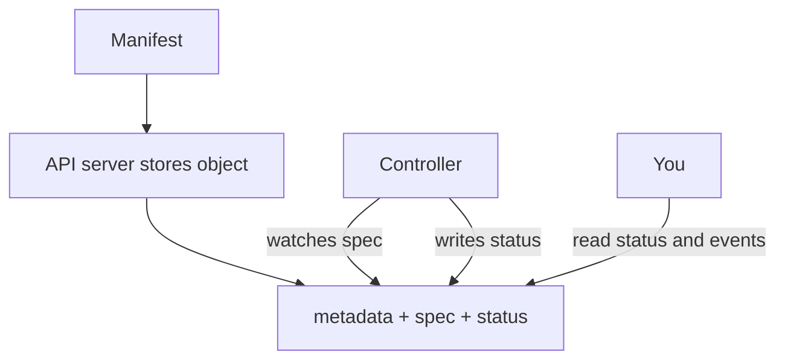

# Objects, the API, and desired state

*Ignition*

**You will be able to:** read a manifest as identity plus desired state plus reported status, and say exactly what "the API accepted it" proves.

## The problem

A YAML manifest looks like a configuration file you run once, like a shell script. If you read it that way you will misjudge almost everything that follows: why a change "applied" but nothing happened, why a field seems to revert, why one Pod is replaced but another is not.

## The idea in plain words

A manifest is not a script. It is a **form you file** with the cluster's record office. The office (the **API server**) checks the form and stores it as an **object**. Later, staff (controllers, the scheduler, node agents) read stored forms and do their own part of the work. Filing the form does not do the work.

Every object has three parts you should learn to see at once:

- **Identity:** what it is and what it is called.
- **Spec:** what is *wanted*. You (or another controller) write this.
- **Status:** what has been *observed*. Controllers and node agents write this, and you read it.

A Deployment's spec says "2 replicas of this Pod template". Its status says how many exist and are available. When they differ, work is still in progress.

## How it works



The identity fields:

| Field | Purpose |
|---|---|
| `kind`, `name`, `namespace` | What it is and where it lives. The name is unique within its namespace and kind |
| `uid` | A unique ID assigned by the server. It distinguishes a *new* Pod from an old one with the same name |
| `labels` | Short tags used for **selecting** groups (Services, ReplicaSets) |
| `annotations` | Extra information not used for selection |
| `ownerReferences` | Lifecycle link: who created this and cleans it up |

Only the API server writes to the cluster database (`etcd`). Everything else, including `kubectl`, talks to the API.

## Read any object in three passes

1. **Identity:** what is it called and where does it live?
2. **Spec:** what result does it request?
3. **Status and events:** which actor should report progress, and what do they say?

This works for Services, Jobs, claims, routes and autoscalers alike. The kinds change; the stored-request model does not.

## What each kind of evidence proves

| Evidence | It proves |
|---|---|
| The manifest | Someone's intent |
| `apply` succeeded | The API accepted the object |
| `status` / conditions | A controller observed or progressed it |
| A real request works | The application is useful |

No field in a manifest causes traffic or starts a process by its own power.

## Try it

```bash
kubectl get pod apollo-shell -o yaml | grep -E '^(  uid|  name|  namespace|spec:|status:)'
kubectl explain pod.spec.restartPolicy
```

- You will see `spec:` and `status:` on the same object. `kubectl explain` documents any field.

## Common misconceptions

- **"Labels and ownership are the same."** Labels select groups; `ownerReferences` records responsibility. A ReplicaSet counts Pods by label, and a relabelled Pod stops being counted (Stage 1).
- **"If the API accepted it, it will work."** It can still reference things that do not exist.
- **"`status` is something I should set."** It belongs to controllers.

## Check yourself

<details>
<summary>The API server accepts a Deployment. What has <em>not</em> yet been shown?</summary>

That Pods were created, scheduled, started, ready, or useful to a passenger.
</details>

## Where this leads

Objects are stored requests. Next: which components read them and in what order they act.
