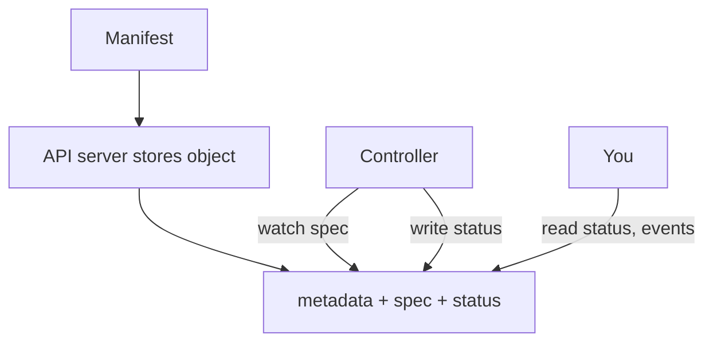

# Objects, the API, and desired state

*Ignition*

**You will be able to:** read a manifest as identity + desired state + reported status, and say what API acceptance proves.

## Key points

- A manifest is a request to **store an object**, not a script that runs once.
- Every object has: `kind`, `name`, usually `namespace`, and a server-assigned `uid`.
- **`spec`** = what is wanted (written by you or a controller). **`status`** = what actors observed (written by controllers/kubelet).
- Only the API server writes to `etcd`; everything else reads/writes through the API.

| Metadata | Purpose |
|---|---|
| `labels` | Short tags for **selection** (Services, ReplicaSets) |
| `annotations` | Extra info, not for selection |
| `ownerReferences` | Lifecycle: who created/garbage-collects this object |
| `uid` | Distinguishes a new Pod from an old one with the same name |



## Read any object in three passes

1. **Identity:** what is it called, where does it live?
2. **Spec:** what result does it request?
3. **Status/events:** which actor should report progress, and what do they say?

## Evidence ladder for "did it work?"

| Evidence | Proves |
|---|---|
| Manifest | Intent |
| `apply` succeeded | API accepted it |
| `status` / conditions | A controller progressed it |
| Real request | Useful behaviour |

- No field starts a process by itself.

## Try it

```bash
kubectl get pod apollo-shell -o yaml | grep -E '^(  uid|  name|  namespace|spec:|status:)'
kubectl explain pod.spec.restartPolicy
```

## Gotchas

- Labels ≠ ownership. A relabelled Pod is released by its ReplicaSet (Stage 1).
- A manifest accepted by the API can still reference things that do not exist.

## Check yourself

<details>
<summary>The API server accepts a Deployment. What has <em>not</em> yet been shown?</summary>

That Pods were created, scheduled, started, ready, or useful to a passenger.
</details>
