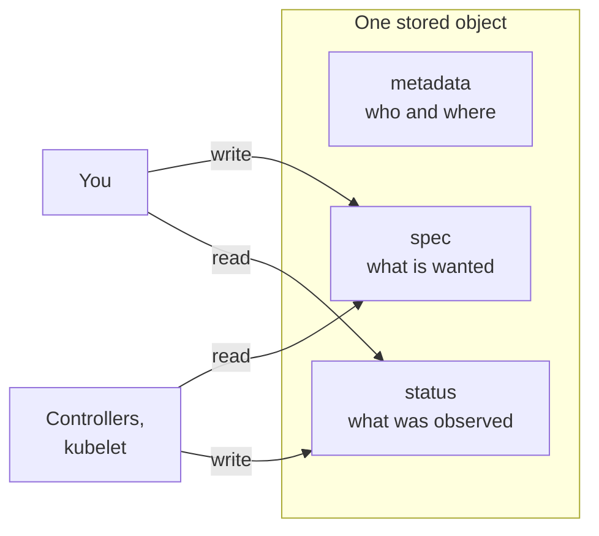
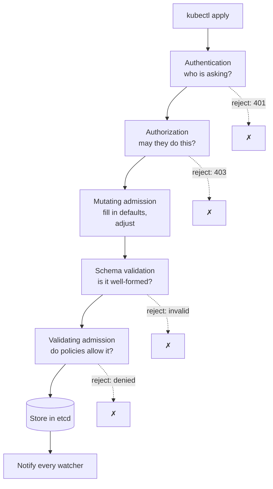
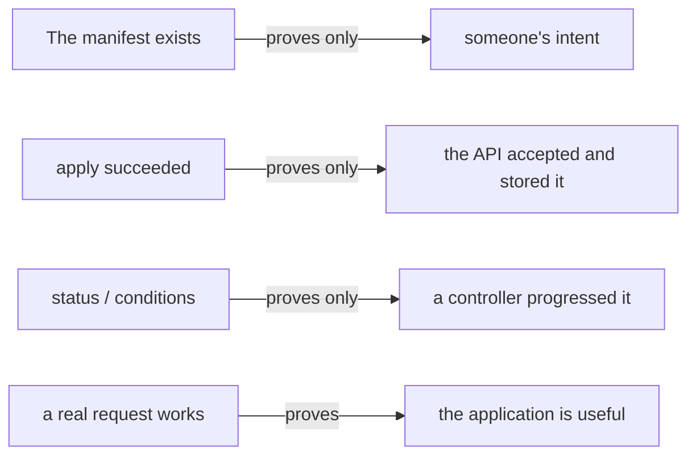

# Objects and the API server

*Ignition*

**You will be able to:** read any manifest as identity plus desired state plus reported status, list the checks a request passes before it is stored, use a server-side dry run to see what the cluster adds, and say exactly what "the API accepted it" proves.

Every chapter so far has said "the API server checks the request and stores it". That one sentence hides a pipeline that decides who may do what, fills in defaults you never wrote, and enforces policy. Knowing it explains why a manifest can be rejected, why fields appear that you did not write, and why an accepted object can still do nothing useful.

## A manifest is a record, not a script

A YAML manifest looks like a script you run once. It is not. It is a **form you file** with the cluster's record office. The API server checks the form and stores it as an **object**. Later, controllers, the scheduler and kubelets read stored objects and do their part. Filing the form does not do the work.

That is why a change can "apply" and nothing visible happens yet, and why deleting a Pod a Deployment owns does not stick: the record that matters is the Deployment's, and its controller keeps reality matching it.

## Every object has the same shape

```yaml
apiVersion: apps/v1             # which API group and version defines this kind
kind: Deployment                # what sort of object
metadata:                       # identity
  name: web
  namespace: shop
  labels: {app: web}
  uid: 4b1c…                    # assigned by the server
spec:                           # desired state: you write this
  replicas: 3
  # ...
status:                         # observed state: controllers write this
  readyReplicas: 3
  conditions: [...]
```



The identity fields you will use most:

| Field | Purpose |
|---|---|
| `kind`, `name`, `namespace` | What it is and where it lives. A name is unique per kind within a namespace. |
| `uid` | A unique ID assigned by the server. It tells a *new* Pod from an old one with the same name. |
| `labels` | Short tags used for **selecting** groups (ReplicaSets, Services). |
| `annotations` | Extra information for tools and people, not used for selection. |
| `ownerReferences` | Who created this object and cleans it up. |

A few kinds, such as ConfigMaps and Secrets, hold plain `data` instead of a `spec` and `status`. Everything that drives behaviour follows the same model: what you ask for, and what the system reports.

## What happens to a request

Every `kubectl apply`, and every write by a controller, is an HTTP request to the API server. It passes the same gates, in order, before anything is stored:



1. **Authentication:** who is this? A certificate from your kubeconfig, or a ServiceAccount token for a Pod.
2. **Authorization:** may this identity perform this verb on this resource in this namespace? Usually decided by **RBAC** rules (Stage 8).
3. **Mutating admission:** plugins and webhooks that may change the object. This is where **defaults** appear: `schedulerName`, `dnsPolicy`, `serviceAccountName: default`, tolerations for not-ready nodes, and so on.
4. **Schema validation:** is the object well-formed for its kind? (Wrong types, missing required fields, a selector that does not match its template.)
5. **Validating admission:** policies that can only accept or reject, such as Pod Security standards or a policy engine like Kyverno (Stage 8).
6. **Store and notify:** the object is written to etcd, and every component watching that kind is told.

Only step 6 makes anything happen, and even then indirectly: the scheduler, controllers and kubelets react to the stored object.

### Seeing the defaults: dry runs

```bash
kubectl apply --dry-run=client -f pod.yaml               # checks the YAML locally only
kubectl apply --dry-run=server -f pod.yaml -o yaml       # runs steps 1–5, shows the result, stores nothing
```

A server-side dry run is the easiest way to see what the cluster will actually store, including every default it adds.

## Read any object in three passes

1. **Identity:** what is it called, and where does it live?
2. **Spec:** what result does it ask for?
3. **Status and events:** which controller should report progress, and what does it say?

This works for Services, Jobs, claims, routes and autoscalers alike. The kinds change; the stored-request model does not.

## What each kind of evidence proves



| Evidence | It proves |
|---|---|
| The manifest | Someone's intent |
| `apply` succeeded | The API accepted the object |
| `status` and conditions | A controller observed or progressed it |
| A real request works | The application is useful |

No field in a manifest serves traffic or starts a process by its own power. Climb this ladder until the question you care about is answered.

## Try it

```bash
kubectl apply --dry-run=server -f stages/ignition/pod.yaml -o yaml \
  | grep -E 'dnsPolicy|schedulerName|serviceAccountName|tolerations'
kubectl explain pod.spec.restartPolicy
kubectl auth can-i create deployments            # authorization, asked directly
kubectl get pod apollo-shell -o yaml | grep -E '^(  uid|  name|spec:|status:)'
```

- The dry run shows fields you never wrote: mutating admission at work.
- `kubectl explain` documents any field; `kubectl auth can-i` asks the authorization step a question.

## Common misconceptions

- **"If the API accepted it, it will work."** It can still reference an image, Secret or node label that does not exist.
- **"`status` is something I should set."** It belongs to controllers.
- **"Labels and ownership are the same."** Labels select groups; `ownerReferences` records responsibility.
- **"Admission is only for security tools."** Every request passes through it, and it is where defaults are filled in.

## Check yourself

<details>
<summary>The API server accepts a Deployment. What has <em>not</em> yet been shown?</summary>

That Pods were created, scheduled, started, ready, or useful to anyone.
</details>

<details>
<summary>A request is rejected with "forbidden". Which gate stopped it?</summary>

Authorization: the identity is known but lacks permission for that verb on that resource.
</details>

<details>
<summary>Your Pod has <code>dnsPolicy: ClusterFirst</code> but you never wrote it. Where did it come from?</summary>

Defaulting during mutating admission, before the object was stored.
</details>

## Where this leads

That completes Ignition's ideas. The [Ignition walkthrough](../../ignition) builds a real cluster and shows each of them: the components, a Pod's journey, a container restart, a stuck Pod, and a bare Pod that stays deleted. Stage 1 then puts the airline on the cluster with Deployments, and adds the stable names, configuration and rollouts that real services need.
