# Pod lifecycle: restart versus replacement

*Ignition*

**You will be able to:** tell whether a container was restarted or a Pod was replaced, and what each kept.

## Key points

- A **Pod** is a shared runtime home: one or more containers sharing a network namespace (same IP, `localhost`) and optionally volumes.
- Two different events both make a process "come back":

```mermaid
stateDiagram-v2
  [*] --> Running
  Running --> Restarted: container exits; kubelet restarts
  Restarted --> Running: same Pod UID
  Running --> Deleted: Pod removed
  Deleted --> Replacement: controller creates a new Pod
  Replacement --> Running: new UID, usually new IP
```

| | Container restart | Pod replacement |
|---|---|---|
| Who acts | **kubelet** (per `restartPolicy`) | A **controller** (e.g. ReplicaSet) |
| Pod UID | Same | **New** |
| Pod IP | Same | Usually new |
| Process memory | Lost | Lost |
| Pod volumes (`emptyDir`) | Kept | Lost (`emptyDir`) / may reattach (PVC) |
| `restartCount` | Increases | Starts at 0 |
| Needs a controller? | No | **Yes**: a bare Pod is not replaced |



## How to tell which happened

| Compare | Restart | Replacement |
|---|---|---|
| `metadata.uid` | unchanged | changed |
| `creationTimestamp` | unchanged | new |
| `restartCount` | up | 0 |
| `ownerReferences` | n/a | shows who made it |
| Events | `Killing`/`BackOff`/`Started` | `Scheduled` on a new Pod |

- Prefer **conditions** (`PodScheduled`, `Initialized`, `ContainersReady`, `Ready`) and container `reason`/exit code over the coarse `phase`.

## Apollo example

- Ignition `apollo-shell` is a bare Pod: if deleted, nobody recreates it.
- Stage 1 `booking-xxxxx` Pods: delete one, the ReplicaSet creates another with a new name, UID and IP.
- Stage 3 `identity-db-0`: replaced, but remounts PVC `pg-data-identity-db-0`.

## Try it

```bash
kubectl get pod apollo-shell -o custom-columns=UID:.metadata.uid,RESTARTS:.status.containerStatuses[0].restartCount,IP:.status.podIP
```

- Record these, cause an event, record again. Unchanged UID with rising `RESTARTS` = restart.

## Gotchas

- "It came back" is not a conclusion. Ask which path, what state it kept, and whether a passenger can still book.
- Neither path preserves memory. A container's writable layer is the most fragile storage.

## Check yourself

<details>
<summary>UID is unchanged and <code>restartCount</code> went from 0 to 2. What happened?</summary>

The kubelet restarted the container twice inside the same Pod. No replacement occurred.
</details>

<details>
<summary>A bare Pod is deleted. Why does nothing replace it?</summary>

No controller owns it, so nothing compares desired versus actual count for it. A ReplicaSet (via a Deployment) does.
</details>
