# Pod lifecycle: restart versus replacement

*Ignition*

**You will be able to:** tell whether a container was restarted or a Pod was replaced, and say what each one kept.

## The problem

An engineer says "booking restarted". That sentence hides two very different events. In one, a container inside the Pod exited and was started again. In the other, the whole Pod was lost and a different Pod was created. They look alike on a dashboard, but they keep different things, and mixing them up leads to false conclusions about addresses, identity and data.

## The idea in plain words

Think of a Pod as a **house** and the containers as **people living in it**. If someone leaves and comes back, the house is the same: same address, same furniture. If the house is demolished and another built from the same plan, the address changes and the furniture is gone, even though the plan (the template) is identical.

In technical terms, a **Pod** is a shared runtime home for one or more containers. Containers in a Pod share one network identity (the same IP and the same `localhost`) and can share mounted volumes. Two containers in the same Pod can talk over `localhost`; containers in different Pods cannot, even on the same node.

## How it works

**Container restart (same house).** If a container exits, the **kubelet** restarts it according to the Pod's `restartPolicy`. The Pod's UID, IP and attached volumes all stay. Only the process is new, so its memory is gone. The `restartCount` goes up.

**Pod replacement (new house).** If the Pod is deleted or lost, a **controller** such as a ReplicaSet creates another from the template. It has a **new UID** and usually a **new IP**, and it starts at `restartCount` 0. If nothing owns the Pod, nothing replaces it.

```mermaid
stateDiagram-v2
  [*] --> Running
  Running --> Restarted: container exits; kubelet restarts
  Restarted --> Running: same Pod UID
  Running --> Deleted: Pod removed
  Deleted --> Replacement: controller creates a new Pod
  Replacement --> Running: new UID, usually new IP
```



| | Container restart | Pod replacement |
|---|---|---|
| Who acts | **kubelet** | A **controller** (e.g. ReplicaSet) |
| Pod UID | Same | **New** |
| Pod IP | Same | Usually new |
| Process memory | Lost | Lost |
| `emptyDir` volume | Kept | Lost |
| PVC (Stage 3) | Kept | Remounted by the new Pod |
| `restartCount` | Rises | Starts at 0 |
| Needs a controller? | No | **Yes** |

## How to tell which happened

Compare the evidence before and after:

| Compare | Restart | Replacement |
|---|---|---|
| `metadata.uid` | unchanged | changed |
| `creationTimestamp` | unchanged | new |
| `restartCount` | up | 0 |
| `ownerReferences` | n/a | shows the creator |
| Events | `Killing` / `BackOff` / `Started` | `Scheduled` on a new Pod |

Prefer **conditions** (`PodScheduled`, `Initialized`, `ContainersReady`, `Ready`) and container exit reasons over the coarse `phase`; they tell a fuller story.

## Apollo example

- Ignition's `apollo-shell` is a **bare Pod**. If you delete it, nobody recreates it.
- Stage 1's booking Pods are owned by a ReplicaSet. Delete one and another appears with a new name, UID and IP.
- Stage 3's `identity-db-0` is replaced but remounts the same claim, which is why its data survives.

## Try it

```bash
kubectl get pod apollo-shell -o custom-columns=UID:.metadata.uid,RESTARTS:.status.containerStatuses[0].restartCount,IP:.status.podIP
```

- Record these, cause an event, record again. An unchanged UID with rising `RESTARTS` means a restart.

## Common misconceptions

- **"It came back, so it recovered."** Ask which path happened, what state it kept, and whether a passenger can still book.
- **"A restart keeps the process's memory."** Neither path does.
- **"Writable-layer files are safe."** They survive a container restart but not a Pod replacement.

## Check yourself

<details>
<summary>UID is unchanged and <code>restartCount</code> went from 0 to 2. What happened?</summary>

The kubelet restarted the container twice inside the same Pod. No replacement occurred.
</details>

<details>
<summary>A bare Pod is deleted. Why does nothing replace it?</summary>

No controller owns it, so nothing compares desired with actual count. A ReplicaSet (via a Deployment) does.
</details>

## Where this leads

Stage 1 adds the controllers that make replacement automatic. Start with the chain that keeps a number of Pods alive: Deployment, ReplicaSet and Pod.
