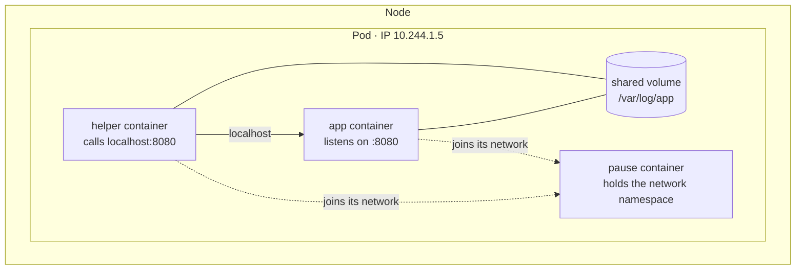
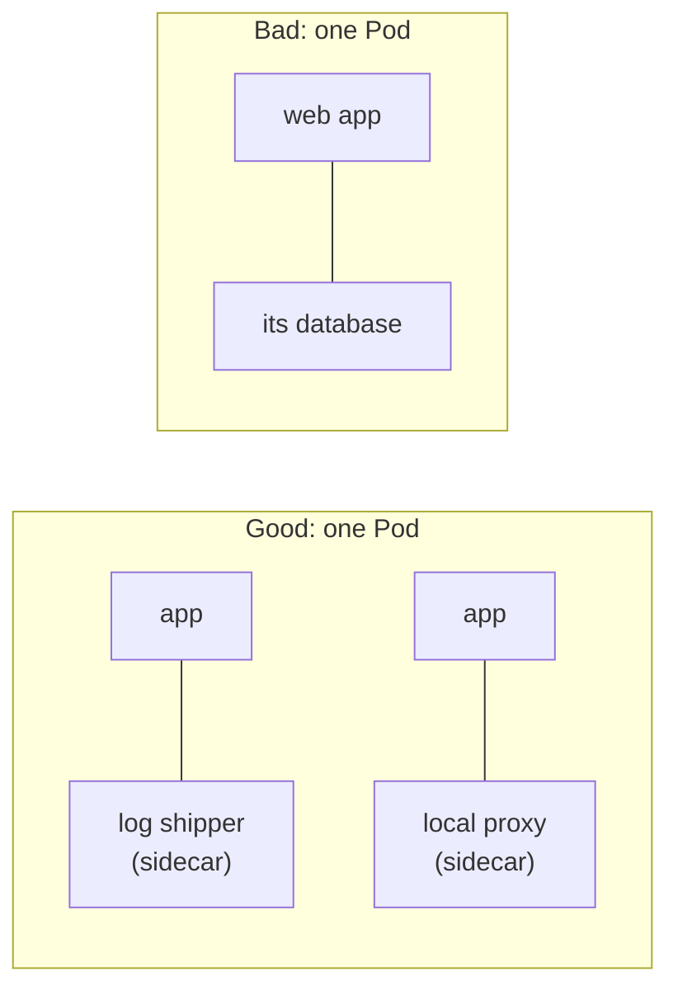
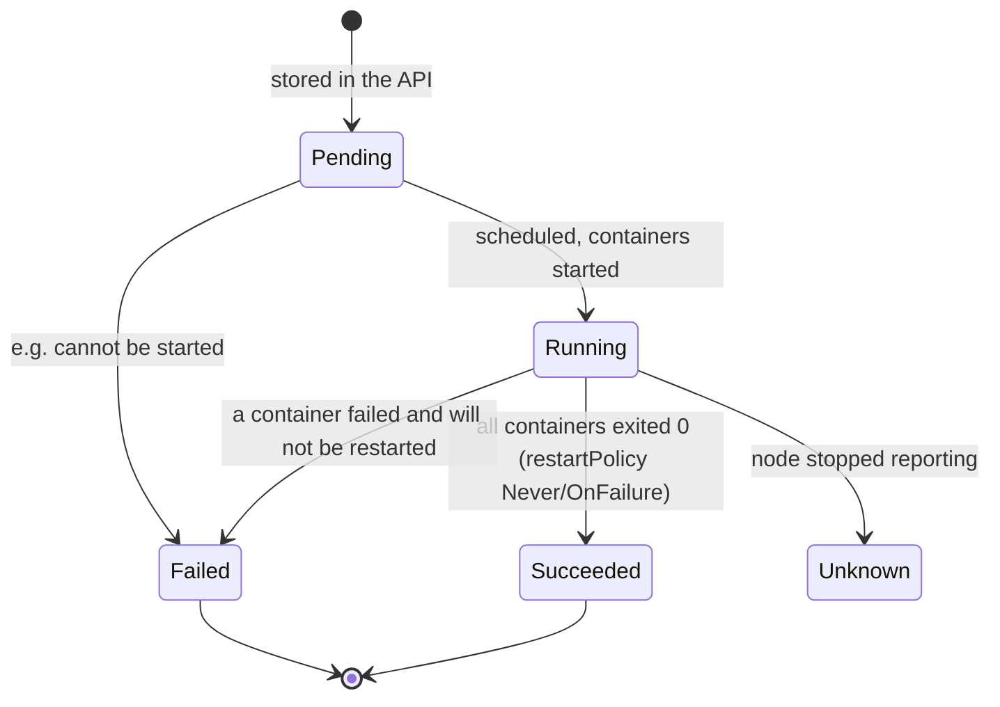
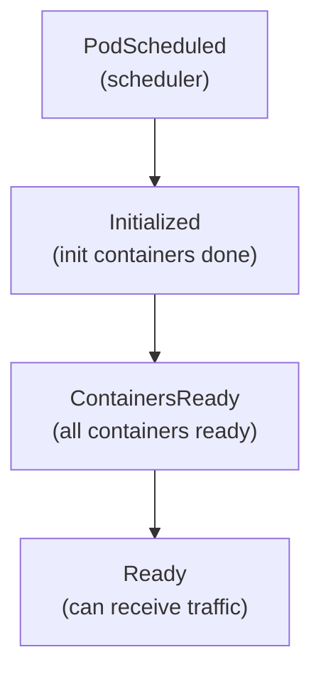
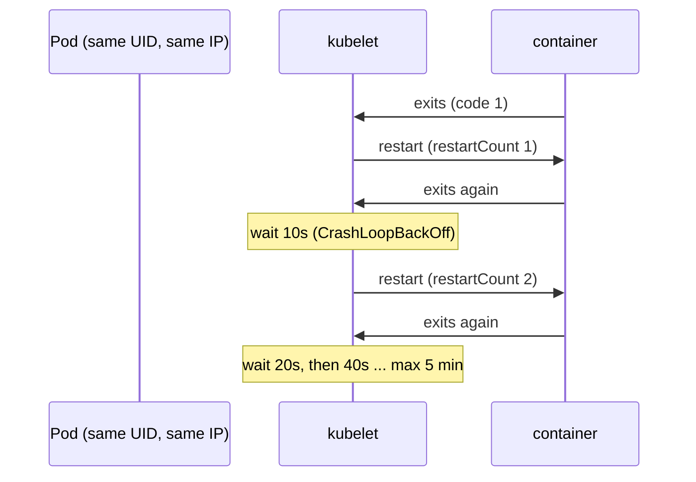
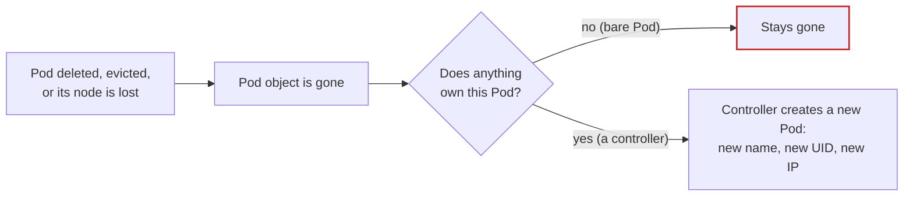

# Pods: more than a container

*Ignition*

**You will be able to:** explain what a Pod adds on top of a container, decide when two containers belong in one Pod, read a Pod's phase and conditions, and say exactly what survives when the kubelet restarts a crashed container.

Kubernetes never runs a bare container. The smallest thing it schedules, starts and reports on is a **Pod**. Every higher-level object you meet later (ReplicaSets, Deployments, Jobs, StatefulSets) exists to create Pods. Getting the Pod right makes the rest of Kubernetes much easier to read.

## Container versus Pod

From Launchpad you know a **container** is one isolated process, with its own network namespace, filesystem and resource limits.

A **Pod** is a small group of one or more containers that Kubernetes treats as one unit. The containers in a Pod:

- **share one network identity:** one IP address, one set of ports, one `localhost`;
- **can share volumes:** a folder mounted into several of them;
- **are placed together:** always on the same node, started and stopped as a group.



How does the sharing work? When the kubelet starts a Pod, the runtime first creates a tiny **pause** container whose only job is to own the Pod's network namespace. Every app container in the Pod then *joins* that namespace instead of getting its own. That is why they share an IP and `localhost`, and why the Pod's IP survives when an app container restarts.

| | Container | Pod |
|---|---|---|
| What it is | One isolated process (plus its children) | One or more containers managed as a unit |
| Network identity | Its own (in Docker) | **One per Pod**, shared by its containers |
| Who creates it | The container runtime | The kubelet, from a Pod object in the API |
| Scheduled by Kubernetes? | No, never on its own | Yes: the unit the scheduler places |
| Has an IP address in the cluster | Through its Pod | Yes |
| Typical lifetime | Restarted in place if it crashes | Replaced as a whole, with a new IP, if lost |

Comparing with Compose: a Compose service with one container is closest to a Pod with one container. Most Pods you write have exactly one.

## One container or several?

Put containers in the same Pod only if they **must** live and die together on the same machine and share its network or files. The common patterns:



- **Sidecar:** a helper that extends the main container, such as a log shipper reading a shared folder or a proxy handling TLS on `localhost`.
- **Init container:** a container that runs to completion *before* the app containers start, such as one that waits for a database or prepares files. (More in Stage 1.)

The database example is wrong because the web app and its database scale differently (you want many web copies, one database), fail differently, and should be updated separately. Two Pods, connected over the network, is the right shape.

## A Pod manifest

```yaml
apiVersion: v1
kind: Pod
metadata:
  name: hello
  labels: {app: hello}            # tags used to select Pods later
spec:
  restartPolicy: Always           # kubelet restarts containers that exit
  containers:
    - name: web
      image: nginx:1.27-alpine    # what to run
      ports:
        - containerPort: 80       # documentation, like EXPOSE
      resources:
        requests: {cpu: 50m, memory: 32Mi}   # what the scheduler reserves (Stage 4)
```

Two parts to notice, which every Kubernetes object shares:

- **`metadata`**: what the object is called and how it is tagged.
- **`spec`**: what you want. When the Pod runs, the cluster adds a **`status`** section reporting what is actually happening.

## A Pod's life

A Pod has a coarse **phase**:



| Phase | Meaning |
|---|---|
| `Pending` | Accepted, but not all containers are running: waiting for a node, an image pull, or a volume |
| `Running` | Placed on a node; at least one container is running or restarting |
| `Succeeded` | All containers finished successfully and will not restart (typical for jobs) |
| `Failed` | All containers have stopped, and at least one failed |
| `Unknown` | The node is not reporting, so nobody knows |

The phase is a summary and hides a lot. For a real answer, read the **conditions**, each a yes/no fact with a reason:



…and the **state of each container**: `Waiting` (with a reason such as `ContainerCreating`, `ImagePullBackOff` or `CrashLoopBackOff`), `Running`, or `Terminated` (with an exit code and reason such as `OOMKilled`). `kubectl get pods` shows the most useful of these in the `STATUS` column, which is why you see `CrashLoopBackOff` there even though the phase is `Running`.

## When a container crashes: restart in place

The kubelet watches every container of every Pod on its node. If one exits, the Pod's `restartPolicy` decides what happens:

| `restartPolicy` | After a container exits | Used for |
|---|---|---|
| `Always` (default) | Restart it, whatever the exit code | Servers that should run forever |
| `OnFailure` | Restart only if it exited with an error | Batch work that should retry |
| `Never` | Leave it stopped | One-shot tasks |

Restarts use **exponential back-off**: 10 s, 20 s, 40 s … up to 5 minutes between tries, so a container that keeps crashing does not hammer the node. While it waits, the status reads `CrashLoopBackOff`.



A restart replaces the **process**, not the **Pod**:

| | Survives a container restart? |
|---|---|
| Pod name, UID, IP address | ✓ Same Pod |
| Volumes such as `emptyDir` | ✓ Belong to the Pod |
| The container's writable layer | ✗ A fresh container starts from the image |
| Process memory | ✗ |
| `restartCount` | Goes up by one |
| The previous container's logs | Kept once: `kubectl logs <pod> --previous` |

## Pods are mortal

A container restart is the kubelet's job, and it only works while the Pod exists on a healthy node. If the Pod itself is **deleted**, **evicted**, or its **node dies**, the Pod is gone for good. The kubelet will not recreate it, and a Pod you created directly (a **bare Pod**) has nothing else watching over it.



Bringing a Pod back requires something that remembers "there should be one of these" and keeps checking. That something is a **controller**, the subject of the next chapter.

## Try it

A two-container Pod whose containers share `localhost`, then a restart:

```bash
kubectl apply -f - <<'YAML'
apiVersion: v1
kind: Pod
metadata: {name: pair}
spec:
  containers:
    - name: web
      image: nginx:1.27-alpine
    - name: helper
      image: busybox:1.36.1
      command: ["sh", "-c", "while true; do wget -qO- http://localhost:80 >/dev/null && echo ok; sleep 5; done"]
YAML
kubectl wait --for=condition=Ready pod/pair --timeout=60s
kubectl logs pair -c helper --tail=2              # ok: helper reached web over localhost
kubectl get pod pair -o jsonpath='{.metadata.uid} {.status.podIP}{"\n"}'

kubectl exec pair -c web -- nginx -s stop         # make the web container exit
sleep 5
kubectl get pod pair -o jsonpath='{.metadata.uid} {.status.podIP} restarts={.status.containerStatuses[?(@.name=="web")].restartCount}{"\n"}'

kubectl delete pod pair
kubectl get pod pair                              # NotFound: nothing brings a bare Pod back
```

- Same UID and IP after the crash, with the restart count up: a restart, not a replacement.
- After the delete, it stays gone.

## Common misconceptions

- **"A Pod is just Kubernetes' word for a container."** A Pod can hold several containers that share one IP and volumes; the Pod, not the container, is what gets scheduled and gets an address.
- **"Put my app and its database in one Pod so they are close."** They would scale, fail and update together. Use separate Pods.
- **"`Running` means it works."** It means the Pod is on a node and a container is running or restarting. Check `Ready`, and then a real request.
- **"The kubelet will recreate my Pod if it is deleted."** The kubelet restarts *containers* in Pods that exist. Recreating a Pod needs a controller.

## Check yourself

<details>
<summary>Two containers in the same Pod. How does one call the other?</summary>

Over `localhost`, on the other container's port. They share the Pod's network namespace, so they also cannot both listen on the same port.
</details>

<details>
<summary>UID is unchanged and <code>restartCount</code> went from 0 to 2. What happened?</summary>

The kubelet restarted a container twice inside the same Pod. No replacement occurred.
</details>

<details>
<summary>The STATUS column says <code>CrashLoopBackOff</code>. Which component is acting, and where do you look first?</summary>

The kubelet, which keeps restarting the container with growing delays. Look at the previous container's logs with `kubectl logs <pod> --previous`, and its last exit code in `kubectl describe pod`.
</details>

<details>
<summary>A bare Pod's node is shut down. What happens to the Pod?</summary>

It is eventually marked as lost and removed, and nothing recreates it, because nothing owns it.
</details>

## Where this leads

Something needs to hold the goal "there should be a Pod like this" and keep making it true. [The controller loop](./controller-loop) explains how Kubernetes does that, and why it works even when its own components crash.
