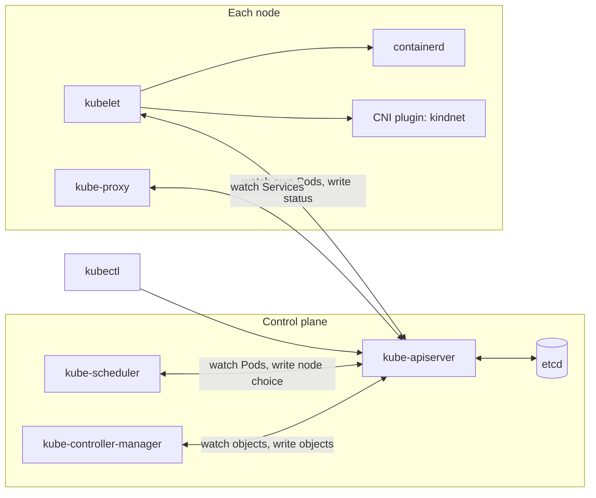
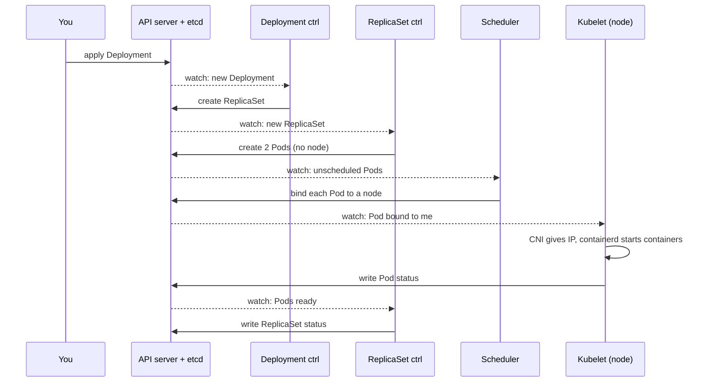

# Reconciliation and Kubernetes components

*Ignition*

**You will be able to:**

- explain a reconciliation loop (observe, compare, act) and why Kubernetes is built from many of them;
- for each component, say where it runs, what it watches, what it writes, and what stops working when it is down;
- given a symptom such as "Pod stuck in `Pending`", name the component to question first and the evidence it leaves.

## The problem

[Objects and the API](./objects-and-api) showed that `kubectl apply` only *stores* an object. Something else must turn that stored object into a running process, and keep it running after a container crashes, a node dies or someone deletes a Pod by mistake.

Launchpad's Docker Compose did that work as one program, once, when you typed `up`. Kubernetes splits it among half a dozen programs that never stop running. When a Pod is not running, "Kubernetes is broken" is not a diagnosis. Each program has one narrow job and leaves its own evidence. If you know which program owns the step that failed, you know where to look. If you don't, you end up deleting things at random.

## The idea in plain words

Think of a thermostat. You set a **desired** temperature. A sensor reads the **actual** temperature. If the two differ, the thermostat switches the heater on or off. It never "runs the heating plan" once and stops; it checks again and again, forever.

Kubernetes is built from many thermostats. Each one is called a **controller**, and the endless check-and-correct cycle it runs is a **reconciliation loop**:

1. **Observe:** read the desired state (an object's `spec`) and the actual state (other objects, or the real world).
2. **Compare:** is there a difference?
3. **Act:** make *one* small change that moves actual towards desired, write it down, and go back to step 1.

Two terms you need from here on:

- **Control plane:** the components that store state and make decisions (API server, etcd, scheduler, controller manager). In Apollo's kind cluster they all run on `apollo11-control-plane`.
- **Node components:** the agents on *every* node that turn decisions into real processes and network rules (kubelet, container runtime, kube-proxy, the network plugin).

The analogy breaks in one useful place. A thermostat touches the heater directly. Kubernetes components **never talk to each other**. Each one reads from and writes to the API server, and other components notice those writes. The API server is the shared noticeboard; everyone else posts and reads notes.

## How it works: the loop and the noticeboard

### Watching instead of asking

A component does not ask the API server "anything new?" every second. It opens a **watch**: one long-lived request that says "send me every change to Pods" (or Deployments, Nodes and so on). The API server pushes each create, update and delete as it happens. Each component keeps a local copy of the objects it cares about, kept up to date by its watches, so it can compare desired and actual without loading the API server.

### Level, not edge

Controllers act on the **current state** ("there are 1 Pods and there should be 2"), not on the event that caused it ("a Pod was deleted"). If a controller misses an event because it was restarting, nothing is lost: when it comes back, it lists the current state, sees the same gap and closes it. This is called *level-triggered* design, and it is why Kubernetes heals itself after its own components crash.



Every arrow ends at the API server, except the kubelet's calls down to its own runtime and network plugin. That shape is the most important thing on this page.

### Following one Deployment from apply to running

You apply a Deployment that asks for 2 booking Pods:

1. **`kube-apiserver`** authenticates you, applies defaults, validates the object and stores it in **etcd**. It starts nothing. It notifies everyone watching Deployments.
2. The **Deployment controller** sees a Deployment with no matching ReplicaSet and creates one, adding a `pod-template-hash` label and an `ownerReference` pointing at the Deployment.
3. The **ReplicaSet controller** sees a ReplicaSet that wants 2 Pods and owns 0. It creates 2 Pod objects. They have no `spec.nodeName` yet and are `Pending`.
4. The **scheduler** sees Pods with no node. For each one it rules out nodes that cannot run it, scores the rest, and writes the winner into `spec.nodeName` (a *binding*). Event: `Scheduled`.
5. The **kubelet** on that node sees a Pod bound to its node. It asks the network plugin for an IP and asks **containerd** to pull the image and start the containers. Events: `Pulling`, `Pulled`, `Created`, `Started`.
6. The kubelet runs the probes and writes the Pod's `status` (phase, IP, conditions, `restartCount`) back to the API server.
7. The ReplicaSet and Deployment controllers see ready Pods and update **their own** `status` (`readyReplicas`, `availableReplicas`).



No component handed work to another. Each one wrote an object, and the next one noticed it. That is why the steps are **asynchronous**: a gap of a second or two between them is normal, and each step can be retried independently.

The loop does not stop after launch. Delete a Pod and the ReplicaSet controller sees 1 < 2 and creates another. A container exits and the kubelet restarts it. A Pod cannot be placed and the scheduler records why, then tries again when nodes change.

## The components one by one

Each section answers the same four questions: what it is for, what it watches, what it writes, and what happens if it is down.

### `kube-apiserver`: the only front door

- **For:** every read and write in the cluster. It authenticates and authorizes the caller, runs admission (defaults and policy), validates the object, stores it in etcd and fans out watch notifications. The steps are in [Objects and the API](./objects-and-api#what-happens-to-a-request-at-the-api-server).
- **Watches:** etcd, and serves watches to everyone else from an in-memory cache.
- **Writes:** etcd. It is the **only** component that talks to etcd.
- **Does not:** schedule, create Pods or start containers. A Deployment applied with every controller stopped is stored and then nothing happens.
- **If it is down:** `kubectl` fails with `connection refused` on port `6443`. No component can read or write, so nothing new happens. **Running containers keep running**: the kubelet does not need the API server to keep an existing process alive. It cannot report status or receive changes.

### `etcd`: the cluster's memory

- **For:** storing every object as a key-value pair (for example `/registry/pods/default/apollo-shell`). It is a consistent store: a write is confirmed only after a majority of etcd members have it. Production clusters run 3 or 5 members; kind runs 1.
- **Watches / writes:** nothing on its own. Only the API server reads and writes it.
- **If it is down:** the API server cannot store or read objects and starts failing requests. Running containers keep running, as above.
- **If it is lost:** the cluster forgets everything you ever applied. That is why etcd backups (or, on EKS, a managed control plane) matter. In kind, deleting the cluster deletes etcd with it.

### `kube-controller-manager`: many thermostats in one process

- **For:** running the built-in controllers. It is one program with dozens of independent loops inside. The ones you meet in this course:

| Controller | Desired state it reads | What it does |
|---|---|---|
| Deployment | Deployment `spec` | Creates and scales ReplicaSets; runs rolling updates (Stage 1) |
| ReplicaSet | ReplicaSet `replicas` | Creates or deletes Pods to match the count |
| StatefulSet | StatefulSet `spec` | Ordered Pods with stable names and claims (Stage 3) |
| DaemonSet | DaemonSet `spec` | One Pod per matching node |
| Job / CronJob | Job `spec` | Runs Pods to completion; creates Jobs on a schedule |
| EndpointSlice | Service `selector` | Lists the IPs of ready matching Pods (Stage 1) |
| Node lifecycle | Node leases | Marks a silent node `NotReady`, taints it, triggers eviction |
| Garbage collector | `ownerReferences` | Deletes objects whose owner is gone |
| Namespace | Namespace deletion | Deletes everything inside a deleted namespace |
| ServiceAccount | Namespaces | Creates the `default` ServiceAccount in each namespace |

- **Watches:** the objects each controller owns.
- **Writes:** other objects, and the `status` of the objects it owns.
- **Does not:** touch nodes or containers. A controller "creates a Pod" by writing a Pod object, nothing more.
- **If it is down:** existing Pods keep running, but **nothing self-heals**. A deleted Pod is not replaced, a scaled Deployment does not scale, a dead node's Pods are never evicted, and deleted namespaces hang in `Terminating`.

### `kube-scheduler`: placement decisions only

- **For:** choosing a node for every Pod that has no `spec.nodeName`. It works in two phases:
  1. **Filter:** remove nodes that cannot run the Pod: not enough free CPU or memory requests, a taint the Pod does not tolerate, a `nodeSelector` or affinity it fails, a volume pinned to another zone or node.
  2. **Score:** rank the nodes that remain (spread replicas apart, prefer less-loaded nodes, honour preferred affinity) and pick the highest.
  It then writes a **binding**, which sets `spec.nodeName`.
- **Watches:** unscheduled Pods, Nodes, and anything that affects placement (PVCs, existing Pods).
- **Writes:** the binding and events. `Scheduled` on success; `FailedScheduling` with a reason such as `0/3 nodes are available: 3 Insufficient memory` on failure.
- **Decides using requests, not real usage.** A node at 10% real CPU can still be "full" if its Pods *requested* all of it (Stage 4).
- **If it is down:** running Pods are unaffected. **New Pods stay `Pending` forever with no events at all.** A Pod with no scheduler events is the clue that the scheduler is not running.

### `kubelet`: the agent on every node

- **For:** making the Pods bound to its node real, and keeping them that way. For each Pod it:
  - asks the **CNI plugin** to give the Pod a network namespace and IP;
  - mounts volumes (Secrets, ConfigMaps, `emptyDir`, PVCs through a CSI driver in Stage 3);
  - asks the **container runtime**, through the **Container Runtime Interface (CRI)**, to pull images and start containers;
  - runs liveness, readiness and startup **probes**, and restarts containers according to `restartPolicy`;
  - enforces memory and CPU limits through the runtime, and evicts Pods when the node runs short of memory or disk.
- **Watches:** Pods bound to *its own* node only. It also reads static Pod files from `/etc/kubernetes/manifests` on disk.
- **Writes:** Pod `status`, the `Node` object's status and capacity, and a small **Lease** object in the `kube-node-lease` namespace that it renews every few seconds as a heartbeat.
- **It is not a Pod.** The kubelet is a normal system service on the node (`systemd` inside each kind node container). You will not find it in `kubectl get pods -A`.
- **If it is down on one node:** containers already running on that node carry on, unsupervised. Nothing restarts them, probes stop and status goes stale. After a grace period of tens of seconds the node lifecycle controller marks the node `NotReady`; by default, about five minutes later the node's Pods are evicted and controllers recreate them elsewhere. Bare Pods are not recreated.

### Container runtime: `containerd`, then `runc`

- **For:** the actual containers. The kubelet speaks CRI to `containerd`; `containerd` pulls and unpacks images and uses a low-level runtime (`runc`) to create the Linux namespaces and cgroups. That last step is the same mechanism Docker used in [Process, image, container](../containers/process-image-container).
- **The Pod sandbox:** for each Pod the runtime first starts a tiny **pause** container that holds the Pod's network namespace. The app containers join it. This is how containers in a Pod share one IP and `localhost`, and why the IP survives a container restart.
- **Evidence:** image pull errors (`ErrImagePull`, `ImagePullBackOff`) come from here, reported by the kubelet. On the node, `crictl ps` and `crictl images` show what the runtime holds.
- **Not Docker:** Kubernetes stopped talking to Docker directly in v1.24. In kind, Docker runs the *nodes*, and `containerd` inside each node runs the *Pods*.

### Networking agents: CNI plugin and `kube-proxy`

- **CNI plugin (`kindnet` in kind; the AWS VPC CNI on EKS).** The kubelet calls it when a Pod starts. It creates the Pod's network interface, assigns an IP from the node's slice of `podSubnet` (`10.244.0.0/16` in Apollo's kind config) and sets up routes so any Pod can reach any other Pod on any node. Runs as a DaemonSet. If it is broken, new Pods stick in `ContainerCreating` with a `FailedCreatePodSandBox` event.
- **`kube-proxy`.** Watches Services and EndpointSlices, and programs `iptables` rules on its node (Apollo sets `kubeProxyMode: "iptables"`) so traffic to a Service IP is forwarded to one of the ready Pods. It does not carry traffic itself; it only writes rules. Runs as a DaemonSet. It matters from Stage 1, when Services appear.

### Add-ons you will see

- **CoreDNS.** An ordinary Deployment in `kube-system` that answers DNS names such as `identity.apollo-airlines.svc.cluster.local` by watching Services. Used from Stage 1.
- **`local-path-provisioner`.** kind's storage provisioner in the `local-path-storage` namespace. Used from Stage 3.
- **`cloud-controller-manager`.** On a real cloud it connects Kubernetes to the provider: LoadBalancer Services, node addresses, node removal. kind has none. On EKS, AWS runs it for you.

### Summary table

| Component | Runs on | Watches | Writes | If it stops |
|---|---|---|---|---|
| `kube-apiserver` | control plane | etcd | etcd; watch streams | Nothing new happens; running containers continue |
| `etcd` | control plane | — | — (via API server only) | API fails; if lost, the cluster forgets all objects |
| `kube-controller-manager` | control plane | Owned objects | Objects + their `status` | No self-healing, scaling or eviction |
| `kube-scheduler` | control plane | Unscheduled Pods, Nodes | `spec.nodeName`, events | New Pods `Pending` with no events |
| `kubelet` | every node | Pods on its node | Pod status, Node status, Lease | Node `NotReady`; Pods evicted after ~5 min |
| `containerd` | every node | — (called by kubelet) | — | Kubelet cannot start containers |
| CNI plugin | every node (DaemonSet) | — (called by kubelet) | — | New Pods stuck in `ContainerCreating` |
| `kube-proxy` | every node (DaemonSet) | Services, EndpointSlices | iptables rules | Service IPs stop routing on that node |
| CoreDNS | Deployment | Services | DNS answers | Service names stop resolving |

## Two special ways Pods get created

Most Pods are created by a controller through the API server. Two kinds work differently, and you meet both in Ignition:

- **Static Pods.** The kubelet reads Pod manifests from a folder on its own node (`/etc/kubernetes/manifests`) and runs them directly, with no scheduler and no controller. This solves a bootstrap problem: the API server cannot be scheduled by an API server that is not running yet. The kubelet then publishes a read-only copy (a *mirror Pod*) to the API, named after the node, such as `kube-apiserver-apollo11-control-plane`. Deleting the mirror Pod with `kubectl` does nothing; the kubelet recreates it from the file.
- **DaemonSets.** A controller that wants **one Pod on every node** (or every matching node). `kube-proxy` and `kindnet` are DaemonSets because every node needs its own Service rules and Pod networking. Add a node and the DaemonSet puts a Pod on it automatically. Stage 6's Alloy log collector uses the same pattern.

## Staying single-minded: leader election

Production clusters run two or three copies of the scheduler and controller manager for availability. If two copies both acted, a ReplicaSet could get four Pods instead of two. So each copy competes for a **Lease** object in `kube-system`, and only the holder acts; the others wait to take over. kind runs one copy of each, but the Leases are still there (`kubectl -n kube-system get leases`).

## Apollo example: the kind layout

Apollo's [`stages/ignition/kind-config.yaml`](https://github.com/darshan-raul/Apollo11/blob/69113dcc80f77e32301d8ee7b9e73a67c923de96/stages/ignition/kind-config.yaml) creates three nodes. kind ("Kubernetes in Docker") makes **each node a Docker container** on your machine:

| kind node (Docker container) | Runs as static Pods | Runs as system services | Runs as DaemonSet Pods |
|---|---|---|---|
| `apollo11-control-plane` | `etcd`, `kube-apiserver`, `kube-controller-manager`, `kube-scheduler` | `kubelet`, `containerd` | `kube-proxy`, `kindnet` |
| `apollo11-worker` | — | `kubelet`, `containerd` | `kube-proxy`, `kindnet` |
| `apollo11-worker2` | — | `kubelet`, `containerd` | `kube-proxy`, `kindnet` |

- The control-plane node carries the taint `node-role.kubernetes.io/control-plane:NoSchedule`, so Apollo's own Pods land on the two workers. (Both workers carry the `workload: app` label that Stages 4 and 7 use for placement.)
- `kubectl` reaches the API server at `127.0.0.1:6443`, forwarded into the control-plane container.
- `extraPortMappings` forward host ports `30080`–`30084` and `30443` into the control-plane container, so your browser can reach Services from Stage 1 and Stage 2.
- If Docker stops, every node stops. kind teaches the roles, not high availability. On EKS (`stages/eks/`) AWS runs the control plane for you; you never see etcd or the API server as Pods, but they do the same jobs.

## Debug by following the chain

A symptom tells you how far along the chain the work got. Start at the first step that did not happen:

| You see | The chain stopped at | Ask this component | First command |
|---|---|---|---|
| `apply` rejected | API server (validation, admission, RBAC) | `kube-apiserver` | read the error message |
| Deployment exists, no ReplicaSet or Pods | Controllers | `kube-controller-manager` | `kubectl describe deploy <name>` (events, conditions) |
| Pod `Pending`, `FailedScheduling` event | Scheduler found no node | `kube-scheduler` | `kubectl describe pod <name>` |
| Pod `Pending`, **no events at all** | Scheduler not running | `kube-scheduler` | `kubectl -n kube-system get pods` |
| `ContainerCreating` for a long time | Kubelet: network, volume or image | kubelet / CNI / CSI | `kubectl describe pod <name>` |
| `ImagePullBackOff` | Runtime could not pull | kubelet → containerd | `kubectl describe pod <name>` |
| `CrashLoopBackOff` | Your process exits | kubelet (restarting it) | `kubectl logs <pod> --previous` |
| `Running` but the request fails | Service, DNS or the app | kube-proxy / CoreDNS / app | `kubectl get endpointslices`, then `curl` |

This is the [evidence ladder](./objects-and-api#what-each-kind-of-evidence-proves) applied to components: snapshot, events, spec and conditions, logs, and finally a real request.

## Try it

Run these against the Ignition cluster after Step 2 of the [Ignition walkthrough](../../ignition).

:::caution[Unverified]
The commands match Apollo's pinned kind config. Exact Pod name suffixes, ages and counts (for example, how many CoreDNS replicas there are) depend on your kind and Kubernetes versions.
:::

**1. See the control plane as static Pods, and the per-node agents as DaemonSets.**

```bash
kubectl -n kube-system get pods -o wide
```

```text
NAME                                             READY   STATUS    NODE
coredns-…                                        1/1     Running   apollo11-control-plane
etcd-apollo11-control-plane                      1/1     Running   apollo11-control-plane
kindnet-…  (×3)                                  1/1     Running   one per node
kube-apiserver-apollo11-control-plane            1/1     Running   apollo11-control-plane
kube-controller-manager-apollo11-control-plane   1/1     Running   apollo11-control-plane
kube-proxy-…  (×3)                               1/1     Running   one per node
kube-scheduler-apollo11-control-plane            1/1     Running   apollo11-control-plane
```

- **Proves:** control-plane components are named after their node (static Pods); `kindnet` and `kube-proxy` appear once per node (DaemonSets). The kubelet and containerd are missing because they are not Pods.

**2. See where static Pods come from, and that the kubelet is a system service.**

```bash
docker exec apollo11-control-plane ls /etc/kubernetes/manifests
docker exec apollo11-worker systemctl is-active kubelet containerd
```

```text
etcd.yaml  kube-apiserver.yaml  kube-controller-manager.yaml  kube-scheduler.yaml
active
active
```

**3. See the containers the runtime is actually running on a worker.**

```bash
docker exec apollo11-worker crictl ps
```

- **Proves:** below Kubernetes there are only containers managed by `containerd`. Each Pod also has a sandbox you can list with `crictl pods`.

**4. See the heartbeats and the leaders.**

```bash
kubectl -n kube-node-lease get leases
kubectl -n kube-system get leases
```

- **Expected:** one Lease per node in `kube-node-lease` (the kubelet heartbeats), and Leases named `kube-controller-manager` and `kube-scheduler` in `kube-system` (leader election), each with a holder.

**5. Ask the API server how healthy it is.**

```bash
kubectl get --raw='/readyz?verbose' | tail -3
```

```text
[+]shutdown ok
readyz check passed
```

**6. Watch the chain leave its evidence.**

```bash
kubectl get events --sort-by=.lastTimestamp | tail -8
```

- **Expected:** after applying a Pod, a `Scheduled` event from `default-scheduler`, then `Pulling`/`Pulled`/`Created`/`Started` from `kubelet`. Two components, each reporting only its own step.

## Common misconceptions

- **"The API server starts containers."** It is tempting because `kubectl apply` is the only thing you typed. The API server only stores objects; the scheduler picks the node and the kubelet starts containers.
- **"Kubernetes pushes commands to nodes."** It feels like "deploy" means "send to the server". In fact the kubelet *pulls*: it watches for Pods bound to its node. Nothing on the control plane opens a connection to start a container.
- **"If the control plane dies, my app goes down."** It sounds like the brain stopping. Running containers keep running because the kubelet and containerd keep them alive locally. What you lose is change: no scheduling, scaling or self-healing until the control plane is back.
- **"Controllers react to events, so a missed event is lost work."** Watches look like an event stream. Controllers compare current state on every pass, so after a restart they close any gap they find.
- **"A green Deployment means the airline works."** Deployment status reports replica availability. It says nothing about whether dependencies are reachable or a booking succeeds.
- **"Pods run in Docker."** In kind, Docker runs the *nodes*. Pods run in `containerd` inside each node container, and Kubernetes has not talked to Docker directly since v1.24.

## Check yourself

<details>
<summary>A Pod is <code>Pending</code> with a <code>FailedScheduling</code> event. Which component wrote it, and which has not seen the Pod yet?</summary>

The scheduler wrote it: no node passed its filters (the message says why, such as insufficient memory or an untolerated taint). No kubelet has seen the Pod, because it is not bound to any node.
</details>

<details>
<summary>A Pod is <code>Pending</code> and <code>kubectl describe</code> shows no events at all. What do you check?</summary>

Whether the scheduler is running (`kubectl -n kube-system get pods`). A working scheduler always records either `Scheduled` or `FailedScheduling`.
</details>

<details>
<summary>You stop <code>kube-controller-manager</code>, then delete one Pod of a 2-replica Deployment. What happens? What happens when you start it again?</summary>

Nothing replaces the Pod while it is stopped: the ReplicaSet controller is the one that would notice 1 < 2. When it starts again, it lists the current state, sees 1 Pod where 2 are wanted and creates one. No event needs to be replayed. This is level-triggered reconciliation.
</details>

<details>
<summary>The kubelet on <code>apollo11-worker</code> stops. Are the containers on that node still running? What does the cluster do?</summary>

Yes, they keep running, but nothing supervises or reports on them. The node's Lease stops being renewed, so the node lifecycle controller marks it `NotReady` and, after the default five-minute toleration, evicts its Pods. Controllers then create replacements on `apollo11-worker2`. A bare Pod is not replaced.
</details>

<details>
<summary>Why can the API server not be a normal, scheduled Pod?</summary>

Scheduling a Pod requires a working API server, scheduler and controllers. The control plane is started as static Pods instead: the kubelet runs them directly from files in <code>/etc/kubernetes/manifests</code>.
</details>

<details>
<summary>Which components can talk to etcd directly?</summary>

Only the API server. Every other component, including <code>kubectl</code>, goes through the API server.
</details>

## Where this leads

You now know which component does each step and what it leaves behind. [Pod lifecycle](./pod-lifecycle) uses that to be precise about what "the Pod came back" means: the kubelet restarting a container, or a controller creating a replacement Pod.
