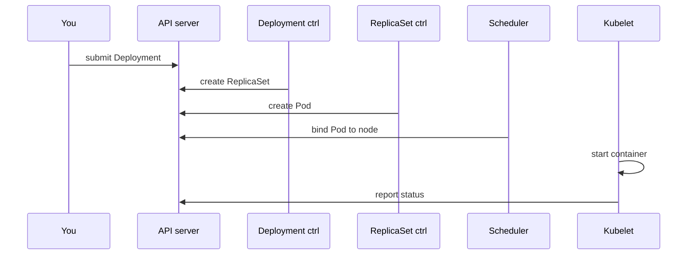

# Reconciliation and Kubernetes components

*Ignition*

**You will be able to:** name the component responsible for each step, and the evidence it leaves.

## Who does what

| Component | Runs on | Job | Evidence it leaves |
|---|---|---|---|
| `kube-apiserver` | control plane | Validate, authenticate, store objects; only writer to etcd | `apply` accepted; defaults filled in |
| `etcd` | control plane | Authoritative state | (via the API) |
| Deployment / ReplicaSet controllers (in `kube-controller-manager`) | control plane | Create ReplicaSets and Pods to match counts | ownerReferences; ReplicaSet events |
| `kube-scheduler` | control plane | Choose a node for a Pod with no `nodeName` | `Scheduled` / `FailedScheduling` |
| `kubelet` | every node | Start containers, run probes, report status | `Pulling`, `Started`, `BackOff`, conditions |
| `containerd` | every node | Actually create containers | `crictl ps` on the node |
| `kube-proxy` | every node | Service routing rules (Stage 2) | iptables rules |



## Key points

- The sequence repeats on every change, not just at first launch.
- Each actor has a **narrow view**: a controller sees a missing replica, not a failing SQL query; the kubelet sees an exit, not a release decision.
- Reconciliation is **asynchronous**: actors observe at different moments.
- `apply` does not reserve capacity forever, keep memory, or make dependencies healthy.

## Where it runs in this course: `kind`

- Each Kubernetes **node is a Docker container**: `apollo11-control-plane`, `apollo11-worker`, `apollo11-worker2`.
- Inside each, `containerd` runs the real app containers.
- `kubectl` talks HTTPS to port `6443`, forwarded to the control-plane container.
- `extraPortMappings` forward host ports `30080`–`30084`, `30443` to the control-plane container (used from Stage 2).
- If Docker stops, every node stops: kind teaches roles, not high availability.

## Debug from evidence outward

1. Object + conditions → 2. Events (scheduling, image pull) → 3. Pod spec + container status → 4. Logs → 5. The passenger request.

## Try it

```bash
kubectl -n kube-system get pods -o wide
kubectl describe pod apollo-shell | sed -n '/^Events:/,$p'
```

- The first shows control-plane Pods on one node and per-node agents on each; the second shows `default-scheduler` then `kubelet` as event sources.

## Check yourself

<details>
<summary>A Pod is <code>Pending</code> with no node. Which component's events do you read?</summary>

The scheduler's (`FailedScheduling`). The kubelet has not seen the Pod yet.
</details>

<details>
<summary>Why is a green Deployment condition not proof the airline works?</summary>

It reflects replica availability, not whether dependencies are reachable or a booking succeeds.
</details>
