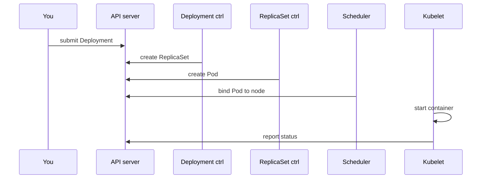

# Reconciliation and Kubernetes components

*Ignition*

**You will be able to:** name the component responsible for each step between "I applied a Deployment" and "a container is running", and the evidence each one leaves.

## The problem

When a Pod is not running, "Kubernetes is broken" is not a useful diagnosis. Kubernetes is not one program; it is several small programs, each with a narrow job. If you know who does what, a failure points at one of them. If you do not, you end up deleting things at random.

## The idea in plain words

Picture an airline operations room. One desk logs every request (API server). One desk plans staffing numbers (controllers). One desk assigns each flight to a gate (scheduler). At each gate, a local crew actually boards the plane (kubelet). Nobody does another desk's job, and each only sees its own paperwork.

That is the design: **narrow roles that cooperate through the shared record**, rather than one program doing everything.

## How it works

Suppose you apply a booking Deployment.

1. The **API server** validates and stores it. It starts nothing.
2. The **Deployment controller** sees a new Deployment and creates a ReplicaSet.
3. The **ReplicaSet controller** sees a ReplicaSet wanting 2 Pods and creates 2 Pod objects. They have no node yet.
4. The **scheduler** sees Pods with no node, picks a suitable node for each, and records the choice.
5. The **kubelet** on that node sees a Pod assigned to it and tells the container runtime to pull the image and start the container.
6. The kubelet reports status back to the API.



| Component | Runs on | Job | Evidence it leaves |
|---|---|---|---|
| `kube-apiserver` | control plane | Validate, authenticate, store objects | `apply` accepted; defaults filled in |
| `etcd` | control plane | Authoritative state store | (read through the API) |
| Controllers (in `kube-controller-manager`) | control plane | Create objects to match counts | `ownerReferences`; ReplicaSet events |
| `kube-scheduler` | control plane | Choose a node for a Pod with no `nodeName` | `Scheduled` / `FailedScheduling` |
| `kubelet` | every node | Start containers, run probes, report status | `Pulling`, `Started`, `BackOff`, conditions |
| `containerd` | every node | Create the real containers | `crictl ps` on the node |
| `kube-proxy` | every node | Service routing rules (Stage 2) | iptables rules |

The loop does not stop after launch. Delete a Pod and the ReplicaSet controller sees 1 < 2 and creates another. A container exits and the kubelet restarts it. A Pod cannot be placed and the scheduler records why and retries when the cluster changes.

## Each actor has a narrow view

A controller can see that a replica is missing; it cannot diagnose a failing SQL query. The kubelet can see a container exit; it does not decide whether a release should be promoted. This is why debugging follows the chain rather than deleting Pods first. It is also **asynchronous**: the actors do not all notice a change at the same instant, so a short delay between steps is normal.

## Two special ways Pods get created

Most Pods are created by a controller through the API server. Two kinds are not quite like that, and you meet both in Ignition:

- **Static Pods.** The kubelet reads Pod manifests from a folder on its own node (`/etc/kubernetes/manifests`) and runs them directly, with no scheduler and no controller. This is how the control plane starts: the API server itself can't be scheduled by an API server that isn't running yet. The kubelet then shows a read-only copy (a *mirror Pod*) in the API, named after the node.
- **DaemonSets.** A controller that wants **one Pod on every node** (or every matching node). `kube-proxy` and `kindnet` are DaemonSets because every node needs its own Service forwarding and Pod networking. Add a node, and the DaemonSet puts a Pod on it automatically. Stage 6's Alloy log collector uses the same pattern.

## Where it runs in this course: `kind`

In a cloud, nodes are virtual machines. Here we use **kind** ("Kubernetes in Docker"), where **each node is a Docker container** on your laptop: `apollo11-control-plane`, `apollo11-worker`, `apollo11-worker2`. Inside each, `containerd` runs the real application containers.

- `kubectl` reaches the API on port `6443`, forwarded into the control-plane container.
- `extraPortMappings` forward host ports `30080`–`30084` and `30443` into the control-plane container, so your browser can reach services from Stage 2.
- If Docker stops, every node stops. kind teaches roles, not high availability.

## Debug from evidence outward

1. The object and its conditions.
2. Events (scheduling, image pull).
3. Pod spec and container status.
4. Logs.
5. The passenger request.

## Try it

```bash
kubectl -n kube-system get pods -o wide
kubectl describe pod apollo-shell | sed -n '/^Events:/,$p'
```

- The first shows control-plane Pods on one node and per-node agents on each. The second shows `default-scheduler`, then `kubelet`, as the sources of events.

## Common misconceptions

- **"The API server starts containers."** It stores objects. The kubelet starts containers.
- **"A green Deployment means the airline works."** It reflects replica availability, not whether dependencies are reachable or a booking succeeds.

## Check yourself

<details>
<summary>A Pod is <code>Pending</code> with no node. Which component's events do you read?</summary>

The scheduler's (`FailedScheduling`). The kubelet has not seen the Pod yet.
</details>

<details>
<summary>Why is a green Deployment condition not proof the airline works?</summary>

It reflects replica availability, not whether dependencies are reachable or a booking succeeds.
</details>

## Where this leads

With the cast of components known, we can be precise about what "the Pod came back" means: a container restart, or a replacement Pod.
