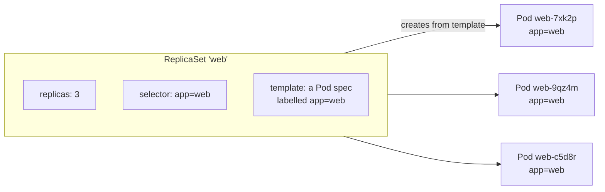
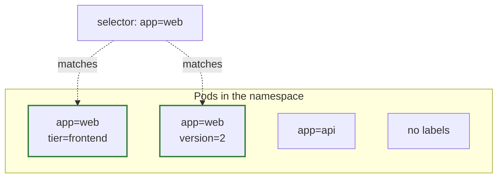
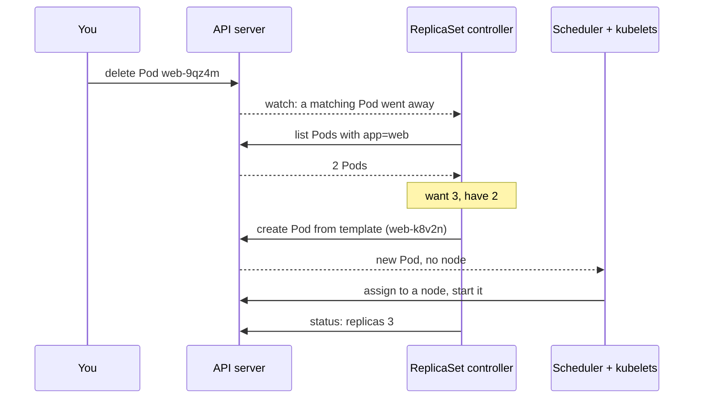
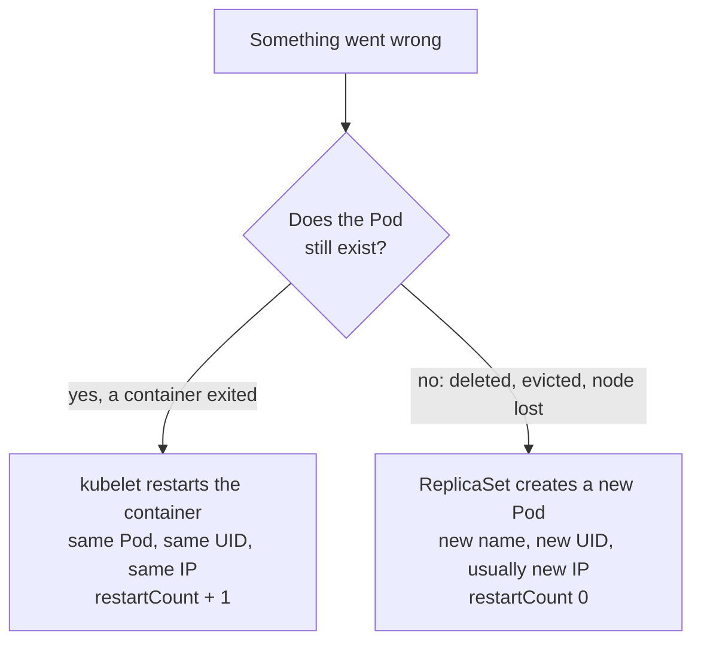
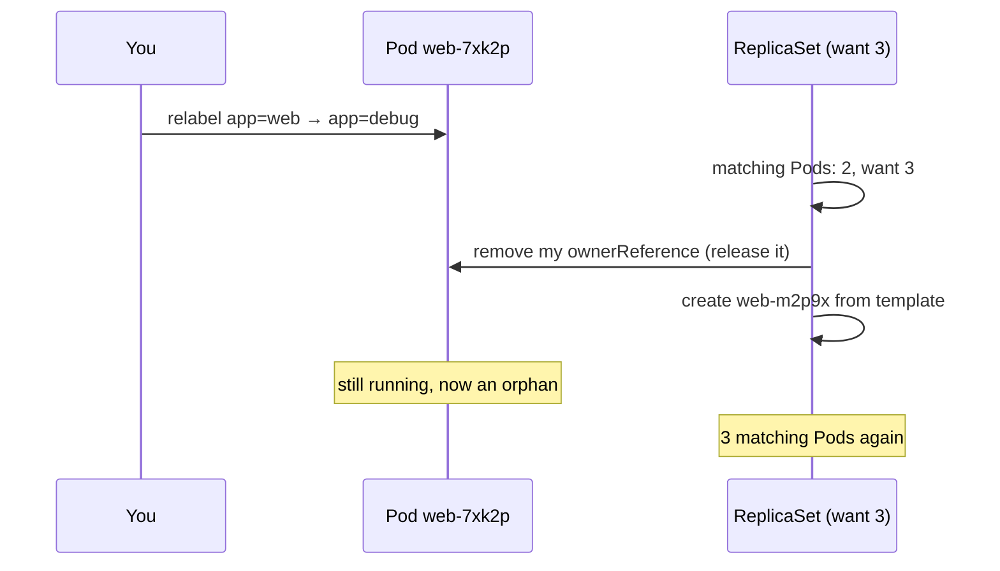
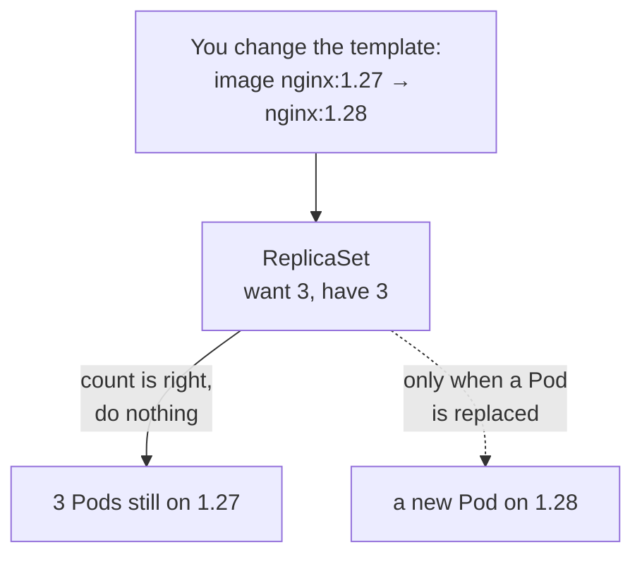

# ReplicaSets: keeping N Pods alive

*Ignition*

**You will be able to:** read a ReplicaSet as a count, a selector and a template; predict what it does when Pods are deleted, added or relabelled; tell a container restart from a Pod replacement; and explain why you rarely create a ReplicaSet yourself.

The first controller worth meeting is the one that fixes the bare Pod problem. A **ReplicaSet** holds one goal: *there are always N Pods that look like this*. Delete one, and it creates another. Lose a node, and it recreates that node's Pods elsewhere.

## Three parts: a count, a selector and a template

```yaml
apiVersion: apps/v1
kind: ReplicaSet
metadata:
  name: web
spec:
  replicas: 3                     # how many: the goal
  selector:
    matchLabels: {app: web}       # which Pods count towards it
  template:                       # how to make a new one
    metadata:
      labels: {app: web}          # must match the selector
    spec:
      containers:
        - name: web
          image: nginx:1.27-alpine
```



- **`replicas`** is the desired count. Not three named machines; just "three".
- The **selector** is a query over labels. It decides which Pods the ReplicaSet counts.
- The **template** is a complete Pod spec without a name. Each new Pod gets the ReplicaSet's name plus a random suffix.

Each `replicas` entry is an *intended* copy. Which actual Pod fills it at any moment does not matter to the ReplicaSet, and should not matter to you.

## Labels and selectors

A **label** is a short key/value tag on any object, such as `app: web` or `tier: frontend`. A **selector** is a query: "every Pod with `app=web`". Labels are how Kubernetes forms groups without hard-coding names, and you will see them everywhere: ReplicaSets count Pods by label, and Services (Stage 1) route traffic to Pods by label.



A selector matches if *all* its labels are present; extra labels on the Pod do not matter. The template's labels must satisfy the selector, or the ReplicaSet would create Pods it never counts, and keep creating them forever. The API server rejects that mistake.

## The loop, step by step

The ReplicaSet controller runs the [controller loop](./controller-loop) with a very simple comparison: *how many matching Pods are there, and how many should there be?*



The same comparison handles every case:

| What happened | Count vs goal | ReplicaSet action |
|---|---|---|
| A Pod is deleted, evicted, or its node dies | Too few | Create a Pod from the template |
| You raise `replicas` | Too few | Create Pods |
| You lower `replicas` | Too many | Delete Pods (preferring ones not yet running or ready) |
| Someone creates a stray Pod with `app=web` | Too many | Delete one, possibly the stray |
| A container in a Pod crashes | Still 3 | Nothing: that is the kubelet's job |

That last row is worth pausing on.

## Restart versus replacement

"The Pod came back" can mean two very different things, done by two different components:



| | Container restart | Pod replacement |
|---|---|---|
| Who acts | **kubelet** on the Pod's node | **ReplicaSet controller** |
| Pod name and UID | Same | **New** |
| Pod IP | Same | Usually new |
| Node | Same | Possibly different |
| Process memory | Lost | Lost |
| `emptyDir` volume | Kept | Lost |
| Persistent volume (Stage 3) | Kept | Reattached to the new Pod |
| `restartCount` | Rises | Starts at 0 |
| Needs a controller? | No | **Yes** |

To tell which happened, compare `metadata.uid` and `restartCount` before and after. An unchanged UID with a higher count is a restart; a new UID is a replacement.

Because replacement Pods get new names and IPs, nothing should depend on a particular Pod's address. Stage 1's **Services** give a group of Pods one stable name instead.

## Ownership is not selection

A ReplicaSet relates to its Pods in two separate ways, and mixing them up causes real confusion.

- **Ownership** answers *"who is responsible for this object, and who cleans it up?"* Each Pod a ReplicaSet creates carries an `ownerReferences` entry pointing back to it. When the ReplicaSet is deleted, the **garbage collector** deletes the Pods it owns.
- **Selection** answers *"which objects form this group right now?"* The ReplicaSet counts whatever matches its selector.

| | Ownership | Selection |
|---|---|---|
| Stored in | `metadata.ownerReferences` on the Pod | `labels` on the Pod, `selector` on the ReplicaSet |
| Question | Who made this, and who deletes it? | Which Pods count towards the goal? |
| Used by | Garbage collection | Counting replicas; routing traffic (Services) |

They usually agree, but they can come apart. Change a running Pod's label so it no longer matches:



The relabelled Pod keeps running, owned by nobody, and a fresh one takes its place. Operators use exactly this to take a misbehaving Pod out of service while keeping it alive for inspection.

## What a ReplicaSet will not do

A ReplicaSet compares **counts**, not contents. Change its template to a new image, and:

- the 3 existing Pods still match the selector, so the count is still right;
- so nothing happens to them. They keep running the old image.
- Only Pods created *later* (after a deletion, or a scale-up) use the new template.



To move every Pod to a new version you would have to delete them yourself, one by one, checking each new one works before deleting the next. That job (a controlled rollout) is exactly what a **Deployment** does on top of ReplicaSets. In practice you almost never write a ReplicaSet directly; you write a Deployment, and it manages ReplicaSets for you.

## Try it

```bash
kubectl apply -f - <<'YAML'
apiVersion: apps/v1
kind: ReplicaSet
metadata: {name: web}
spec:
  replicas: 3
  selector: {matchLabels: {app: web}}
  template:
    metadata: {labels: {app: web}}
    spec:
      containers: [{name: web, image: nginx:1.27-alpine}]
YAML
kubectl get pods -l app=web -L app

# 1. Replacement: delete one, watch a new name appear
kubectl delete pod "$(kubectl get pod -l app=web -o name | head -1 | cut -d/ -f2)"
kubectl get pods -l app=web

# 2. Ownership: who owns a Pod?
kubectl get pod -l app=web -o jsonpath='{.items[0].metadata.ownerReferences[0].kind}/{.items[0].metadata.ownerReferences[0].name}{"\n"}'

# 3. Selection: relabel one, see it orphaned and replaced
P=$(kubectl get pod -l app=web -o name | head -1)
kubectl label "$P" app=debug --overwrite
kubectl get pods -L app                      # 3 with app=web, plus 1 with app=debug

# 4. Template change does not touch running Pods
kubectl patch rs web --type=json -p='[{"op":"replace","path":"/spec/template/spec/containers/0/image","value":"nginx:1.28-alpine"}]'
kubectl get pods -l app=web -o jsonpath='{range .items[*]}{.metadata.name} {.spec.containers[0].image}{"\n"}{end}'

kubectl delete rs web; kubectl delete "$P"
```

## Common misconceptions

- **"`replicas: 3` means three specific Pods."** It means three matching Pods, whichever they are.
- **"Labels give a controller ownership."** Ownership is separate metadata; labels only form groups.
- **"A ReplicaSet keeps my data."** It keeps a *count*. A new Pod starts from the template with nothing from the old one.
- **"Editing the ReplicaSet updates my Pods."** Only Pods created afterwards use the new template. Use a Deployment to roll out changes.

## Check yourself

<details>
<summary>Which component handles a crashed container, and which handles a deleted Pod?</summary>

The kubelet restarts the container inside the same Pod. The ReplicaSet controller creates a new Pod when one is missing.
</details>

<details>
<summary>You change a Pod's <code>app</code> label so it no longer matches. What happens?</summary>

The ReplicaSet stops counting it, releases its ownership, and creates a replacement. The old Pod keeps running as an orphan.
</details>

<details>
<summary>You delete a ReplicaSet. What happens to its Pods, and why?</summary>

They are deleted too, by the garbage collector, because their `ownerReferences` point at the ReplicaSet.
</details>

<details>
<summary>Why is a ReplicaSet on its own not enough to release a new version?</summary>

It only compares counts. Existing Pods still match, so changing the template does not replace them; there is no controlled, gradual handover.
</details>

## Where this leads

[Deployments](./deployments) add the missing piece: a controller that creates a *new* ReplicaSet for each version of the template and moves Pods across gradually, with a way back.
