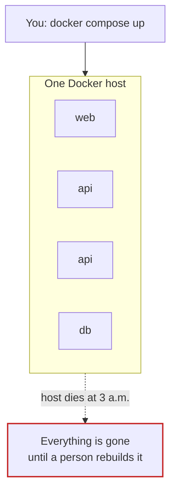
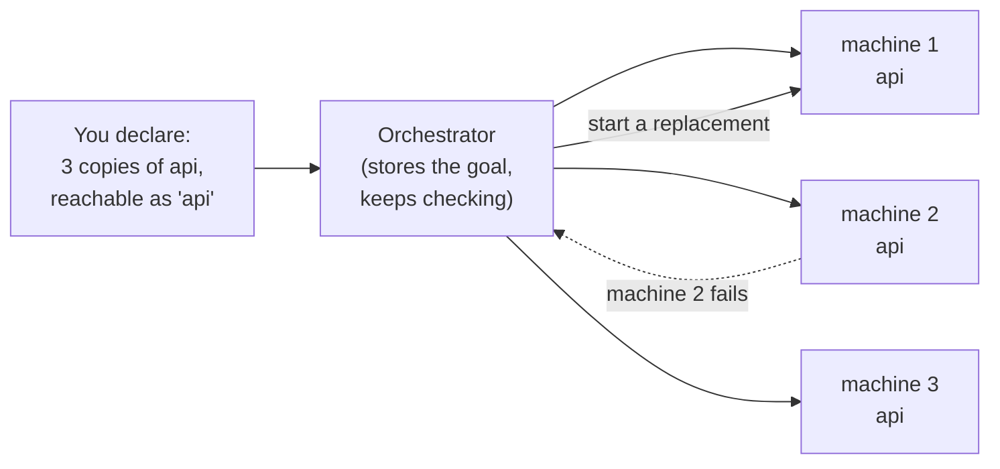
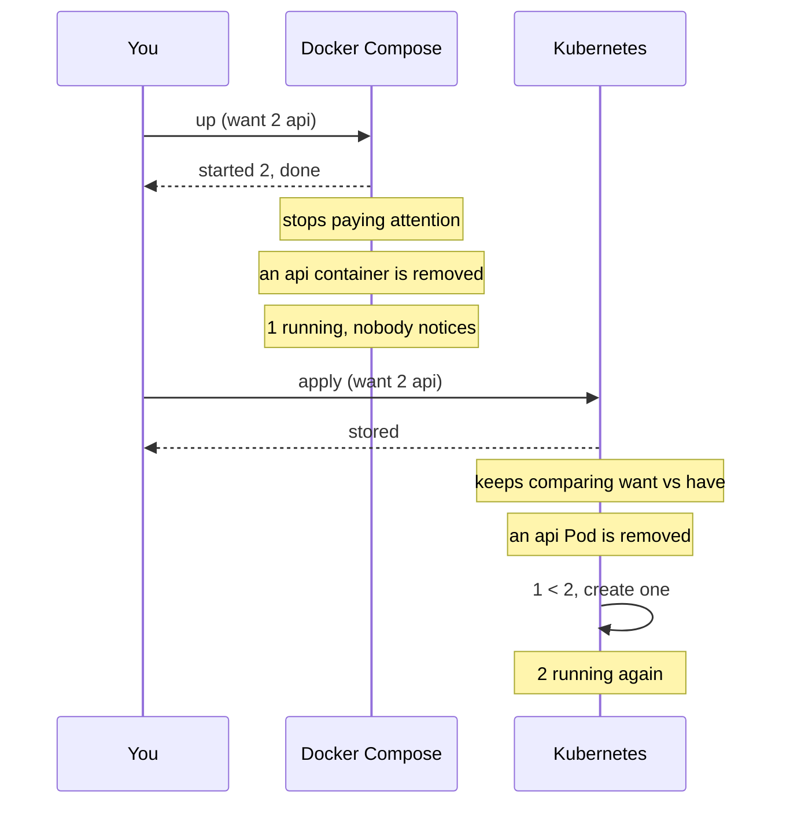

# Why Kubernetes?

*Ignition*

**You will be able to:** name the jobs a single Docker host cannot do, explain what an orchestrator adds, and compare Kubernetes with Docker Compose feature by feature, including when Compose is still the better tool.

In Launchpad, Docker Compose ran the whole airline on one machine, and **you** were the operations team. You typed `up`, you noticed when something died, you decided when to rebuild. That is fine for one laptop while you are watching. This chapter is about what changes when you are not watching, and when one machine is not enough.

## What one machine cannot do

Everything Compose did was bound to one Docker host:



| Need | What happens on one Docker host |
|---|---|
| **Survive a machine failure** | Every container on it stops. `restart: always` is the Docker daemon on that host, so it dies too. |
| **More capacity than one machine** | There is nowhere else to put a container. |
| **Keep N copies running** | Compose starts N once. If one is removed, nothing notices. |
| **Ship a new version without downtime** | Compose recreates containers; there is a gap, and a bad version stays broken. |
| **Send traffic only to healthy copies** | Docker DNS returns a container even when it is `unhealthy`. |
| **Remember what should be running** | The intent lives in a file on your machine and in your head, not in the system. |

None of these is exotic. Every production service needs all of them.

## What an orchestrator does

An **orchestrator** runs containers across a group of machines (a **cluster**) and keeps them the way you asked, without a person in the loop. You stop giving commands ("start this container on that machine") and start declaring results ("three copies of this, reachable at this name"). The orchestrator works out the commands, and keeps working them out as things change.



Its jobs, all of which you will meet in this course:

- **Scheduling:** pick a machine with room for each workload.
- **Self-healing:** notice a missing or crashed copy and replace it.
- **Scaling:** run more or fewer copies, by hand or automatically.
- **Service discovery and load balancing:** give a group of copies one stable name and spread traffic across the healthy ones.
- **Rolling updates and rollback:** replace copies gradually, and go back if the new version fails.
- **Configuration and secrets:** deliver settings to every copy, wherever it runs.
- **Storage:** attach the right disk to the right workload, even after it moves.

Kubernetes is the orchestrator that won. It is open source, runs the same way on a laptop and on every major cloud, and has a large ecosystem built on its API.

## The key idea: desired state, kept true

The biggest change is not "more machines". It is **who keeps the goal**.



Compose turns your file into commands **once**. Kubernetes **stores** what you asked for and runs programs that compare it with reality forever, correcting any gap. That is called **reconciliation**, and it is the subject of [The controller loop](./controller-loop). Almost everything else in Kubernetes is built on it.

## Kubernetes compared with Docker Compose

You already know Compose, so use it as a map. Most Compose ideas have a Kubernetes counterpart; the difference is that each one now works across machines and keeps working after you walk away.

| Concern | Docker Compose | Kubernetes |
|---|---|---|
| **Scope** | One Docker host | A cluster of many machines (**nodes**) |
| **Model** | Runs commands when you type `up` | Stores desired state; controllers keep reality matching it |
| **Unit you run** | A container (a "service" is one or more) | A **Pod**: one or more containers that share a network identity |
| **Keeping copies alive** | `restart: always` on that host | A **ReplicaSet** recreates missing Pods on any node |
| **Releasing a new version** | Recreate the containers | A **Deployment** rolls Pods over gradually, gated on readiness |
| **Finding each other** | Service name on the Docker network | A **Service** with a stable name and IP, via cluster DNS |
| **Traffic only to healthy copies** | No | Yes: only **ready** Pods receive traffic |
| **Exposing to users** | `ports: "8080:80"` | NodePort / LoadBalancer **Services**, Ingress, Gateway API |
| **Configuration** | `environment:`, `.env`, bind-mounted files | **ConfigMaps** and **Secrets** |
| **Persistent data** | Named volumes on that host | **PersistentVolumeClaims**, attached wherever the Pod runs |
| **Placing work** | Nowhere to choose | The **scheduler** picks a node from requests and constraints |
| **Access control** | Whoever can use the Docker socket | Users, ServiceAccounts and **RBAC** on every API call |

And the same small app written both ways. The shape is similar; Kubernetes splits it into separate objects, each with one job.

```yaml
# Compose: one file, one section per service
services:
  api:
    image: myorg/api:1.4
    deploy:
      replicas: 2
    environment:
      LOG_LEVEL: info
    ports: ["8080:8080"]
```

```yaml
# Kubernetes: what to run and how many...
apiVersion: apps/v1
kind: Deployment
metadata: {name: api}
spec:
  replicas: 2
  selector: {matchLabels: {app: api}}
  template:
    metadata: {labels: {app: api}}
    spec:
      containers:
        - name: api
          image: myorg/api:1.4
          env: [{name: LOG_LEVEL, value: info}]
---
# ...and, separately, how to reach it
apiVersion: v1
kind: Service
metadata: {name: api}
spec:
  selector: {app: api}
  ports: [{port: 8080}]
```

Do not worry about every field yet. By the end of Ignition you will be able to read the Deployment line by line.

### When Compose is still the right tool

Kubernetes is not free: there are more moving parts to learn, run and pay for. Compose is the better choice for local development, a demo, a CI test environment, or a small internal tool on one machine where a few minutes of downtime is acceptable. Reach for Kubernetes when you need several machines, automatic recovery, zero-downtime releases or many teams sharing one platform.

## What Kubernetes does not do

It keeps *processes* matching your declaration. It does not keep everything those processes knew, and it does not make your app correct.

| Kubernetes can | Kubernetes cannot |
|---|---|
| Recreate a missing Pod | Recreate data that lived only in that Pod's memory |
| Send traffic only to ready Pods | Guarantee the services those Pods call are working |
| Roll out a new image, and roll back the template | Undo what the bad version wrote or sent while it ran |
| Restart a crashed container | Fix the bug that crashed it |

"Self-healing" is shorthand for the left column only. The rest of the course names these boundaries instead of hiding them.

## Try it

Ignition's walkthrough builds a cluster. Once it exists, this one line shows the core idea:

```bash
kubectl get nodes
```

- Several machines (here, Docker containers pretending to be machines) answering as **one** system. In Compose there was nothing to list: the only machine was yours.

## Common misconceptions

- **"Kubernetes is a better Docker."** Docker builds images and runs containers on one machine. Kubernetes decides where containers should run across many machines and keeps them that way. It still needs a container runtime on each node.
- **"`kubectl apply` starts my containers."** It records what you want. Other components act on that record, as the next chapter shows.
- **"Self-healing keeps my data safe."** It recreates processes, not the state they held.
- **"I need Kubernetes for every project."** For one machine and a tolerance for brief downtime, Compose is simpler.

## Check yourself

<details>
<summary>Compose has <code>restart: always</code>. Why is that not the same as Kubernetes self-healing?</summary>

It is the Docker daemon on one host restarting a container that exited. If the container is removed, or the host dies, nothing brings it back. Kubernetes stores the goal in the cluster and recreates missing Pods on any healthy node.
</details>

<details>
<summary>Name three Compose concepts and their Kubernetes counterparts.</summary>

For example: `deploy.replicas` → a Deployment's `replicas`; a service name on the Docker network → a Service and cluster DNS; `environment:` → ConfigMaps and Secrets; named volumes → PersistentVolumeClaims; `ports:` → NodePort or LoadBalancer Services.
</details>

<details>
<summary>Why is "self-healing" an incomplete description?</summary>

It restores processes to match a recorded intent. It cannot restore state held only in a lost Pod, or repair a broken dependency.
</details>

## Where this leads

"Kubernetes" is not one program. It is a handful of components with narrow jobs, on two kinds of machines. [Architecture and the basic flow](./architecture) introduces them and follows one workload from your terminal to a running container.
