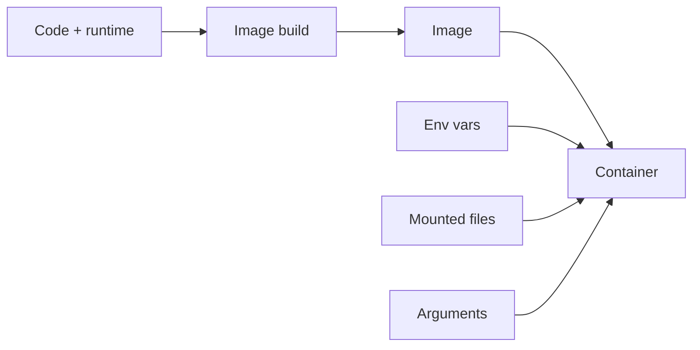

# Images and runtime configuration

*Launchpad*

**You will be able to:** decide whether a value belongs in the image or in runtime configuration, read Apollo's Dockerfile and Compose file, and predict when a configuration change takes effect.

## The problem

You now know an image is a sealed package. The next question is what to put in it. If you bake today's database address and password into the booking image, that image only works in one place, and anyone who can pull it can read the password. If you leave everything out, nobody can start it.

The skill is knowing which facts belong to the **program** (stable, shared by every environment) and which belong to the **environment** (different on your laptop, in staging and in production).

## The idea in plain words

Compare a kettle with the water you pour into it. The kettle is the same everywhere; what you put in changes each time.

- **Build time** is when the image is assembled: your code, its libraries, and a default start command go in. Rebuilding makes a *new* image. It never reaches into a running process.
- **Runtime** is when a container starts from that image. Per-environment facts are handed in *then*: environment variables, files mounted into the container, command-line arguments, and network names.

Keeping those apart means you can test one image and promote that same image from development to production, changing only what is handed in at start.



## How it works: reading Apollo's Dockerfile

A `Dockerfile` is the build recipe. Each instruction adds a **layer**, and Docker caches layers so unchanged steps are not repeated.

*Source: `stages/launchpad/code/booking/Dockerfile`*

| Instruction | What it does and why |
|---|---|
| `FROM golang:1.22-alpine AS builder` | First stage: an image that has the Go compiler, used only to build. |
| `COPY go.mod go.sum ./` then `RUN go mod download` | Fetch dependencies **before** copying source. Dependencies change rarely, so this layer is cached and a source edit does not re-download them. |
| `COPY . .` then `RUN … go build` | Copy the code and compile it into one binary. |
| `FROM alpine:3.19` + `COPY --from=builder …` | Second stage: start from a tiny image and copy in only the binary. The compiler is left behind, so the final image is small and has less for an attacker to use. |
| `adduser -S` + `USER apollo` | Run the process as an ordinary user rather than root. |
| `ENV DATABASE_URL=…` | A *default* so the image runs on its own. Compose overrides it. |
| `EXPOSE 8082` | Documentation only. It does not publish the port. |

This two-stage layout is called a **multi-stage build**: one stage to build, one to run.

## How it works: reading Apollo's Compose file

Compose describes how to run several containers together and what to hand each.

*Source: `stages/launchpad/docker-compose.yml`*

| Field | Meaning |
|---|---|
| `build.context` | Which folder to build the image from |
| `ports: "8082:8082"` | `host:container`. Publishes the container port on your laptop |
| `environment` | Runtime values. Service URLs use **names** (`http://flight:8081`), not IP addresses |
| `depends_on … service_healthy` | Start order only. It is not rechecked after startup |
| `read_only`, `tmpfs`, `cap_drop` | Restrictions on the running container |
| `networks` | Which private network; Docker's DNS resolves service names inside it |

## When does a change take effect?

A running process copied its settings when it started. Editing the source of a value later does not reach into its memory. For any configuration change, ask three questions:

1. Where does the value live before the container starts?
2. How is it delivered (environment variable, mounted file, argument)?
3. What makes the process use the new value (a restart, or a reload it supports)?

Mounted files can change under a running process, but the program still has to notice and re-read them. "The file changed" and "the service adopted the new setting" are different facts. Kubernetes gives these delivery routes names (ConfigMap, Secret) in Stage 1, but the rule is the same.

## Apollo example

`JWT_SECRET` is passed to booking through the Compose `environment` block from your `.env` file, never written into the image. `FLIGHT_SERVICE_URL=http://flight:8081` names the destination by service name, so the same image works wherever a service called `flight` exists.

## Try it

```bash
cd stages/launchpad
docker compose exec booking printenv FLIGHT_SERVICE_URL
docker compose exec booking printenv JWT_SECRET
```

- The first prints a service **name**; the second prints a secret that anyone who can run `exec` can read. Runtime delivery keeps it out of the image, not out of reach.

## Common misconceptions

- **"A password in a private image is fine."** Every copy of the image and every machine that pulls it now holds the password. It is also baked in until you rebuild.
- **"`latest` always means the newest build."** It is only a movable label. Two machines can hold different images both called `latest`.
- **"Editing `.env` updates running containers."** Only newly created containers see it.

## Check yourself

<details>
<summary>A source value changes but booking reads its environment only at startup. What must happen?</summary>

A new process must start with the changed value, usually by replacing the container.
</details>

<details>
<summary>Why is a password in an image different from one injected at runtime?</summary>

The image and every copy then contain the password. Runtime delivery keeps it out of the artifact, though access control, encryption and rotation still need their own measures.
</details>

<details>
<summary>Why copy <code>go.mod</code> before the rest of the source?</summary>

So the dependency layer stays cached when only source files change.
</details>

## Where this leads

With a repeatable image and runtime settings, booking can start. Next: how it finds the other services, which depends on *who is asking*.
