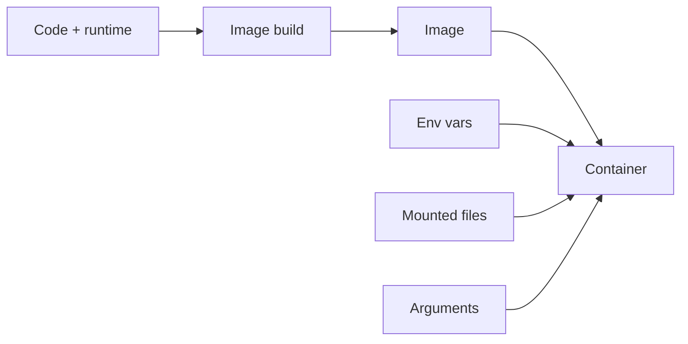

# Images and runtime configuration

*Launchpad*

**You will be able to:** decide whether a value belongs in the image or in runtime config, and predict when a change takes effect.

## Key points

- **Build time** produces the image: code, libraries, default command.
- **Runtime** supplies per-environment values: env vars, mounted files, arguments, network names.
- One inspected image should move through dev → prod; only config changes.
- **A running process does not see config changes** unless it rereads them. Env vars are read at start; mounted files may update but the app must reload.
- Secrets must not be baked into images: every copy of the image carries them.



## Reading a Dockerfile

*Source: `stages/launchpad/code/booking/Dockerfile`*

| Instruction | Why it is there |
|---|---|
| `FROM golang:1.22-alpine AS builder` | Build stage: has the compiler |
| `COPY go.mod go.sum ./` then `RUN go mod download` **before** `COPY . .` | Dependency layer is cached; editing `main.go` does not redownload |
| `FROM alpine:3.19` + `COPY --from=builder` | Runtime image has only the binary: smaller, no compiler to exploit |
| `adduser -S` + `USER apollo` | Process runs as non-root inside the container |
| `ENV DATABASE_URL=…` | A **default** for standalone runs; Compose overrides it from `.env` |
| `EXPOSE 8082` | Documentation only; does not publish the port |

## Reading Compose as configuration

*Source: `stages/launchpad/docker-compose.yml`*

| Field | Meaning |
|---|---|
| `build.context` | Which folder is built into the image |
| `ports: "8082:8082"` | `host:container`, publishes to your laptop |
| `environment` | Runtime values (service URLs use **names**, e.g. `http://flight:8081`) |
| `depends_on … service_healthy` | Start order only; not checked again later |
| `read_only`, `tmpfs`, `cap_drop` | Hardening of the runtime, not the image |
| `networks` | Which bridge network; Docker DNS resolves service names |

## Three questions for any config change

1. Where does the value live before the container starts?
2. How is it delivered (env, file, argument)?
3. What makes the process use the new value (restart, reload)?

- Kubernetes names these deliveries ConfigMap, Secret, env, volume. The lifecycle rule stays the same.

## Try it

```bash
cd stages/launchpad
docker compose exec booking printenv FLIGHT_SERVICE_URL
docker compose exec booking printenv JWT_SECRET
```

- The first shows a service **name**; the second shows a secret visible to anyone who can exec: injected at runtime, not hidden.

## Gotchas

- Image tags like `latest` are mutable: "same tag" does not mean "same image".
- A Secret object is delivery, not protection. Who can read it, whether it is encrypted, how it rotates, whether logs print it: separate questions.
- Rebuilding the image does not change running containers.

## Check yourself

<details>
<summary>A source value changes but booking reads env only at startup. What must happen?</summary>

A new process must start with the changed value, usually by replacing the container.
</details>

<details>
<summary>Why is a password in an image different from one injected at runtime?</summary>

The image and every copy then contain the password. Runtime delivery keeps it out of the artifact, though access, encryption and rotation still need their own controls.
</details>

<details>
<summary>Why copy <code>go.mod</code> before the source?</summary>

So the dependency layer stays cached when only source changes.
</details>
