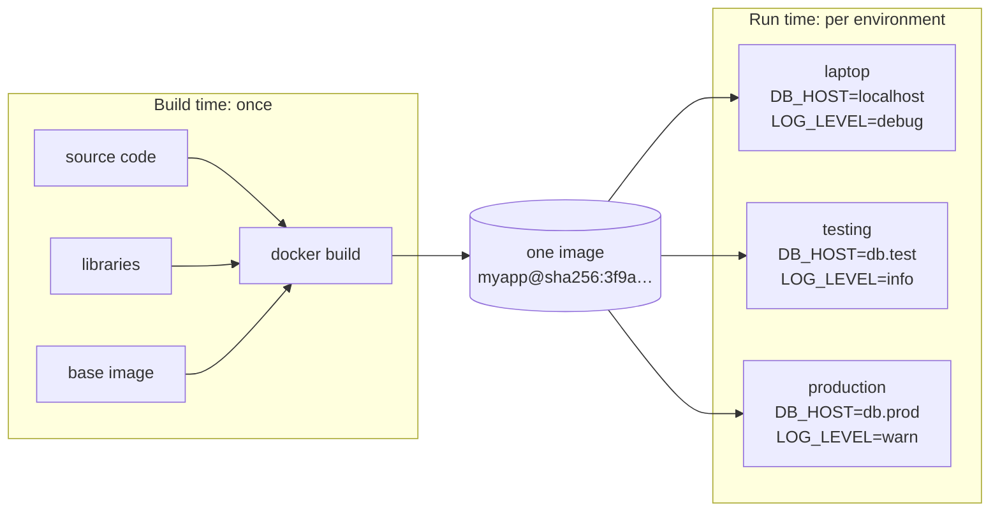
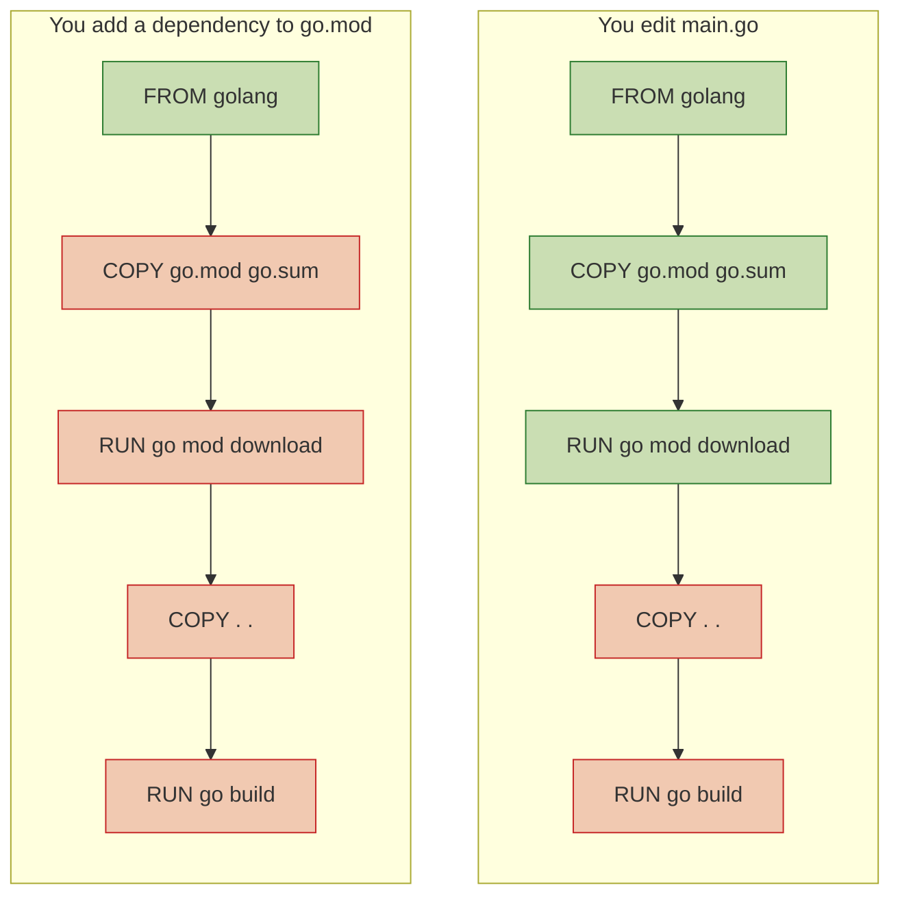
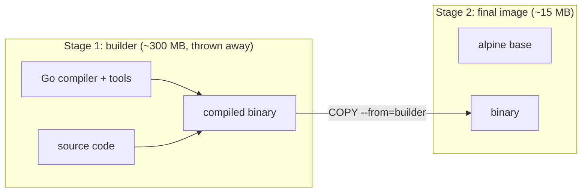
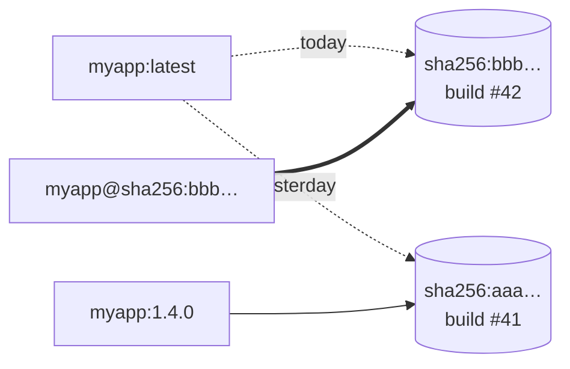
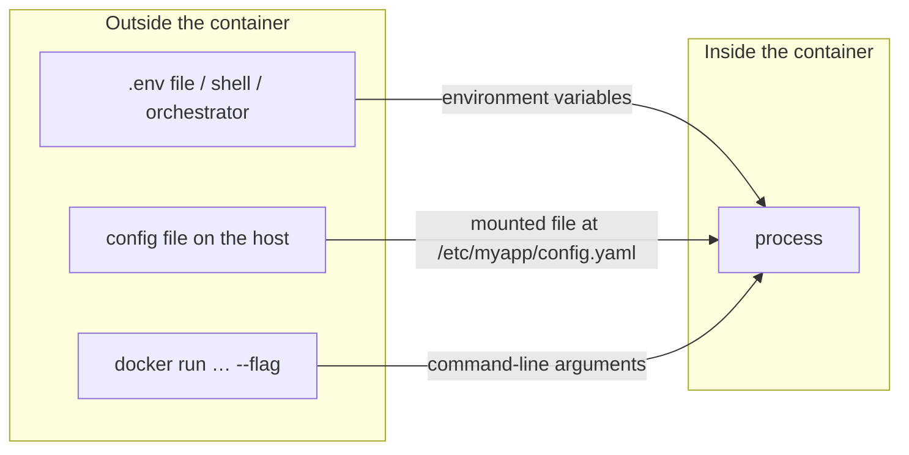
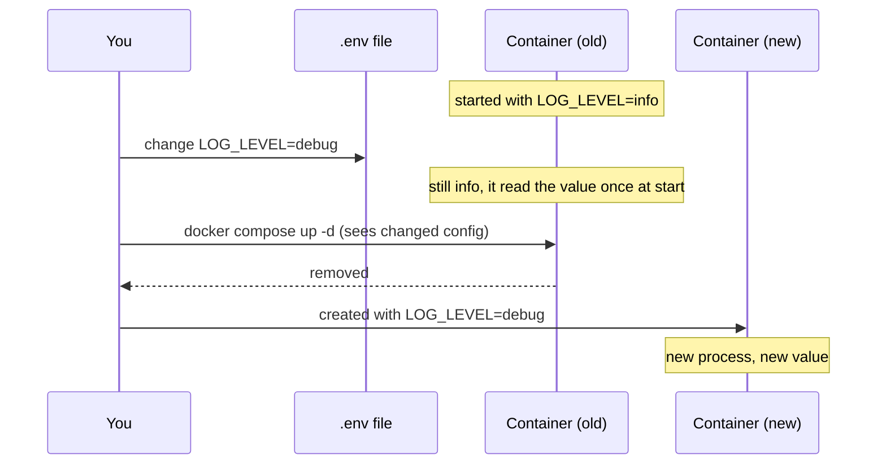

# Images and runtime configuration

*Launchpad*

**You will be able to:** decide whether a value belongs in the image or in runtime configuration, read a Dockerfile and say which steps the build cache will reuse, and predict when a configuration change takes effect.

You now know an image is a sealed package. The next question is what to put in it.

Suppose you bake the database address and password into your API's image. That image now works in exactly one place, and anyone who can pull it can read the password. Suppose instead you leave everything out: nobody can start it without reading the source code to find out what it needs.

The skill is sorting facts into two piles: those that belong to the **program** (the same in every environment) and those that belong to the **environment** (different on your laptop, in testing and in production).

## Build time and run time

Compare a kettle with the water you pour into it. The kettle is the same everywhere; what you put in changes each time.

- **Build time** is when the image is assembled: your code, its libraries and a default start command go in. Rebuilding makes a *new* image. It never reaches into a running process.
- **Run time** is when a container starts from that image. Per-environment facts are handed in *then*: environment variables, mounted files, command-line arguments.



Keeping the two apart is what lets you **test one image and promote that same image** all the way to production, changing only what is handed in at start. If you rebuild per environment, the thing you tested is not the thing you shipped.

### Which pile does it go in?

| Value | Pile | Why |
|---|---|---|
| Your compiled code, libraries, CA certificates | Image | Same everywhere; needed for the program to exist |
| Default port the program listens on | Image (as a default) | Stable; override if needed |
| Database host, other services' URLs | Run time | Differs per environment |
| Passwords, API keys, signing secrets | Run time | Must never sit inside a copyable artifact |
| Log level, feature flags | Run time | Changed without rebuilding |

A useful test: **could you publish this image on the internet without leaking anything or breaking anything?** If not, something in it belongs to the environment.

## A Dockerfile, step by step

A `Dockerfile` is the build recipe. Here is one for a small API written in Go. The language does not matter; the shape is the same for Python, Node or Java.

```dockerfile
# ---- stage 1: build ----
FROM golang:1.22-alpine AS builder
WORKDIR /src
COPY go.mod go.sum ./
RUN go mod download
COPY . .
RUN CGO_ENABLED=0 go build -o /out/api .

# ---- stage 2: run ----
FROM alpine:3.20
RUN adduser -S app
COPY --from=builder /out/api /usr/local/bin/api
USER app
ENV PORT=8080
EXPOSE 8080
CMD ["api"]
```

| Instruction | What it does |
|---|---|
| `FROM … AS builder` | Start from an image that has the compiler. This stage exists only to build. |
| `COPY go.mod go.sum` then `RUN go mod download` | Fetch dependencies **before** copying the source (see *the build cache* below). |
| `COPY . .` then `RUN go build` | Copy the code and compile it into one binary. |
| `FROM alpine:3.20` | Start a **second, fresh** stage from a tiny base image. |
| `COPY --from=builder …` | Take only the finished binary from stage 1. The compiler stays behind. |
| `USER app` | Run as an ordinary user, not root. |
| `ENV PORT=8080` | A *default*. Run time can override it. |
| `EXPOSE 8080` | Documentation only. It does not open or publish anything. |
| `CMD ["api"]` | The command a container runs if you do not give it another. |

### Layers and the build cache

Each instruction that changes files produces a **layer**. Docker remembers every layer by what went into it. On the next build, it walks the instructions in order and reuses a layer as long as nothing that feeds it has changed. **The first changed step, and every step after it, is rebuilt.**



Green steps come from cache; red steps run again. Because code changes far more often than the dependency list, copying `go.mod` first means a normal edit skips the slow download. The rule generalises: **order instructions from least to most frequently changed.**

### Multi-stage builds

The two `FROM` lines make this a **multi-stage build**. The final image contains only what the last stage copies in.



Smaller images download faster, and leaving the compiler, shells and package caches behind also leaves an attacker fewer tools to use.

### Tags and digests

An image has an immutable **digest** (`sha256:3f9a…`), computed from its content. A **tag** like `myapp:1.4` or `myapp:latest` is a human-friendly label that *points at* a digest, and it can be moved.



`latest` is just a tag name with no special meaning: it is whatever was pushed last under that name. Two machines that pulled `latest` at different times can be running different code. Pin a version tag, or the digest itself, when it matters which bytes run.

### Build arguments versus environment variables

Both look like `NAME=value`, but they live at different times.

| | `ARG` (build argument) | `ENV` (environment variable) |
|---|---|---|
| Set with | `docker build --build-arg NAME=…` | `ENV` in the Dockerfile, or `-e NAME=…` at `docker run` |
| Exists | Only while the image is being built | In every container started from the image |
| Typical use | Choose a version to install, label a build | Configure the running program |
| Safe for secrets? | **No.** Values can be recovered from the image history | Not inside the image; inject at run time instead |

## How runtime configuration arrives

When a container starts, the runtime can hand it values in three ways. All three are set from outside the image.



- **Environment variables** are simple and universal, but the process reads them once at start, and anyone who can inspect the container can see them.
- **Mounted files** suit larger or structured config (and certificates). The file can change while the process runs, but the program must notice and re-read it.
- **Arguments** override the image's `CMD` and are visible in the process list.

### Docker Compose: writing it all down

Typing `docker run` with a dozen flags does not scale past one container. **Docker Compose** lets you describe several containers and what to hand each in one YAML file:

```yaml
services:
  api:
    build: ./api                  # build the image from this folder
    ports: ["8080:8080"]          # publish container port 8080 on the host
    environment:
      DB_HOST: db                 # another service's name, not an IP
      DB_PASSWORD: ${DB_PASSWORD} # filled in from a .env file next to this one
      LOG_LEVEL: info
  db:
    image: postgres:16            # use a published image as-is
    environment:
      POSTGRES_PASSWORD: ${DB_PASSWORD}
```

`docker compose up` builds what needs building, creates the containers and hands each its runtime values. The image for `api` contains no password and no address; the Compose file and `.env` supply them.

## When does a change take effect?

A running process copied its settings into memory when it started. Editing the source of a value later does not reach into that memory.



For any configuration change, ask three questions:

1. **Where** does the value live before the container starts?
2. **How** is it delivered: environment variable, mounted file or argument?
3. **What** makes the process use the new value: a new container, a restart, or a reload the program supports?

"The file changed" and "the program is using the new setting" are different facts. Check the second one, not the first.

## Try it

Build a tiny image and see each idea in action.

```bash
mkdir config-demo && cd config-demo
cat > Dockerfile <<'EOF'
FROM alpine:3.20
ARG BUILD_LABEL=local
RUN echo "built as: $BUILD_LABEL" > /build-info
ENV GREETING=hello
CMD ["sh", "-c", "cat /build-info; echo \"$GREETING from $(hostname)\""]
EOF

docker build -t config-demo:1 .
docker run --rm config-demo:1                       # built as: local / hello
docker run --rm -e GREETING=hola config-demo:1      # same image, new runtime value

docker build -t config-demo:1 .                     # every step says CACHED
docker build -t config-demo:2 --build-arg BUILD_LABEL=ci .
docker run --rm config-demo:2                       # built as: ci

docker history config-demo:2                        # the build arg is visible here
docker image ls config-demo                         # two tags, two different IDs
```

- The second `run` changes behaviour without a rebuild: that is runtime configuration.
- The repeated build shows the cache; changing the build argument invalidates the `RUN` step that uses it.
- `docker history` shows why build arguments are not a place for secrets.

## Common misconceptions

- **"A password in a private image is fine."** Every copy of the image, on every machine and in every registry, now holds it, and it stays there until you rebuild and delete the old images.
- **"`latest` always means the newest build."** It is only a movable label. Different machines can hold different images both called `latest`.
- **"Editing `.env` updates running containers."** Only newly created containers see it.
- **"`EXPOSE` opens the port."** It is a note for humans and tools. Publishing a port is a run-time choice, covered in the next chapter.

## Check yourself

<details>
<summary>A value changes, but the program reads its environment only at startup. What must happen?</summary>

A new process must start with the changed value, usually by replacing the container.
</details>

<details>
<summary>Why is a password in an image different from one injected at run time?</summary>

The image and every copy of it then contain the password. Run-time delivery keeps it out of the artifact. It still needs access control, encryption and rotation, but at least it is not shipped with every pull.
</details>

<details>
<summary>Why copy <code>go.mod</code> before the rest of the source?</summary>

So the dependency-download layer stays cached when only source files change. The first changed step and everything after it rebuild.
</details>

<details>
<summary>You tested <code>myapp:latest</code> on Monday and deployed <code>myapp:latest</code> on Friday. Did you deploy what you tested?</summary>

Not necessarily. The tag may have moved. Deploy by version tag or digest to be sure.
</details>

## Where this leads

With a repeatable image and runtime settings, a container can start. Next it needs to talk to other containers and to you, and an address means different things depending on *who is asking*. That is [Networks and clients](./networks-and-clients).
