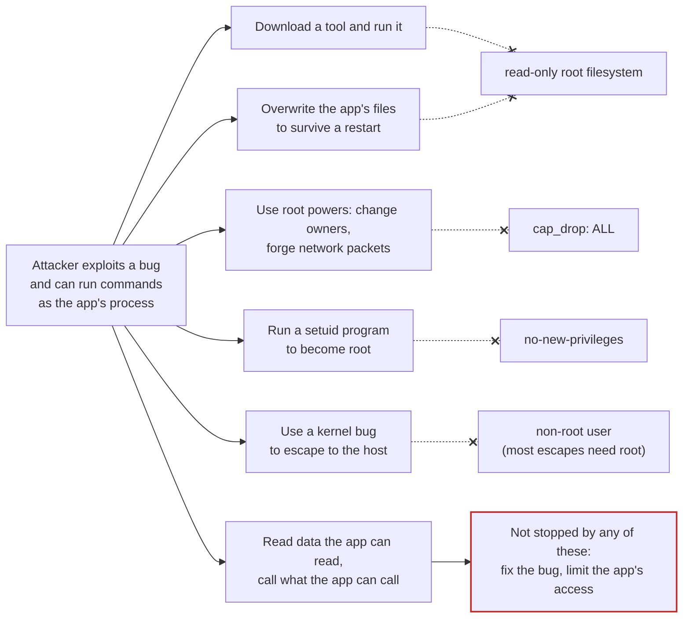
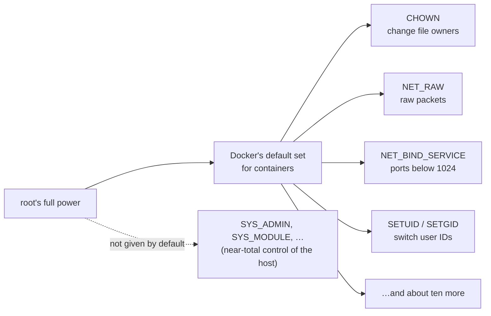
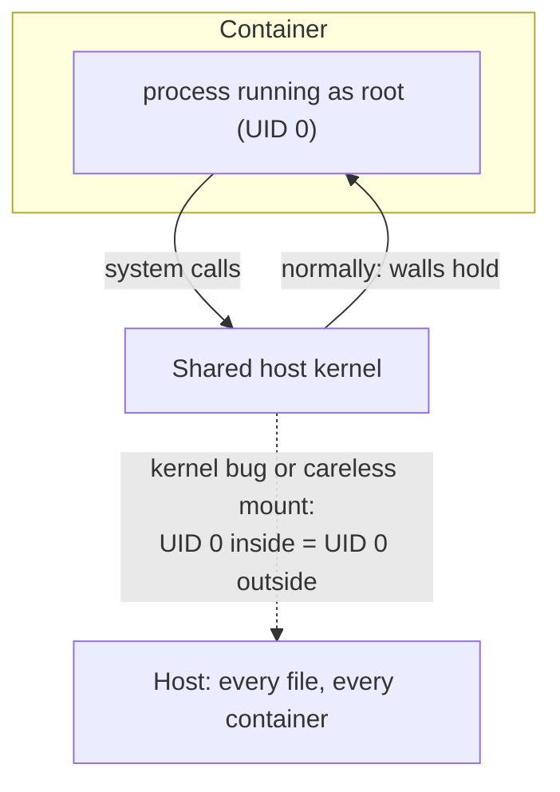
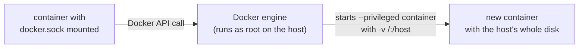

# Least privilege for containers

*Launchpad*

**You will be able to:** explain what a non-root user, a read-only filesystem, `tmpfs`, dropped capabilities and `no-new-privileges` each take away, and why none of them on its own makes a container safe.

A container is an isolated process, not a separate machine ([Process, image, container](./process-image-container)). It shares the host's kernel. Suppose an attacker finds a bug in your API, such as a vulnerable library or an injection flaw, and can now run commands *as your API's process*. What happens next depends entirely on what that process is allowed to do.

By default, that is a lot:

- Most images run their process as **root** (user ID 0).
- The filesystem is **writable**, so a downloaded tool can be saved and run.
- The process holds a set of Linux **capabilities**: slices of root's power, such as changing file ownership or creating raw network packets.
- **setuid** programs inside the image can raise the process's privileges further.

Defaults are chosen so things work out of the box, not so they are safe.

## Give a process only what it needs

Think of a hotel key card. A guest's card opens their room and the lift. It does not open the kitchen, the safe or the other rooms. If it is stolen, the thief gets one room, not the building. The hotel did not make theft impossible; it made theft **cheap to survive**.

Least privilege is the same idea for a process: give it exactly what its job needs and nothing more, so that a compromise of the process is a small problem instead of a large one.

The analogy stops here. A key card is one thing. A container's privileges are several independent switches, and each one closes a different door.

## Following an attacker

Picture what an attacker typically tries after getting a foothold, and which control blocks each step.



The last branch is the important one: these controls shrink what an attacker can do *beyond* the app's normal powers. They do nothing about the app's normal powers themselves.

### The five controls

In a `Dockerfile`:

```dockerfile
RUN adduser -S app            # create an ordinary user
USER app                      # the process runs as that user, not root
```

In a Compose file (each line has a `docker run` flag equivalent):

```yaml
services:
  api:
    read_only: true                # --read-only
    tmpfs:
      - /tmp                       # --tmpfs /tmp
    cap_drop:
      - ALL                        # --cap-drop ALL
    security_opt:
      - no-new-privileges:true     # --security-opt no-new-privileges
```

| Control | What it takes away | Attack it blunts | What it does not stop |
|---|---|---|---|
| **Non-root `USER`** | Root inside the container | Writing to system paths; many kernel-escape paths need root | Bugs in the app; reading anything that user can read |
| **`read_only: true`** | Writes to the container's filesystem | Dropping and running a tool; tampering with the app's own files | Writes to volumes or `tmpfs` |
| **`tmpfs: /tmp`** | Nothing. It *gives back* one writable place | Keeps apps that need scratch space working; contents vanish on stop | It is still writable while running |
| **`cap_drop: [ALL]`** | Every Linux capability | Ownership changes, raw sockets, binding ports below 1024, many escalation paths | Ordinary file and network use, which needs no capability |
| **`no-new-privileges`** | Gaining privileges through setuid/setgid programs | "Run a `sudo`-like binary to become root" | Anything the process can already do |

These controls **stack**. Each closes a door the others leave open, which is why they are used together.

### Capabilities: root, split into pieces

Traditionally a Linux process was either root (allowed everything) or not. **Capabilities** split root's power into about forty separate permissions. Docker gives containers a default subset; you can drop them all and add back only what a program truly needs.



A typical web service listening on port 8080 needs **none** of them. `cap_drop: [ALL]` is safe for it.

### Root inside versus root outside

Why does root *inside* a container matter, if the container is isolated? Because the walls are made by the kernel, and root inside is talking to that same kernel.



Unless the container uses a *user namespace* to remap IDs (not Docker's default), UID 0 inside is UID 0 on the host. Most of the time the walls hold. Running as non-root means that when they do not, the attacker lands on the host as an unprivileged user instead of as root.

## When a container cannot take all five

Some software legitimately needs more:

- **Database images** often start as root to set up their data directory, then switch to their own user. Give them the extra rights they document, and no more.
- **Tools that manage other containers** often mount the Docker socket (`/var/run/docker.sock`). Whoever can talk to that socket can start a privileged container that mounts the host's disk: it is **equivalent to root on the host**, even if the socket is mounted read-only.



Treat every exception as a decision you can explain, not a default.

## Try it

```bash
# Who am I by default?
docker run --rm alpine:3.20 id                          # uid=0(root)
docker run --rm --user 1000:1000 alpine:3.20 id         # uid=1000

# Read-only root, with one writable scratch folder
docker run --rm --read-only alpine:3.20 touch /x        # Read-only file system
docker run --rm --read-only --tmpfs /tmp alpine:3.20 touch /tmp/x && echo "tmp works"

# Capabilities: root can chown by default, but not without CAP_CHOWN
docker run --rm alpine:3.20 sh -c 'touch /f && chown nobody /f && echo "chown allowed"'
docker run --rm --cap-drop ALL alpine:3.20 sh -c 'touch /f && chown nobody /f'   # Operation not permitted
```

Each pair changes exactly one switch, so you can see what that switch alone takes away.

## Common misconceptions

- **"Containers are isolated, so root inside is harmless."** Root inside talks to the host kernel. With a kernel bug or a careless mount, root inside can become root outside.
- **"A read-only filesystem means the app cannot write anything."** It can still write to volumes and `tmpfs`. Data belongs in volumes anyway.
- **"Dropping capabilities breaks most apps."** Ordinary web services need none.
- **"These settings make the container secure."** They make a compromise smaller. They do not fix vulnerable code, leaked secrets or overly broad access to data.

## Check yourself

<details>
<summary>An attacker can run commands in your API container. Which setting stops them from saving a downloaded scanner next to the app and running it?</summary>

`read_only: true`. They could still write to `/tmp`, which is why `tmpfs` stays small and why the other controls still matter.
</details>

<details>
<summary>Your API runs as non-root with every control above. The attacker can still read the customer table. Why?</summary>

The API itself is allowed to read it. Least privilege on the container limits extra powers, not the app's normal access. Limiting that is a job for the database's own permissions.
</details>

<details>
<summary>Why is mounting the Docker socket risky even when it is read-only?</summary>

"Read-only" applies to the socket *file*, not to the API behind it. Anyone who can talk to the Docker API can start a privileged container that mounts the host's filesystem.
</details>

## Where this leads

Kubernetes expresses the same switches in a Pod's `securityContext`: `runAsNonRoot`, `readOnlyRootFilesystem`, `capabilities.drop`, `allowPrivilegeEscalation: false` and `seccompProfile`. [Stage 8](../../stage-8) makes them explicit, and [Admission and runtime](../security/admission-and-runtime) explains how a cluster can *require* them.

You now have the single-machine picture: what runs, what it is built from, how it is configured, how it is reached, what it keeps and what it may do. The [Launchpad walkthrough](../../launchpad) applies all five chapters to a real multi-service application. After that, one question remains that a single machine cannot answer: who keeps all of this running across many machines and failures? That is orchestration, and [Ignition](../cluster/why-orchestration) starts with it.
