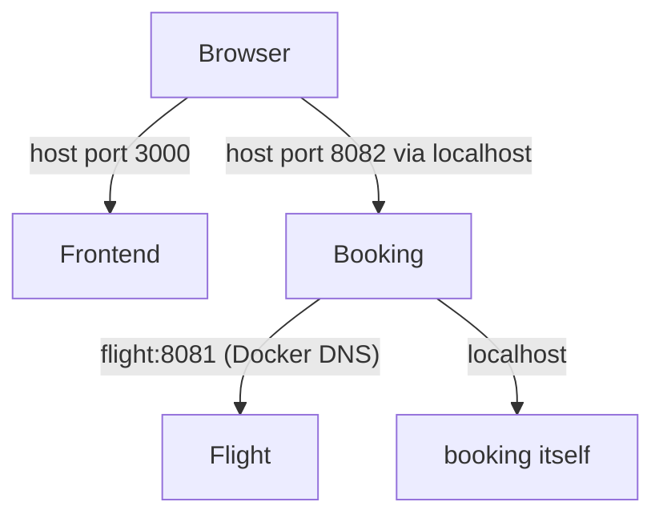

# Networks and clients

*Launchpad*

**You will be able to:** choose the correct address for a request by identifying where it starts.

## Key points

- Every request has a **client** and a **server**. An address only makes sense from the client's network.
- `localhost` means "this client's own network environment":

| Client | `localhost:8081` reaches |
|---|---|
| Your host shell / browser | Your laptop (works only if a port is **published**) |
| The `booking` container | `booking` itself, **not** `flight` |

- A port is local to its network environment. `flight` listens on 8081 inside its container; publishing `8081:8081` makes a separate path from the host.
- Compose gives containers **service names** via Docker DNS (`127.0.0.11`): `booking` calls `http://flight:8081`.
- Names are stable; container IPs change on replacement.



## Apollo example

- Frontend JS runs **in the browser**, so its API URLs are `http://localhost:808x` (published ports).
- Backends run **in containers**, so they use `http://flight:8081`, `http://identity:8080`.
- `VITE_*` values are baked into public JS at build time: never put secrets there.

## Debugging rule

- When booking → flight fails, start from **booking's** network view: configured name → DNS → port → is flight listening?
- A test from your laptop proves only the laptop's path.

## Try it

```bash
cd stages/launchpad
curl -s localhost:8081/healthz                                   # host → published port
docker compose exec booking wget -qO- http://localhost:8081/healthz   # fails: booking's own localhost
docker compose exec booking wget -qO- http://flight:8081/healthz      # works: service name
```

## Gotchas

- "The browser can reach it" says nothing about container-to-container reach.
- Different clients can have different DNS search paths, port mappings and policies.
- Names find a destination; they do not mean it is ready (next chapter).

## Check yourself

<details>
<summary>The browser reaches <code>localhost:8082</code>. Does that prove booking can reach <code>flight:8081</code>?</summary>

No. Different clients, different paths. Test from booking's container.
</details>

<details>
<summary>Why use a service name instead of a container IP?</summary>

The IP changes when the container is replaced; the name is the stable contract.
</details>

<details>
<summary>Why does the frontend use <code>localhost</code> URLs when backends use service names?</summary>

The frontend code executes in the browser on the laptop, which cannot resolve Docker-network names.
</details>
