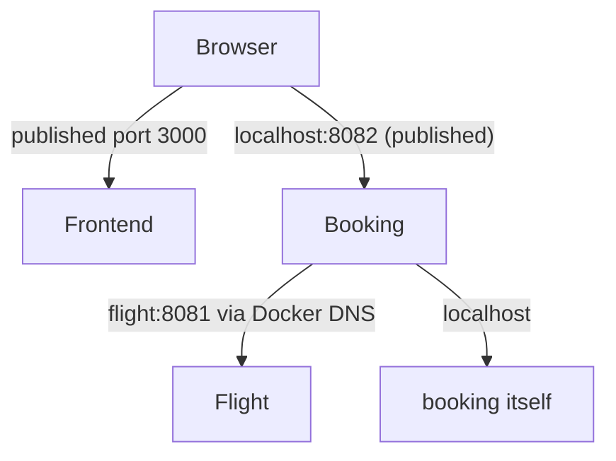

# Networks and clients

*Launchpad*

**You will be able to:** choose the correct address for a request by first identifying where the request starts, and explain why `localhost` means different things to a browser and to a container.

## The problem

You open the Apollo frontend in your browser and it calls the booking API. Later, booking calls the flight service. Both are "HTTP requests", yet the first uses `http://localhost:8082` and the second uses `http://flight:8081`. Using the wrong style in the wrong place is one of the most common early failures, and the error messages ("connection refused") give no hint why.

The fix is a habit: before choosing an address, ask **who is sending this request, and from where?**

## The idea in plain words

An address is like a street name: "Main Street" only means something once you know which town you are in. Every request has a **client** (the sender) and a **server** (the receiver), and the client is in a particular network environment. An address is interpreted from the client's position.

`localhost` is the clearest example. It means "this machine's own network environment", whichever machine is asking:

- When your **browser** says `localhost`, it means your laptop.
- When the **booking container** says `localhost`, it means the booking container itself, which is a separate little network with its own loopback. It does not mean your laptop, and it does not mean the flight container.

Ports work the same way. `flight` listens on 8081 *inside its container*. That says nothing about port 8081 on your laptop until you **publish** it (`8081:8081`), which creates an extra path from the host into that container.

## How it works

Docker Compose creates a private **bridge network** and attaches the containers to it. Docker also runs a small DNS server (at `127.0.0.11`) on that network. When booking asks for the name `flight`, that DNS answers with flight's current internal IP. So containers find each other by **service name**, not by IP, because IPs change when a container is replaced.



| Client | `localhost:8081` reaches | `flight:8081` reaches |
|---|---|---|
| Your host shell or browser | Your laptop; works only if the port is published | Nothing (the name is unknown outside Docker) |
| The `booking` container | `booking` itself, **not** flight | The flight container |

## Apollo example

- The frontend's JavaScript runs **in the browser**, so its API URLs are `http://localhost:8080` … `8083`: the published ports on your laptop.
- The backend services run **in containers**, so they use `http://flight:8081`, `http://identity:8080` and so on.
- The frontend's URLs are compiled into the public JavaScript at build time (`VITE_*` values). Anyone can read them in the browser, so never put secrets there.

## Debugging rule

If booking cannot reach flight, test **from booking's point of view**: the configured name, whether the name resolves, whether the port is reachable, whether flight is actually listening. Testing from your laptop only tells you about your laptop's route.

## Try it

```bash
cd stages/launchpad
curl -s localhost:8081/healthz                                        # host → published port: works
docker compose exec booking wget -qO- http://localhost:8081/healthz   # booking's own localhost: fails
docker compose exec booking wget -qO- http://flight:8081/healthz      # service name: works
```

- The middle command fails because nothing in the booking container listens on 8081. It is the proof that `localhost` depends on the client.

## Common misconceptions

- **"If I can reach it from my browser, the other services can too."** They start from different places and follow different paths.
- **"A service name works everywhere."** It resolves only on that Docker network.
- **"EXPOSE publishes the port."** It does not. Only `ports:` does.

## Check yourself

<details>
<summary>The browser reaches <code>localhost:8082</code>. Does that prove booking can reach <code>flight:8081</code>?</summary>

No. Different clients, different paths. Test from booking's container.
</details>

<details>
<summary>Why use a service name instead of a container IP?</summary>

The IP changes when a container is replaced; the name is the stable contract.
</details>

<details>
<summary>Why does the frontend use <code>localhost</code> URLs while backends use service names?</summary>

The frontend code executes in the browser on your laptop, which cannot resolve Docker-network names.
</details>

## Where this leads

Finding a service is not the same as that service being able to help. The last Launchpad chapter covers when a reachable service is still not ready, and where data survives.
