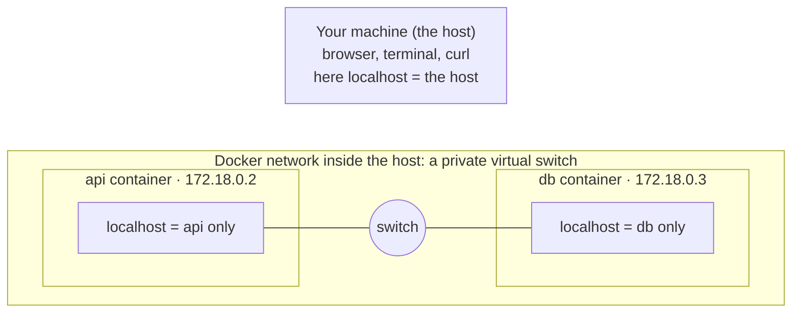
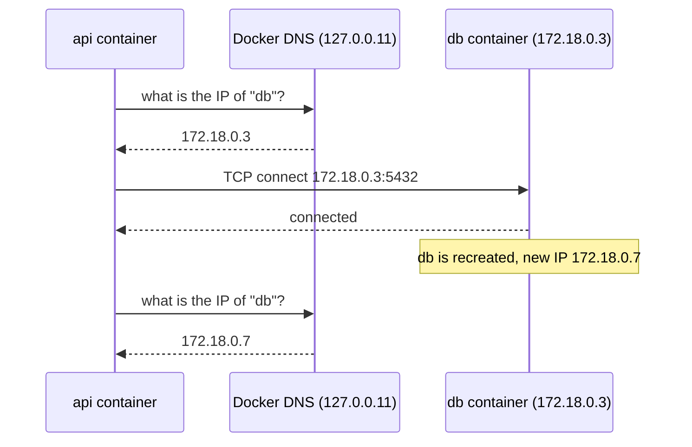
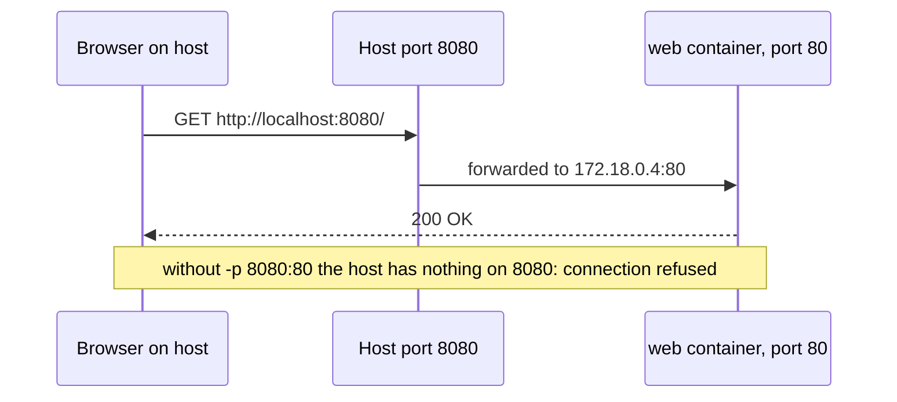
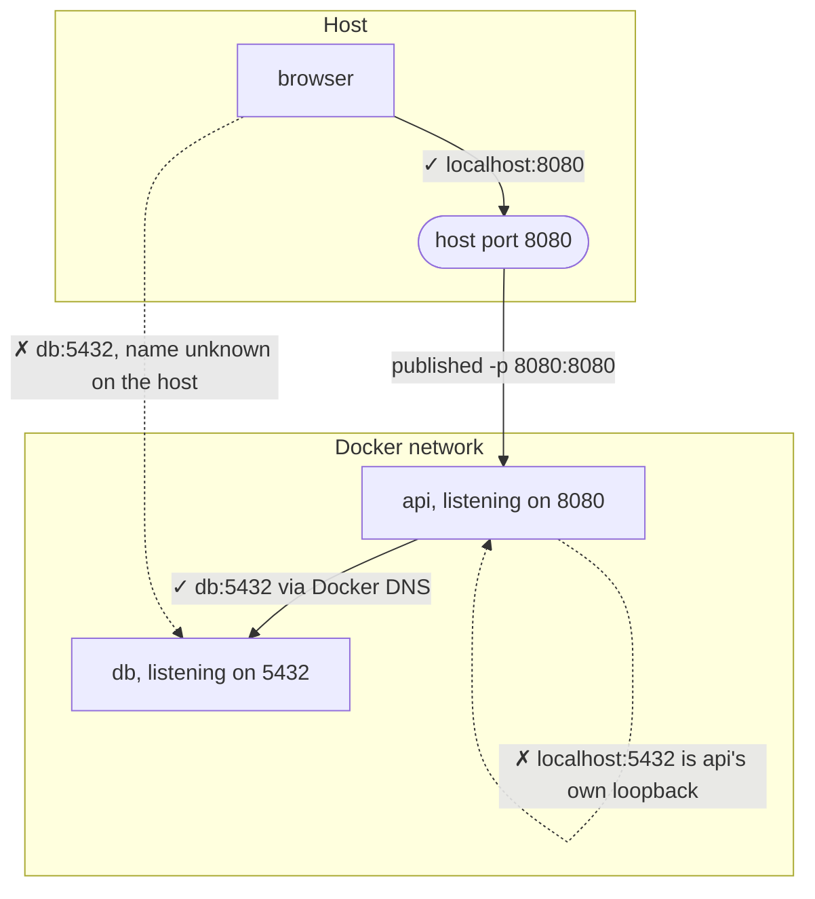
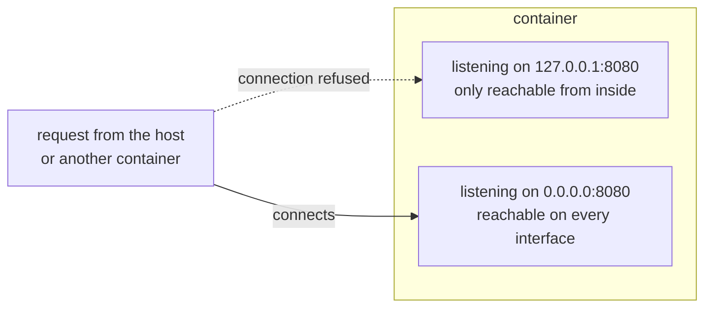
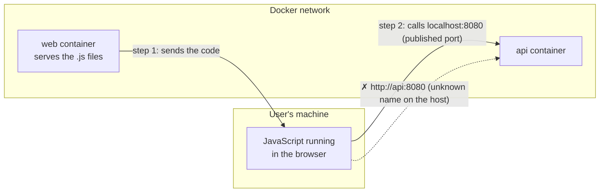
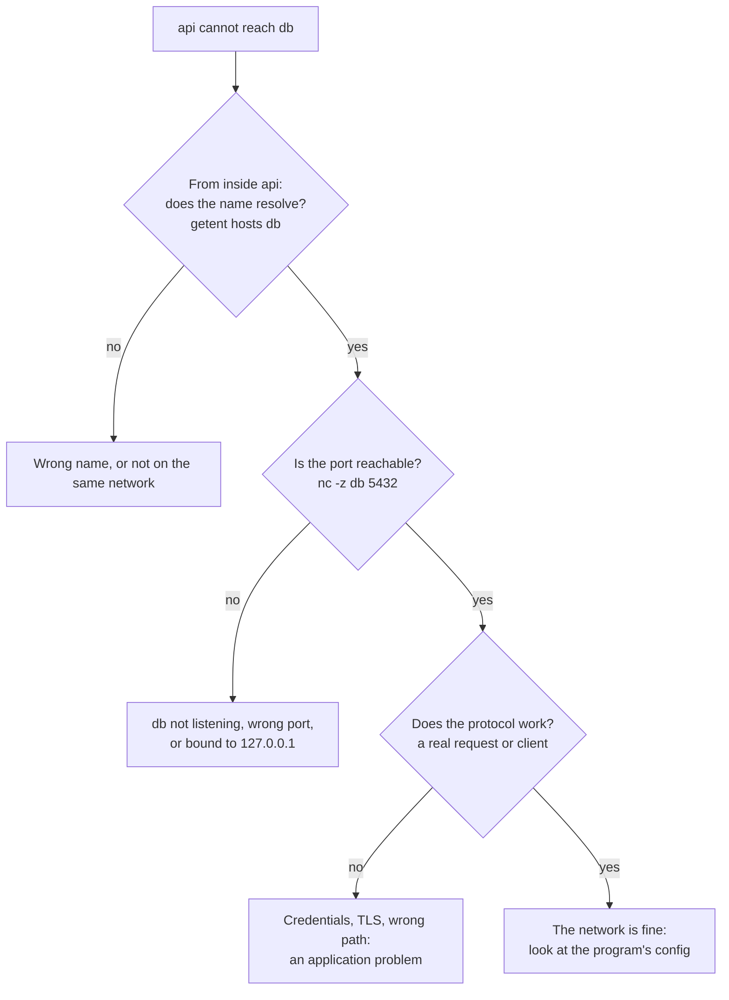

# Networks and clients

*Launchpad*

**You will be able to:** choose the correct address for a request by first identifying where the request starts, explain why `localhost` means something different inside a container, and debug "connection refused" from the right place.

You run two containers: an `api` and a `db`. In your browser, `http://localhost:8080` reaches the API. So you configure the API to reach the database at `localhost:5432`, and it fails with *connection refused*. Then you try the container's IP address, and it works until the database container is recreated and gets a different IP.

Every one of these is an HTTP or TCP request, yet the right address is different each time. The error messages give no hint why. The fix is a habit: before choosing an address, ask **who is sending this request, and from where?**

## An address depends on who is asking

An address is like "the kitchen": it only means something once you know whose house you are standing in. Every request has a **client** (the sender) and a **server** (the receiver), and the address is interpreted from the client's position.

From the [first chapter](./process-image-container) you know each container gets its own **network namespace**: its own interfaces, its own IP address, its own port numbers, and its own **loopback** (`localhost`, `127.0.0.1`). So each container is a separate house with its own kitchen.



`localhost` means "my own network namespace", whichever process is asking:

- When your **browser** or **terminal** says `localhost`, it means your machine.
- When the **api container** says `localhost`, it means the api container itself. Not your machine, and not the db container.

## How a request finds its way

Three mechanisms decide where a request can go: the network the containers share, the names they use to find each other, and the ports that are published to the host.

### 1. Containers on the same network reach each other directly

Docker (and Compose, automatically) creates a private **bridge network**: think of it as a virtual network switch inside the host. Every container attached to it gets an IP on that network and can connect to every other container on it, on any port the other container listens on. Nothing needs to be published for container-to-container traffic.

### 2. Names, not IPs

IP addresses on that network are handed out when a container starts, and a recreated container usually gets a new one. So containers should find each other by **name**. On a user-defined network (which Compose always creates), Docker runs a small DNS server at `127.0.0.11` inside each container that answers with the current IP for a container or service name.



The name is the stable contract; the IP is a detail that changes. These names exist **only on that Docker network**. Your host's browser has never heard of `db`.

### 3. Publishing a port opens a door from the host

A container's ports are reachable from its network, not from your machine's network. To let your browser in, you **publish** a port: `-p 8080:80` (or `ports: ["8080:80"]` in Compose) means "connections to port 8080 on the host are forwarded to port 80 in this container". It is always `host:container`.



### Putting it together



| Client | `localhost:5432` reaches | `db:5432` reaches |
|---|---|---|
| Your terminal or browser | Your machine; works only if 5432 is published | Nothing: the name is unknown outside Docker |
| The `api` container | `api` itself, **not** the database | The db container |

## Two traps that look like network problems

### The server listens on the wrong address

A program does not just "listen on port 8080". It listens on a specific **address** *and* port. Many frameworks default to `127.0.0.1`, which accepts connections only from the same network namespace. Inside a container that means only from inside that same container.



A server inside a container should listen on `0.0.0.0` (all interfaces). If a port is published, the container is running, and you still get *connection refused* or an empty reply, check the bind address in the program's logs or settings.

### Code that runs in the browser is not in a container

A web front end is served *from* a container, but its JavaScript **runs in the user's browser**. When that code calls an API, the client is the browser on the user's machine, not the container that served the file.



So browser code must use addresses the **browser** can reach (published ports, or a public domain), while server code in containers uses service names. Values compiled into front-end code are readable by anyone who opens the page, so never put secrets there.

## Debugging rule: test from the client's position

If one container cannot reach another, a test from your terminal tells you only about your terminal's route. Test from **inside the client container**, one layer at a time:



## Try it

```bash
docker network create demo-net
docker run -d --name web --network demo-net -p 8080:80 nginx:1.27-alpine

# From the host: the published port works, the container name does not.
curl -s -o /dev/null -w 'host → localhost:8080: %{http_code}\n' localhost:8080
curl -s http://web || echo "host cannot resolve 'web'"

# From another container on the same network: the name works...
docker run --rm --network demo-net alpine:3.20 wget -qO- http://web | head -n 4
docker run --rm --network demo-net alpine:3.20 getent hosts web

# ...but localhost is that container itself, where nothing listens on 80.
docker run --rm --network demo-net alpine:3.20 wget -qO- http://localhost || echo "localhost is me"

# A container NOT on demo-net cannot resolve the name at all.
docker run --rm alpine:3.20 wget -qO- http://web || echo "different network, no name"

docker rm -f web && docker network rm demo-net
```

- The same URL succeeds or fails depending only on where the request starts.
- The last command uses Docker's *default* network, which has no name resolution. Compose never uses it, which is why names "just work" there.

## Common misconceptions

- **"If I can reach it from my browser, other containers can too."** They start from different places and follow different paths.
- **"A container name works everywhere."** It resolves only on the Docker network both containers share.
- **"`EXPOSE` publishes the port."** It does not. Only `-p` / `ports:` does, and only container-to-host traffic needs it.
- **"Connection refused means a firewall."** More often it means nothing is listening at that address from the client's point of view: wrong `localhost`, an unpublished port, or a server bound to `127.0.0.1`.

## Check yourself

<details>
<summary>Your browser reaches <code>localhost:8080</code>. Does that prove the <code>api</code> container can reach <code>db:5432</code>?</summary>

No. Different clients, different paths. Test from inside the api container.
</details>

<details>
<summary>Why use a service name instead of a container IP?</summary>

The IP changes when a container is replaced; Docker DNS keeps the name pointing at the current one.
</details>

<details>
<summary>A port is published with <code>-p 8080:8080</code>, the container is running, and the host still gets "connection refused". What is the first thing to check?</summary>

The address the program listens on. If it is bound to `127.0.0.1` inside the container, only the container itself can connect. It should bind to `0.0.0.0`.
</details>

<details>
<summary>Why does browser-side code use <code>localhost</code> URLs while server-side code uses service names?</summary>

Browser code executes on the user's machine, which cannot resolve Docker-network names. Server code executes inside containers on that network.
</details>

## Where this leads

Being able to reach a service is not the same as that service being able to help. The next chapter, [State and dependencies](./state-and-dependencies), covers when a reachable service is still not ready, and where data survives.
