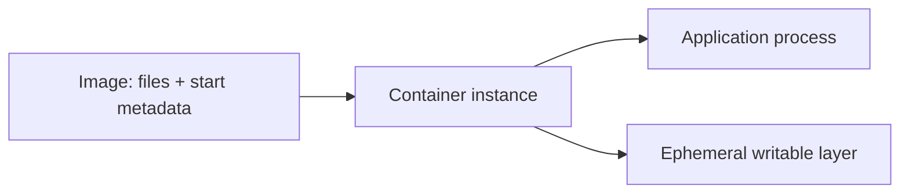

# Process, image, and container

*Launchpad · Getting Apollo Airlines off the ground*

Before a passenger can book a flight, the booking program has to be running
somewhere. Start there: a **process** is a running program. It has memory, reads
inputs, does work, and eventually exits. If you have ever started a server in a
terminal, you have already worked with a process.

Now imagine handing that booking program to another developer. The code alone
may not be enough; it needs the right runtime and files. An **image** packages
those files and the metadata used to start the program. It is a stored artifact,
so having an image on disk does not mean the booking service is running.

A **container** runs a process from that image with isolated views of resources
such as the filesystem and network. Two containers can start from the same
image while having different process memory and writable files. Rebuilding the
image prepares a new artifact; existing containers do not automatically switch
to it.

Read the diagram from the package toward the running application. The image
supplies the starting files, while the container gives the process a runtime
environment and its own writable layer. *(Diagram CT-01.)*

That writable layer is tied to the container. Removing and replacing the
container loses changes stored only there; a simple stop and start in Docker
can retain them. Later, Mission Data will show how separately mounted storage
changes which bytes survive a replacement.

For now, picture two copies of the booking service starting from the same image.
They share the same starting code, but a value held in one process’s memory is
not automatically available in the other. This is why running another copy and
preserving application state become separate questions as the airline grows.

## Why this distinction matters to Apollo

The booking program is a process with memory, file descriptors, and a lifecycle.
An image is a stored package that can be copied, scanned, and promoted. A
container is one runtime instance created from that image. If a process exits,
the image still exists and can start another instance; the old process memory
does not.

This makes a useful debugging sequence possible: ask which image was requested,
which container was created, and what process the container actually started.
The names are related, but they are not synonyms.

## Evidence and limits

Inspect an image’s metadata to understand its entrypoint and files. Inspect the
container and process status to learn what is running now. A container that is
running proves the process has not exited; it does not prove that a booking
dependency is reachable or that temporary state is safe. The next Launchpad
chapters add configuration, network location, and dependency readiness.
