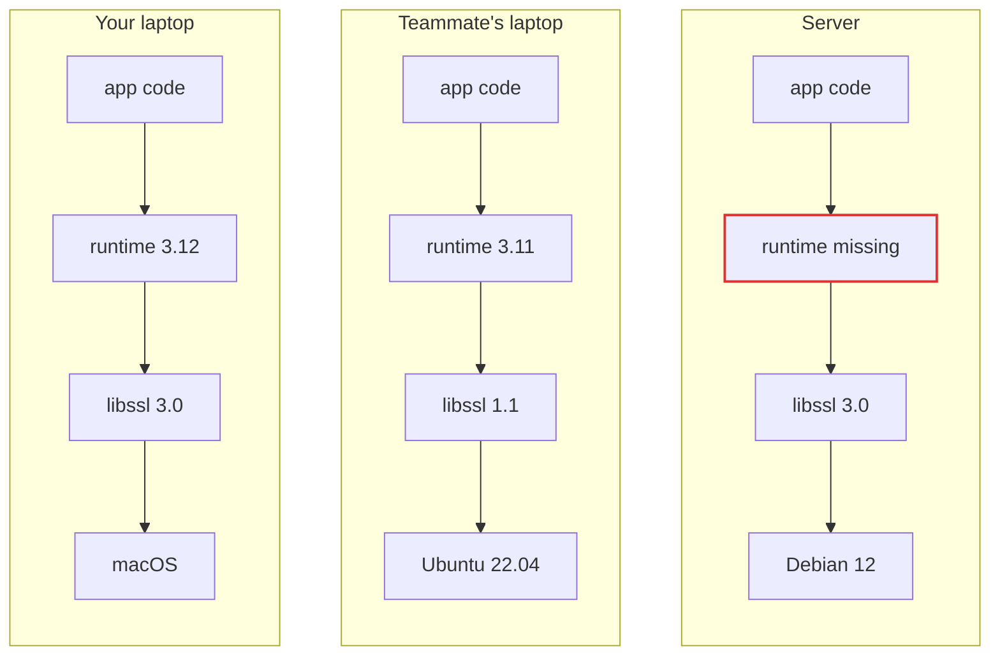
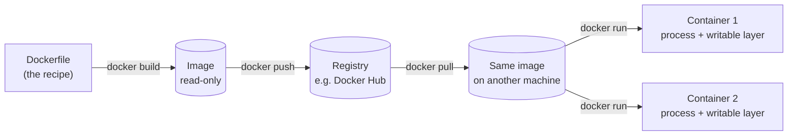
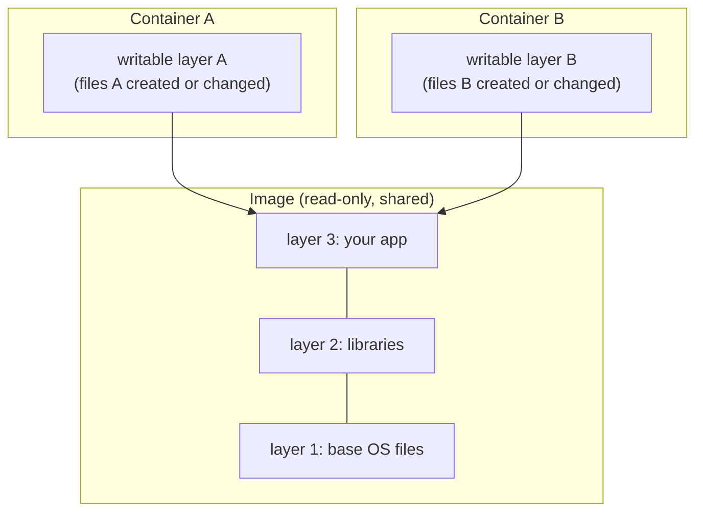
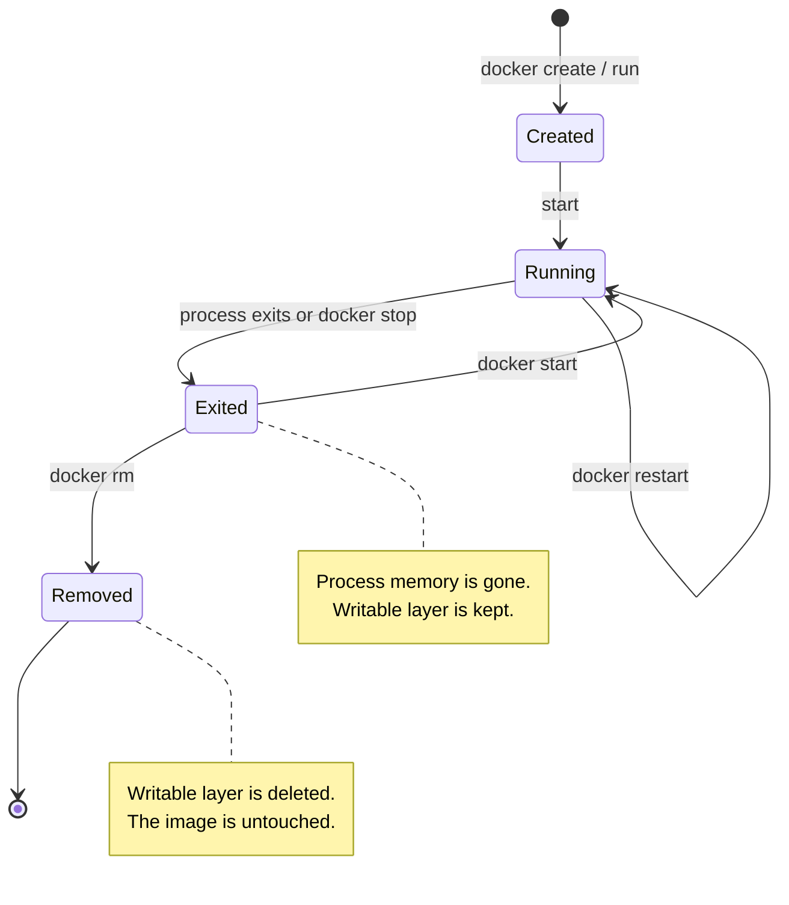
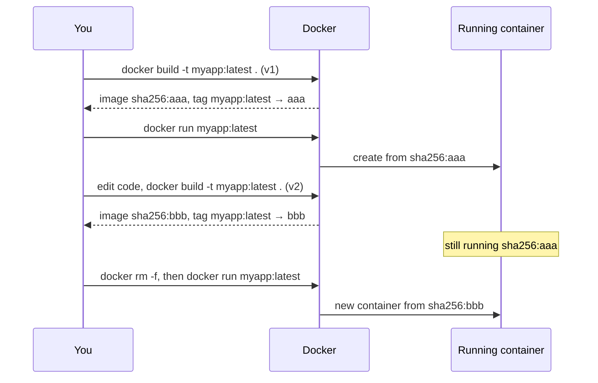
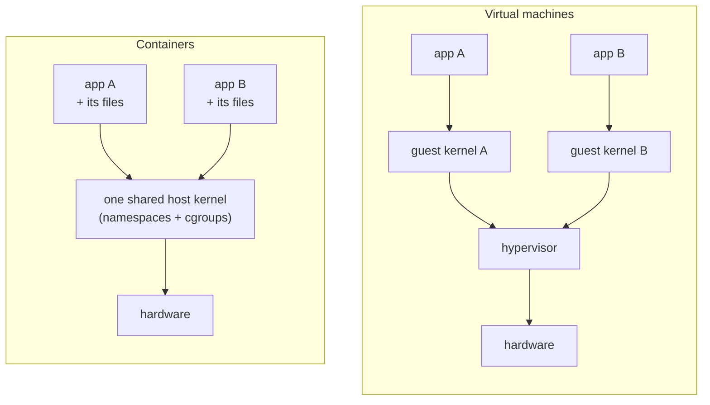
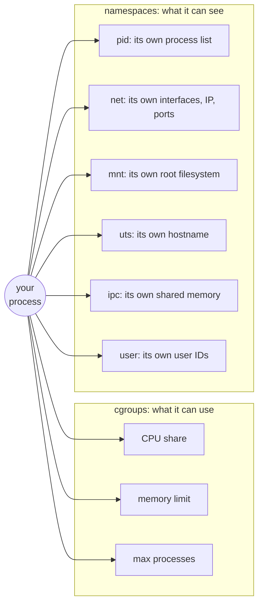

# Process, image, and container

*Launchpad*

**You will be able to:** tell a process, an image and a container apart, say what is lost when each one goes away, and explain why a container is not a small virtual machine.

## The problem

A program almost never runs on its own. A small web API needs a language runtime of an exact version, a dozen libraries, some operating-system files (certificates, a time zone database, a shell), and a start command with the right flags. On your laptop all of that happens to be installed. On a teammate's laptop one library is a version newer. On a server the runtime is missing.


```mermaid
flowchart TB
  subgraph S["Server"]
    direction TB
    A3["app code"] --> R3["runtime missing"]:::bad --> B3["libssl 3.0"] --> O3["Debian 12"]
  end
  subgraph T["Teammate's laptop"]
    direction TB
    A2["app code"] --> R2["runtime 3.11"] --> B2["libssl 1.1"] --> O2["Ubuntu 22.04"]
  end
  subgraph L["Your laptop"]
    direction TB
    A1["app code"] --> R1["runtime 3.12"] --> B1["libssl 3.0"] --> O1["macOS"]
  end
  classDef bad stroke:#d33,stroke-width:2px;
```

Same code, three different results. "Works on my machine" is a statement about everything underneath the code, not the code itself.

Containers fix this by **shipping the whole stack underneath the program along with it**. But the word *container* is used loosely, and three different things hide behind it: a **process**, an **image** and a **container**. Mixing them up causes most early confusion ("I rebuilt it, why is the old code still running?"). This chapter separates them.

## The idea in plain words

Think of a recipe card, a sealed meal kit, and a meal being cooked.

- A **process** is the meal being cooked right now: a program that is running. It has memory, it reads input, it does work, and when it stops that live state is gone.
- An **image** is the sealed meal kit: the program, every library and file it needs, and a note saying how to start it. It does nothing by itself. It can sit on a shelf, be copied to another kitchen, and be used any number of times without being used up.
- A **container** is one cooking session started from a kit: a process running in its own walled-off kitchen, with a private worktop for scratch work.

The analogy breaks in one useful place: one kit can feed any number of cooking sessions *at the same time*, and each session's worktop is private. What one container writes is invisible to the others.

## How it works: build, ship, run

There are three verbs, and each produces or consumes one of the three things.


```mermaid
flowchart LR
  DF["Dockerfile<br/>(the recipe)"] -->|docker build| IMG[("Image<br/>read-only")]
  IMG -->|docker push| REG[("Registry<br/>e.g. Docker Hub")]
  REG -->|docker pull| IMG2[("Same image<br/>on another machine")]
  IMG2 -->|docker run| C1["Container 1<br/>process + writable layer"]
  IMG2 -->|docker run| C2["Container 2<br/>process + writable layer"]
```

1. **Build** turns a recipe (a `Dockerfile`) into an **image**: a stored, read-only artifact with an ID such as `sha256:3f9a…`.
2. **Ship** copies that exact image to a **registry** and from there to any other machine. Every machine gets byte-for-byte the same files.
3. **Run** creates a **container** from the image: the container runtime sets up an isolated environment, then starts the image's command inside it. That command is the **process**.

### What a container looks like on disk

An image is made of stacked, read-only **layers**, one per build step. Running a container does not copy those layers. It adds one thin **writable layer** on top, private to that container.


```mermaid
flowchart TB
  subgraph C1["Container A"]
    W1["writable layer A<br/>(files A created or changed)"]
  end
  subgraph C2["Container B"]
    W2["writable layer B<br/>(files B created or changed)"]
  end
  subgraph IMG["Image (read-only, shared)"]
    direction TB
    L3["layer 3: your app"]
    L2["layer 2: libraries"]
    L1["layer 1: base OS files"]
    L3 --- L2 --- L1
  end
  W1 --> L3
  W2 --> L3
```

When the process reads a file, it sees the merged view of all layers. When it changes a file from the image, the changed copy goes into its writable layer (this is called *copy-on-write*). The image itself is never modified, which is why a hundred containers can share one image.

### The three things side by side

| Term | What it is | Where it lives | When it is lost |
|---|---|---|---|
| **Process** | A running program (memory, open files, a PID) | RAM | It exits or is killed |
| **Image** | Read-only layers + start command + metadata | Local disk or a registry | You delete the image |
| **Container** | One isolated process started from an image, plus its writable layer | The host kernel and its disk | The container is **removed** |

## A container's life

A container has more states than "on" and "off", and the difference between *stopped* and *removed* is where data goes missing.


```mermaid
stateDiagram-v2
  [*] --> Created: docker create / run
  Created --> Running: start
  Running --> Exited: process exits or docker stop
  Exited --> Running: docker start
  Running --> Running: docker restart
  Exited --> Removed: docker rm
  Removed --> [*]

  note right of Exited
    Process memory is gone.
    Writable layer is kept.
  end note
  note right of Removed
    Writable layer is deleted.
    The image is untouched.
  end note
```

Two consequences matter immediately:

- **Rebuilding an image does not change a running container.** A build makes a *new* image. A container records the ID of the image it was created from and keeps using it until you remove it and create a new one.
- **Stopping is not removing.** A stopped container keeps its writable layer and can be started again. Removing it throws the layer away.


```mermaid
sequenceDiagram
  participant You
  participant Docker
  participant C as Running container
  You->>Docker: docker build -t myapp:latest .  (v1)
  Docker-->>You: image sha256:aaa, tag myapp:latest → aaa
  You->>Docker: docker run myapp:latest
  Docker->>C: create from sha256:aaa
  You->>Docker: edit code, docker build -t myapp:latest .  (v2)
  Docker-->>You: image sha256:bbb, tag myapp:latest → bbb
  Note over C: still running sha256:aaa
  You->>Docker: docker rm -f, then docker run myapp:latest
  Docker->>C: new container from sha256:bbb
```

## A container is not a virtual machine

A virtual machine pretends to be a whole computer: a hypervisor simulates hardware and each VM boots its **own kernel**. A container does none of that. It is an ordinary Linux process on the **same kernel** as everything else on the host, with walls put up around it by that kernel.


```mermaid
flowchart TB
  subgraph VMs["Virtual machines"]
    direction TB
    va["app A"] --> vka["guest kernel A"]
    vb["app B"] --> vkb["guest kernel B"]
    vka --> hv["hypervisor"]
    vkb --> hv
    hv --> hw1["hardware"]
  end
  subgraph CTs["Containers"]
    direction TB
    ca["app A<br/>+ its files"] --> hk["one shared host kernel<br/>(namespaces + cgroups)"]
    cb["app B<br/>+ its files"] --> hk
    hk --> hw2["hardware"]
  end
```

The kernel builds the walls out of two features:

- **Namespaces limit what the process can see.** Inside its namespaces the app believes it is process number 1, has its own network interface, its own hostname and its own root filesystem. Other processes and the host's files are simply not visible.
- **cgroups (control groups) limit what the process can use.** They cap CPU time, memory and the number of processes. A container that goes over its memory cap is killed by the kernel on the spot (an *OOM kill*, for "out of memory").


```mermaid
flowchart LR
  subgraph CG["cgroups: what it can use"]
    direction TB
    cpu["CPU share"]
    mem["memory limit"]
    pids["max processes"]
  end
  subgraph NS["namespaces: what it can see"]
    direction TB
    pid["pid: its own process list"]
    net["net: its own interfaces, IP, ports"]
    mnt["mnt: its own root filesystem"]
    uts["uts: its own hostname"]
    ipc["ipc: its own shared memory"]
    usr["user: its own user IDs"]
  end
  P(("your<br/>process"))
  P --> pid & net & mnt & uts & ipc & usr
  P --> cpu & mem & pids
```

Because there is no second operating system to boot, a container starts in milliseconds and costs little more than the process itself. The trade-off: every container shares the host's kernel, so a kernel bug can cross the wall. A VM's isolation is stronger. The [least privilege](./least-privilege) chapter comes back to this.

:::note On a Mac or Windows
Docker Desktop runs a small Linux VM and your containers run inside it, because containers need a Linux kernel. Everything in this chapter still holds; the "host" is just that VM rather than your laptop.
:::

## Try it

These use the small public `alpine` image, so they work anywhere Docker does.

```bash
# 1. One image, one container. Inside, the process thinks it is PID 1.
docker run -d --name demo alpine:3.20 sleep 600
docker exec demo ps                       # PID 1 is "sleep 600"

# 2. On a Linux host the same process is visible from outside, with a different PID.
ps -ef | grep "sleep 600"

# 3. Write into the container's writable layer.
docker exec demo sh -c 'echo hello > /note.txt'

# 4. Stop and start: the process restarts, the writable layer survives.
docker stop demo && docker start demo
docker exec demo cat /note.txt            # hello

# 5. Remove and recreate: the writable layer is gone.
docker rm -f demo
docker run --rm alpine:3.20 cat /note.txt # No such file or directory
```

- Step 1 and 2 show the namespace wall: one process, two different views of its PID.
- Step 4 versus step 5 is the difference between *stopped* and *removed*.

## Common misconceptions

- **"I rebuilt the image, so my container is updated."** Tempting because the tag name (`myapp:latest`) did not change. The tag now points to a new image; the old container still runs the old one. Recreate the container to pick up the change.
- **"A container is a lightweight VM."** It feels like one because you can open a shell inside it. There is no separate kernel: it is a restricted process.
- **"Data inside a container is lost when it stops."** Stopping loses process memory only. Removing loses the writable layer. Neither is a safe place for data you care about; that is what volumes are for, in [State and dependencies](./state-and-dependencies).
- **"If the container is running, the app works."** Running only means the process has not exited. Whether it can do useful work is a separate question.

## Check yourself

<details>
<summary>You rebuild <code>myapp:latest</code> while a container from it is running. Did that container change?</summary>

No. The build created a new image and moved the tag. The container keeps the image it was created from, and its writable layer, until it is removed and replaced.
</details>

<details>
<summary>A process exits but its container has not been removed. What is definitely gone, and what is not?</summary>

The process memory is gone. The image remains. The writable layer remains too, and comes back if the same container is started again; it disappears only when the container is removed.
</details>

<details>
<summary>Ten containers run from the same 200 MB image. Roughly how much disk do the image files take?</summary>

About 200 MB, once. The read-only layers are shared; each container adds only its own writable layer.
</details>

<details>
<summary>What do namespaces limit that cgroups do not, and vice versa?</summary>

Namespaces limit what the process can *see* (other processes, network, filesystem). Cgroups limit what it can *consume* (CPU, memory, number of processes).
</details>

## Where this leads

An image is deliberately incomplete: it should not hard-code the address of a database or a password, because the same image must run on your laptop and in production. The next chapter, [Images and runtime configuration](./images-and-configuration), looks at what belongs inside an image and what must arrive when the container starts.
