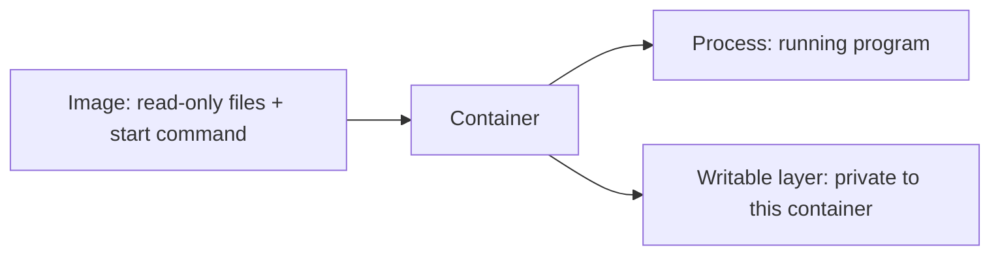

# Process, image, and container

*Launchpad*

**You will be able to:** tell a process, an image and a container apart, say what is lost when each is replaced, and explain why a container is not a small virtual machine.

## The problem

Apollo's booking service works on your laptop. Tomorrow a teammate must run it, next month it must run on a server, and later in a cluster. If the only instruction is "install Go, copy these files, set these variables, run this command", every machine ends up slightly different and something eventually breaks.

Containers exist to remove that variation. But the word *container* gets used loosely, and three different things hide behind it: a **process**, an **image** and a **container**. Mixing them up is the root of many early mistakes ("I rebuilt it, why is the old code still running?"). This chapter separates them.

## The idea in plain words

Think of a recipe, a printed copy of a cookbook, and a meal being cooked.

- A **process** is the meal being cooked right now: a program that is running. It has memory, it reads input, it does work, and when it stops that live state is gone.
- An **image** is the sealed, read-only package: the program files, the libraries it needs, and the instruction for how to start it. It does nothing by itself. Like a printed cookbook, it can sit on a shelf, be copied to another kitchen, and be used any number of times.
- A **container** is one actual cooking session started from that package: a process running in its own walled-off space, created from an image.

The analogy breaks in one useful place: you can start many containers from one image at the same time, and each gets its own private scratch space, so what one writes does not appear in another.

## How it works

1. You **build** an image from the booking code (a `Dockerfile` lists the steps). The result is a stored artifact.
2. You **run** the image. The container runtime creates a container: it sets up an isolated environment and starts the image's command inside it. That command is the **process**.
3. While it runs, the container has a thin **writable layer** on top of the read-only image. Anything the process writes to its own filesystem lands there.
4. When the container is **removed**, the writable layer is deleted with it. The image is untouched, so you can start a new container from it at any time.


```mermaid
flowchart LR
  I[Image: read-only files + start command] --> C[Container]
  C --> P[Process: running program]
  C --> W[Writable layer: private to this container]
```

| Term | What it is | Where it lives | When it is lost |
|---|---|---|---|
| **Process** | A running program (memory, open files, a PID) | RAM | It exits |
| **Image** | Read-only package of files + start command | Registry or local disk | You delete the image |
| **Container** | One isolated process started from an image, plus its writable layer | The host kernel and its layer | The container is **removed** |

Two consequences matter immediately:

- **Rebuilding an image does not change a running container.** A rebuild produces a *new* image. The container you started earlier keeps using the old one until you replace it.
- **Stopping is not removing.** A stopped container keeps its writable layer and can be started again. Removing it discards the layer.

## A container is not a virtual machine

A virtual machine pretends to be a whole computer: it boots its own operating system kernel on simulated hardware. That is heavy, and takes minutes.

A container does none of that. It is an ordinary Linux process on the **same kernel** as the host, with two restrictions placed on it by the kernel itself:

- **Namespaces limit what the process can see.** Inside the container the app believes it is process number 1, has its own network interface and its own filesystem. Other processes, other containers and the host's files are simply not visible.
- **cgroups limit what the process can use.** They cap CPU, memory and the number of processes. If a container goes over its memory cap, the kernel kills it immediately (an *OOM kill*).

| Namespace | What it hides or separates |
|---|---|
| `pid` | The process list (the app is PID 1) |
| `net` | Network interfaces, routes, IP address, ports |
| `mnt` | The filesystem (the container sees only its image) |
| `uts` | Hostname |
| `ipc` | Shared memory and message queues |
| `user` | User IDs (root inside is not root on the host) |

Because there is no second operating system to boot, containers start in milliseconds. The trade-off is that they share the host kernel, so isolation is weaker than a VM's.

## Apollo example

- The `booking` image is built from `stages/launchpad/code/booking/Dockerfile`.
- `docker compose up` creates a booking container from it, giving it a private writable layer plus an in-memory `/tmp`.
- Start a second booking container from the same image and you get a second process with separate memory. If you put a value in one's memory, the other cannot see it. That is why "run more copies" and "keep state safe" turn out to be two separate problems later on.

## Try it

```bash
cd stages/launchpad && docker compose up -d booking
docker inspect -f 'image={{.Image}}' $(docker compose ps -q booking)
docker compose images booking
```

- The container records the exact image ID it was created from. After you rebuild, `docker compose images` shows a new ID while the running container still shows the old one. That gap is the proof that rebuilding does not touch running containers.

## Common misconceptions

- **"I rebuilt the image, so my container is updated."** Tempting because the tag name (`booking:latest`) did not change. In fact the tag now points at a new image, and the old container still runs the old one. Recreate the container to pick up the change.
- **"A container is a lightweight VM."** It feels like one because you can open a shell inside it. But there is no separate kernel: it is a restricted process.
- **"If the container is running, the service works."** A running container only means the process has not exited. Whether booking can reach its database is a separate question, which later chapters take up.

## Check yourself

<details>
<summary>You rebuild <code>booking:latest</code> while a booking container runs. Did that container change?</summary>

No. The rebuild creates a new image. The container keeps its original image and writable layer until it is replaced.
</details>

<details>
<summary>A process exits but its image still exists. What is definitely gone?</summary>

The process memory. The image remains. The writable layer survives only if the same container is started again, not if it is removed.
</details>

<details>
<summary>What do namespaces limit that cgroups do not, and vice versa?</summary>

Namespaces limit what the process can *see* (PIDs, network, mounts). Cgroups limit what it can *consume* (CPU, memory).
</details>

## Where this leads

An image is deliberately incomplete: it should not hard-code today's database address or passwords. The next chapter looks at what belongs inside an image and what must arrive when the container starts.
